### ✍️ Tangxt ⏳ 2020-12-25 🏷️ 诞生

# 01-React 的诞生

## ★课件

代码：<http://jsbin.com/piwazag/1/edit?html,js,output>

1. React 的初衷？
2. createElement
3. JSX
4. [Babel Online](https://babeljs.io/repl#?browsers=defaults%2C%20not%20ie%2011%2C%20not%20ie_mob%2011&build=&builtIns=false&spec=false&loose=false&code_lz=DwEwlgbgBAxgNgQwM5ILwCIAOCBOBTAOwBd0A-AKCimCWwNkRQ3xDIG8CBXAWwCM8cAX2AB6WggIUqwXpyJEA9vSUBhOGBgBrVG1XqtAITmKCACgCUg0gGpRs-UqnV7JqHo3bdBNR6MOCAEwWVgC0dsaO5KLgEKRAA&debug=false&forceAllTransforms=false&shippedProposals=false&circleciRepo=&evaluate=false&fileSize=false&timeTravel=false&sourceType=module&lineWrap=true&presets=env%2Ces2015%2Ces2016%2Ces2017%2Creact%2Cstage-0%2Cstage-1%2Cstage-2%2Cstage-3%2Ces2015-loose&prettier=false&targets=&version=7.12.12&externalPlugins=)

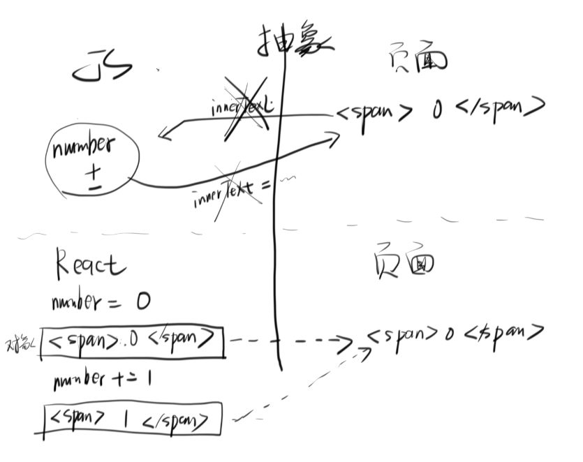

## ★React 的诞生

> 为什么说 React 是先进的、生产力的代表？

React 最重要的一个东西，就是关于 `createElement` 这部分内容！

### <mark>1）原生 JS</mark>

需求：加 1 减 1

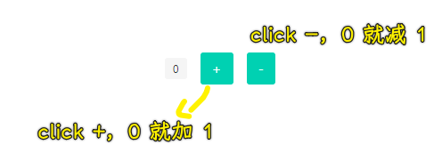

完成这个需求，显然需要用到 DOM API，如需要获取元素等……之后，你用了 React ，你就会明白你被颠覆了……

代码实现：

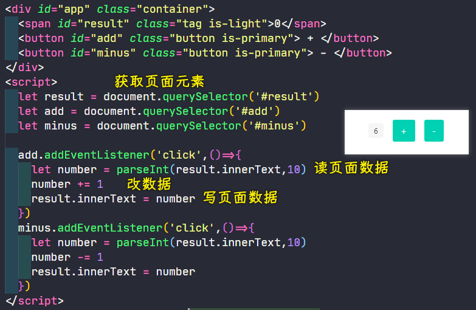

用图表示以上代码在干什么……

**程序最重要的两个能力，一个是理解力，另一个就是抽象**。你需要把上述的运行结果这样具体的东西，抽象成不具体的东西

抽象的反义词就是具体，而我们不需要具体，我们要的是「抽象」

那如何抽象呢？

简单回顾整个代码运行逻辑，我们可以把整个过程，分为两块：

* 页面
* JS

我们透过 `innerText` 从页面中把数据提取到 JS 中，然后通过那两个 `+1/-1` 按钮，还是透过 `innerText = ` 把数据回填到页面中！

这个代码运行逻辑并不复杂，但有点烦

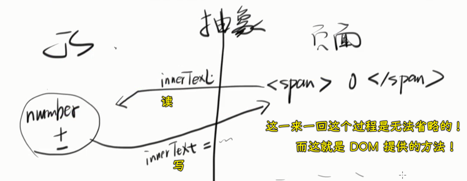

总之，我们完成这个需求，总得做这一步：「**获取页面数据，改数据，回填数据到页面**」，而这一步是无法省略的 -> 这就是 DOM 提供的方法了！

然而写 React 的程序员，也就是作者，觉得这个过程太智障了，虽然代码挺简单的，但就是很不爽……

话说，有咩有一种更简便的方法呢？

可以这样做：把上边的 `innerText` 干掉，而下边的 `innerText=` 不能干掉，不然 JS 就无法通知页面改数据了！

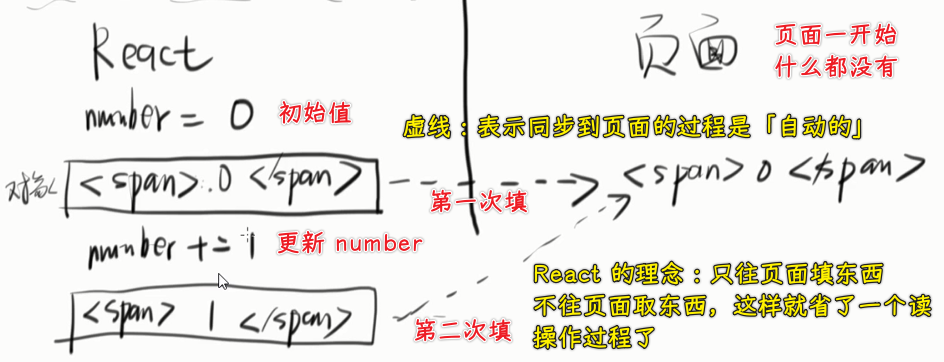

带着这样的理念，React 就诞生了……

接下来，我们抱着这种理念，使用 React 重写这个需求！

### <mark>2）React 初使用</mark>

cdn 引用两个库：

* react
* react-dom

> 选择 umd，umd（Universal Module Definition）是 AMD 和 CommonJS 的糅合，跨平台（浏览器 & 服务端）的解决方案

💡：为什么需要依赖两个库？

React 是一个非常厉害的库，Facebook 的牛人写的。它能**让页面更可控，性能极高，而且使用起来很简单**。

**React DOM 是用来操作 DOM 的**，因为这些 DOM 是用 JSX 写的，所以需要一个专门的库来操作。

JSX 是对 JS 的扩展，它看起来跟 XML 差不多，可以用来写 HTML，你**可以认为 JSX 是一种更优雅的 HTML 写法**。

➹：[在 2016 年学 JavaScript 是一种什么样的体验？ - 知乎](https://zhuanlan.zhihu.com/p/22782487)

---

之前说到，页面是咩有东西的，即你不用写这个了：

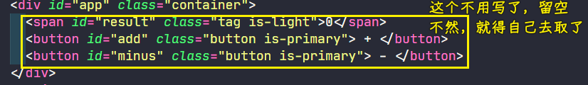

所以此时的页面结构，直接这样：

``` html
<div id="app"></div>
```

就行了……

完整代码：

``` html
<div id="app" class="container">
</div>
<button id="add" class="button is-primary"> + </button>
<button id="minus" class="button is-primary"> - </button>
<script src="https://cdn.bootcdn.net/ajax/libs/react/17.0.1/umd/react.development.min.js"></script>
<script src="https://cdn.bootcdn.net/ajax/libs/react-dom/17.0.1/umd/react-dom.development.min.js"></script>
<script>
  let number = 0
  let span = React.createElement('span', {
    className: 'tag'
  }, number)
  ReactDOM.render(span, document.querySelector("#app"))

  let add = document.querySelector('#add')
  add.onclick = () => {
    number += 1
    let span = React.createElement('span', {
      className: 'tag'
    }, number)
    ReactDOM.render(span, document.querySelector("#app"))
  }
  let minus = document.querySelector('#minus')
  minus.onclick = () => {
    number -= 1
    let span = React.createElement('span', {
      className: 'tag'
    }, number)
    ReactDOM.render(span, document.querySelector("#app"))
  }
</script>
```

效果：

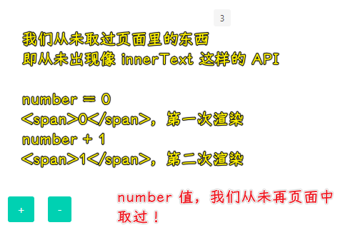

总之，根据之前那张图，**只有从 JS 到页面这个过程，没有页面到 JS 这个过程！**

当然，目前的代码还是很傻的！不过，你至少有了**这种想法「只有从 JS 到页面的过程」**

优化一下代码（我与重复不共戴天）：

``` js
let number = 0
render()

let add = document.querySelector('#add')
add.onclick = () => {
  number += 1
  render()
}
let minus = document.querySelector('#minus')
minus.onclick = () => {
  number -= 1
  render()
}

function render() {
  let span = React.createElement('span', {
    className: 'tag'
  }, number)
  ReactDOM.render(span, document.querySelector("#app"))
}
```

`number`为`0`就`render`一下，`number`为`1`就`render`一下……`number`变了就`render`一下！

可以看到，我们要做的就只有把`number`的值改一下，然后`render`一下，除此之外，不做任何事……

以上就是 React 的所有操作了，除此之外，没有任何操作！

可以看到，React 的操作，让我们不用去理会取元素的儿子、爸爸、爷爷等复杂繁琐的操作了……

### <mark>3）把按钮放到`#app`容器里边</mark>

要点：

- 事件监听怎么做？
- 同级多个元素怎么做？

代码：

``` html
<div id="app" class="container">
</div>
<script src="https://cdn.bootcdn.net/ajax/libs/react/17.0.1/umd/react.development.min.js"></script>
<script src="https://cdn.bootcdn.net/ajax/libs/react-dom/17.0.1/umd/react-dom.development.min.js"></script>
<script>
 let number = 0
 let onClickButton = ()=>{
   number += 1
   render()
 }
 let onClickButton2 = ()=>{
   number -= 1
   render()
 }

 render()

 function render() {
  let span = React.createElement('span',{className:'tag'},number)
  let button = React.createElement('button',{onClick:onClickButton,className:'button is-primary'},'+')
  let button2 = React.createElement('button',{onClick:onClickButton2,className:'button is-primary'},'-')
  let div = React.createElement('div',{className:"parent"},span,button,button2)
  ReactDOM.render(div,document.querySelector("#app"))
 }
</script>
```

效果：

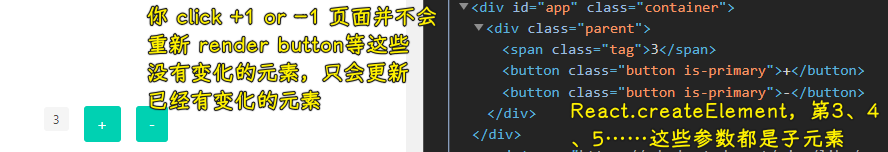

> 不会全局更新，只会局部更新，哪里变化了，就会更新哪里！

可以看到整个页面内容，都是 JS 渲染的！而 React 的存在，简化了我们要写的很多代码，而且这性能要比我们自己用原生 DOM API 要高效得多！

对比我们之前的原生 JS 代码，用了 React，显然让代码更简洁、更易懂了……

小结：

- 数据变化，就`render`，数据变化，就`render`……结合一开始那个草稿图来理解……

接下来，对这个`render`函数来一个更深层次的优化！

💡：在 HTML 元素上写`click`事件？

``` html
<button onclick="myFunction()">Click me</button>
```

➹：[HTML onclick Event Attribute](https://www.w3schools.com/tags/ev_onclick.asp)

💡：在 React 中，如何写多个`class`，是用`classList`吗？

直接`{className: 'class1 class2'}`就好了！

➹：[javascript - Toggle Class in React - Stack Overflow](https://stackoverflow.com/questions/36403101/toggle-class-in-react)

💡：我在`div#app`里边写了一个`<div>hi</div>`，你觉得这个元素会被渲染吗？

结果并咩有被渲染！`ReactDOM.render(div,document.querySelector("#app"))`这个操作，把`div#app`旗下的内容都给覆盖了，该`render`API 的实现，并不是`appendChild`，而是类似于`innerHTML` 这样

## ★jsx 的发明

目前，我们代码的问题：

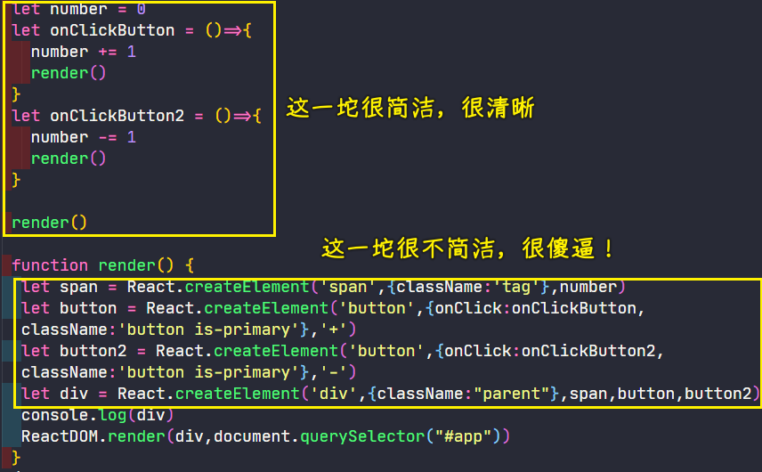

> 谁这样写，谁傻逼！

所以，我们该如何优化它呢？ -> 分三步走

第一步：

`React.createElement`既然每次都写，那为何不把它缩小一点呢？

所以就有了这样的代码：

``` js
let h = React.createElement
```

这是一个最简单的优化——**把函数换一个名字**

💡：为何把这个变量叫做`h`呢？叫`ele`等这样的变量名不行吗？

没有什么缘由，一般都叫`h`！

> `h` 代表的是 hyperscript（hyper 对应着 HTML 的 H），它本身表示的是 "生成 HTML 结构的脚本"，当我们正在处理一个脚本的时候，在虚拟 DOM 节点中去使用它进行替换已成为一种惯例。这个定义同时也被运用到其他的框架文档中，如 [Cycle.js - API reference (dom)](https://cycle.js.org/api/dom.html#api-h)

➹：[在 Vue 的 render 方法中 h 是什么意思？](https://learnku.com/vuejs/t/23288/what-does-h-mean-in-the-vue-render-method)

---

第二步：

把变量减少

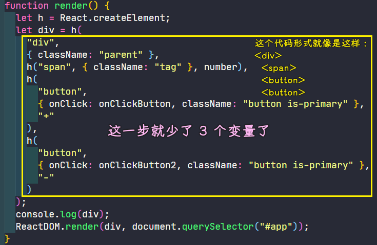

> 记住代码的形式，这形式可是非常重要的

第二步的优化——**把临时变量都给删掉，直接用`h`函数嵌套起来！**

第三步：

这是 React 最聪明的一步！React 开发者看了上述的代码，想到了某个问题，那就是这个代码跟某个代码非常相似，简直就是一模一样的说：

``` js
h('div',{className:"parent"},
  h('span',{className:'tag'},number),
  h('button',{onClick:onClickButton,className:'button is-primary'},'+'),
  h('button',{onClick:onClickButton2,className:'button is-primary'},'-')
)
```

``` html
<div class="parent">
  <span class="red">number</span>
  <button onClick=onClickButton>+</button>
  <button onClick=onClickButton2>-</button>
</div>
```

> 出现这样的`</span>`闭合标签，就是代表着`h()`的这个`)`，同理，`h()`的`(`就是开标签`<span>`

至此，React 的发明者惊讶地发现「**我的代码其实跟标签没有什么区别**」，所以「我」能否想一种办法让我们的使用者写下边这种代码：

``` html
<div class="parent">
  <span class="red">number</span>
  <button onClick=onClickButton>+</button>
  <button onClick=onClickButton2>-</button>
</div>
```

然后，「我」用一个程序翻译成这种代码：

``` js
h('div',{className:"parent"},
  h('span',{className:'tag'},number),
  h('button',{onClick:onClickButton,className:'button is-primary'},'+'),
  h('button',{onClick:onClickButton2,className:'button is-primary'},'-')
)
```

呢？

思于至此，React 作者就开始干了！他写了一个程序，可以把上边这种语法，也就是`JSX`语法，搞成是下边那种代码！

这个程序可以叫做「**JSX 翻译器**」

> JSX 语法：可以让我们用 HTML 的形式来写 JS，注意，这可不是在写 HTML 哈！

这个 JSX 语法出来以后，就越来越流行了，于是，大家都很喜欢像写标签这样去写 JS 了，这种方法甚是简便，但实质上我们是在写下边那个`h……`代码……

之后，这种语法就被 Babel 采纳了，于是 Babel 就自带了可以翻译这种 JSX 语法的功能了！

💡：`<span class="red">number</span>`这个`number`是字符串，可我们要的是`number`变量呀！

很简单，我们要变量，直接加个`{}`包裹起来就好了，如`<span class="red">{number}</span>`。

同理，`<button onClick=onClickButton>+</button>`的`onClickButton`也是被当作字符串处理的（你点击按钮，并不会调用`onClickButton`这个函数），而我们要的是函数变量，所以也得加上个`{}` -> `<button onClick={onClickButton}>+</button>`

`number`和`onClickButton`这个变量的值是**沿着当前作用域链往上找的**……

---

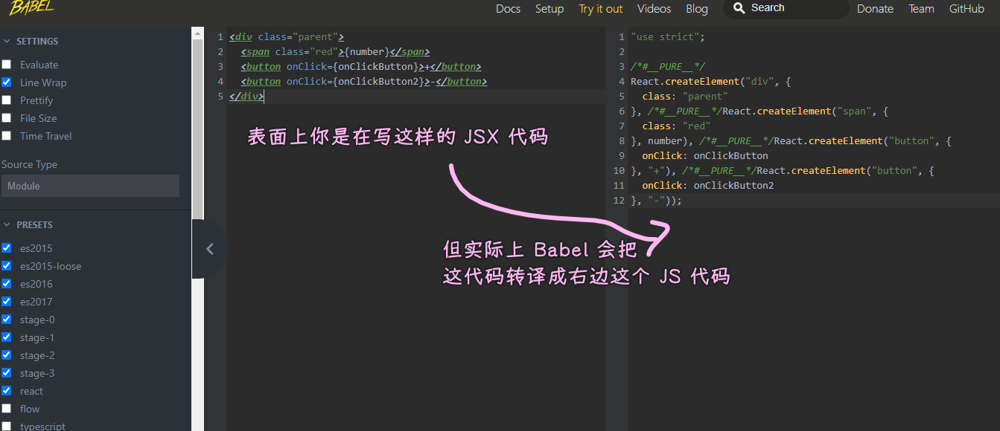

➹：[Babel · The compiler for next generation JavaScript](https://babeljs.io/repl#?browsers=defaults%2C%20not%20ie%2011%2C%20not%20ie_mob%2011&build=&builtIns=false&spec=false&loose=false&code_lz=DwEwlgbgBAxgNgQwM5ILwCIAOCBOBTAOwBd0A-AKCimCWwNkRQ3xDIG8CBXAWwCM8cAX2AB6WggIUqwXpyJEA9vSUBhOGBgBrVG1XqtAITmKCg0gGpRs-UqnVrJqHo3bdBNS6M2CAJjMBaK2NbclFwCFIgA&debug=false&forceAllTransforms=false&shippedProposals=false&circleciRepo=&evaluate=false&fileSize=false&timeTravel=false&sourceType=module&lineWrap=true&presets=env%2Ces2015%2Ces2016%2Ces2017%2Creact%2Cstage-0%2Cstage-1%2Cstage-2%2Cstage-3%2Ces2015-loose&prettier=false&targets=&version=7.12.12&externalPlugins=)

这就是 React 的最后一步优化了，即你写 JSX 语法的代码，就相当于是在写`React.createElement(……)`这样一大串 JS 语法了！

当然，我们写的 JSX 语法代码是不能运行的，因为这并不是合法的语法，那么我们如何才能让它合法呢？

有两种办法：

- 第一种：基于 Webpack/Parcel 等构建工具，使用 Babel 把这个语法给翻译一下！
- 第二种：一些线上编辑工具，如 jsbin……

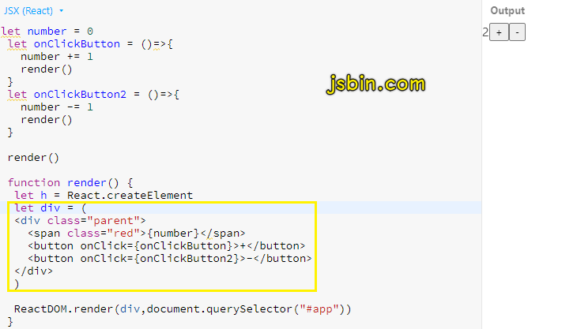

继续优化代码：

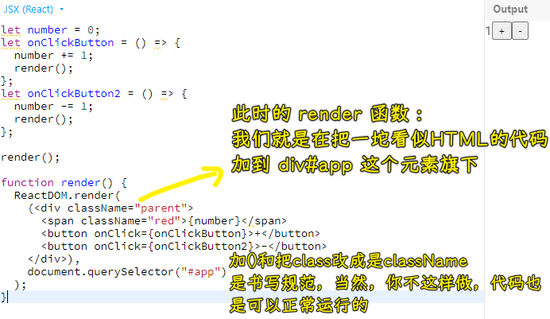

> 芳芳建议把`class`写成是`className`，虽然不这样做，代码也能正常运行，但如果遇上了报错，那你就得写成`className`这样了！所以，不管怎样都建议写成`className`这样

有人认为为啥不写成`onClick={onClickButton()}`这样呢？即加个`()`这样 -> 点击按钮，就执行函数……

其实你捋一捋就清楚了，你如果加上，那么翻译的结果：

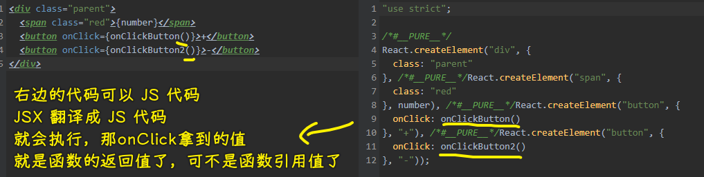

> JSX 语法的事件监听函数就是一个 `0x101` 这样的引用值，与 HTML 里边的 `<button onclick="xxx()">Click me</button>`是不一样的形式！

回顾整个过程：

原生 JS 姿势操作 DOM 的代码是很复杂的（用 jQuery 也是如此），当然，这是相较于使用了 JSX 语法而言的！

以前用原生 JS 或 jQuery 写代码的姿势：

1. 把内容放到页面上去
2. 如果要更新内容，就得到页面取对应的值，取到值之后，做一些处理，然后再回传到页面中去！
3. 不停重复 1、2 这两个过程

React 的想法：

页面你先给我空着，所有东西都是通过一个对象来表示的！

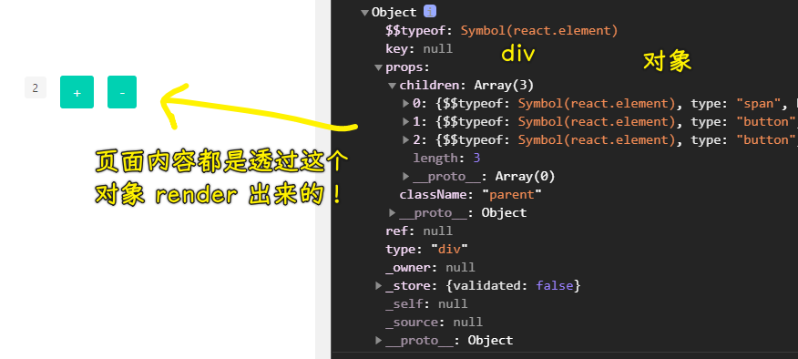

简单来说，就是把一个对象放到页面里边去，对象的某个内容更新了，就再把这个对象放到页面里边去！如此反复…… -> **改值，渲染，改值，渲染……**，没有任何其它的操作，如没有`innerText`这样的操作，总之，你可以忘掉所有的 DOM API，当然，除了最后挂载的这个`document.querySelector("#app")`……毕竟，我们需要告诉浏览器这个对象要在页面哪个位置渲染！

总之，`document.querySelector("#app")`是唯一用到了 DOM API 的地方，除此之外，就没有用到其它 DOM API 了。

以上就是 React 实现最初的想法了，一句话总结之：

> 由于 DOM API 太难用了，所以 React 不择手段地做到了不去访问 DOM ，只用你更新数据构造出个虚拟 DOM 就完事儿了！

💡：什么是虚拟 DOM？

就是我们写的那个看起来像 HTML 的 JSX 语法代码，为啥叫虚拟 DOM 呢？因为**它不是真正的 DOM 啊**！所以就叫虚拟 DOM 了

简单来说，虚拟 DOM 就是不真实的 DOM，而「不真实的 DOM」就是一个对象！ -> 虚拟 DOM 就是一个对象，没有任何神奇之处：

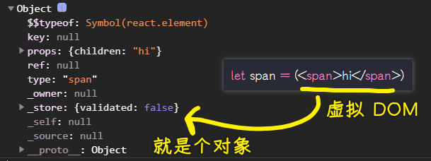

## ★总结

我们解决了一些悬而不决的问题：

JSX 是什么？

> 用 HTML 的形式来写 JS，所以就叫 JSX -> 一种 JS 的扩展，X 一般即扩展的意思！

虚拟 DOM 是什么？

> 非真实的 DOM 即虚拟 DOM，一般用对象来表示，虚拟 DOM 就是一个表示 DOM 节点的对象

这些概念都挺智障的，没有任何一点复杂的地方……

---

学到了什么？

知道了关于 React 这个想法是怎么来的，下一节芳芳会讲到 「React 的组件」这个想法是怎么来的！

Vue 是怎么来的？

➹：[Vue.js - Wikipedia](https://en.wikipedia.org/wiki/Vue.js)

➹：[Vue.js 进阶【1】Vue 产生的背景与未来_CalmReason 的博客-CSDN 博客](https://blog.csdn.net/calmreason/article/details/82526054)

