### ✍️ Tangxt ⏳ 2020-12-26 🏷️ react 组件

# 02-组件的诞生

## ★课件

代码：<http://jsbin.com/nezocuk/2/edit?html,js,output>

* 简单组件用函数
  * 第一个参数就是 props
* 复杂组件用 class
  * constructor(props) super(props)
  * this.state
  * this.setState()
  * render

## ★函数组件和 class 组件

上一节里边的需求，我们并不需要组件就能实现了。接下来，就讲讲**我们为什么需要组件**！

### <mark>1）为什么需要组件？</mark>

做一个思想推论：

之前我们做了一个简单的`+1/-1`需求，而现在我们要搞一个淘宝首页，我们知道淘宝首页是很复杂的，有很多元素标签，于是一个变态的现象就出现了：

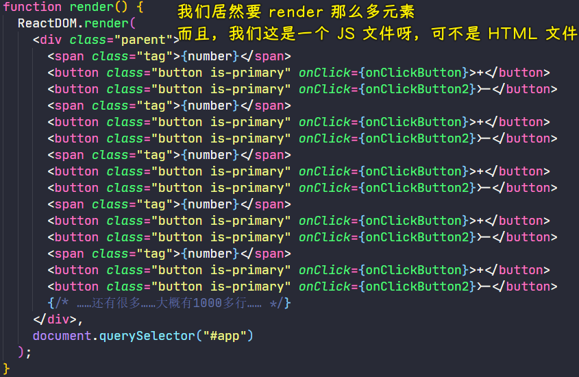

> `+1/-1`作为一块，图中，得加个`<div></div>`包裹那三个元素，以便感官上看起来这是一个组件之类的东西……

为啥我们这样写觉得很丑，而在 HTML 里边也是写标签，但并不觉得丑呢？

因为这是一个审美的倾向啊！在 JS 里边，我们崇尚每个文件不要那么复杂

所以，我们能否有一种办法可以把它们划分成一块一块东西呢？

于是，React 作者就想「什么东西可以把一些东西给包起来呢？」

> 最简单的包起来的东西就是一个「函数」

### <mark>2）函数组件</mark>

定义一个 `App` 函数（App，应用之意，表示我们整个应用的所有代码），该函数什么也不做，就返回一个 JSX 语法的虚拟 DOM

``` jsx
function App() {
  return (
    <div className="parent">
      <span className="tag">{number}</span>
      <button className="button is-primary" onClick={onClickButton}>
        +
      </button>
      <button className="button is-primary" onClick={onClickButton2}>
        -
      </button>
    </div>
  );
}
```

> `App()`的返回值是一个对象，就是那个虚拟 DOM

注意点：`return` 后边不能回车

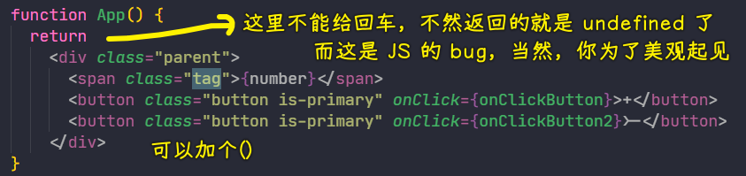

> 加个`()`就能回车了！

使用这个 `App` 组件，有两种姿势：

第一种：原生 JS 姿势

``` js
function render() {
  let h = React.createElement
  ReactDOM.render(
    h(App),
    document.querySelector("#app")
  );
}
```

第二种：JSX 姿势

``` js
function render() {
  ReactDOM.render(
    <App />,
    document.querySelector("#app")
  );
}
```

这两种姿势是一样的效果……只是后者更简单一点……

---

整体上看，我们把整个页面放到一个叫`App`的函数里边，然后再把这个函数当作是「标签」来用，当然，这实际上并不是一个标签！

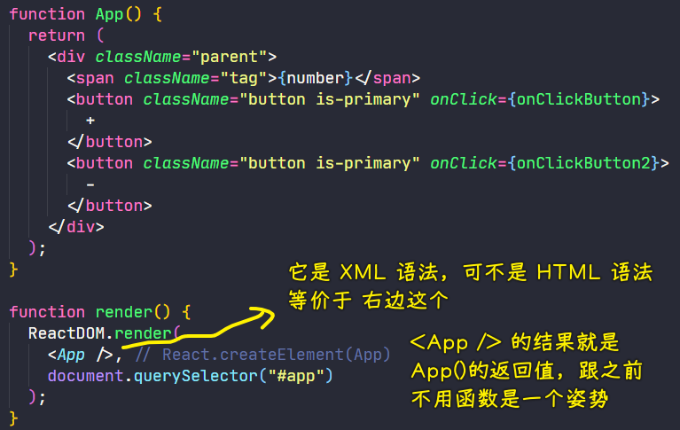

`App`这个标签所表示的就是上边那个返回值`div`标签，这样一来，我们的代码就有**更多的可能性**了……比如各种组件标签嵌套起来，然后再`ReactDOM.render`一下

### <mark>3）在一个组件里边使用另一个组件</mark>

> 根元素不能写两个元素，这是框架的毛病……

``` jsx
function App() {
  // 根元素不能写两个元素，所以需要用一个元素包裹住
  return (
    <div>
      <Box1 />
      <Box2 />
    </div>
  );
}

function Box1() {
  return (
    <div className="parent">
      <span className="tag">{number}</span>
      <button className="button is-primary" onClick={onClickButton}>
        +
      </button>
      <button className="button is-primary" onClick={onClickButton2}>
        -
      </button>
    </div>
  )
}
function Box2() {
  return (
    <div className="parent">
      <span className="tag">{number}</span>
      <button className="button is-primary" onClick={onClickButton}>
        +
      </button>
      <button className="button is-primary" onClick={onClickButton2}>
        -
      </button>
    </div>
  )
}

function render() {
  ReactDOM.render(
    <App />, // React.createElement(App)
    document.querySelector("#app")
  );
}
```

使用 Babel 转译的结果：

``` js
"use strict";

function App() {
  return /*#__PURE__*/React.createElement("div", null, /*#__PURE__*/React.createElement(Box1, null), /*#__PURE__*/React.createElement(Box2, null));
}

function Box1() {
  return /*#__PURE__*/React.createElement("div", {
    className: "parent"
  }, /*#__PURE__*/React.createElement("span", {
    className: "tag"
  }, number), /*#__PURE__*/React.createElement("button", {
    className: "button is-primary",
    onClick: onClickButton
  }, "+"), /*#__PURE__*/React.createElement("button", {
    className: "button is-primary",
    onClick: onClickButton2
  }, "-"));
}

function Box2() {
  return /*#__PURE__*/React.createElement("div", {
    className: "parent"
  }, /*#__PURE__*/React.createElement("span", {
    className: "tag"
  }, number), /*#__PURE__*/React.createElement("button", {
    className: "button is-primary",
    onClick: onClickButton
  }, "+"), /*#__PURE__*/React.createElement("button", {
    className: "button is-primary",
    onClick: onClickButton2
  }, "-"));
}

function render() {
  ReactDOM.render( /*#__PURE__*/React.createElement(App, null), // React.createElement(App)
  document.querySelector("#app"));
}
```

可以看到，我们用 JSX 语法写的代码，都是虚拟 DOM，咩有真正的 DOM

`React.createElement`发现你给的`Box1`参数是个函数的话，就会去执行这个`Box1`函数，把返回的结果，替换掉`Box1`这个参数！

以上就是关于组件的第一个构想了，即把一堆标签用一个函数包起来再`return`出去，而这个函数名就代表着这一堆标签 -> **组件的第一个萌芽想法**！

了解了这一点，我们就可以做很复杂的页面了，而且各组件之间不受影响！ -> 用 ES6 的模块语法，`export/import`一个函数就好了！

做一个树形结构的页面：

``` jsx
function App() {
  return (
    <div>
      <TopBar />
      <Ad />
      <Floors />
    </div>
  )
}
```

每个组件标签都对应着一个函数，而这些函数又`return`其它的标签，除此嵌套下去……

有了关于组件最基本的想法之后，我们可以对原先的需求加一些小功能！

> 学习的时候不要纠结细节，请把这个东西的大体脉络学完再说！不然，你就学不往这个东西了！

### <mark>4）给函数组件传参</mark>

函数组件总得有自己的状态吧！总不能公用一个全局状态吧！不然，你一动`number`，其它组件也动了……

这样加参数？

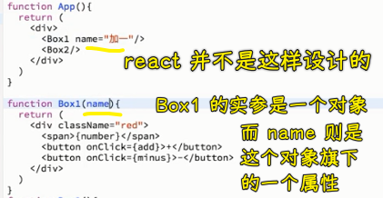

React 的设计：把写在`Box1`上的所以属性归纳成一个对象！

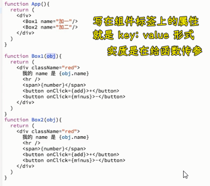

React 作者有两个创举：

1. 虚拟 DOM
2. 标签就是函数，函数就是对象，标签的属性就是函数的参数

可以看到，React 作者这种想法所搞出来的效果是非常简洁的，没有任何复杂的东西 -> **所有东西都变成一个函数和参数**！

话说，我们能不能给`Box1`和`Box2`各自传一个`number`属性呢？

这是不行的，因为 React 规定了一个事情：**不允许你修改别人传给你的参数**。

所有，`Box1`这个函数只能接受`name`，不能改这个`name`的值，如：

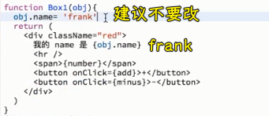

当然，你改了控制台也不会警告你，不过，你最好不要改，因为按照芳芳的「经验」来说，这样的代码很容易出 bug！

总之，「**请永远不要修改别人给你传的属性**」！如果修改了，后果自负（肯定会出现 bug 的，bug 是啥？可能目前你这样做的这天你不知道，但过了几个星期，几个月，就会出现无厘头的 bug 了）……

回过头来看，我们的需求：


朴素的想法：

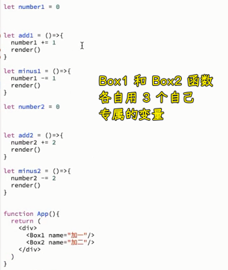

用这种方案来阻隔这两个组件，到底是好还是不好呢？

显然是不好的！如我要搞 100 个这样的组件，我岂不是要声明 300 个全局变量？ -> 我疯了才这样搞！

所以咋办呢？

目前，我们知道：

1. 不能修改传过来的属性，于是用了全局变量
2. 总是用变量的话，外面的变量会越来越多，最后膨胀，整个页面看上去有几百个变量，都搞不懂这个变量是专属于哪个函数组件使用的了……

升级版：

JS 里边有什么东西既能满足函数的功能，又能有一个自己的作用域呢？ -> 在函数里声明变量不就好了吗？

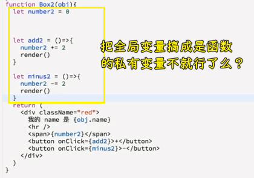

然而，再点击的时候没有任何明显的反应：


究其原因：

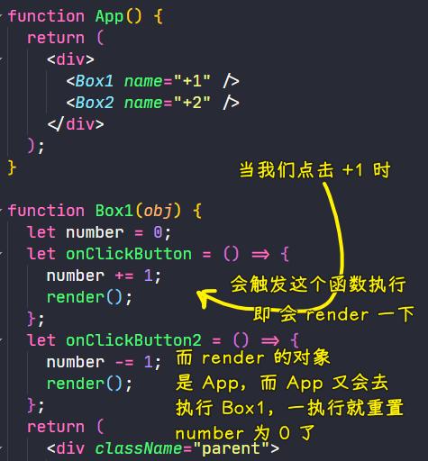

可以看到我们这思路凉了呀！ -> 函数的功能过于单一了，所以是否考虑使用 class 呢？

目前来看，我们一`render`就是渲染那个`App`组件，而这渲染就会初始化整个页面了！

所以我们能否局部`render`呢？而不是把整个`App`都给`render`了！

目前考虑两个点：

1. 不能用函数了
2. 不能每次都`render`整个`App`了

于是，我们就用`class`了！

### <mark>5）class 组件</mark>

``` jsx
class App2 extends React.Component {
  render() { // 局部 render
    return (
      <div>App2</div>
    )
  }
}
render();
function render() {
  ReactDOM.render(
    <App2 />, // React.createElement(App)
    document.querySelector("#app")
  );
}
```

这是最最简单用 `class` 构建组件标签的方式！

> `extends React.Component`是官方示例的写法……非得这样继承……

接受参数的写法：

之前我们写函数组件，接受参数直接`function App(props) {}`

> `props`这个形参命名是约定俗称的 -> 把接受到的参数叫做`props`

使用 `class` 组件的方式，更好拿参数：

``` js
class App2 extends React.Component {
  render() { // 局部 render
    return (
      <div>App2 {this.props.name}</div>
    )
  }
}
render();
function render() {
  ReactDOM.render(
    <App2 name="LeBron"/>, // React.createElement(App)
    document.querySelector("#app")
  );
}
```

直接`{this.props.name}`就行了，之所以可以这样做，是因为我们继承了`React.Component` -> `props`是父类构造的！

💡：数值 与 字符串？


元素标签上加引号的都是字符串哈！

我们知道我们不能改`props`，但这个 `class` 组件能否有自己的局部变量呢？

设置局部变量：

在`constructor`设置 -> 为啥在这里设置？因为这是规定的！所以没有为什么……

文档规定，你要把变量放到`state`里边 -> 不能写`let`之类的，毕竟在`class`里边你只能写属性或函数，没法瞎写……

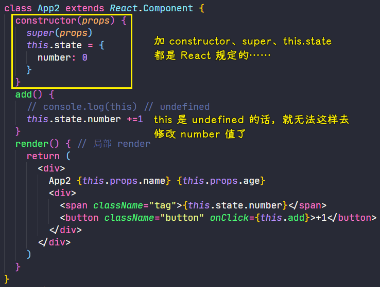

注意点：

- 不要加括号，如不要写成这样`this.add()`，因为这是需要转译的！而转译的结果是`add`函数的返回值
- 我们这样调用`add`函数：`this.add()`，按照以前写`class`的认识，`this.add`，`add`里边的`this`就是这个类的实例，但在 React 里边，它做了处理，它把`this`重置为了`undefined`！即 React 在调用`add`时，是这样调用的：`add.call(undefined)` -> 总之，React 是强制把`this`变为`undefined`，这是故意的！

> 框架有很多规定，就是要把你框死！

为了能让`add`函数体里边的`this`指向`App2`的实例，我们有两种姿势可以做到：

1. 使用`bind`：`{this.add.bind(this)}`
2. 使用箭头函数：`{()=> this.add()}`

可选择哪种姿势呢？

芳芳选择的是第一种，因为它语义更明确啊！

回过头来，我们指定了`this`，但效果并没有出来：

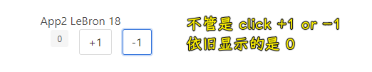

为啥没有效果呢？

因为官网规定，必须要用`this.setState`去做！

``` js
this.setState({
  number: this.state.number + 1
})
```

效果：


可以看到，虽然`class`的功能更强大，但是它的约束条件更多！

如果你的 JS 基础不好，你基本理解不了它为啥有那么多限制……

一个完整的`class`组件：

``` jsx
class App2 extends React.Component {
  constructor(props) {
    super(props)
    this.state = {
      number: 0
    }
  }
  add() {
    this.setState({
      number: this.state.number + 1
    })
  }
  minus() {
    this.setState({
      number: this.state.number - 1
    })
  }
  render() { // 局部 render
    return (
      <div>
        App2 {this.props.name} {this.props.age}
        <div>
          <span className="tag">{this.state.number}</span>
          <button className="button" onClick={this.add.bind(this)}>+1</button>
          <button className="button" onClick={()=>this.minus()}> -1</button>
        </div>
      </div>
    )
  }
}
```

用 `class` 组件必须要记住的：

1. 必须继承 `React.Component`
2. `constructor`必须接受一个`props`
3. 必须在`constructor`里边写个`super(props)` -> 这是 JS 规定的，这表示调用父组件的`constructor`
4. 必须在`constructor`里边初始化这个`state`，不能在其它地方初始化它！`state`这个对象旗下的属性就是你能用的变量！
5. 事件可以放在与`constructor`同级的位置
6. 必须要有一个叫`render`的函数，而且这个`render`函数必须要返回一个标签，而且这个标签必须只有一个根元素，不能有两个，当然，后来 React 升级了，是可以支持两个的！
   1. 在标签里边想要`props`的话，必须得`this.props.xxx`这样 -> **外边传过来的**
   2. 如果想要`state`的话，必须得`this.state.zzz`这样 -> **自己维护的**
   3. 事件处理 -> 如果你要指定`this`，你得自己去绑定，React 可不会帮你去做！（以前是可以的，但后来有人说这样并不好，于是就改成不帮你绑定了，即只能让使用者自己去做了）

> JS 基础好，不需要死记硬背上边这几点，否则，就死记硬背吧！

以上这个代码，就是一个最简单、最简单的 React 组件！

### <mark>6）回顾整个过程</mark>

1. 一开始用函数代替标签，发现它是很简单的，但其功能不足，如不能有局部变量，不能有局部方法，于是我们就用了`class`
2. `class`姿势 -> 我们可以有局部的变量、局部的方法，而且还有一个局部的`render` -> **重点抓住我要局部，不要全局**

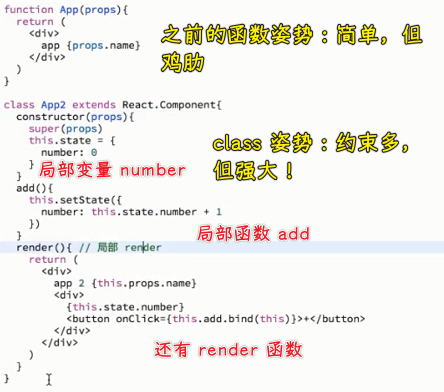

### <mark>7）完成我们的最终需求</mark>

> 始终谨记：我们写的 JSX 语法代码，并不是在写标签，而是在写虚拟的一个对象，只不过这个对象可以用标签来表示而已！

写 JSX 语法代码的时，你所添加的属性，你得这样：`onClick={()=>xxx()}`，千万不要写成有空格的这样：`onClick = {……}`

``` jsx
class Box1 extends React.Component {
  constructor(props) {
    super(props);
    this.state = {
      number: 0,
    };
  }
  add() {
    this.setState({
      number: this.state.number + 1,
    });
  }
  minus() {
    this.setState({
      number: this.state.number - 1,
    });
  }
  render() {
    return (
      <div className="parent">
        我的 name 是 {this.props.name}
        <span className="tag">{this.state.number}</span>
        <button className="button is-primary" onClick={this.add.bind(this)}>
          +1
        </button>
        <button className="button is-primary" onClick={this.minus.bind(this)}>
          -1
        </button>
      </div>
    );
  }
}
class Box2 extends React.Component {
  constructor(props) {
    super(props);
    this.state = {
      number: 0,
    };
  }
  add() {
    this.setState({
      number: this.state.number + 2,
    });
  }
  minus() {
    this.setState({
      number: this.state.number - 2,
    });
  }
  render() {
    return (
      <div className="parent">
        我的 name 是 {this.props.name}
        <span className="tag">{this.state.number}</span>
        <button className="button is-primary" onClick={this.add.bind(this)}>
          +2
        </button>
        <button className="button is-primary" onClick={this.minus.bind(this)}>
          -2
        </button>
      </div>
    );
  }
}
function App(props) {
  return (
    <div>
      <Box1 name="Box1" />
      <Box2 name="Box2" />
    </div>
  );
}

function render() {
  ReactDOM.render(
    <App />, // React.createElement(App)
    document.querySelector("#app")
  );
}
render()
```

效果：

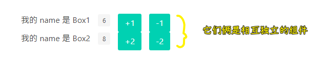

> Box1 和 Box2 都有各自独立的局部变量、局部方法、局部`render`

💡：改变`state`，为啥不是这样写？

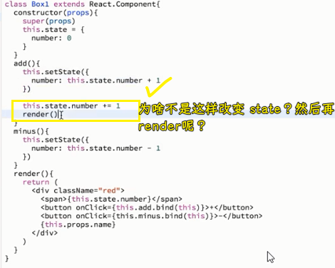

很明显的看到，下边这种姿势要更容易理解啊！

问题来了，为啥要写`setState`？而不是我们自己亲自直接改变`number`的值，然后再手动地去`render`呢？

这个问题在面试的时候经常会问到，如`setState`有啥优点？又有啥缺点？

优点：`setState`可以**对更新进行优化**，不然，你很有可能频繁地调`render`，这样一来页面就很容易卡了！（大批量更新，一秒`render`十几次是很容易卡的）

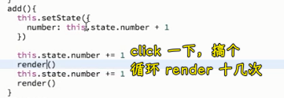

而`setState`则不会这样，**它会将大批量的更新合并成一次更新**，这意味着你可以不止一次地去`setState`了

总之，自己`render`容易把自己给坑了，还不如把`render`的调用过程交给`setState`去搞（`setState`的源代码里边最终肯定会有一步去调用`render`这个方法的） -> React 既然帮我们搞定了`render`，那就不用去管了！React 怎么说，你就怎么做……

💡：同一个组件类搞出来的标签是一样的吗？

``` jsx
let x = (<Box1 />)
let y = (<Box1 />)
console.log(x)
console.log(y)
console.log(x === y)
```

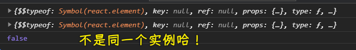

💡：我们能否这样改变`number`的值？


测试结果：


原因是：

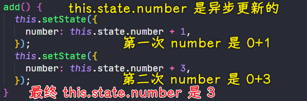

> 图中的代码是我测试第二次`+3`的情况，结果就是点一下`+3`

这是批量操作的，会等`number`有确切值后，才去`render`的，说白了，就是不断覆盖前一次的值，可不是`setState`一次页面就`render`一次……

可我就是想要这样两次`+1`啊？

那么你可以这样做：


但`setState`执行的时候，会执行这个箭头函数参数，`setState`函数体内部会传一个参数给它……

进一步的测试：


再进一步的测试：

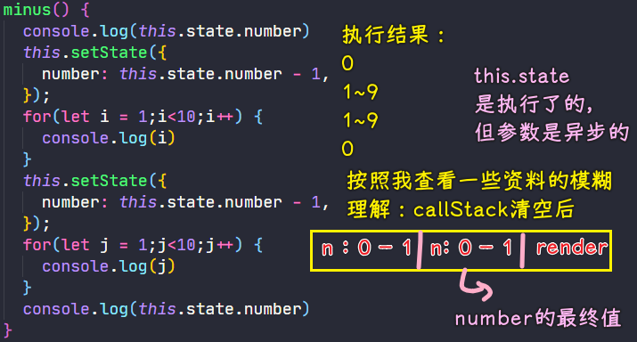

如果参数是箭头函数的话，那么第二个空格就不是初始值`0`了，而是上一个空格得到的`n`值…… -> 这只是我个人为了理解的猜测……

总之，不管怎样，我们一般只写一个`setState`，而不是写两个、三个……这样

💡：以怎样的姿势看待这个代码？

``` jsx
function App(props) {
  return (
    <div>
      <Box1 name="Box1" />
      <Box2 name="Box2" />
    </div>
  );
}
```

整个应用叫`App`（也就是我们在页面上要看到的内容），它里边有两个盒子，如果你想要知道`Box1`这个盒子长啥样？那么你得去看看它的`class`里边的`render`是怎么写的！同理，`Box2`也是如此！还有它们的功能以及状态都在它们各自的`class`里边！

💡：DOM diff？

找两次 render 结果不同之处这个过程叫做「DOM diff」，至于是如何去对比的，我们无须去操心！反正就是能找到变化的位置！

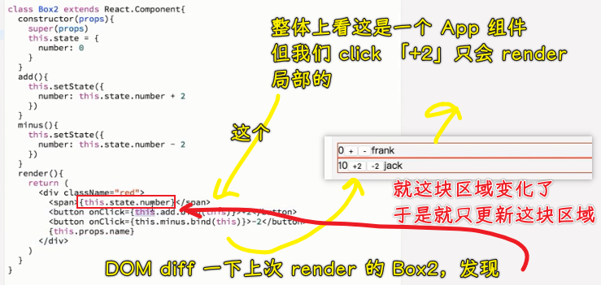

> 搞清楚肤浅的东西，再去理解深的东西，如「DOM diff」算法这种深的东西，无须当下去理解，当你去找 20k 以上的工作时，倒是可以去理解，但 10k 以下就算了！

如果你非得搞清楚深的东西，我只能说「等你搞清楚（需要几个月的时间），你早就饿死了……」，先有钱、能活再去学习深入的东西

💡：`setState`这个 API 的其它参数？

``` js
this.setState((state, props) => {
  return {counter: state.counter + props.step};
});
```

传`props`是为了拿到最新的`props`值！

➹：[React.Component – React](https://zh-hans.reactjs.org/docs/react-component.html#setstate)

---

用了`class`组件实现我们的需求，显然代码更模块化了……

## ★了解更多

➹：[React - setState 源码分析（小白可读）](https://juejin.cn/post/6844903573453537287)

➹：[第 18 题：React 中 setState 什么时候是同步的，什么时候是异步的？ · Issue #17 · Advanced-Frontend/Daily-Interview-Question](https://github.com/Advanced-Frontend/Daily-Interview-Question/issues/17)

## ★总结

- 关于 React 的两种组件：
  - 函数组件 -> 功能单一
  - `class` 组件 -> 有很多规定
  - 参数：外边用`props`，里边用`state`
