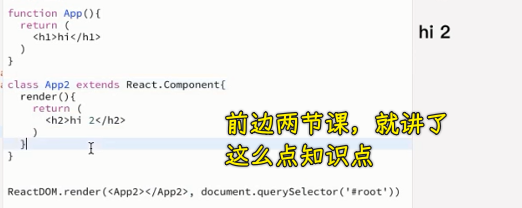
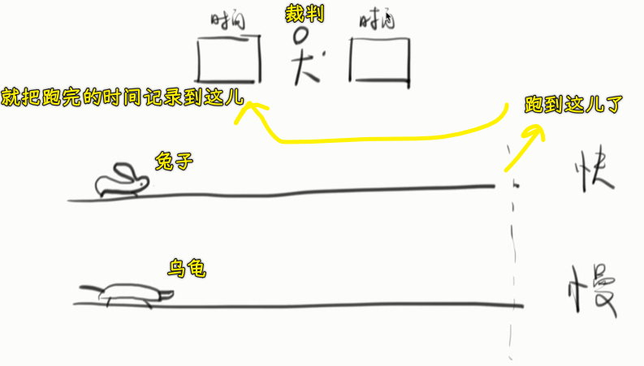
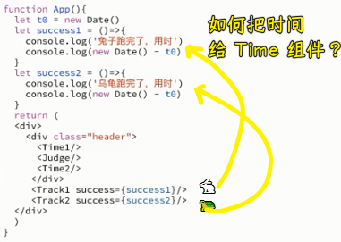
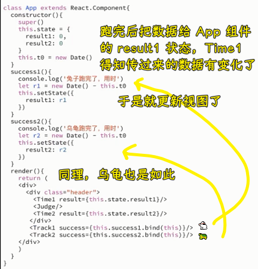
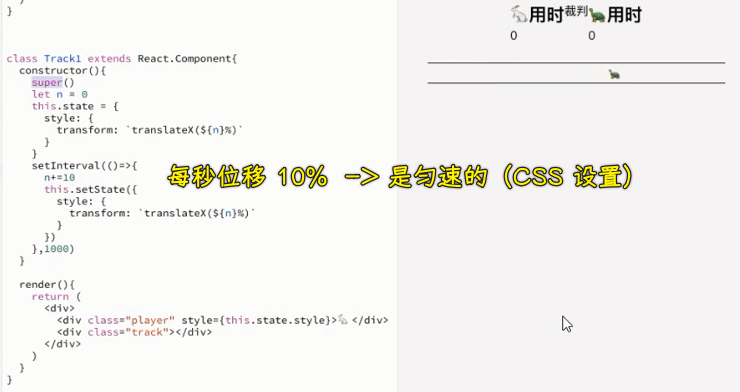
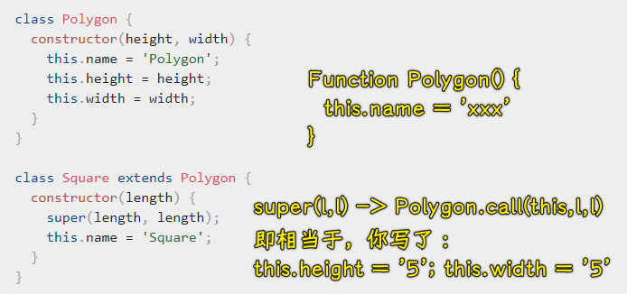
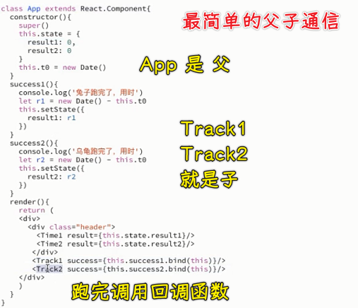
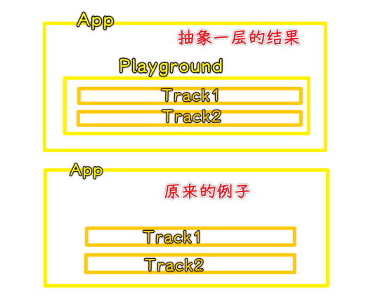
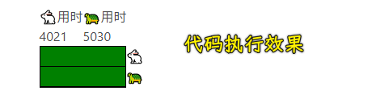

### ✍️ Tangxt ⏳ 2020-12-30 🏷️ 组件通信

# 03-组件通信 - 父子/爷孙

## ★React 龟兔赛跑 1

### <mark>1）回顾之前所学的内容</mark>

1. 在使用 React 之前，需要引入两个库（版本是一致的，选择`umd`的`production`版）
   1. react
   2. react-dom
2. 简单组件 -> 函数组件 -> 直接返回一个 JSX 语法的代码
3. 复杂组件 -> `class`组件 -> 在`render`方法里边返回一个 JSX 语法的代码
4. 谨记：函数即是标签、`class`即是标签

虽然内容很少，但方方告诉了我们「为啥要这样写？」，而其它老师的课程可能仅仅就是讲一个像上边这样的结果给你听了！

总之，你已经明白了：

**React 作者为啥会想到要用函数来表示一个组件 以及 用一个 `class`来表示组件了**

接下来，要讲的内容是组件通信！ -> 借助一个小例子来描述一下组件间的通信到底是什么

### <mark>2）龟兔赛跑</mark>

> 随便想个例子，然后把它做出来

构思：

你要做的：

1. 想想如何用代码把这个例子给做出来
2. 在做这个例子的过程中，你用到了什么知识，就学会了什么知识了！ -> 根本就不用去看文档学习！

做法：

1. `App`组件、用时组件、裁判组件、跑道组件
2. 让兔子动 -> 改变位置即可 -> 用 CSS -> 使用`setInterval` -> 兔子跑完赛道就停下来（把定时器砸了）
3. 让乌龟动 -> 同上，但乌龟跑得更慢
4. 兔子停了就把时间告诉裁判，同样，乌龟也是如此 -> 如何告诉裁判？

时间处理：

函数组件没有`state`，如果要有自己的`state`得用`class`组件

所以可有：

> 裁判组件没有必要存在，我们只要把跑完的时间渲染出来就好了！

这个例子体现了，`Track`与`App`通信，`App`与`Time`通信 -> 眯着眼睛看就是`Track`与`Time`通信！

💡：如何用 React 改变一个函数组件的`style`？

只能用 `class` 来改！因为函数没有状态呀！

内联样式：

1. 声明一个样式对象
2. 把该样式对象赋值给标签上的`style`属性就行了

💡：钩子也叫生命周期

💡：关于`class`里边的`super`？

如果你用了`extends`，那么在`constructor`里边使用`this`关键字之前，先`super`一下 -> 这是语法规定哈！

`super`相当于是调用父类：

💡：`n === 100` & `n >= 100` ？

后者要比前者更严谨，表示不管你是等于 100，还是大于 100 都是跑完了……

💡：父组件传数据给子组件，不用写`props`吗？

是可以的！我一直以为要给`constructor`一个`props`形参！

💡：CSS 动画存在延时的现象？

当你的 JS 执行完后，CSS 动画还在继续，照理说，JS 执行完后，CSS 动画刚好结束！而不是，JS 执行完，还有等一会儿，CSS 动画才结束！

如何解决？不要用 CSS 延时动画……

💡：什么时候用`function`？什么时候用`class`？

- 组件非常纯净，没有内部状态，那就用`function`
- 如果你发现这个组件需要记录一下自己内部状态，那就用`class`

💡：组件如何通知外界？

通过回调的方式来做的！

龟兔赛跑这个例子告诉了我们：遇到了某种场景就必须要通知外面，如果方方一开始就直接告诉了这么一个父子通信的话，我们很有可能记不住，毕竟，没有告诉我们为什么要这么做！

总之，React 的父子组件通信是这样的：

- 父元素传一个函数给子元素
- 子元素在恰当的时候调用这个函数（可以传参数） -> 修改父组件的状态

为什么要父子通信？ -> 不通信的话，裁判（`App`组件）如何知道你跑完了呢？所以，`Track`组件跑完了，就得调用一下回调函数了！

## ★龟兔赛跑 2

> 让例子复杂一点

抽象一层 -> 把两个跑道扔到一个`playground`（操场）组件里边去！

爷爷组件如何与孙子组件通信？

1. 爷爷`App`把函数传给爸爸`Playground`
2. 爸爸再把这个函数透传给孙子`Track`

同理，曾爷爷传曾孙子也是如此……

下一节讲的是「`Track1`与`Track2`是如何交流的？」，如兔子跑了一半路程了，嘲讽一下乌龟说「你咋跑那么慢呢？」

---

代码：[Demo](https://github.com/ppambler/react-demo/commit/2fef3b2583f4d30bfea35f6b4d19994b2ce0b555)

💡：透传？

中间的爸爸不关心爷爷传了什么数据给孙子，只关心把数据传给孙子就完事儿了……

➹：[数据透传的概念_chenlycly 的专栏-CSDN 博客_透传是什么意思](https://blog.csdn.net/chenlycly/article/details/7391038)

## ★测试

面试题：请简述 React 父子组件之间如何通信。

我的答案：

> 父组件用一个函数（假如叫 A ）作为实参传给子组件，子组件在恰当的时机调用这个 A 函数，而这个 A 函数里边的代码可以去改变父组件的状态值……

参考答案：

父组件要传数据给子组件很简单，直接放在 props 里即可
子组件要传递数据给父组件就复杂点：

1. 父组件将一个函数 fn 作为子组件的 props 传给子组件
2. 子组件在恰当的时候调用这个 fn，并且把数据放在 fn 的参数里
