### ✍️ Tangxt ⏳ 2021-01-08 🏷️ eventHub

# 04-组件通信 - eventHub

## ★课件

1. 任意两个组件之间如何通信
2. 发布订阅模式
3. Redux 就那么回事

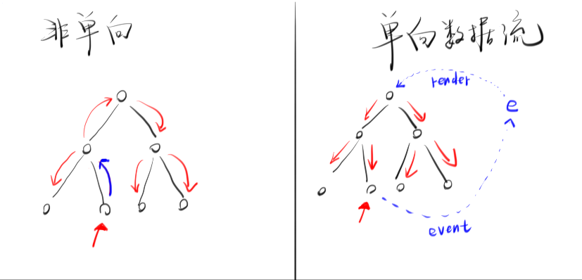

## ★回顾

引入两个库（请保证两个库的版本一致）：

- `react.production.min`
- `react-dom.production.min`

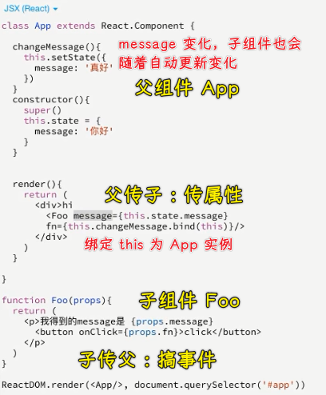

关键点：

在 React 里边：

- 任何一个函数都是一个组件，都可以写成标签的形式，返回值就是渲染的内容
- 父组件传参数给子组件：对组件标签传参数 -> 往组件标签上写属性；组件所映射的 HTML 标签要拿到参数，需要透过形参（第一个参数）来拿到！
- 子组件传参数给父组件：把父组件改造成`class`，因为需要保存状态！

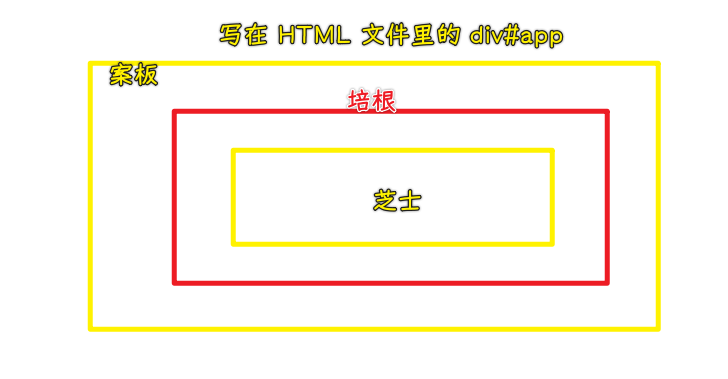

具象化自己是如何看组件的：


## ★使用 eventHub 实现通信

### <mark>1）需求：</mark>

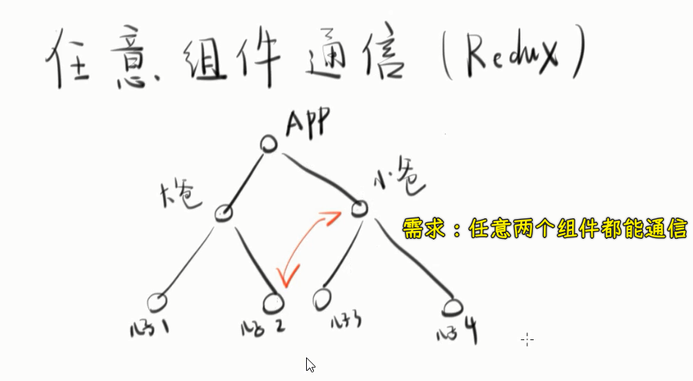

做法：

第一步：搞个轮廓

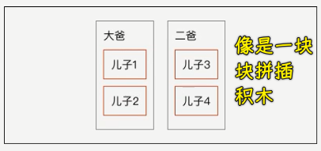

> `demo4/1.js`

第二步：更新一个全局数据

爷爷的遗产：一张存有「100 k」的存折

儿子 2 此时消费了 9k，儿子 3 此时得知道存折此时的余额

> 所谓入门：不知道为什么，但知道怎么做。如不断地写`class Son2 extends React.Component{}`，你不知道为啥这样写就创建了一个组件，但需求依旧能被自己给实现出来！

每个儿子、孙子都有`money`状态

💡：为儿子 2 绑定了`click`事件，事件触发执行`x`方法，结果只更新了儿子 2 的数据，我们想要的是所有组件都能更新

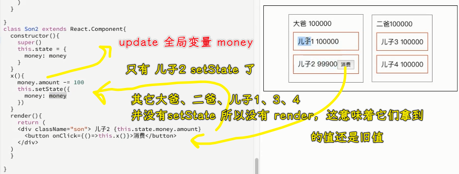

> `demo4/2.js`

这意味着，如果一个儿子消费了「100k」，那么其它儿子就会吃霸王餐了……因为其它儿子以为自己的卡里还是有「100k」的！

解决方案：

姿势一：

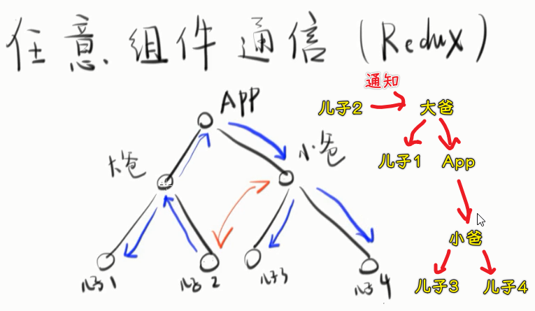

这个姿势很辣鸡，因为要做的事情太多了，有没有什么办法可以做到「一个人可以直接通知任何人呢？」

总之，你要做的是：假如有两个家族，它们都共用一个财产，你是否有方法可以做到让它们使用这笔财产不混乱？ -> 提供一个管理财产的方案！

很简单，雇一个财务经理（管家，专门管钱的）不就行了吗？

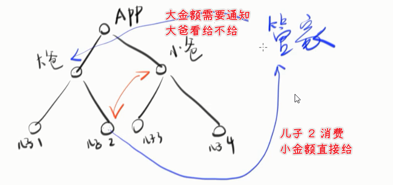

> 所有人共用一个数据的情况，那就雇一个人来专门管这个事情！

💡：如何让儿子 2 跟所有人交互？

经典的设计模式：发布订阅模式（Event Hub）

任何地方都能发布（`trigger`）事件…… -> 订阅是`on`

> 有人放「烟雾」了，订阅「烟雾」的请行动起来！

``` js
var eventMap = {};
var eventHub = {
  trigger(eventName, data) {
    let fnList = eventMap[eventName];
    if (!fnList) return;
    for (var i = 0; i < fnList.length; i++) {
      fnList[i](data);
    }
  },
  on(eventName, fn) {
    if (!eventMap[eventName]) {
      eventMap[eventName] = [];
    }
    eventMap[eventName].push(fn);
  },
};
```

测试：儿子 2 发布，儿子 3 订阅

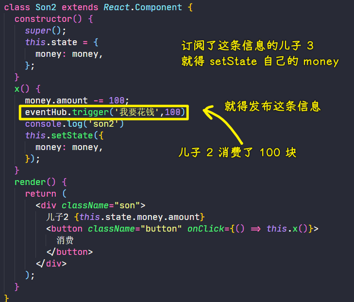

``` jsx
// 儿子 3 订阅
class Son3 extends React.Component {
  constructor() {
    super();
    this.state = {
      money: money,
    };
    eventHub.on("我要花钱", (data) => {
      this.setState({
        money: money,
      });
      console.log('son3')
    });
  }
  render() {
    return <div className="son">儿子 3 {this.state.money.amount}</div>;
  }
}
```

> `demo4/3.js`

这样做的不好之处，每个人都得订阅「我要花钱」事件，因为每个人都有`money`这个状态呀！也就是每个人手里都拿着一张卡，每个人花钱的时候都是「**先斩后奏**」的……

所以我们得把他们的「卡」上交给「管家」去管！

💡：把卡都交给管家，让管家去管钱（支配金额的 CRUD）

不用`state`，用`props`

``` js
var 管家 = {
  init() {
    eventHub.on("我想花钱", (data) => {
      console.log("管家");
      money.amount -= data;
      // 此时要调用 render 才能实现 数据的同步
      // 这是 React 的牛逼之处 -> DOM diff
      // 如果你用 jQuery 的话，Render 一下，就得更新整个 App 了，而不是局部更新
      render();
    });
  },
};

管家。init();
```

> `demo4/4.js`

整个流程：

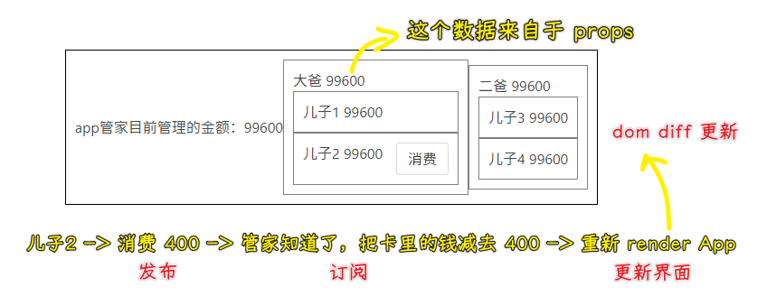

可以看到，我们不用在每个组件里边都写上「订阅」了，也不用写一个个`state`了！

总之，完成这个流程需要的材料有：

1. eventHub
2. 管家
3. 各个用于测试的组件

💡：数据流是单向的

没有单向数据流之前：

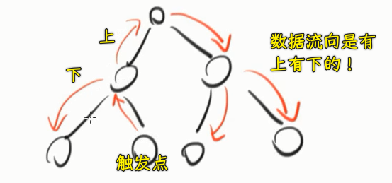

用了之后：

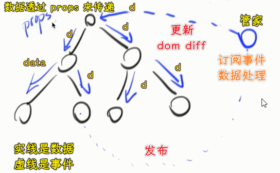

至此，我们就明白了如何做到任意两个组件之间的通信了！

## ★使用 Redux 代替 eventHub

### <mark>1）Redux 的第一个概念——Store</mark>

使用`eventHub`这个模式的特点：

1. 所有的动作都要通过事件来沟通
2. 你的`var money = {}`这个数据必须放在顶层，然后把`money`这个状态是放到`App`组件里边

问题来了，我们能否把`money`放到其它地方？

这是不行的，如果你放在「大爸」里边，那么「二爸」就得不到这个`money`了！

所以就像 Redux 所提倡的那样：**你要把所有的数据归到一个地方去！然后把这个数据传给最顶层的那个组件就行了！**

目前我们只有一个`money`数据，假如还有个`user`数据：

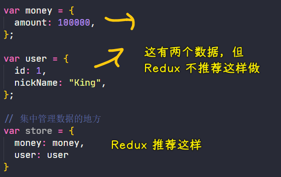

> Redux 一直没有解决的一个问题，那就是不管做什么，都得把数据一级级的传下去……没有办法做到哪一层用数据，就把数据给哪一层……但不管怎样，这种「单向数据流」思路还是可以把数据送到它该送到的地方的……

💡：`store`？

为什么需要它？

因为`money`和`user`这两个数据太分散了，我们要把它提到一个地方去！

而这就是著名的一个概念——store

store 表示所有的数据，注意，store 这个名字是不能改的，因为这是约定俗成的！

总之，store 就是存数据的地方！

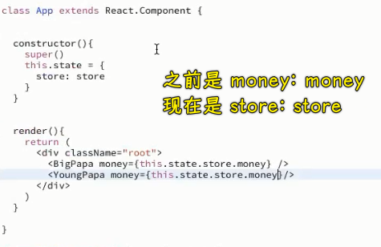

如果你有很多数据，那就把这些数据都放到`store`里边去吧！

### <mark>2）Redux 的第二个概念——Action</mark>

你想做一个事情，那么做这个事情其实就是一个动作

如「你想花钱」，你就`eventHub.trigger("我想花钱", 100)`，那么这行代码就是`action`

也许你会问「为啥 Redux 要把这些操作都换个名字呢？」

如：

1. 发布一个事件（`eventHub.trigger("我想花钱", 100)`）叫做`action`
2. 把这个`我想花钱`叫做`action type`
3. 把这个`100`叫做`payload`

### <mark>3）Redux 的第三个概念——Reducer</mark>

我们对数据的变动就叫做「Reducer」

``` js
var 管家 = {
  init() {
    // 订阅 subscribe
    eventHub.on("我想花钱", (data) => {
      console.log("管家");
      money.amount -= data; // reducer 对数据的变动
      render();
    });
  },
};
```

把`on`这个操作叫做「订阅」

> Redux 本质上就是一个 EventHub

### <mark>4）Redux 入门</mark>

文档：[Counter 示例 · Redux](https://www.redux.org.cn/docs/introduction/Examples.html)

查看：[redux/index.js at master · reduxjs/redux](https://github.com/reduxjs/redux/blob/master/examples/counter/src/index.js)

引入 Redux，有两种姿势：

1. cdn 引入
2. `npm install --save react-redux`、`npm install --save-dev redux-devtools`

使用 Redux ：

💡：创建一个数据存储仓库？

``` js
import React from "react";
import ReactDOM from "react-dom";
import "./1.css";
import { createStore } from "redux";

// 管家 -> 一个函数 -> 返回值是 state
let reducers = (state = 0, action) => {
  state = state || {
    money: {
      amount: 100000,
    },
    user: {
      nickName: 'King'
    }
  };
  switch (action.type) {
    case "ADD":
      console.log("ADD");
      console.log(state);
      return Object.assign({}, state, {
        money: { amount: state.money.amount + action.payload },
      });
    case "MINUS":
      console.log("MINUS");
      return Object.assign({}, state, {
        money: { amount: state.money.amount - action.payload },
      });
    default:
      console.log('default')
      return state;
  }
};

// 数据仓库
const store = createStore(reducers);
```

可以看到，我们把之前的`store`（简单的普通对象）变成了 Redux 它所用的`store` -> 这形式看起来有点复杂

> Redux 的难处在于「不好好说话」 -> 喜欢起新名字

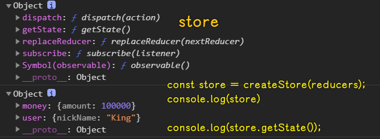

发布事件的操作是：

``` js
store.dispatch({ type: "MINUS", payload: 100, });
```

> Redux 内置了 EventHub，我们不需要自己去写！而且管家也不需要了，Redux 它也自带了！

💡：如何把数据传给`App`？

``` jsx
function render() {
  ReactDOM.render(
    <App store={store.getState()} />,
    document.querySelector("#root")
  );
}

render();
store.subscribe(render);
```

以前是直接把数据传给`App`的`state `状态的！现在直接用`props`传给`App`就好了！

💡：更改数据的状态？

使用 reducers，以前是交给管家做的！

💡：数据改了，如何重新 Render？

``` js
// 初始化 render，渲染第一次 store 的数据
render();
// store 变化，就会去重新 render App -> 执行 render 函数
store.subscribe(render);
```

`store`变了，就会重新`render`！

---

注意：顶级组件不存储`state`，一开始就使用`props`来传递数据！

### <mark>5）小结</mark>

1. Redux 非常啰嗦（明明要做的事儿很简单），喜欢造名词
2. 简单使用 Redux 的姿势：
   1. 造个 store 出来
   2. 把 store 透过`props`注入到顶层组件里边
   3. 更新数据使用`dispatch`

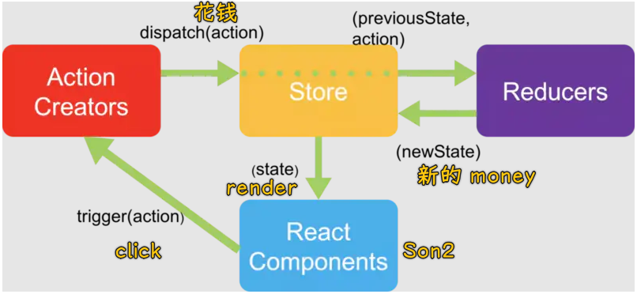

Redux 的弊端，如果数据在 100 层就得传 100 层，也就是一层层地传下去…… -> 非常啰嗦！

接下来，探讨一下 Redux 既然那么啰嗦，可它到底有什么价值呢？

## ★吐槽 Redux

### <mark>1）Redux 搞出来的这些概念到底有什么意义？</mark>

所有的框架都有这么一个使命：防呆

什么叫「防呆」？

我们在做软件开发的时候，最怕什么情况？

不怕软件复杂，怕的是你的队友是猪队友！

什么叫猪队友？ -> 非要违反规则去写一些很烂的代码！导致出现一些影藏的 bug

#### <mark>1、规范事件名</mark>

所有 Redux 最主要的功能就是防呆，如果你很厉害，你用 EventHub 完全可以模拟 Redux，但是 EventHub 有什么问题呢？

它的一个问题是：你的事件名字完全是随心所欲的。

如「我想花钱」等其它奇奇怪怪的名字，如果这个项目有 100 种不同的事件，这事件名起得岂不是乱七八糟的！ -> 所以 Redux 就告诉你「你不能瞎写名字，而是用个事件列表罗列出来」

如果你不这样做，那么代码就很容易出现不同事件名却做同一件事的代码了！如 A 写`我想花钱`，B 写`我想要花钱` -> 这是没有办法阻止的，谁叫这事件名是用字符串来表示的呢！

总之，Redux 把事件名（`action.type`）和参数（`action.payload`）做了一个约束，而且还得把所有的事件列在这个`switch...case...`里边（如果不列在这里边，Redux 就不接受了……）

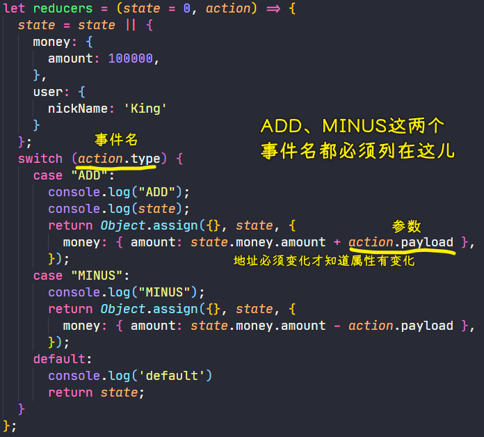

#### <mark>2、让你有强烈的意愿认为`store`（`value`属性）是只读的！</mark>

使用 Redux，那么你就不能用 `state`了，用了就报错！

总之，你只能用`props`的形式去使用`store.getState()` -> 这告诉我们什么？ -> `store`是只读的，任何组一个件都不能去改我的`state`

而 EventHub 能做到吗？ -> 答案是做不到的！

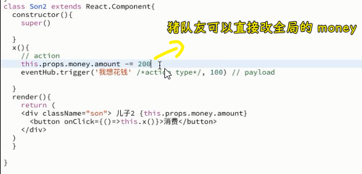

当然，Redux 也是可以改的 -> 这是 JS 的毛病：

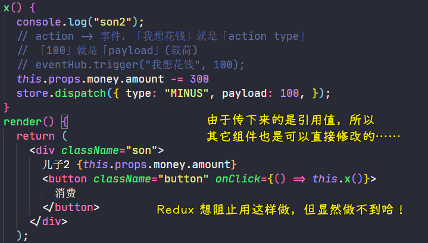

除非你不给组件对象，但不给对象，那组件就读不了数据了呀！所以这是矛盾的！

总之，Redux 的 API 是有暗示这个`store`是只读的，而且还得把这个数据放在顶层的组件里边！

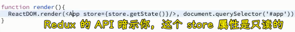

#### <mark>3、让不懂英语的前端滚出去</mark>

1. store：对象
2. subscribe：订阅`store`的变化，一旦变化，传给它的函数参数就会执行
3. Reducer：为了区分 reduce 这个数组 API
4. action(type,payload)：`playload`是最难理解的，但它其实就是`data`的意思，之所以取这个很难理解的英文单词就是要把猪队友给屏蔽走……以后前端的发展方向就是「把前端变复杂，让不好好学前端的人滚动，如最新的 React API 是非常之抽象滴！」

话说，方方会用 Redux 吗？ -> 如果团队有猪队友那就用，如果都是大神，那就可以不用，反正用 EventHub 等姿势大家都能理解哈！

---

接下来，会讲 Redux 的深入运用，如「如何做到不在每个组件上都传数据呢？」

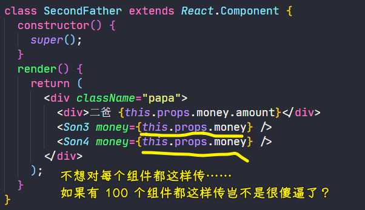

### <mark>2）Redux 的优点</mark>

1. 把`event`归类，你不能瞎命名`event`
2. 要求所有数据是只读的，任何一个组件都能去修改根级传过来的数据，但 Redux 并咩有办法禁止我们这样做
3. 通过制造一些概念，让不好好学习的人滚蛋

Redux 就是一个 EventHub。

## ★测试

面试题：请简述 React 任意组件之间如何通信。

有两种方式：

1. 自定义一个 EventHub，一个组件发布一个事件，另一个组件订阅这个事件
2. 使用 Redux

---

参考答案：

```
1. 使用 eventHub/eventBus 来通信

一个组件监听某个事件，另一个组件触发相同的事件并传参，即可实现两个组件的通信
缺点是事件容易越来越多，不好控制代码的复杂度

2. 使用 Redux

每次操作触发一个 action
action 会触发对应的 reducer
reducer 会用旧的 state 和 action 造出一个新的 state
使用 store.subscribe 监听 state 的变化，一旦 state 变化就重新 render（render 会做 DOM diff，确保只更新该更新的 DOM）
```

## ★了解更多

➹：[Data Flow - React 入门教程](https://hulufei.gitbooks.io/react-tutorial/content/data-flow.html)

➹：[Redux 入门教程（一）：基本用法 - 阮一峰的网络日志](http://www.ruanyifeng.com/blog/2016/09/redux_tutorial_part_one_basic_usages.html)

➹：[React 之 Redux 的基本使用 - 简书](https://www.jianshu.com/p/10ccbefca455)

➹：[redux 的工作流程是怎样的？· Issue #40 · daily-interview/fe-interview](https://github.com/daily-interview/fe-interview/issues/40)

➹：[React 9 - Redux 图解原理 - 知乎](https://zhuanlan.zhihu.com/p/144222700)