### ✍️ Tangxt ⏳ 2021-01-29 🏷️ redux

# 05-Redux 是什么

## ★课件

带你看懂 Redux 的文档和例子。

例子：<https://redux.js.org/introduction/examples>

注意几个问题

1. Redux 一定要跟 React 一起用吗？
2. Redux 怎么跟 React 一起用，有哪些重要概念？
3. Redux 和 React 一起用有什么不方便？为什么需要 react-redux？

## ★重要 API

1）Redux

1、Reducer 函数

> 文档：<https://cn.redux.js.org/docs/basics/Reducers.html>

``` js
const reducer = (state, action) => {
  if (state === undefined) {
    return {
      n: 0
    }
  } else {
    if (action.type === 'add') {
      var newState = {
        n: state.n + action.payload
      }
      return newState
    } else {
      return state
    }
  }
}
```

2、store

``` js
const store = createStore(reducer)
```

3、store.subscribe

``` js
store.subscribe(() => {
  render()
})
```

4、store.dispatch

``` js
store.dispatch({
  type: 'add',
  payload: 1
})
```

2）React-Redux

1、Provider 标签

``` jsx
<Provider store={store}>
  <App />
</Provider>, 
```

2、connect 函数

``` js
function mapStateToProps(state) {
  return {
    n: state.n
  }
}

function mapDispatchToProps(dispatch) {
  return {
    add1: () => dispatch({
      type: 'add',
      payload: 1
    })
  }
}

export default connect(mapStateToProps, mapDispatchToProps)(App);
```

## ★VanillaJS

Redux 可以说是发布订阅模式的一种变种 -> Redux 搞了一些约定，具体做了哪些约定就是我们今天要讲的内容 -> 透过 Redux 文档提供的例子来认识这些阅读

💡：评价 Redux 官网？

看起来很全，但实际上并不适合新手观看的官网！

总之，Redux 是面向于 JS 熟练者的官网，即便是它的中文官网，也不如 Vue 官网好看！

还有，这文档一开始就说：

- Redux is a predictable state container for JavaScript apps. -> 对新手而言，这句话并不好懂
- [You Might Not Need Redux. People often choose Redux before they…](https://medium.com/@dan_abramov/you-might-not-need-redux-be46360cf367) -> 为啥不直接说，Redux 就是最牛逼的……这样我们初学者就有更大的动力去学习它了，而不是直接说「也许你并不需要它」！所以我到底是去学它呢？还是不去学它呢？

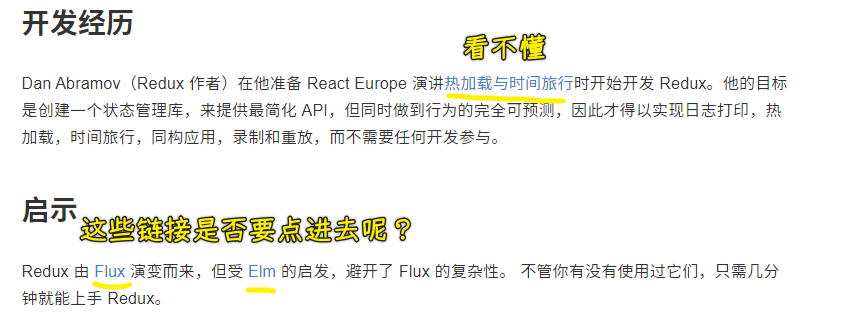

可以看到，此文档对新手而言是极其不好的，所以我们该如何看 Redux 文档呢？

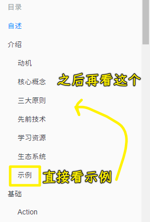

这些示例一个个地去看完，就能知道 Redux 它产生的背景以及动机了……

总之，Redux 文档很高端，适合熟手，而新手第一步是去看示例！

> 方方在看 Redux 之前就已经它的背景了！所以可以看懂了，而如果假装自己是新人的话，就觉得这官网写得并不好！

1）Counter Vanilla

> Counter 是数数，Vanilla 是原生 JS，香草之意

💡：一个梗？

很多前端程序员只会用库或者框架，ta 们 搞不清楚底层原理，如他们上手前端就直接学 Vue 和 React 了，人家叫你用原生 JS，但是你们居然不会……那就宣称原生 JS 是个库或者框架，以此来嘲讽这些不会原生 JS 的人……

此「库」官网：[Vanilla JS](http://vanilla-js.com/)

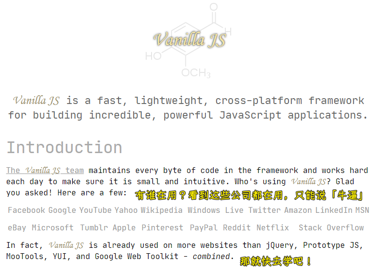

如何下载这个库？

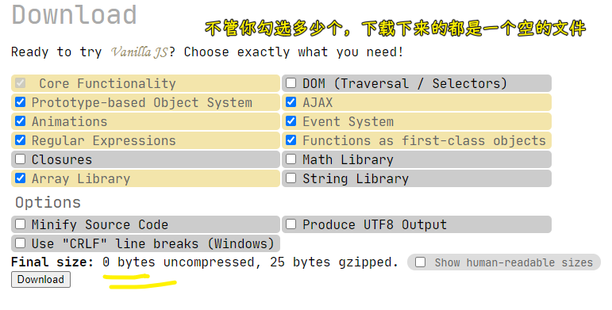

---

所以「为何叫 Counter Vanilla」呢？ -> 表示没有用任何的库，直接就是「Redux+原生 JS」，而不是「React」结合「Redux」。

总之，如果你遇到不想用原生 JS 的同事，那你就安利他使用一个叫「VanillaJS」的库吧，并且告诉他体积小，功能又强大！

💡：例子？

Example：<https://github.com/reduxjs/redux/tree/master/examples/counter-vanilla>

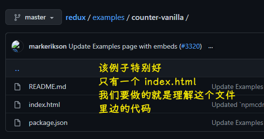

环境搭建：只用 cdn 引入 redux 就好了，而 VanillaJS 就不需要引入了 😀

注意点：

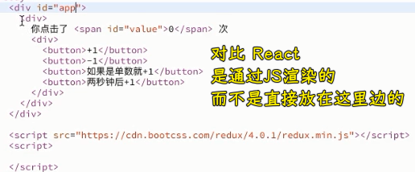

---

如何配合 Redux 使用？

如果不配合：

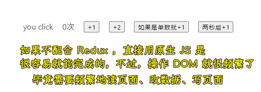

关键点讲解：

`createStore`：

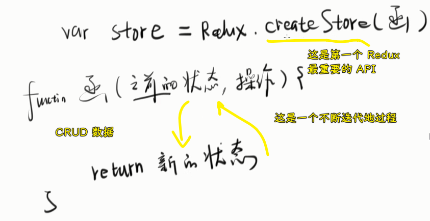

写在`onclick`属性里边的代码涉及到变量，那就是全局的变量：

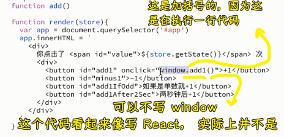

> React 是不加括号的 -> 只需要获取函数引用就行了

做法：

1. 写 UI
2. 写 Reducer
3. 根据 Reducer 创建 store，render 函数用 ES6 字符串模板语法拿到 state，渲染到页面中去！
4. 交互 -> 写事件监听器 -> 改页面数据，不用 DOM API，根据 Redux 要求要用`store.dispatch({type:'add',payload:1})`
5. 重新 Render -> store 变了就得重新 Render 了 -> `dispatch`这个 API，会触发`store.subscribe(callback)`的`callback`参数执行

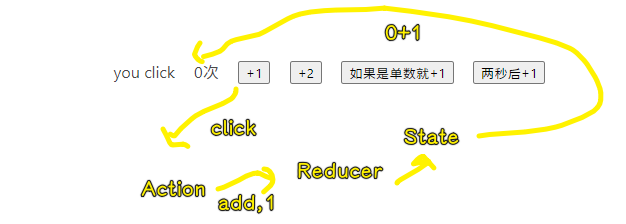

> 方方在 2018 年 9 月时说，Redux 过一年就得死……既然会死，我 2021 年为何还要去学它了？ -> 因为它的思想是不会死的，以后出现的东西，只是把 Redux 简化罢了，实际上代码还是一样的思路……总之，写法、API 变了都无所谓，重要是思路不变就行了！ -> 这就是我学习它的原因！

可以看到，这个过程挺复杂的，如果不用 Redux 的话，不用两句话就搞定了，但如果你有这种想法的话，你是学不会 Redux，总之你得放弃这种想法才能学会 Redux -> 不要去问「还有更简单的实现」这种问题

💡：Angular 很少为旧概念发明新名词？

``` js
function add1() {
  store.dispatch({ type: "add", payload: 1 });
  // 1 dispatch 一个 action
}
```

「dispatch 一个 action」的意思其实就是「触发一个事件」，但 Redux 就得说成是「派发一个动作」 -> 它们本质上差不多是一个意思！

> 我其实比较认同 Redux 的说法的，我们 click 一个页面，其实就是把 `add` 这个动作交给 Reducer 去处理！

其实如果我们对发布订阅模式有一定了解的话，我们就不会被` store.dispatch`这行代码所迷惑

➹：[为什么前端讨论的都是各种react，vue源码解析，渲染机制等，没人讨论angular？ - Trotyl Yu的回答 - 知乎](https://www.zhihu.com/question/274940977/answer/383016528)

💡：Redux 的本质？

1. dispatch 一个 action
2. 根据操作生成新的 state, 触发一个事件
3. 接收到事件，重新 render

了解了上边这个例子，就了解了接下来要讲的例子 -> 接下来的例子都是这个例子的加强版！

💡：state 和 store 的区别？

store 是存储 state 的地方，要获取 state，你只能通过`store.getState()`来获取

如果你要更新 state，你只需要调用一个 action 就新了！ -> 触发事件，操作 action，生成新的 state，重新获取 state

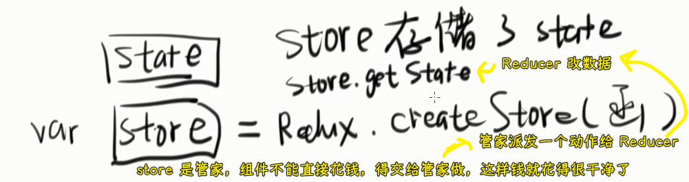

> 在 Flux 里边，改数据是交给 Store 做的！

## ★Redux + VanillaJS

