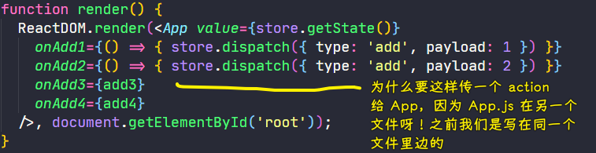
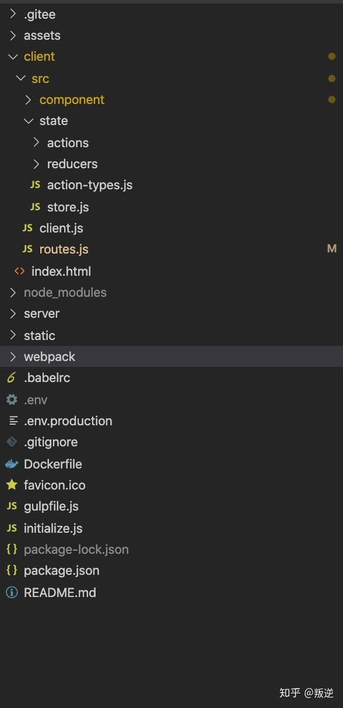
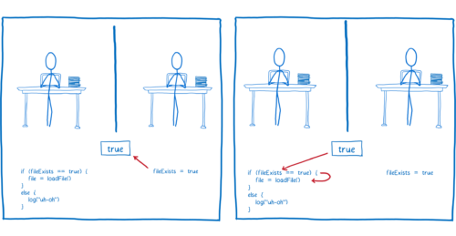

### ✍️ Tangxt ⏳ 2021-01-29 🏷️ redux

# 05-Redux 是什么

## ★课件

带你看懂 Redux 的文档和例子。

例子：<https://redux.js.org/introduction/examples>

注意几个问题

1. Redux 一定要跟 React 一起用吗？
2. Redux 怎么跟 React 一起用，有哪些重要概念？
3. Redux 和 React 一起用有什么不方便？为什么需要 react-redux？

## ★重要 API

### <mark>1）Redux</mark>

#### <mark>1、Reducer 函数</mark>

> 文档：<https://cn.redux.js.org/docs/basics/Reducers.html>

``` js
const reducer = (state, action) => {
  if (state === undefined) {
    return {
      n: 0
    }
  } else {
    if (action.type === 'add') {
      var newState = {
        n: state.n + action.payload
      }
      return newState
    } else {
      return state
    }
  }
}
```

#### <mark>2、store</mark>

``` js
const store = createStore(reducer)
```

#### <mark>3、store.subscribe</mark>

``` js
store.subscribe(() => {
  render()
})
```

#### <mark>4、store.dispatch</mark>

``` js
store.dispatch({
  type: 'add',
  payload: 1
})
```

### <mark>2）React-Redux</mark>

#### <mark>1、Provider 标签</mark>

``` jsx
<Provider store={store}>
  <App />
</Provider>, 
```

#### <mark>2、connect 函数</mark>

``` js
function mapStateToProps(state) {
  return {
    n: state.n
  }
}

function mapDispatchToProps(dispatch) {
  return {
    add1: () => dispatch({
      type: 'add',
      payload: 1
    })
  }
}

export default connect(mapStateToProps, mapDispatchToProps)(App);
```

## ★VanillaJS

Redux 可以说是发布订阅模式的一种变种 -> Redux 搞了一些约定，具体做了哪些约定就是我们今天要讲的内容 -> 透过 Redux 文档提供的例子来认识这些阅读

💡：评价 Redux 官网？

看起来很全，但实际上并不适合新手观看的官网！

总之，Redux 是面向于 JS 熟练者的官网，即便是它的中文官网，也不如 Vue 官网好看！

还有，这文档一开始就说：

* Redux is a predictable state container for JavaScript apps. -> 对新手而言，这句话并不好懂
* [You Might Not Need Redux. People often choose Redux before they…](https://medium.com/@dan_abramov/you-might-not-need-redux-be46360cf367) -> 为啥不直接说，Redux 就是最牛逼的……这样我们初学者就有更大的动力去学习它了，而不是直接说「也许你并不需要它」！所以我到底是去学它呢？还是不去学它呢？


可以看到，此文档对新手而言是极其不好的，所以我们该如何看 Redux 文档呢？


这些示例一个个地去看完，就能知道 Redux 它产生的背景以及动机了……

总之，Redux 文档很高端，适合熟手，而新手第一步是去看示例！

> 方方在看 Redux 之前就已经它的背景了！所以可以看懂了，而如果假装自己是新人的话，就觉得这官网写得并不好！

### <mark>1）Counter Vanilla</mark>

> Counter 是数数，Vanilla 是原生 JS，香草之意

💡：一个梗？

很多前端程序员只会用库或者框架，ta 们 搞不清楚底层原理，如他们上手前端就直接学 Vue 和 React 了，人家叫你用原生 JS，但是你们居然不会……那就宣称原生 JS 是个库或者框架，以此来嘲讽这些不会原生 JS 的人……

此「库」官网：[Vanilla JS](http://vanilla-js.com/)


如何下载这个库？


---

所以「为何叫 Counter Vanilla」呢？ -> 表示没有用任何的库，直接就是「Redux+原生 JS」，而不是「React」结合「Redux」。

总之，如果你遇到不想用原生 JS 的同事，那你就安利他使用一个叫「VanillaJS」的库吧，并且告诉他体积小，功能又强大！

💡：例子？

Example：<https://github.com/reduxjs/redux/tree/master/examples/counter-vanilla>


环境搭建：只用 cdn 引入 redux 就好了，而 VanillaJS 就不需要引入了 😀

注意点：


---

如何配合 Redux 使用？

如果不配合：


关键点讲解：

`createStore` ：


写在 `onclick` 属性里边的代码涉及到变量，那就是全局的变量：


> React 是不加括号的 -> 只需要获取函数引用就行了

做法：

1. 写 UI
2. 写 Reducer
3. 根据 Reducer 创建 store，render 函数用 ES6 字符串模板语法拿到 state，渲染到页面中去！
4. 交互 -> 写事件监听器 -> 改页面数据，不用 DOM API，根据 Redux 要求要用`store.dispatch({type:'add',payload:1})`
5. 重新 Render -> store 变了就得重新 Render 了 -> `dispatch`这个 API，会触发`store.subscribe(callback)`的`callback`参数执行


> 方方在 2018 年 9 月时说，Redux 过一年就得死……既然会死，我 2021 年为何还要去学它了？ -> 因为它的思想是不会死的，以后出现的东西，只是把 Redux 简化罢了，实际上代码还是一样的思路……总之，写法、API 变了都无所谓，重要是思路不变就行了！ -> 这就是我学习它的原因！

可以看到，这个过程挺复杂的，如果不用 Redux 的话，不用两句话就搞定了，但如果你有这种想法的话，你是学不会 Redux，总之你得放弃这种想法才能学会 Redux -> 不要去问「还有更简单的实现」这种问题

💡：Angular 很少为旧概念发明新名词？

``` js
function add1() {
  store.dispatch({
    type: "add",
    payload: 1
  });
  // 1 dispatch 一个 action
}
```

「dispatch 一个 action」的意思其实就是「触发一个事件」，但 Redux 就得说成是「派发一个动作」 -> 它们本质上差不多是一个意思！

> 我其实比较认同 Redux 的说法的，我们 click 一个页面，其实就是把 `add` 这个动作交给 Reducer 去处理！

其实如果我们对发布订阅模式有一定了解的话，我们就不会被 ` store.dispatch` 这行代码所迷惑

➹：[为什么前端讨论的都是各种 react，vue 源码解析，渲染机制等，没人讨论 angular？ - Trotyl Yu 的回答 - 知乎](https://www.zhihu.com/question/274940977/answer/383016528)

💡：Redux 的本质？

1. dispatch 一个 action
2. 根据操作生成新的 state, 触发一个事件
3. 接收到事件，重新 render

了解了上边这个例子，就了解了接下来要讲的例子 -> 接下来的例子都是这个例子的加强版！

💡：state 和 store 的区别？

store 是存储 state 的地方，要获取 state，你只能通过 `store.getState()` 来获取

如果你要更新 state，你只需要调用一个 action 就更新了！ -> 触发事件，操作 action，生成新的 state，重新获取 state


store 就是管家，它是用来管钱的！钱你要花是可以的，你要花在哪儿，我帮你付钱就行了，付完钱之后我告诉你「还剩多少钱」 -> **钱不经过用钱人的手，钱只经过管家的手，那么这个钱就很干净了！**

> 在 Flux 里边，改数据是交给 Store 做的！

## ★Redux + VanillaJS

### <mark>1）payload 的意义</mark>

为啥需要 `payload` ？

不要 `payload` ：


我们不能这样写，因为 `add` 和 `add2` 没啥本质区别，无非就是一个 `+1` ，一个 `+2` 罢了！

总之，我们都是在做加操作，只是加的量不同罢了！

因此我们应该这样写（需要`payload`）：

``` js
function add1() {
  store.dispatch({
    type: "add",
    payload: 1
  });
  // 1 dispatch 一个 action
}
function add2() {
  store.dispatch({ type: "add", payload: 2 });
}
```

一个加的量是`1`，另一个加的量则是`2`。

这样一来，我们就不用写那么多的`actionType`了 -> 显得更简洁！

总之，**`payload`就是告诉我们这个操作的量是多少**！（操作的量甚至可以是个对象）

💡：如何区分什么时候加括号？什么时候不加括号？

``` html
<button id="add1IfOdd" onclick="add1IfOdd()">如果是单数就+1</button>
```

写 React 是不加括号的，因为我们要的是引用，而加括号那就意味着我们要的返回值……

写 HTML，`add1IfOdd()`则表示一段 JS 代码，只要触发了，就会执行这行代码！

### <mark>2）经常需要拿到旧状态</mark>

``` js
function add1IfOdd() {
  var oldState = store.getState();
  if (oldState % 2 === 1) {
    store.dispatch({ type: "add", payload: 1 });
  }
}
```

> 这是对原生事件的监听函数

### <mark>3）异步操作的位置</mark>

我们通常把异步操作放在这儿：

``` js
function add1Async() {
  setTimeout(() => {
    store.dispatch({ type: "add", payload: 1 });
  }, 2000);
}
```

但为何不放在 Reducer 里边呢？


因为如果这样做，默认返回的就是`undefined`了！ -> 在 JS 里边，函数不写返回值，默认返回的就是`undefined`

定时器里边那个返回值是箭头函数返回的，可不是`stateChanger`所返回的……

---

接下来的例子就是「React+Redux」 -> 代码会少很多！

## ★Redux + React

例子：<https://github.com/reduxjs/redux/tree/master/examples/counter>


之前那个「原生 JS+Redux」就一个文件就讲清楚了，而现在「React+Redux」就得多个文件了…… -> 对于新人而言，一句话概括之「什么鬼？这些鬼文件都是什么？」 -> 总之，这需要我们为 React 搭建开发环境

### <mark>1）快速搭建一个 React 应用</mark>

使用：create-react-app

官网：<https://github.com/facebook/create-react-app>

``` bash
yarn create react-app my-app
```

代码写法步骤（不要 cdn 引入了）：

1. 渲染 UI
2. 搞个 Reducer，搞个 store -> 需要安装 Redux
3. 把 store 放到需要被 render 的组件里边

> 如果你是用 yarn 搭建的项目，那么如果你在安装 Redux 的时候用了 npm 的话，那你就得把项目的`node_modules`给`rm -rf `了 -> 一个项目不能同时使用两种包管理工具 -> 为啥前端不把这两个工具合并了？我也不知道，方方推荐用 yarn，因为这比 npm 快！

💡：为啥官方例子是`value`，而不是`state`属性呢？


💡：事件与`constructor`同级？

不然，无法访问到！

💡：为什么要给`App`组件直接传函数参数？



官方例子也是这样干的：

``` jsx
import React from 'react'
import ReactDOM from 'react-dom'
import { createStore } from 'redux'
import Counter from './components/Counter'
import counter from './reducers'

const store = createStore(counter)
const rootEl = document.getElementById('root')

const render = () => ReactDOM.render(
  <Counter
    value={store.getState()}
    onIncrement={() => store.dispatch({ type: 'INCREMENT' })}
    onDecrement={() => store.dispatch({ type: 'DECREMENT' })}
  />,
  rootEl
)

render()
store.subscribe(render)
```

💡：关于`undefined`的报错？


💡：为传给`store.subscribe`函数传参数？

- 不传参数：`store.subscribe(render)`
- 传参数：`store.subscribe(()=>{ render(store) })`

如果直接这样`store.subscribe(render(store))`，那么`render(store)`就会直接执行了，把返回值作为`subscribe`的参数值 -> 也许会报错！

### <mark>2）小结</mark>

相较于原生 JS 配合 Redux，React+Redux：

- 代码少了很多
- 结构会更好看，不会那么零散
  - `index.js`专门处理数据的
  - `App.js`咩有与`store`相关的代码，就是调用它爸爸的一些钩子……
- DOM diff -> 局部更新 -> 更新数据时，在浏览器 DOM 视图里边会看到标签一闪而过，这就是在更新，而原生的会把整个`App`都给更新了！


目前代码存在的问题：


那我们就可以这做：

``` jsx
<App value={store.getState()} store={store} />
```


于是，就有很多工程师想做这么一件事情，不想一层层地通知数据下去，如子组件通知爸爸，爸爸通知爷爷，爷爷通知曾爷爷……，最后通知到`App`去更新那个`store`…… -> 如果一个组件嵌套了很多组件，最底部的组件用到了`store`，意味着我们需要一层层地往下传`store`（我们不用考虑往上调的情况，但得考虑往下传这种单向数据流的情况）：


于是就引入了「react-redux」

总之，如果你直接用「react+redux」的话，那么你就得考虑这个：


话说，为啥 React 最初不内置 Redux 呢？

如果内置了，就不会出现 Redux 和 React-Redux 了

当然，React 最终还是出了 Hooks，而 Hooks 就是为了干掉 Redux 的，不然，React 整个生态就像个智障一样 -> 每一个都不爽，合起来了？还是不爽……

## ★Redux + React + React-Redux

### <mark>1）概述</mark>

安装：

``` bash
yarn add react-redux
```

react-redux，可以让我们随时访问`store`，而又不出现混乱的问题！

文档：

- [React Redux - React Redux](https://react-redux.js.org/)
- [React Redux - 中文](https://www.yuque.com/marckon/react-redux.cn/introduction)

此文档相较于之前的「Redux」文档，要好那么一点点……

> React Redux is the official React binding for Redux. It lets your React components read data from a Redux store, and dispatch actions to the store to update data.

这段话给的感觉就是「react-redux」是专门为「React」写的……之前的「Redux」是万金油……

> React Redux is the official Redux UI binding library for React.

react-redux 是 Redux 与 React 之间的桥梁……

### <mark>2）先认识再看看方方讲解</mark>


➹：[理解 React，但不理解 Redux，该如何通俗易懂的理解  Redux？ - Wang Namelos 的回答 - 知乎](https://www.zhihu.com/question/41312576/answer/90782136)

### <mark>3）示例</mark>

这个库就只有 4 个 API


💡：如何讲`provider`这个 API？

如果先解释`provider`，我们是听不懂的，但如果不解释它的话，直接干代码，我们又不知道它是干啥用的……

方方的做法：一般就是 CRM，直接干……

我们不知道为啥这样写 `provider`，但就是无脑复制这个代码：

``` jsx
import React from 'react'
import ReactDOM from 'react-dom'
import { Provider } from 'react-redux'

import { App } from './App'
import createStore from './createReduxStore'

const store = createStore()

ReactDOM.render(
  <Provider store={store}>
    <App />
  </Provider>,
  document.getElementById('root')
)
```

> `Provider`的唯一功能就是传入`store`对象，`Provider`在根组件外面包了一层，这样一来，`App`的所有子组件就默认都可以拿到`state`了

做法：

- 在`render`的时候搞个`provider`组件包裹住`App`组件 -> 不这样做，就不起效果
- 写`App`组件，搞个`connect`（柯里化传参）
  - 第一个参数：确定组件如何拿到数据
  - 第二个参数：确定事件触发时，执行什么`action`
  - `connect(mapStateToProps,mapDispatchToProps)(App)`返回的结果


> `stateChanger`里边的`{n:0}`是为了方便后边的`App`组件取值！

💡：简单理解`connect`这个 API？


``` js
connect(1)(2)
```

它的读法：`connect(1)`叫偏函数，因为它的参数不全，所以叫偏……（以偏概全）

按照官网的说法：`connect`这个函数的作用就是把 Redux store 与 React 组件连接（关联）起来

`connect`的返回值是容器组件，传给它的参数是给 UI 组件的数据……

➹：[Redux 入门教程（三）：React-Redux 的用法 - 阮一峰的网络日志](https://www.ruanyifeng.com/blog/2016/09/redux_tutorial_part_three_react-redux.html)

💡：为什么取名`mapStateToProps`、`mapDispatchToProps`？

因为：


`connect`可以把这个参数合并起来作为`props`传给 `App`：


💡：react-redux 解决了什么问题？

不用我们一层层地传`store`了 或者 一层层地调回调了！

💡：`bindActionCreators`这个 API？


React 的特点 -> 把所有东西都分成函数 -> 用一个东西把它们组合起来 -> 组合起来的这个函数就把传给它的那几个函数调来调去

## ★总结

- 原生 JS + Redux -> 一个文件搞定 -> [Demo](https://github.com/ppambler/react-redux/tree/react-redux/src)
- React + Redux -> 多个文件，有不好之处 -> [Demo](https://github.com/ppambler/react-redux/tree/main/src)
- React + Redux + react-redux -> 用`connect`去读取传给`Provider`组件的`store` -> 让你不用写`dispatch`等 -> 也不用写重新 render 了 -> [Demo](https://github.com/ppambler/react-demo/blob/main/src/demo5/1.js)

Context API 也能解决 Redux 配合 React 的问题——不用一层层地传数据

这三个例子其实是很重复的，从中我们也可以看出 Redux 社区总喜欢造一些概念，如：

- data -> Store.getState()
- Event(name,data) -> Action(Type,Payload)
- Trigger -> Dispatch
- On -> Subscribe
- stateChanger -> reducer（根据旧的`state`返回新的`state`）
- add1 -> Selectors

💡：关于官网那个 ToDo APP 例子？

> 例子：<https://codesandbox.io/s/9on71rvnyo>

结构过于复杂，当然，它的复杂程度也就只能写到这儿了，不能再写得更复杂了！


## ★Q&A

### <mark>1）同构应用是什么？</mark>

问题缘由：[文档](https://cn.redux.js.org/docs/introduction/ThreePrinciples.html#%E5%8D%95%E4%B8%80%E6%95%B0%E6%8D%AE%E6%BA%90)


简单来说：

同构是共同构建，首屏后端渲染，后面的是前端渲染。如果你用过 next.js 就明白了，只要你请求一个页面，那就是后端渲染的，但如果你是前端路由跳转渲染页面，那就直接是前端渲染了！

具体点来说：

前后端同构就是 SSR 的一种实现方式

同构的概念最早是 angular2 在 beat 版中提出来的 (2016 年）， 那时叫 angular isomorphism，是一个类似于草案的策略， 是为了解决 angular 1.x 时代的 **SPA 首屏慢及 SEO 问题**而提出的。

同构的核心理念是「客户端」与「服务端」共用一套渲染代码， 客户端自然是 javascript 的， 服务端使用可以识别 javascript 的引擎。 比如：

* 前端 react/vue/angular2+ 配合后端 node.js
* 前端 react/vue/angular2 配合后端 java(Nashorn)

其他的入 python/.net/go 都有自己各自的方案。

对比其它的：

再来说说 PHP/JSP/ASP 的 SSR， 类似这种的渲染统称为模版引擎渲染。是任何一门 WEB 开发技术栈必须支持的技术， 也是最早期动态网站的根本技术。

当然现在已经有更多功能更丰富的模版引擎了。 比如：

Java 体系下的

* thymleaf
* freemarker
* velocity

Nodejs 体系下的

* mustache
* handlebars
* doT
* ejs
* numjucks
* underscore（惊不惊喜？)
* pug
* marko
* jade
* jsrender
* jquery template（意不意外？)

其实， 相对于同构 SSR， 模版引擎渲染才是 WEB 的主流。同构 SSR 虽然有诸多好处， 但是上手难度还是挺大的， 需要一个横跨前后端的人来做统筹， 目前来说依然算小众。



> 此项目就是一个 React 同构实现的， 后台通过 RPC 接到 Java， 主要功能就是 SSR

从零开始从头到尾自己纯手搭建就算一个老手也要一周才能完成。利用各种脚手架工具会快很多， 但是可定制化程度较低， 可优化程度也较低。（如果有高手有更好的办法， 可以分享一下。)

最后再来说说提出了前后端同构概念的 angular。**angular isomorphism** 项目在 angular 2.0 正式发布之后改名叫： angular universal。 目前是前端知名的**高开低走**的项目， 并不算成功。

➹：[前端同构应用和 SSR 有什么区别？ - 叛逆的回答 - 知乎](https://www.zhihu.com/question/379831174/answer/1087241315)

➹：[大前端进阶-同构应用 - SegmentFault 思否](https://segmentfault.com/a/1190000023881923)

➹：[魅族官网基于 next.js 重构实践总结与分享 - 知乎](https://zhuanlan.zhihu.com/p/113853235)

### <mark>2）竞态条件（race condition or race hazard）？</mark>

初始状况：


先执行线程 2：



文件就会被加载

但，如果线程 1 先执行呢？


那就会 `log` 一个错误，说明该文件不存在！

这两种情况的发生就是因为「竞态条件」！

许多 JavaScript 开发人员都遇到了这种竞态条件，即使是在单线程代码中也是如此。你甚至都不需要理解任何关于多线程的东西就可以知道为什么这是一个「race」。

当然，有些竞态条件在单线程代码中是不可能的，但是当您使用多个线程编程并且这些**线程共享内存**时，就会发生这种情况。

> 两个线程都在「竞赛」地访问/更改数据 -> 如果 A 第一名，那么皆大欢喜，但如果 B 第一名，那就大家都不好了！ -> 总之，谁跑第一，取决于线程调度算法！

为了防止出现「race condition」，我们通常会在共享数据周围设置一个锁，以确保一次只有一个线程可以访问数据！

不加锁：

``` js
if (x == 5) // The "Check"
{
  y = x * 2; // The "Act"

  // If another thread changed x in between "if (x == 5)" and "y = x * 2" above,
  // y will not be equal to 10.
}
```

加锁：

``` js
// Obtain lock for x
if (x == 5) {
  y = x * 2; // Now, nothing can change x until the lock is released. 
  // Therefore y = 10
}
// release lock for x
```

> Redux 为啥不让组件自己改全局状态而是交给 Reducer？因为改了的话，其它组件都会发生不可预知的错误了……

➹：[Avoiding race conditions in SharedArrayBuffers with Atomics - Mozilla Hacks - the Web developer blog](https://hacks.mozilla.org/2017/06/avoiding-race-conditions-in-sharedarraybuffers-with-atomics/)

➹：[multithreading - What is a race condition? - Stack Overflow](https://stackoverflow.com/questions/34510/what-is-a-race-condition)

### <mark>3）写 React 不用 Redux 行吗？</mark>

可以！

➹：[除 Redux 外，目前还有哪些状态管理解决方案？ - 知乎](https://www.zhihu.com/question/63726609/answers/updated)

### <mark>4）取余和取模？</mark>

概述：

取模运算 (mod) 和取余运算 (rem) 两个概念有重叠的部分，但又不完全一致；主要区别在于**对负整数进行除法运算时操作不同**。取模主要是用于计算机术语中；取余则更多是数学概念。

取模 vs 取余：

- 取余运算 在计算商值时 商值向 0 方向舍入；靠近 0 原则
- 取模运算 在计算商值时 商值向负无穷方向舍入；尽可能让商值小的原则（不超多商值的最大值）

计算步骤：

假设有整数 a 和 b（可以是负整数），那么取模/取余运算可以分为两步运算：

1. 求整数商：`c = a/b`;
2. 计算模/余数：`r = a - (c*b)`;
3. 总计算模/余数：`a mod b = a - b[a/b]` (`[a/b]`表示整数商）

例子：

取模：

| 简述           | 商值                          |                    | 取模值 |
| -------------- | ----------------------------- | ------------------ | ------ |
| 5 mod 3 = 2    | 5/3 = 1.66  商取小原则  商=1  | 5 - 3 * 1 = 2      | 2      |
| -5 mod 3 = 1   | -5/3 = -1.66 商取小原则 商=-2 | -5 - (3 * -2) = 1  | 1      |
| 5 mod -3 = -1  | 5/-3 = -1.66 商取小原则 商=-2 | 5 - (-3 * -2) = -1 | -1     |
| -5 mod -3 = -2 | -5/-3 = 1.66 商取小原则 商=1  | -5 - (-3 * 1) = -2 | -2     |

取余

| 简述           | 商值                         |                     | 取余值 |
| -------------- | ---------------------------- | ------------------- | ------ |
| 5 rem 3 = 2    | 5/3 = 1.66  商靠 0 原则  商=1  | 5 - 3 * 1  = 2      | 2      |
| -5 rem 3 = -2  | -5/3 = -1.66 商靠 0 原则 商=-1 | -5 - (3 * -1) = - 2 | -2     |
| 5 rem -3 = 2   | 5/-3 = -1.66 商靠 0 原则 商=-1 | 5 - (-3 * -1) =  2  | 2      |
| -5 rem -3 = -2 | -5/-3 = 1.66 商靠 0 原则 商=1  | -5 - (-3 * 1) = - 2 | -2     |

java 中 % 是取余运算；Python 中 % 是取模运算

💡：模的理解

“模”是指一个计量系统的计数范围；如时钟，12 个整点为计算范围，则模为 12；计算机也是一个计量机器，模为 32 位或者 64 位；

32 位计算机正常理解 在模 范围内能表达的 有 `[0, 2³²-1]`；那么负数该怎么表达呢，所以出现了补码；也就是 正数 + 负数 正好达到模的溢出阀值 `2³²`；所以在计算机中负数是用补码方式表达的原因；

关于补码的例子：在 12 模的时钟中；假设当前时针指向 10 点，而准确时间是 6 点，调整时间可有以下两种拨法

1. 倒拨 4 小时，即：`10-4=6` ->  `(10-4) mod 12 = 6`
2. 顺拨 8 小时：`10+8=12+6=6` -> `(10+8) mod 12 = 6`

在以 12 模的系统中，加 8 和减 4 效果是一样的；因此凡是减 4 运算，都可以用加 8 来代替。对“模”而言，8 和 4 互为补数。实际上以 12 模的系统中 11 和 1、10 和 2、9 和 3、7 和 5、6 和 6 都有这个特性；**共同的特点是两者相加等于模**

“取模”实质上是计量器产生“溢出”的量，它的值在计量器上表示不出来，计量器上只能表示出模的余数（取模）；任何有模的计量器，均可化为加减法运算

`5 mod 3 = 2` 例子中；模 为 3；2 为取模的值

💡：计算机中取模应用思想

取模的本质是：取模的值，必定会模的范围内；所以，计算机领域引用该特性，使元素路由算法不超出边界，并有规则存放。

首先确定模（范围）；元素取模，使元素有规则的落入模的范围内容器中

如：hashMap、数据库分表、分布式节点路由算法等

➹：[取模运算理解 - 简书](https://www.jianshu.com/p/5e1a83e8be3b)

➹：[原码, 反码, 补码 详解 - ziqiu.zhang - 博客园](https://www.cnblogs.com/zhangziqiu/archive/2011/03/30/ComputerCode.html)

➹：[大神们可不可以讲一下取模是什么意思？最好比如一下，本人数学没学好 - 知乎](https://zhuanlan.zhihu.com/p/103762122)

➹：[编程语言中，取余和取模的区别到底是什么？ - 知乎](https://www.zhihu.com/question/30526656)