### ✍️ Tangxt ⏳ 2021-02-04 🏷️ Context API

# 06-React Context API

## ★课件

预习内容：<https://reactjs.org/docs/context.html>
中文翻译：<https://react.docschina.org/docs/context.html#when-to-use-context>

* [JS demo](https://codesandbox.io/s/yj7ox1lrz9)
* [React demo](https://codesandbox.io/s/m7pojr19xj)
* [consumer demo](https://codesandbox.io/s/99wym030y)
* [换肤 demo](https://codesandbox.io/s/8rvz0qpj8)

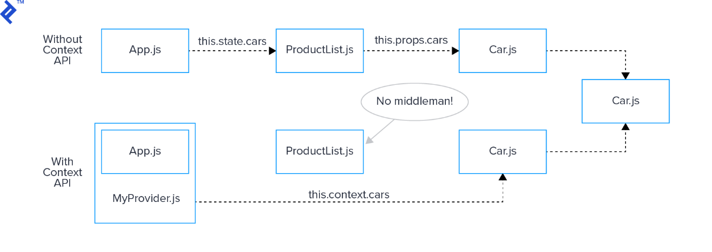

> 此图来源：[怎样使用 React Context API - SegmentFault 思否](https://segmentfault.com/a/1190000018215032)

## ★四层函数传递值

Context 是 React 的 API，API 是什么？不用管它是什么，你直接用即可 -> API ，程序员经常说，但是就是没有人能清楚地解释它是什么，当然，你可以简单把它理解为「别人提供给你用的东西就叫 API」

Context 这个 API，解释起来相当复杂 -> 方方会从思想上给大家解惑

之前学习了「如何做组件间的通信？」 -> 与今天所讲的这个 Context API 有非常大的联系！

话又说回来，上一节留了一个悬念：react-redux 是如何实现一个标签就能让所有的元素都拥有一个方法呢？

1）在一个函数里边调一个函数（一共四层）

💡：需求 1：把一个变量传给 `f4`

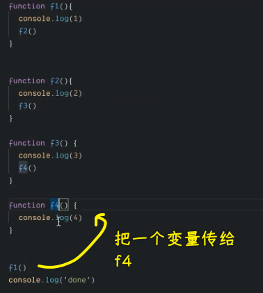

实现：

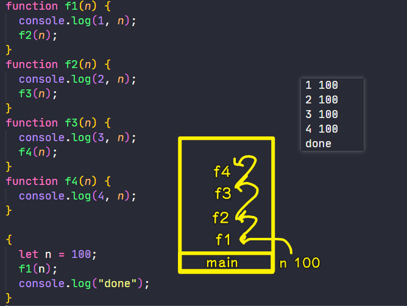

我们不能在 `f4` 里边直接访问 `let n` 这个 `n` 变量 -> 因为它是在块级作用域 `{}` 里边的变量！

下一步 -> 使用 React 变形这个过程

2）使用 React

> 在写 JSX 代码的时候，请告诉自己我并不是在写 HTML，不然，你就是完全不懂 React -> 总之，经常使用那个 <babeljs.io> 工具

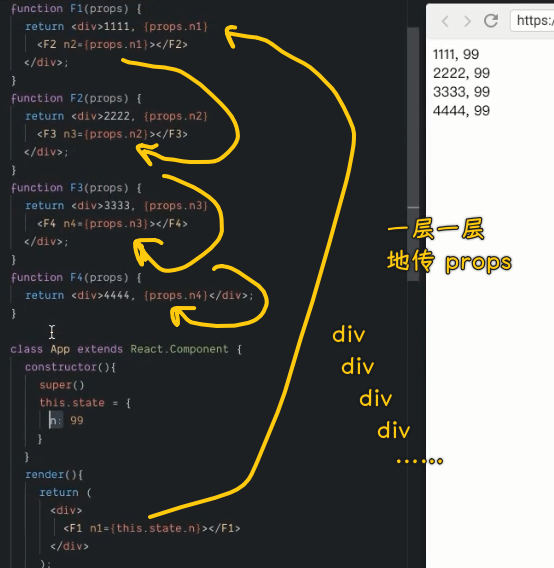

我们用 React 的形式把之前那个 f1~f4 的调用给演示了一遍，可以看到我们写标签实际上还是在调用函数！（不是马上调用，API 内部会调用它）

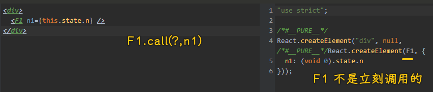

问题：一层层地传 props 太麻烦了，如果我们只想 `F4` 组件拿到 `n` ，其它 `F1~F3` 不需要，那么我们能否把一层一层这样传的过程给省略掉呢？

回头看那个原生 JS 代码，答案是不行的，因为用 `let` 声明的变量 `n` 在 `{}` 里边啊！ `f4` 函数只能从 `f3` 那里拿到 `n` ……

问题来了：为啥不把写在 `{}` 里边的 `n` 提到 `{}` 外边去呢？

💡：写的 React 组件标签，必须是大写字母开头

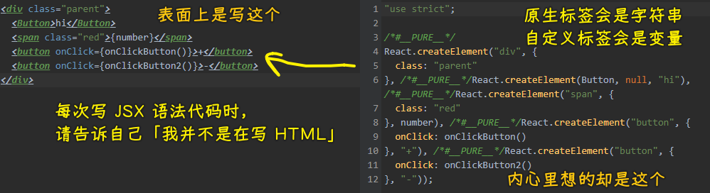

## ★用 Context API 传值

1）全局变量慎用

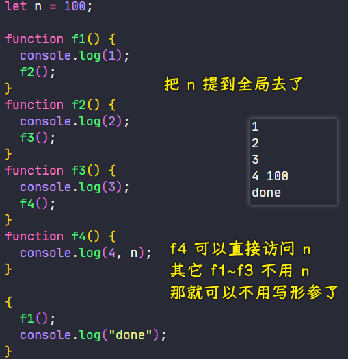

如果用了全局变量，那么结果很有可能不是你想要的值！

比如：

``` js
let n = 100;

function f1() {
  console.log(1);
  f2();
}

function f2() {
  console.log(2);
  f3();
}

n = 50

function f3() {
  console.log(3);
  f4();
}

function f4() {
  console.log(4, n);
}

{
  setTimeout(() => {
    f1();
  })
  console.log("done");
}

n = 66
```

我们必须把代码看完，才能确定`n`的值是`66`，而不是`f4`一执行就只看上边的代码……

总之，全局变量的`n`作用范围太广了……

问题来了：如何让`f4`拿到`n`的值，而且又不会因为其它因素影响到`n`的值呢？

我们可以做一个约定 -> 传一个局部的全局变量，这个变量大家都能访问，但是就不给别人访问 -> 不是一家人不进一家门

2）如何做一个局部的全局变量？

- ES5：立即执行函数造局部的全局变量
- ES6：直接`{}`，但要用`let/const`声明的变量

``` js
{
  let x = {}
  // 访问器
  window.setX = (key,value)=>{
    x[key] = value
  }
}
{
  window.setX('n',100)
}
```

`x`就是局部的全局变量，表示只在它自己那块作用域里边有用，但在其它地方就不能用了！

> 自己那块区域能用，看起来自己是全局变量，但在它的上一级`window`看来，它就是局部变量了！

``` js
{
  let context = {};
  window.setContext = (key, value) => {
    context[key] = value;
  };

  window.f1 = function () {
    console.log(1);
    f2();
  };
  function f2() {
    console.log(2);
    f3();
  }

  function f3() {
    console.log(3);
    f4();
  }
  function f4() {
    console.log(4, context["n"]);
  }
}

{
  window.setContext("n", 100);
  setTimeout(() => {
    f1();
  });
  console.log("done");
}

```

回过头来上边的代码是否达到了我们的需求：

- `f1~f3`不需要用到`n`，只有`f4`用到了`n`
- `context`可以随意改动吗？不能，你得通过`window.setX`才能改动 -> 我们把它限制到只能在某个作用域下起作用，更进一步来搞，像`f1~f4`也不能直接访问它……

接下来，看看 React 形式怎样的

3）Context API

文档：<https://zh-hans.reactjs.org/docs/context.html>

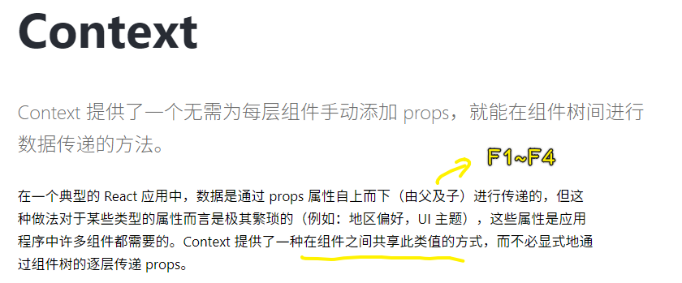

总之，该 API 就是为了解决「prop drilling」这个问题的！


之前我们是通过管家、EventHub 来管理数据的，而现在我们则通过 Context（局部的全局变量）来管理数据！

---

💡：何时使用 Context？

> Context 设计目的是为了共享那些对于一个组件树而言是“全局”的数据

这句话的言外之意就是「局部的全局变量」

> 关于官方文档，即便是英文好的看英文文档也不一定能搞懂，更不用说中文文档了……

``` jsx
class App extends React.Component {
  render() {
    return <Toolbar theme="dark" />;
  }
}

function Toolbar(props) {
  // Toolbar 组件接受一个额外的“theme”属性，然后传递给 ThemedButton 组件。
  // 如果应用中每一个单独的按钮都需要知道 theme 的值，这会是件很麻烦的事，
  // 因为必须将这个值层层传递所有组件。
  return (
    <div>
      <ThemedButton theme={props.theme} />
    </div>
  );
}

class ThemedButton extends React.Component {
  render() {
    return <Button theme={this.props.theme} />;
  }
}

function Button(props) {
  return <button>{props.theme}</button>
}
```

如何看待这个例子？ -> `Toolbar、ThemedButton、Button`就是`F1~F3`

使用 `context`, 我们可以避免通过中间元素传递 `props`：

``` jsx
// Context 可以让我们无须明确地传遍每一个组件，就能将值深入传递进组件树。
// 为当前的 theme 创建一个 context（“light”为默认值）。
const ThemeContext = React.createContext("light");
class App extends React.Component {
  render() {
    // 使用一个 Provider 来将当前的 theme 传递给以下的组件树。
    // 无论多深，任何组件都能读取这个值。
    // 在这个例子中，我们将 “dark” 作为当前的值传递下去。
    return (
      <ThemeContext.Provider value="dark">
        <Toolbar />
      </ThemeContext.Provider>
    );
  }
}

// 中间的组件再也不必指明往下传递 theme 了。
function Toolbar() {
  return (
    <div>
      <ThemedButton />
    </div>
  );
}

class ThemedButton extends React.Component {
  // 指定 contextType 读取当前的 theme context。
  // React 会往上找到最近的 theme Provider，然后使用它的值。
  // 在这个例子中，当前的 theme 值为 “dark”。
  static contextType = ThemeContext;
  render() {
    return <Button theme={this.context} />;
  }
}

function Button(props) {
  return <button>{props.theme}</button>;
}
```

对比之前的例子，我们可以看到：

- F1：多了`<ThemeContext.Provider value="dark"></ThemeContext.Provider>`
- F2：多了`static contextType = ThemeContext;`、`this.context`

视频教程里边的代码（react 16.5.2）：

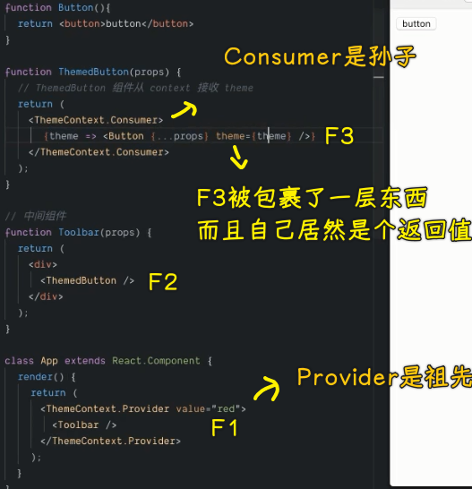

可以看到与现在的 react 17.0.1 是有区别的……

问题来了：Context API 是如何做到的呢？

接下来，就把我们之前那个抽象一点的`F1~F4`代码改成是用 Context API 的

回顾需求：

- 只有 F4 组件需要数据
- 而且不需要层层传递数据到 F4

4）如何使用 Context API 改写例子

> 依葫芦画瓢……

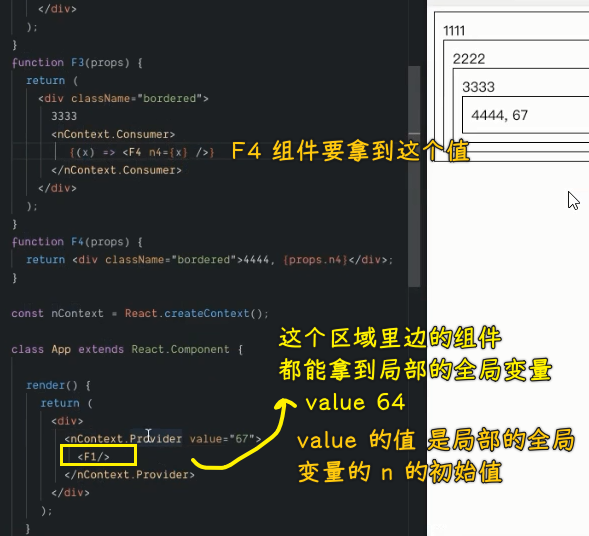

解释这个`nContext.Consumer`

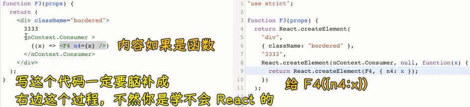

`Consumer`组件的实现其实是这样的：

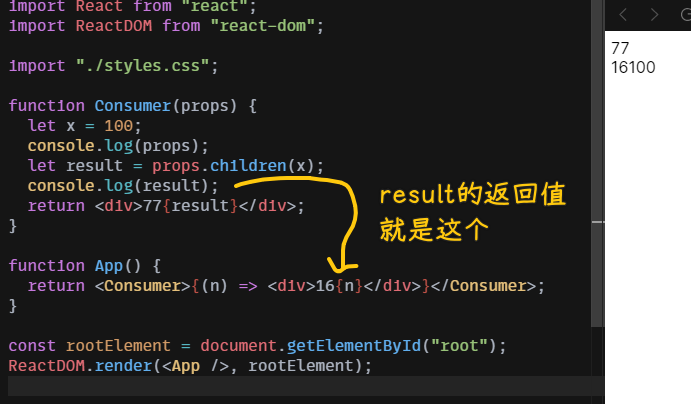


