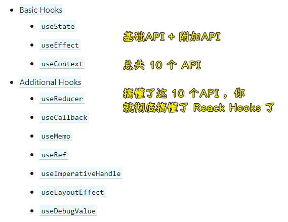
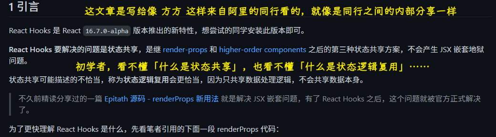
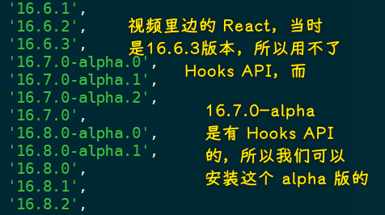
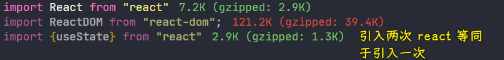
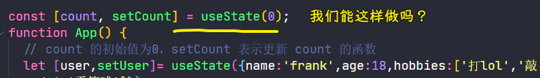
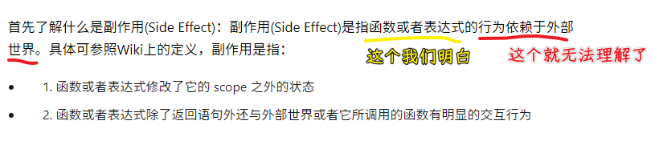
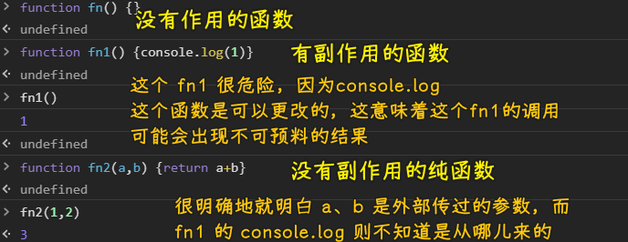
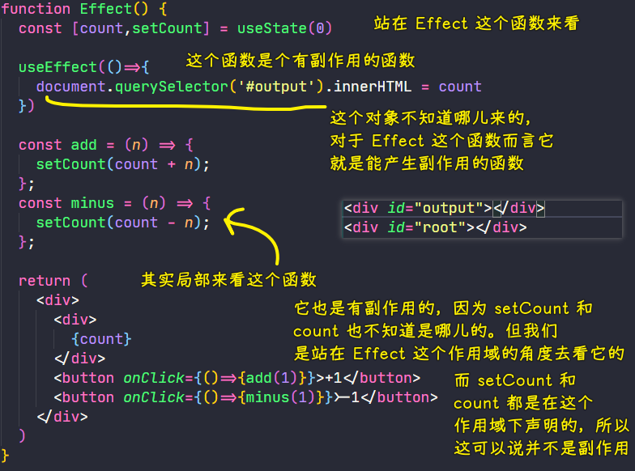

### ✍️ Tangxt ⏳ 2021-02-06 🏷️ Hooks API

# 07-React Hooks API

## ★课程简介

如果自学可看这几个链接：

英文文档：[这里](https://reactjs.org/docs/hooks-intro.html) 和 [这里](https://reactjs.org/docs/hooks-reference.html)

中文解析：[这里](https://github.com/dt-fe/weekly/blob/master/79.%E7%B2%BE%E8%AF%BB%E3%80%8AReact%20Hooks%E3%80%8B.md)

1. useState
2. useEffect
3. 自己的 Hook
4. 看一看所有 Hooks API

## ★概述

Hook 是 React 16.8 的新增特性。它可以让你在不编写 class 的情况下使用 state 以及其他的 React 特性。

它旗下有这么几个 API：



> 搞懂了这 10 个 API，算是彻底了解了 Hooks API 了

关于这篇 [文章](https://github.com/dt-fe/weekly/blob/master/79.%E7%B2%BE%E8%AF%BB%E3%80%8AReact%20Hooks%E3%80%8B.md):



初学者需要教学者通过一些代码比较智障的方法来教会他们……

## ★useState 的使用

### <mark>1）查看一个库目前的版本历史</mark>

``` bash
yarn info react versions
```

有一些新特性，你需要安装`alpha`版本才能用：



把`package.json`里边的`dependencies`字段旗下的`react`和`react-dom`改成这个`alpha`版的，重新`yarn add`一下就好了！

> 用 codesandbox 会更简单！改一下值，就能自动更新库的版本了！

### <mark>2）函数也有状态</mark>

之前说到，函数组件是咩有状态的，如果你要想有状态的话，那就得用`class`组件，不过，之后出了这个 Hooks API，意味着函数也是有状态的！

#### <mark>1、函数有状态的例子</mark>

没有 Hooks API 之前，你想这样写：


有了 Hooks API 之后：

``` jsx
function App() {
  // count 的初始值为 0，setCount 表示更新 count 的函数
  // 返回一个数组
  const [count, setCount] = useState(0);
  const add = (n) => {
    setCount(count+n)
  }
  return (
    <div>
      <div>{count}</div>
      <div>
        <button onClick={() => { add(1); }} > +1 </button>
      </div>
    </div>
  );
}
```

可以看到自从有了`useState`之后，我们就不需要用`class`来维护一个组件的状态了！ -> 直接就是通过`useState`，然后给一个初始的`0`，然后再通过`count`拿到最新的值，如果要更新`count`那就调用`setCount`

💡：两次引入`react`，也是只有一次加载？



#### <mark>2、用`class`来写一遍</mark>

用了`useState`之后，代码变得更简洁了，那我们之前用`class`是怎么写的呢？

``` jsx
class App1 extends Component {
  constructor() {
    super();
    this.state = {
      count: 0,
    };
  }
  add(n) {
    this.setState({
      count: this.state.count + n,
    });
  }
  minus(n) {
    this.setState({
      count: this.state.count - n,
    });
  }
  render() {
    return (
      <div>
        <div>{this.state.count}</div>
        <div>
          <button onClick={() => { this.add(1); }} > {" "} +1{" "} </button> 
          <button onClick={() => { this.minus(1); }} > {" "} -1{" "} </button>
        </div>
      </div>
    );
  }
}
```

可以看到，我们需要写这些废话：

- `extends Component`
- `constructor`
- `super`
- `this`
- `render`

而我们用了 Hooks API 的函数组件，就没有废话了……每一行代码都没有多余的……

### <mark>3）小结</mark>

- 永远不再需要`class`组件了，只要你把 React 升级到 16.8
- 也许你也不再需要 Redux 了，当然，Redux 还是有它所存在的价值的，毕竟它的生态很好 -> 不过，用了 Hooks API 后，组件状态就可以直接共用了！
- 使用`useState`之后，那就意味着你可以很简单的进行函数的赋值和更新了

## ★useState 更多例子

### <mark>1）函数可以有多个状态吗？</mark>

``` jsx
function App() {
  // count 的初始值为 0，setCount 表示更新 count 的函数
  const [count, setCount] = useState(0);
  const [user,setUser]= useState({name:'frank',age:18})
  const add = (n) => {
    setCount(count + n);
  };
  const minus = (n) => {
    setCount(count - 1);
  };
  const old = (n) => {
    setUser({
      ...user,
      age: user.age +1
    })
  }
  return (
    <div>
      <div>{count}</div>
      <div>
        <button onClick={() => { add(1); }} > {" "} +1{" "} </button> 
        <button onClick={() => { minus(1); }} > {" "} -1{" "} </button>
      </div>
      <div>{user.name},{user.age}</div>
      <button onClick={()=>{old(1)}}>age + 1</button>
    </div>
  );
}
```

如果你想更新复杂的`state`，那么其它不更新的属性直接拷贝，更新的则赋值……

💡：`setX`这样就是在给一个`x`赋值，但是我很好奇的是，`x`就是`const`声明的变量啊！为啥还可以重新赋值呢？

在`setUser`的时候，不能单独对某个属性该值，你得把原属性搞过来后再改值……

> 重新呈现组件后，将**再次执行该函数**，从而创建**新的作用域**，创建新的`user`变量，**该变量与先前的变量无关**。

➹：[为什么 useState 可以使用 const 解构赋值？ - 知乎](https://zhuanlan.zhihu.com/p/242792793)

### <mark>2）如果状态是数组类型的值</mark>

需求：

- 添加爱好
- 删除爱好

``` jsx
function App() {
  // count 的初始值为 0，setCount 表示更新 count 的函数
  const [count, setCount] = useState(0);
  let [user,setUser]= useState({name:'frank',age:18,hobbies:['打 lol','敲 code','看篮球']})
  const add = (n) => {
    setCount(count + n);
  };
  const minus = (n) => {
    setCount(count - 1);
  };
  const old = (n) => {
    setUser({
      ...user,
      age: user.age +1
    })
  }
  const delHobby = () => {
    // 这种写法很不直观……
    // 删除第二项……
    user.hobbies.splice(1,1)
    setUser({
      ...user
    })
  }
  const addHobby = () => {
    // 姿势 1
    // user.hobbies.push(Math.random())
    // setUser({
    //   ...user
    // })
    // 姿势 2
    let newHobby = Math.random()
    setUser({
      ...user,
      hobbies:[...user.hobbies,newHobby]
    })
  }
  return (
    <div>
      <div>{count}</div>
      <div>
        <button onClick={() => { add(1); }} > {" "} +1{" "} </button> 
        <button onClick={() => { minus(1); }} > {" "} -1{" "} </button>
      </div>
      <div>{user.name},{user.age}</div>
      <button onClick={()=>{old(1)}}>age + 1</button>
      <div>{user.hobbies.join(',')}</div>
      <button onClick={()=>{delHobby()}}>删除一个爱好</button>
      <button onClick={()=>{addHobby()}}>添加一个爱好</button>
    </div>
  );
}
```

不管是简单的`0`，还是复杂的数组，都可以用`useState`来改变函数的状态！ -> 功能都可以实现，只是就得写一些复杂的 JS 代码罢了！

总之，函数组件不仅可以有一个`state`，还可以有多个`state`，而且每个`state`也可以有复杂的结构！

### <mark>3）改乱例子，找知识</mark>

💡：能否把`useState`代码写到`App`函数的外边去呢？

> CRM 套路，一旦 copy 的代码，运行成功，我们就在这个代码的基础上各种改！



代码编译结果：

```
src\demo\Add.js
  Line 4:27:  React Hook "useState" cannot be called at the top level. React Hooks must be called in a React function component or a custom React Hook function  react-hooks/rules-of-hooks

Search for the keywords to learn more about each error.
```

这就是第一个文档里边没有告诉我们的知识：**你不能把`useState`拿到函数外边去** -> 没有为什么，React 就是不准！

这个问题告诉我们「**并不需要一直死磕文档，有时候只需要稍微改一下例子，就能发现一些我们不能这样做的知识点了**」

💡：状态名以及修改状态的函数名能否随意起名？

把

``` js
const [count, setCount] = useState(0);
```

改成这样的：

``` js
const [x, y] = useState(0);
```

也是可以的，只要搞清楚顺序就好了 -> 第一个是状态，第二个是改状态的赋值函数

总之，这与名字无关！

---

方方学习套路：把可以改的都改一下，看看有什么效果，然后再把效果记录下来！

## ★useEffect 的使用

文档：[使用 Effect Hook – React](https://zh-hans.reactjs.org/docs/hooks-effect.html)、[使用 Effect Hook – React 中文文档 v16.6.3](https://react.css88.com/docs/hooks-effect.html)

### <mark>1）什么是副作用？</mark>

要了解`Effect Hook`，必须先了解「副作用」



这就像是高中英语听力一样 -> 重要的那个单词老是听不懂……

---

用通俗的话来讲什么是副作用（**可能不对，但至少能听懂**）：

> 如果你在看一个函数，发现它的函数体里边有代码不知道是哪儿来的，那么这个函数就是有副作用的函数！因为它依赖了不知道从哪儿来的东西！



生活例子：

- 干净的屋子，不知道哪来的塑料袋从窗口飘进来了，让人突兀就是副作用
- 吃药，肚子痛就是副作用

总之，就是一些让你感到惊讶的东西出现在了不该出现的地方……

> 副作用就是依赖了一些乱七八糟的函数！当然，这其实并没有什么坏处！

### <mark>2）Effect Hook</mark>

如果你的这个函数是个有副作用的函数，那么你就把这个函数写到`useEffect`里边

例子：把状态交给与`div#root`同级的`div#output`



> 我挺想知道 Hook API 的执行时机是怎样的，在上边这个例子里边，我更新了`count`的值，`div#output`的内容就会自动改变……难道每次更新状态，`Effect`这个函数都会重新执行一遍吗？

小结：

- 知道什么是副作用
- 知道在`useEffect`里边可以引入最新的`count`的值

## ★测试

> Hooks API

请使用 Hooks API 做出一个 couter 应用：

1. 页面上有一个数字 n 和一个按钮 +1
2. 点击 +1 之后 n 就会加 1 -> 简单吧

``` jsx
function Test() {
  const [n, setN] = useState(0);
  const add1 = () => {
    setN(n + 1);
  };
  return (
    <div>
      <div>{n}</div>
      <button
        onClick={() => {
          add1();
        }}
      >
        +1
      </button>
    </div>
  );
}
```

## ★了解更多

- [React Hooks 入门教程 - 阮一峰的网络日志](https://www.ruanyifeng.com/blog/2019/09/react-hooks.html)
- [轻松学会 React 钩子：以 useEffect() 为例 - 阮一峰的网络日志](http://www.ruanyifeng.com/blog/2020/09/react-hooks-useeffect-tutorial.html)