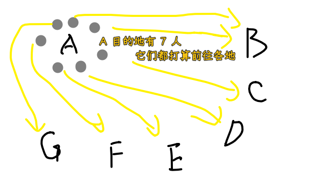
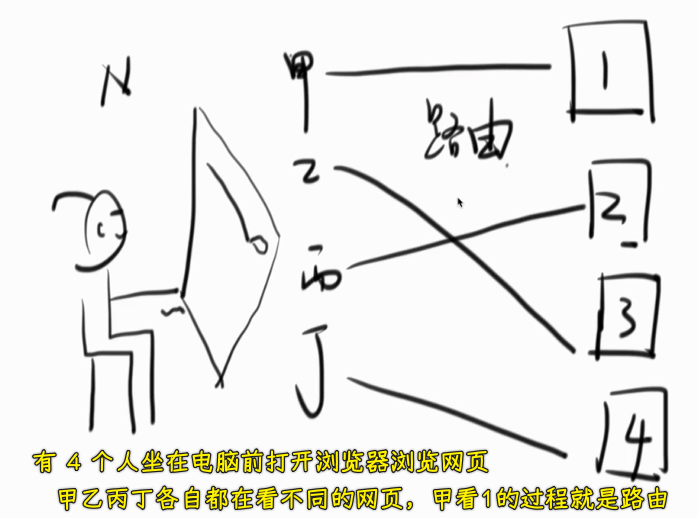
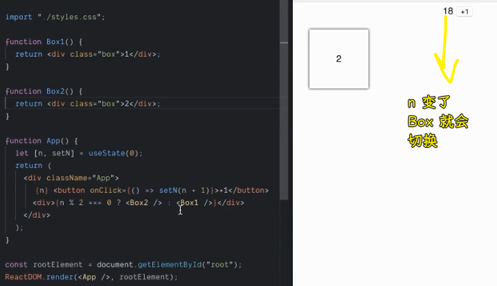
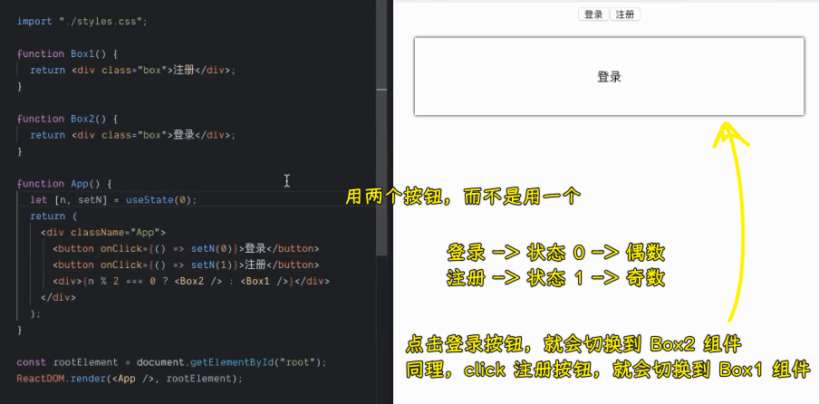
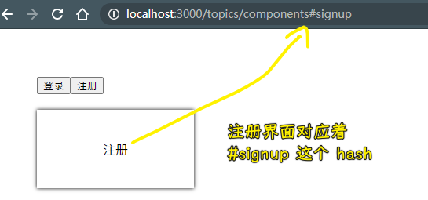
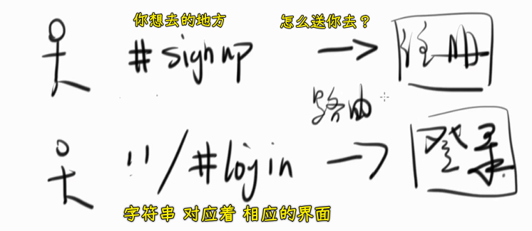

### ✍️ Tangxt ⏳ 2021-02-09 🏷️ Router

# 08-React Router

## ★课程简介

1. 什么是 Router
2. 什么是 React Router

所有代码：<https://codesandbox.io/s/zlop689pr4>

## ★使用 hash 做路由

> 方方是如何学习 React Router 的？先把 React 搞清楚，再把 Router 搞清楚，再学习 React Router。千万不要这两个东西都还没搞清楚，就去学习 React Router 了。

1）什么是 Router？

> 搜索「Wiki Router（computing）」

路由（routing）就是通过互联的网络把信息（0101）从源地址传输到目的地址的活动。

> 互联的网络即互联网，目前所有的信息都是在互联网上的，「通过 xxx」这句话就 TM 就是废话……

简而言之就是「**信息从一个地方到另一个地方的活动**」

抽象到具体：



把一个地方的东西（信息）传到它想去的目的地的过程就叫做「路由」。

2）对于前端来说，路由它又是什么呢？

也就是对于浏览器来说：



> 如果把网页看成是一个地方，那么我们输入一个地址就是到这个地方去！

3）用代码解释什么是路由？

需求：状态变化，组件就会被切换

step 1：



间接让按钮有状态，每次点击都会渲染不同的 Box 组件

step 2：



---

需求：把页面分享给其他人

我们点击了注册按钮，渲染的是`Box1`组件（注册），然后把 URL 分享给其他人，结果他们打开页面，看到的是`Box2`组件（登录）

可以看到这不符合路由的意义——让一个用户去他想去的地方

用户想去注册页面，结果去的是登录页面

从我们的代码里边可以看到，不管我们的 JS 变量`n`如何改变，地址栏都是不会变化的，这意味着你分享给他人的地址永远是初始状态——登录！

所以，我们只要把 url 给改变了，那它就可以去不同的界面了……

💡：如何更改 url ？

浏览器提供了 hash 来给我们改！

不同的界面对应着不同的 hash：

``` jsx
import {useState} from "react"
function Box1() {
  return <div className='box'>注册</div>
}
function Box2() {
  return <div className='box'>登录</div>
}

function App() {
  let [ui,setUi] = useState('登录')
  let onClickLogin = ()=> {
    setUi('登录')
    window.location.hash = 'login'
  }
  let onClickSignUp = ()=> {
    setUi('注册')
    window.location.hash = 'signup'
  }
  return (
    <div className="app">
      <button onClick={onClickLogin}>登录</button>
      <button onClick={onClickSignUp}>注册</button>
      <div>{ui === '注册' ? <Box1 /> : <Box2 />}</div>
    </div>
  )
}

export default App
```

> 为了让代码更明确，所以就把`0、1`改成是`登录`、`注册`了

效果：



这就是做路由的第一步了，如果两个`url`都是一样的话，那么这就没办法指路了……

当然，就目前而言，上边的代码是没有用的 -> 我们还得根据`hash`去设置初始值！

``` jsx
function App() {
  let hash = window.location.hash;
  let initUi = hash === "#signup" ? "注册" : "登录";
  let [ui, setUi] = useState(initUi);
  let onClickLogin = () => {
    setUi("登录");
    window.location.hash = "login";
  };
  let onClickSignUp = () => {
    setUi("注册");
    window.location.hash = "signup";
  };
  return (
    <div className="app">
      <button onClick={onClickLogin}>登录</button>
      <button onClick={onClickSignUp}>注册</button>
      <div>{ui === "注册" ? <Box1 /> : <Box2 />}</div>
    </div>
  );
}
```

> 一个疑问：初始值来自于函数外面的`hash`是否需要放到`useEffect`里边呢？

---

小结：

- 把一个客户送往到 ta 想到的目的，那么这就是路由了！
- 如何实现路由？ -> 最简单的方式就是使用`hash`



总之，路由分为两部分：

1. 获取当前的`hash`值，根据这个`hash`值搞清楚用户想要去的是`注册`还是`登陆`
2. 在你切换页面的时候（点击按钮），把`hash`改掉

## ★除了 hash 还能用什么


