### ✍️ Tangxt ⏳ 2021-02-09 🏷️ Router

# 08-React Router

## ★课程简介

1. 什么是 Router
2. 什么是 React Router

所有代码：<https://codesandbox.io/s/zlop689pr4>

## ★使用 hash 做路由

> 方方是如何学习 React Router 的？先把 React 搞清楚，再把 Router 搞清楚，再学习 React Router。千万不要这两个东西都还没搞清楚，就去学习 React Router 了。

### <mark>1）什么是 Router？</mark>

> 搜索「Wiki Router（computing）」

路由（routing）就是通过互联的网络把信息（0101）从源地址传输到目的地址的活动。

> 互联的网络即互联网，目前所有的信息都是在互联网上的，「通过 xxx」这句话就 TM 就是废话……

简而言之就是「**信息从一个地方到另一个地方的活动**」

抽象到具体：


把一个地方的东西（信息）传到它想去的目的地的过程就叫做「路由」。

### <mark>2）对于前端来说，路由它又是什么呢？</mark>

也就是对于浏览器来说：


> 如果把网页看成是一个地方，那么我们输入一个地址就是到这个地方去！

### <mark>3）用代码解释什么是路由？</mark>

需求：状态变化，组件就会被切换

step 1：


间接让按钮有状态，每次点击都会渲染不同的 Box 组件

step 2：


---

需求：把页面分享给其他人

我们点击了注册按钮，渲染的是`Box1`组件（注册），然后把 URL 分享给其他人，结果他们打开页面，看到的是`Box2`组件（登录）

可以看到这不符合路由的意义——让一个用户去他想去的地方

用户想去注册页面，结果去的是登录页面

从我们的代码里边可以看到，不管我们的 JS 变量`n`如何改变，地址栏都是不会变化的，这意味着你分享给他人的地址永远是初始状态——登录！

所以，我们只要把 url 给改变了，那它就可以去不同的界面了……

💡：如何更改 url ？

浏览器提供了 hash 来给我们改！

不同的界面对应着不同的 hash：

``` jsx
import {useState} from "react"
function Box1() {
  return <div className='box'>注册</div>
}
function Box2() {
  return <div className='box'>登录</div>
}

function App() {
  let [ui,setUi] = useState('登录')
  let onClickLogin = ()=> {
    setUi('登录')
    window.location.hash = 'login'
  }
  let onClickSignUp = ()=> {
    setUi('注册')
    window.location.hash = 'signup'
  }
  return (
    <div className="app">
      <button onClick={onClickLogin}>登录</button>
      <button onClick={onClickSignUp}>注册</button>
      <div>{ui === '注册' ? <Box1 /> : <Box2 />}</div>
    </div>
  )
}

export default App
```

> 为了让代码更明确，所以就把`0、1`改成是`登录`、`注册`了

效果：


这就是做路由的第一步了，如果两个`url`都是一样的话，那么这就没办法指路了……

当然，就目前而言，上边的代码是没有用的 -> 我们还得根据`hash`去设置初始值！

``` jsx
function App() {
  let hash = window.location.hash;
  let initUi = hash === "#signup" ? "注册" : "登录";
  let [ui, setUi] = useState(initUi);
  let onClickLogin = () => {
    setUi("登录");
    window.location.hash = "login";
  };
  let onClickSignUp = () => {
    setUi("注册");
    window.location.hash = "signup";
  };
  return (
    <div className="app">
      <button onClick={onClickLogin}>登录</button>
      <button onClick={onClickSignUp}>注册</button>
      <div>{ui === "注册" ? <Box1 /> : <Box2 />}</div>
    </div>
  );
}
```

> 一个疑问：初始值来自于函数外面的`hash`是否需要放到`useEffect`里边呢？

---

小结：

- 把一个客户送往到 ta 想到的目的，那么这就是路由了！
- 如何实现路由？ -> 最简单的方式就是使用`hash`


总之，路由分为两部分：

1. 获取当前的`hash`值，根据这个`hash`值搞清楚用户想要去的是`注册`还是`登陆`
2. 在你切换页面的时候（点击按钮），把`hash`改掉

## ★除了 hash 还能用什么

### <mark>1）用`pathname`</mark>

我们想不要`#xxx`，直接`/xxx`

但是，浏览器默认，如果你改路径的话，就会刷新整个页面（浏览器认为你要跳转页面，所以会刷新页面）……而`hash`则不会让浏览器认为你会跳转页面的！

``` jsx
import { useState } from "react";
function Box1() {
  return <div className="box">注册</div>;
}
function Box2() {
  return <div className="box">登录</div>;
}

function App() {
  let pathName = window.location.pathname;
  let initUi = pathName === "/signup" ? "注册" : "登录";
  let [ui, setUi] = useState(initUi);
  let onClickLogin = () => {
    setUi("登录");
    window.location.pathname = "/login";
  };
  let onClickSignUp = () => {
    setUi("注册");
    window.location.pathname = "/signup";
  };
  return (
    <div className="app">
      <button onClick={onClickLogin}>登录</button>
      <button onClick={onClickSignUp}>注册</button>
      <div>{ui === "注册" ? <Box1 /> : <Box2 />}</div>
    </div>
  );
}

export default App;
```

效果：


目前遇到的问题：

1. 只要改`pathname`，浏览器就会刷新页面 -> 这样不好，因为你总不能让用户切个`tab`，就刷新页面吧！
2. 改路径访问，后端很有可能返回一个 `404` 页面给你

大多数后台应用，如果你改了路径，返回给你的就是 `404` 了！因为默认你只能访问根目录，而其它路径则不一定允许你访问了！

💡：从`codesandbox.io`下载代码到本地运行？

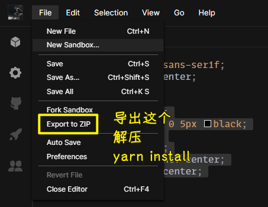

### <mark>2）不刷新页面改`pathname`的方法</mark>

使用浏览器提供的`history.pushState()`方法！

``` jsx
import { useState } from "react";
function Box1() {
  return <div className="box">注册</div>;
}
function Box2() {
  return <div className="box">登录</div>;
}

function App() {
  let pathName = window.location.pathname;
  let initUi = pathName === "/signup" ? "注册" : "登录";
  let [ui, setUi] = useState(initUi);
  let onClickLogin = () => {
    setUi("登录");
    window.history.pushState(null,'',"/login")
  };
  let onClickSignUp = () => {
    setUi("注册");
    window.history.pushState(null,'',"/signup");
  };
  return (
    <div className="app">
      <button onClick={onClickLogin}>登录</button>
      <button onClick={onClickSignUp}>注册</button>
      <div>{ui === "注册" ? <Box1 /> : <Box2 />}</div>
    </div>
  );
}

export default App;
```

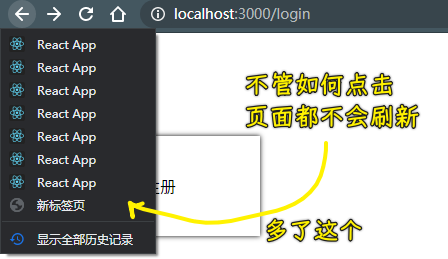

可以看到，这提供了更好看的`url`，而且也不会刷新页面！

但是这还是有问题的，比如如果你直接访问某个`url`还是会出现结果为`404`的情况！ -> 毕竟我们目前只是在前端页面路由切换，并没有发起`http`请求，总之，有时候路径看上去是对应着内容，但是直接输入路径敲下回车访问的话，那么结果很有可能是个`404`页面了！

➹：[一个 popstate 的 bug 引起的雪崩 - 知乎](https://zhuanlan.zhihu.com/p/32195737)

### <mark>3）小结</mark>

搞路由，目前了解到有三种方式：

- `window.location.hash` -> url 有点丑，但可以做到不刷新页面
- `window.location.pathname` -> 会刷新页面，基本不考虑
- `window.history.pushState(null,'','/login')` -> url 好看，专门用来搞路由的，改`pathname`不会刷新页面！是`pathname`的升级版

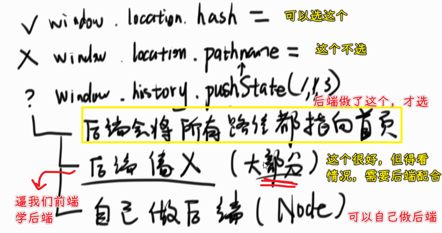

如果后端没有帮我们把所有路径都指向根路径的话，那么我们是不能用第三个方案的！ -> 为什么需要指向根路径的首页？ -> 以防`404`页面啊！

总之，如果你自己在做页面，只会前端不会后端，那么做保险的方式就是做第一种，即用`hash`当路由！如果你能控制后端，那你就用第三种，因为这种`url`更好看！ -> 千万不要选择第二种！

以上就是关于这 3 个 API 的选择分析情况了！

## ★后端要将让路径都展示首页

### <mark>1）什么叫所有的路径都指向首页？</mark>

不管你输入什么路径敲下回车，都返回到首页页面 -> 这是前端做不到的，只有后端才能做！（去学习 Node.js 吧！）

百度的做法：

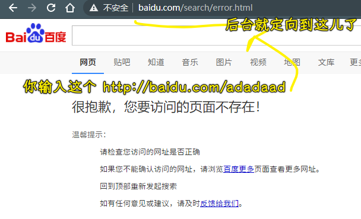

这样的做法才是正常的 -> 所有不存在的、没有权限的路径，都定位这个`error`页面！

正常的服务器都这样，而不正常的，不管你输入什么`url`都给你定位到首页！

总之，你有两种选择：

- 把所有不存在的路径都定为首页
- 把所有不存在的路径都定为不存在的页面 -> 一般的后台都选择这种，因为这种正常一点！

而你要用`pushState`就得定为首页 -> 选择第一种！

> 前端路由就只有`hash`，而如果你要了解后端路由的话，那就得学很多后端知识了，如 Nginx、HTTP、Express、Koa 等

💡：为什么我这个 React 应用也可以这样？

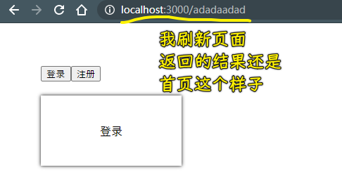

也许 `yarn start` 启动的服务，也做了把所有路径都定位到首页这样的事儿！

codesanbox 也帮我们做了，所以这也是为什么我们能用`pushState`的原因所在了！

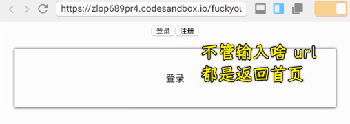

## ★使用 history.pushState 做路由

使用`pushState`的条件：

后端把所有路径都设为首页！

细节：

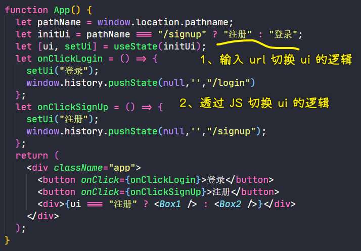

以上就是通过`pushState`实现的前端路由！

## ★路由变多了怎么办

### <mark>1）如果有多个页面？</mark>

目前我们的测试代码，就只有「注册」和「登录」页面，现在我们再加一个「欢迎」页面（这个页面一般在网站里边不会出现，在这里只是为了方便测试罢了！）

三个页面给我们带来的麻烦：如何判断 url 属于哪个页面？

如果是两个页面就很好判断了，要么是这个，要么是那个，而三个页面，则需要判断很多次了……同理，100 个页面，岂不是 GG 了？

``` jsx
import { useState } from "react";
function Box1() {
  return <div className="box">注册</div>;
}
function Box2() {
  return <div className="box">登录</div>;
}

function Welcome() {
  return <div className="box">欢迎</div>;
}

function App() {
  let pathName = window.location.pathname;
  let initUi = "";
  if (pathName === "/signup") {
    initUi = "注册";
  } else if (pathName === "/login") {
    initUi = "登录";
  } else {
    initUi = "欢迎";
  }
  let [ui, setUi] = useState(initUi);
  let onClickLogin = () => {
    setUi("登录");
    window.history.pushState(null, "", "/login");
  };
  let onClickSignUp = () => {
    setUi("注册");
    window.history.pushState(null, "", "/signup");
  };
  let onClickWelcome = () => {
    setUi("欢迎");
    window.history.pushState(null, "", "/welcome");
  };
  let showUi = () => {
    if (ui === "登录") {
      return <Box2 />;
    } else if (ui === "注册") {
      return <Box1 />;
    } else {
      return <Welcome />;
    }
  };
  return (
    <div className="app">
      <button onClick={onClickLogin}>登录</button>
      <button onClick={onClickSignUp}>注册</button>
      <button onClick={onClickWelcome}>注册</button>
      <div>{showUi()}</div>
    </div>
  );
}

export default App;
```

目前代码的问题：

- 如果`path`过多，也就是用户去的目的地过多，那么`if……else`就得写得很长
- 如果路由无限多个，如`/users/1`、`/users/2`……`/users/10000`这样，我们就无法写了……不然，你要写无限行代码吗？

为了解决这两个问题，我们就得使用一些更高级的东西了 -> 基本使用正则表达式来搞这些事儿！

不过，为了简单起见，我们使用一些库就能解决这两个问题了！

`react-router-dom`就能解决很多个`path`，甚至无穷多个路由的问题！

## ★安装和配置 ReactRouter

### <mark>1）使用 React-Router 改写之前的例子</mark>

官网：[React Router: Declarative Routing for React.js](https://reactrouter.com/web/guides/quick-start)

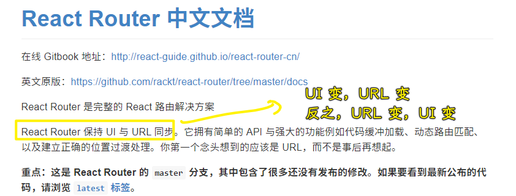

> 这个同步就像我们上边写的例子一样，点击就更新 UI，地址栏 URL 也随着改变，地址栏 URL 变，UI 也跟着变

找例子，CRM 大法！ -> 千万不要原创，先抄 quick start 就完事儿了！之后再慢慢改！

💡：react-router 4.0 无法 `import` `hashHistory`

3.0.2 是可以的！

中文文档：[Introduction - React Router 中文文档](https://react-guide.github.io/react-router-cn/)

该文档已经过时了！请看英文文档！

> 不要装`react-router` -> 如果装了，那么代码就需要你自己去监听`hashchange`了

## ★上手 ReactRouter

### <mark>1）react-router-dom</mark>

可以看到，路由写得特别简单，只要用标签就行了，不用写什么`if……else……`，`button`按钮了！

之前方方讲的是原理，而 react-router-dom 就基于原理做了非常多的优化，使我们像写标签那样，点击一个超链接就到某个地方去一样！

代码：

``` jsx
import React from "react";
import { BrowserRouter as Router, Switch, Route, Link } from "react-router-dom";

export default function App() {
  return (
    <Router>
      <div>
        <Link to="/">首页</Link> | 
        <Link to="/signup"> 注册</Link> | 
        <Link to="/login"> 登录</Link> | 
        <Link to="/welcome"> 欢迎</Link>

        <Switch>
          <Route path="/signup">
            <Box1 />
          </Route>
          <Route path="/login">
            <Box2 />
          </Route>
          <Route path="/welcome">
            <Welcome />
          </Route>
          <Route path="/">
            <Home />
          </Route>
        </Switch>
      </div>
    </Router>
  );
}

function Box1() {
  return <div className="box">注册</div>;
}
function Box2() {
  return <div className="box">登录</div>;
}

function Welcome() {
  return <div className="box">欢迎</div>;
}

function Home() {
  return <div className="box">首页</div>;
}
```

效果：

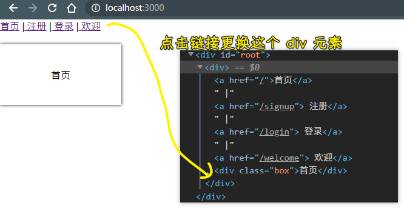

可以看到，UI 的渲染是与 url 息息相关的！

如果你要去「注册」页面，那就点击注册链接 -> 没有刷新页面！

旧的写法：

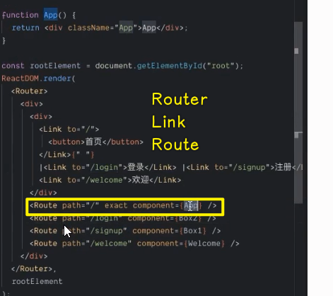

`Route`标签和`component`属性的配合就像是`if……else……`这样！

而`Link`就是在做`pushState`的事儿！

### <mark>2）小结</mark>

原生 JS 如何实现路由？React 又是如何实现路由的？

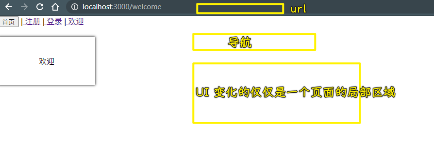

## ★测试

router

请使用 ReactRouter 做出一个 tab 切换

1. 点击 1 则显示 tab 1
2. 点击 2 则显示 tab 2
3. 重要：刷新页面后还是显示对应的 tab

``` jsx
import React from "react";
import { BrowserRouter as Router, Switch, Route, Link } from "react-router-dom";

export default function Tab() {
  return (
    <div>
      <Router>
        <Link to="/tab1">Tab1</Link>
        <Link to="/tab2">Tab2</Link>
        <Switch>
          <Route exact path="/">
            <Tab1 />
          </Route>
          <Route path="/tab1">
            <Tab1 />
          </Route>
          <Route path="/tab2">
            <Tab2 />
          </Route>
        </Switch>
      </Router>
    </div>
  );
}

function Tab1() {
  return <div>Tab1</div>;
}
function Tab2() {
  return <div>Tab2</div>;
}

```

> 写到前面必须加上`exact`，如果不加，那就把它写到后面去！

一个疑问：如何做多个路径匹配一个组件？

➹：[React Router中同一组件的多个路径名](https://qastack.cn/programming/40541994/multiple-path-names-for-a-same-component-in-react-router)


## ★了解更多

➹：[React Router 使用教程 - 阮一峰的网络日志](http://www.ruanyifeng.com/blog/2016/05/react_router.html)

➹：[react-router-tutorial/lessons at master · reactjs/react-router-tutorial](https://github.com/reactjs/react-router-tutorial/tree/master/lessons)

➹：[What is Routing in web development? – DivPusher](https://divpusher.com/glossary/routing/)

➹：[react router - What is routing? Why is "routing" needed in single page web apps? - Stack Overflow](https://stackoverflow.com/questions/39636411/what-is-routing-why-is-routing-needed-in-single-page-web-apps)

➹：[react路由补充部分（exact、八个路由示例）_mapbar_front的博客-CSDN博客](https://blog.csdn.net/mapbar_front/article/details/72832057)

