### ✍️ Tangxt ⏳ 2021-02-12 🏷️ lifecycle

# 09-React 生命周期

> 从摇篮到坟墓 -> 组件从诞生到成长再到消亡，这一过程发生了一些事儿，而这些一件件的事儿都会触发一个个生命周期方法！

响应组件生命周期有三种类型：挂载（Mounting）、更新（Updating ）和卸载（Unmounting）

## ★课件

- 文档：<https://reactjs.org/docs/state-and-lifecycle.html>
- 中文文档： <https://react.docschina.org/docs/state-and-lifecycle.html>

1. 有哪些生命周期
2. 每个周期有什么特点

div 的例子：<https://codesandbox.io/s/54mkyvl3r4>

React 的例子：<https://codesandbox.io/s/yqrkxpm01>

图示：<https://projects.wojtekmaj.pl/react-lifecycle-methods-diagram/>

## ★React 的生命周期

面试必考，但平时用得不多。平时用到它的知识点非常少，但面试的时候问到它的知识点就特别得多！

### <mark>1）如何讲 React 的生命周期？</mark>

官网讲生命周期这一章节的标题是「State and Lifecycle」

State 我们已经非常熟悉了，但是 Lifecycle 是什么玩意儿呢？（不知道）

要讲清楚生命周期，那一开始就不讲 React，不然，把生命周期配合 React 来讲的话，生命周期就特别的模糊了。

总之，不讲 React，直接讲生命周期，就不模糊了。

### <mark>2）原生 JS vs 生命周期</mark>

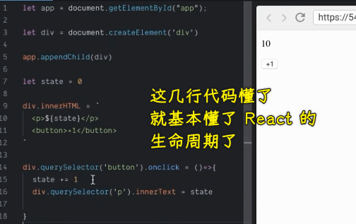

我们研究生命周期的对象就是`div` -> 看看它的生老病死是怎样的……

💡：`create` 和 `mount`的区别？

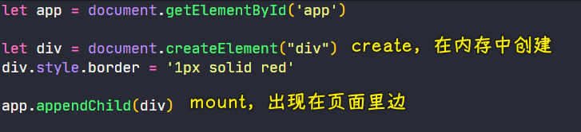

我们创造的`div`没有在页面里边，只是出现在 JS 内存中！

而我们把`div`放到`app`里边，这就叫做`mount` -> 把`div` `mount`到`app`里边！

把一个东西放到另一个东西里边，这个过程就叫做「挂载」！

💡：React 里边有 `props`，这个原生例子不讲`props`……

💡：先填充，再挂载？

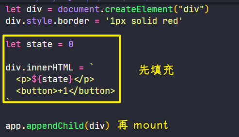

💡：更新`div`？

``` js
div.querySelector('button').onclick = () => {
  state += 1
  // update div
  div.querySelector('p').innerText = state
}
```

💡：React 生命周期最重要的三个点？

1. 出现在内存里边
2. 出现在页面里边，出现在页面里边之前，最好先把子元素准备好
3. 更新内容，把某部分内容给更新了

💡：关于`div`的死亡？

`div.remove`？ -> 这是`div`的自毁程序，把自己从页面里边移除！

但是，你还得移除一些绑定在`div`身上的事件监听，还有`div`自己所占的内存！

``` js
div.querySelectorAll("button")[1].onclick = () => {
  div.querySelector("button").onclick = null;
  div.querySelectorAll("button")[1].onclick = null;
  div.remove();
  div = null; // destroy div
};
```

💡：人有生老病死，`div`有生挂更新死……

### <mark>2）React 的生命周期</mark>

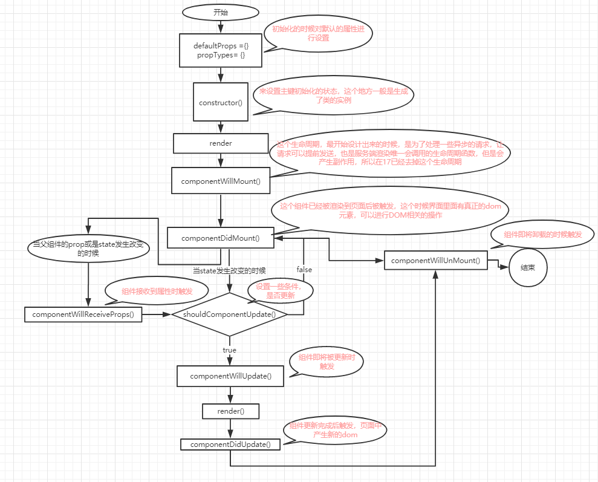

> 图来源：[React 生命周期的图解 - 简书](https://www.jianshu.com/p/46022f1cbbb3)

> 方方说函数是没有生命周期的！`class`组件才有生老病死！

💡：第一轮，挂载阶段？


💡：给用户一个点页面的机会，好让用户可以更新组件？

> 能在`componentDidMount`前点击页面吗？不能！

💡：自己做一个控制台，让控制台的内容在页面中显示？

``` js
let div = document.createElement('div')
document.body.appendChild(div)

console.log = function(content) {
  div.innerHTML += `${content}<br>`
}
```

💡：为啥要在创建的时候初始化状态？

初始化得越早越好！而最早的时间就是出生的那天……孩子一出生，初始化了 ta 的爸爸妈妈……

总之，组件一出生就给它一个`state`

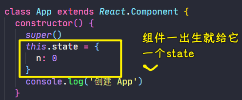

💡：目前的代码？

``` jsx
let div = document.createElement("div");
document.body.appendChild(div);

console.log = function (content) {
  div.innerHTML += `${content}<br>`;
};

class App extends React.Component {
  add1() {
    console.log("用户点击了");
    this.setState({
      n: this.state.n + 1,
      flag: true
    });
  }
  constructor() {
    super();
    this.state = {
      n: 0,
      flag: false
    };
    console.log("创建 App");
  }
  componentWillMount() {
    console.log("将要 mount App");
  }
  render() {
    console.log(`${this.state.flag ? '更新' : '填充'} App 的内容`);
    return (
      <div className="app">
        {this.state.n}
        <button
          onClick={() => {
            this.add1();
          }}
        >+1</button>
      </div>
    );
  }
  componentDidMount() {
    console.log("mount App 完毕");
  }
}

ReactDOM.render(<App />, document.getElementById("root"));
```

效果：

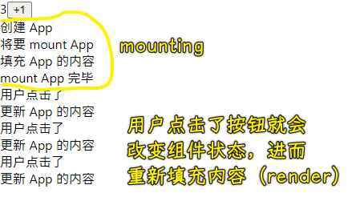

`render`就是在`update`，第一次填充（其实也叫更新），在`render`，第二次更新，也是`render`。

💡：我能否在更新`App`的内容之前做点事情呢？

React 提供了一个叫`componentWillUpdate`的钩子，而且更新之后也提供了一个叫`componentDidUpdate`的钩子：

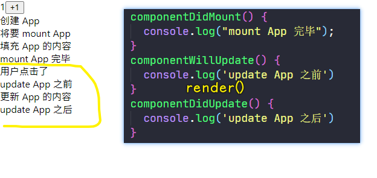

💡：第一次的，钩子都带有 mount，第二次的，钩子都带有更新

💡：如果组件要死了？

如何让组件凉凉？

1. 路由切换
2. 爸爸组件让它凉凉

话说，儿子被凉凉之前，能否说一句遗言呢？

可以，这就需要用到`componentWillUnmount`这个钩子了，表示儿子马上从页面中被弄出来！

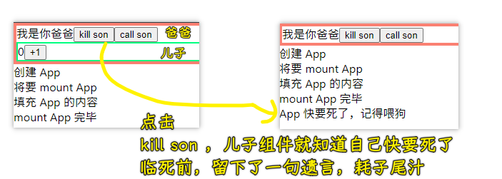

💡：爸爸给儿子传新的数据？

如何知道爸爸传数据给儿子？ -> 使用`componentWillReceiveProps(nextProps)`这个钩子！

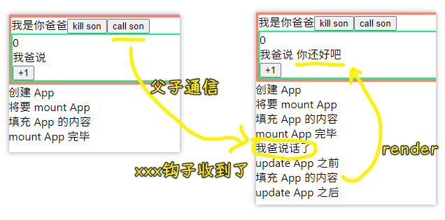

---

接下来就讲一下这 8 个生命周期分别如何地使用……

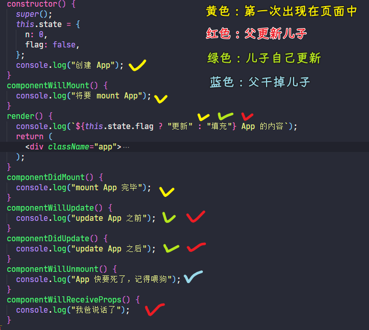

17 版后，一些钩子被废弃了：

- componentWillMount() -> UNSAFE_componentWillMount()
- componentWillReceiveProps(nextProps) -> UNSAFE_componentWillReceiveProps()
- componentWillUpdate（nextProps, nextState) -> UNSAFE_componentWillUpdate()

## ★这些生命周期的区别

> 如何使用各个生命周期？

### <mark>1）我们在页面里边一般要做的动作有哪些？</mark>

一般 React 做的就这两个：

1. 发请求，请求数据（ajax）
2. 更新状态，即更新数（setState）

如果非要强加的话，这两个也算：

3. 事件监听（onClick）
4. 初始化 state

💡：请求数据放哪儿做？

理论上这 8 个钩子都行 -> 为什么都行？ -> 因为请求数据更新跟组件关系并不大！

请求数据的原则：越早越好！

请求数据有两个比较好的时机：

1. 创建 App -> `constructor`
2. 事件处理函数 -> `onClick`（有些请求必须等用户某个动作之后才去请求）

当然，你还可以在`componentWillMount`、`render`里边发，不过`render`按规范是纯函数，所以`render`就算了！

几乎同时执行？


至于，其它刚刚讲到的剩余钩子，都可以发送请求，注意，**这里强调的仅仅是发请求这件事……**

总之，要么在`constructor`发，要么在事件处理函数`onClick`里边发！ -> **越早发越好！**

### <mark>2）什么时候初始化`state`？</mark>

💡：`state`是什么时候产生的？

`state`跟组件不是一个东西，`state`它是组件的一个附属品

在`render`前都那些钩子都可以初始化`state`，但是官方推荐你在`constructor`里边初始化……

何以见得？

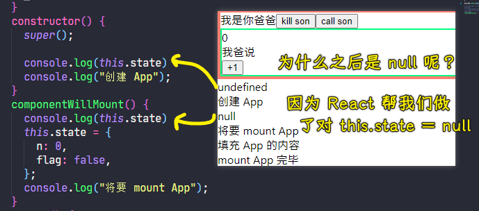

### <mark>3）更新`state`放哪儿？</mark>

最明显的地方，事件处理函数 -> `onClick`

话说，我们能否在其它钩子里边更新呢？

如`constructor`

会报错：告诉你不能在`mount`之前更改状态

还有不能在`render`里边更改状态，不然会死循环，导致爆栈！

在`componentDidMount`里边`setState` -> 这个`setState`只会执行一次，因为组件只会`mount`一次。

`componentWillUpdate` -> 这会死循环，爆栈……因为组件之所以更新是因为`state`变了，所以你不能在这个钩子里边`setState`

同理，`componentDidUpdate`也是如此，也会死循环！

`componentWillUnmount` -> 咩有意义，就像是临死前赚一块钱花这样没啥意义……注意，你还有 1s 就凉凉了（什么也做不了），可不是还有一天啊！总之，你不能想着临死前打一局 LOL 这样…… -> 简单写一封遗书，或说一句话就够了！千万不要做任何更新自己的事儿！

`componentWillReceiveProps` -> 这个可以`setState`，它可以记录「爸爸说了几次话」…… -> **用得比较多**

总之，有常用的 3 处地方可以放`setState`：

1. 事件处理函数
2. `componentDidMount`
3. `componentWillReceiveProps`

方方是如何得出这几点的？ -> 很简单，一个个排查出来的！有逻辑错误的就不能放！

### <mark>4）事件监听放哪儿？</mark>

一般都放在元素标签上啊！除此之外就没地方了！ 

注意，也不要用原生的 JS 做事件监听！

### <mark>5）阻止组件更新？</mark>

`shouldComponentUpdate(nextProps, nextState)`

让这个钩子返回`false`值，这样不管你如何`setState`都不会更新组件！

一些测试例子：

偶数更新：

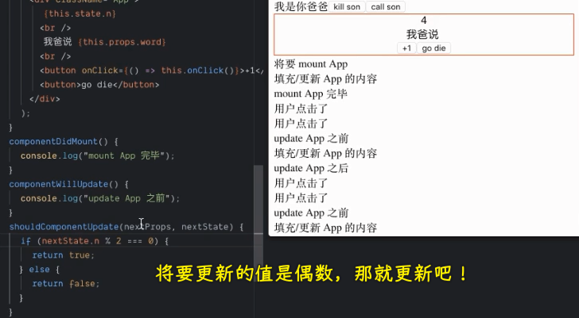

初始值是`0`，用户点击了，此时将要更新为`1`，那就不更新呗！（注意这是页面咩有任何变化，但是内存中的状态已经变成`1`了），用户再点击，此时将要更新为`2`，那就更新页面呗！

避免不必要的更新：

我们写了一个不出现在页面里边的`x`状态，我们更新了这个`x`，显然这就需要去`render`了，可是页面用到的状态并咩有发生改变啊！所以我们显然并不需要去更新……

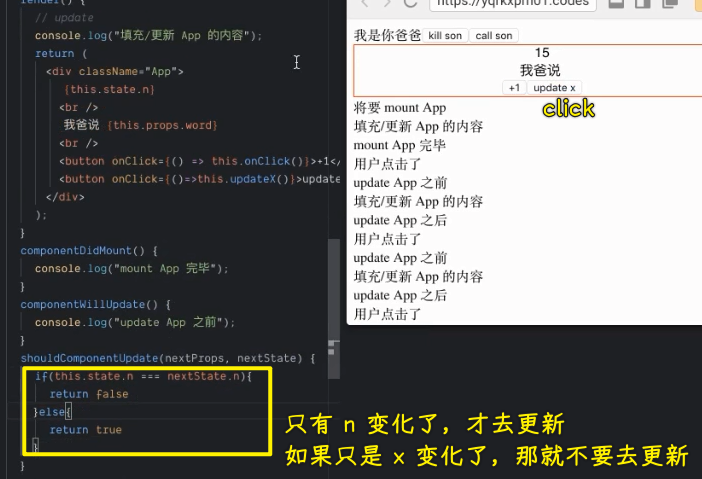

这个钩子一般不用，一般都用在非常特殊的情况！

面试题：


➹：[React 常用面试题目与分析 - 知乎](https://zhuanlan.zhihu.com/p/24856035)

如果问你例子，那就说上边的例子，即：一个不显示在 UI 上的状态变了，就得判断一下显示在 UI 上的状态是否变了，如果变了，那就返回`true`，`render`组件，否则就`false`，不更新！

## ★面试常考的点

[关于 React 面试题汇总](https://juejin.cn/post/6844903620664623111#comment):

1. 请说一下 React 生命周期有哪些函数？
2. React 性能优化是哪个周期函数？

在面试 React 前，就把 React 的相关面试题过一遍就好了！

[React 常用面试题目与分析 - 知乎](https://zhuanlan.zhihu.com/p/24856035)：

1. 在生命周期中的哪一步你应该发起 AJAX 请求？ -> 方方不认同他是对的，但他给出来理由，所以个信不信由你！ -> 面试统一说是`componentDidMount`（方方不是很认同），这是看了几个面试题归纳博客得出来的说法 -> 不能放在`constructor`里边是因为你不能在这儿`setState`，而不能放在`componentWillMount`是为了性能的需要，因为用了 fiber！ -> 这是用了排除法，根据请求越早越好，把最早的逐步排除，那么最终无法排除的就是正确的答案了！
2. 当调用`setState`之后，组件会调用哪几个生命周期函数？ -> shouldComponentUpdate -> componentWillUpdate -> render -> componentDidUpdate

看着面试题不断地测试就好了！背一下为什么这样做的原因就行了！

➹：[关于 React 的几道面试题 - Kevin's Notes](https://wuxinhua.com/2018/03/17/The-questions-about-react-and-redux-in-interview/)

总结一下面试题：

1. 请说一下 React 里边所有的生命周期钩子？（9 个）
2. 请说一下 `shouldComponentUpdate` 为什么那么重要？
   1. 它可以自定义是否更新组件
   2. 我们可以通过它来优化这个更新效率
3. 请问 ajax 请求，应该在哪个生命周期钩子函数里边发出？
   1. `componentDidMount`
   2. 原因：
      1. `constructor`里边不能使用`setState`（方方表示不成立，也许是因为组件要用到请求过来的数据吧，不过，这真得是强制性的吗？）
      2. 因为`componentWillMount`在 fiber 里边会多次被调用，造成不稳定！（道听途说，也不知道为什么，即便深问起来，面试官也不知道为什么 fiber 会造成不稳定）
      3. `render` -> 保证是纯函数，所以最后就自然而然地落到了`componentDidMount`这个钩子里边了！
4. 调用`setState`的时候，会调用哪几个钩子？
   1. 四个：`shouldComponentUpdate -> componentWillUpdate -> render -> componentDidUpdate`（其实就是两个，一个是看要不要更新，另一个就是更新，更新又有之前和之后）

## ★了解更多

➹：[React 入门实例教程 - 阮一峰的网络日志](https://www.ruanyifeng.com/blog/2015/03/react.html)

➹：[React 生命周期 - WindrunnerMax - 博客园](https://www.cnblogs.com/WindrunnerMax/p/14090262.html)

➹：[大话 react 生命周期 2019：react-v16.3 新生命周期总结 - SegmentFault 思否（★）](https://segmentfault.com/a/1190000020348448)

➹：[图解 ES6 中的 React 生命周期](https://juejin.cn/post/6844903510538977287#heading-15)

➹：[React 生命周期详解 - SegmentFault 思否](https://segmentfault.com/a/1190000021827650)

➹：[（★）译-React 生命周期方法--深入理解 - 知乎](https://zhuanlan.zhihu.com/p/349661581)

➹：[生命周期 - 知乎](https://www.zhihu.com/topic/19601187/hot)

➹：[React Lifecycle Methods - A Deep Dive - Programming with Mosh](https://programmingwithmosh.com/javascript/react-lifecycle-methods/)

➹：[附实例！图解 React 的生命周期及执行顺序_Mathilda91 的博客-CSDN 博客](https://blog.csdn.net/weixin_33767813/article/details/88598680)

➹：[生命周期-React 生命周期流程图及简述](https://juejin.cn/post/6845166891711856654)

➹：[三张图对比 React 组件生命周期 - 知乎](https://zhuanlan.zhihu.com/p/60168527)

➹：[16.3 新版 react 生命周期 图示 - SegmentFault 思否](https://segmentfault.com/a/1190000020268993)

➹：[（★）Hooks 与 React 生命周期的关系](https://juejin.cn/post/6844903901620092941)

➹：[（★）函数式组件的崛起 - 黯羽轻扬](http://www.ayqy.net/blog/the-rise-of-function-component/)

➹：[（★）2019 年 17 道高频 React 面试题及详解](https://juejin.cn/post/6844903922453200904#heading-3)