### ✍️ Tangxt ⏳ 2021-02-14 🏷️ CSS

# 10-React 的 CSS 方案

## ★课件

CSS in React

1. 以前怎么写
2. Vue 怎么写
3. React 怎么写
   1. styled-components <https://codesandbox.io/s/rjr43532wo>
   2. emotion <https://codesandbox.io/s/9yvlrp86pw>
   3. css modules
   4. radium
4. 优缺点
   1. 普通应用使用 styled-components 和 css modules，因为类名会变成随机字符串
   2. 库使用传统 CSS 方式，因为类名不会变成随机字符串

## ★传统 CSS 使用方式

> React 里边的 CSS 要怎么写？

### <mark>1）我们以前是如何写 CSS 的？</mark>

> 建议使用 codesandbox 去学习，因为这可以让你不用配置，很快就搭建出一个能跑的 React 项目了。

1. 写在标签的`style`属性里边
2. 用`style`标签
3. 外部样式表

后两种，就是「**内容与样式分离**」的旧的 CSS 思想

但自从有了 React 之后，这一切的东西都不一样了！

### <mark>2）React 是如何使用 CSS 的？</mark>

> 有好几十种方案……

#### <mark>1、内容和样式分离</mark>

注意点：

- 用`className`而不是`class`，当然`class`也能用，只是会警告而已！ -> 总之，建议用 React 建议的方式来做，即`className`
- 用 JS 的方式导入`CSS`

``` jsx
import './1.css'
function X() {
  return <div className="c1">hi</div>
}

export default X
```

> `c1`是`class1`

效果：

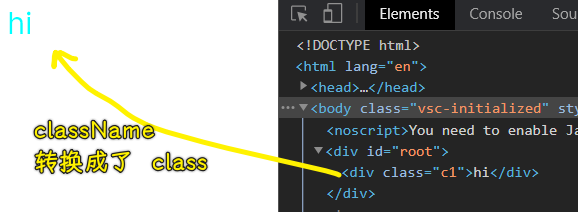

话说，这个方法好吗？

一开始这是没啥问题的，但是当我们的组件逐渐变多了之后，你就会觉得不好了！

比如这样：


只要你用了`className`，那么这样式就会全局生效了！

因此，你不能用`c1`

于是，就用了 BEM 命名法这个东西，它表示咩有前缀的`class`命名是不能容忍的！（除了加前缀之外，还可以加状态变量）

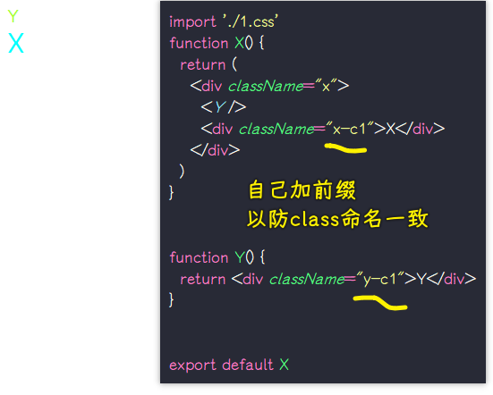

加前缀这种姿势，写起来特别麻烦，但还可以接受！

以上就是防止组件之间`class`冲突的改进版了 -> 使用前缀阻止它们互相侵犯

💡：继续改进，组件根据不同的状态，有不同的样式，如`light`主题和`dark`主题

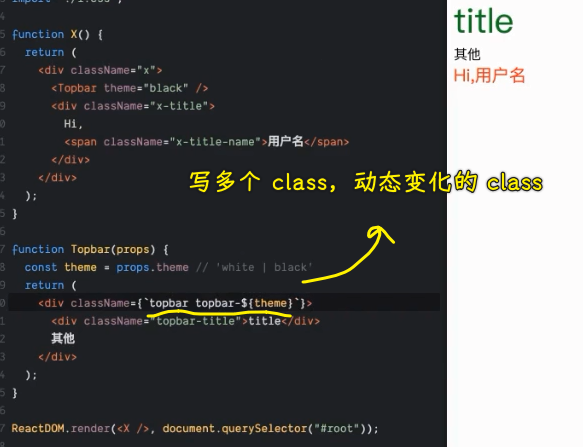

字符串插变量太麻烦了，能否有更简单的方式？

于是就有人发明了`classnames`

💡：`classnames`？

官网：[JedWatson/classnames: A simple javascript utility for conditionally joining classNames together](https://github.com/JedWatson/classnames)

很多用 React 开发的人，都觉得`classnames`很好用，即便，我们这代码写起来看起来似乎变得更长了：

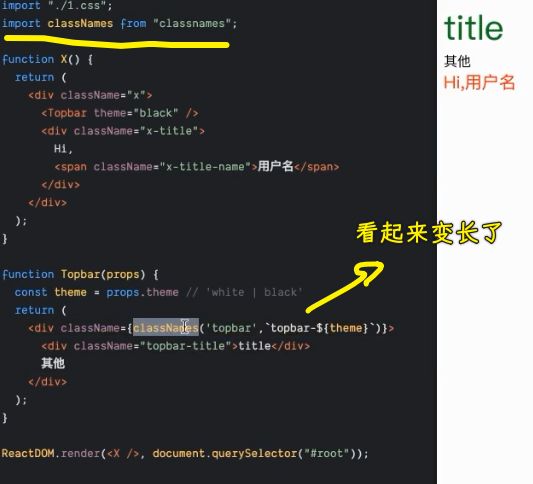

> 在 React 里边一般是用`props`来动态控制`class`

可以改成是`cn`这样短的命名

这个`classnames`在方方看来是很智障的，因为事情变得复杂起来了！

当然，还有更智障的做法……不过，这些做法在 React 世界里边都很流行！

💡：在一个文件里边，类名多了，就很难组织了，我们能否分两个文件来写呢？

也就是所谓的模块化，每个 CSS 文件，都只服务于某个组件……

如：`Topbar`组件对应着`topbar.css`，`X`组件对应着`x.css`

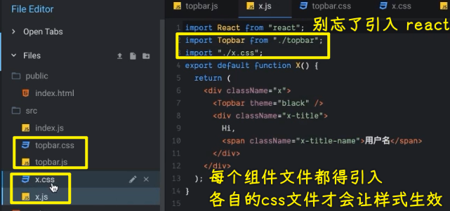

整个文件的导入流程：

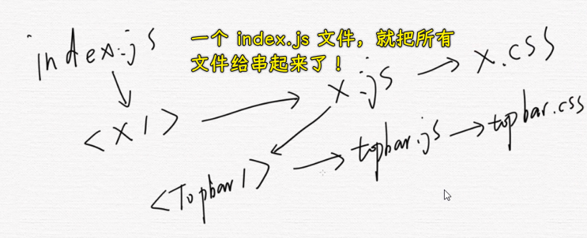

目前代码很符合处女座的人所写的代码，即非常清晰，你想看哪个组件的样式，直接点文件进去看就行了，而不是在一个混杂着各种组件样式代码的文件里边找！

如果你的处女座、强迫症再进一步，那么你这时就可以**引入目录**了！

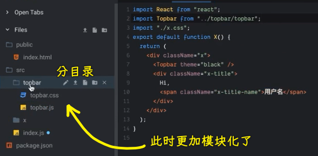

可以看到，每个组件的内容、样式都被锁定在一个文件目录里边了！

我们不用操心，其它组件目录是如何划分的，但我们使用它们时，我们直接引用一个`X`标签就可以了

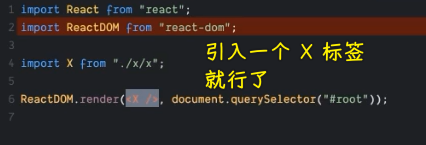

> 如果我引入了 `X`，但是我没有使用，那么其它在`x.js`里边的引入还会去引入吗？

💡：模块化很深，我们该如何找文件呢？

如一个页面，当作是一个目录，这个目录旗下又有很多一级组件、二级组件的……

用快捷键就好了！ -> VS Code，就能很快找到文件！

---

这个方法很好，但 React 程序员就觉得不爽！

如：不想加前缀，类似 Vue 的 `scoped` 这样

可以看到前端前进的动力是来自于强迫症，如果没有强迫症，我们乐于接受加前缀的`class`命名，但有了强迫症就很不爽加前缀了！

💡：如何做到不写前缀就能区分，不同组件里边所写的`class`？

如`Topbar`组件的 jsx 里边有个`title`class，而`X`组件也有个`title`class，我们原先是透过加前缀来区分它们俩的，而现在则是不想透过加前缀来区分它们俩！

> 突然觉得了解了 React 的 CSS 方案之后，就有点明白`.vue`文件为何要这些写 CSS 了！!

如何区分呢？

CSS 是无法做的！除非浏览器能把 CSS 升级！

既然如此，前端就不用 CSS，而是用 JS 来做！

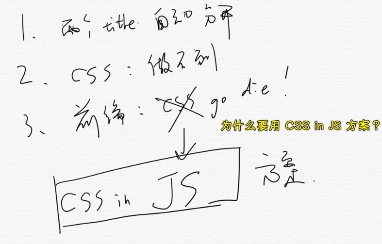

## ★styled-components 方式

### <mark>1）CSS in JS 是什么？</mark>

简单来说，这个方案等于几十种 CSS 方案！ -> 这不是一个方案，而是一个在 JS 里边写 CSS 的大概方向……

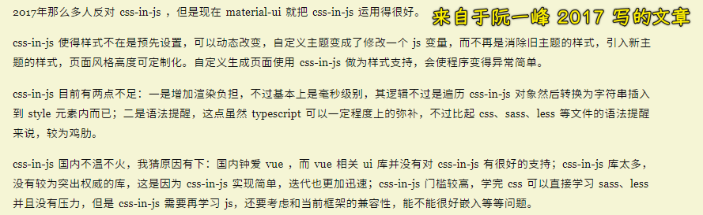

这个仓库目前收录了所有的 css in js 方案：[MicheleBertoli/css-in-js: React: CSS in JS techniques comparison](https://github.com/MicheleBertoli/css-in-js)

目前使用 React 的人，所选择的 CSS 方案，跟另外一个人所写的完全不一样，而且**互相看不顺眼**！

💡：为啥有人说做前端架构很难呢？

没有写 3 年前端项目，你是做不到的！因为你需要把很多东西都试一遍才知道哪个好，如这个 CSS in js 的方案选型……

所以如果你不花时间去研究这些乱七八糟的社区瞎搞出来的东西，你是不知道应该选哪种方案的！ -> **很有可能选择是一个错的，过了几年后被人认为是辣鸡！**

在前端里边是否有很多东西，一开始觉得很好，后来就变成辣鸡的呢？

如：

- Grunt，一开始出来的时候，觉得很牛逼，之后就凉凉了
- Angular1.x

目前大热的 React 和 Vue，火的时间也不过 6、7 年……谁能预料到未来会怎样呢？当然，反正一个程序员在一家公司干一两年就走了，后来谁维护都不关自己的事儿了！

💡：这么多种 CSS in JS 方案，应该选哪一种呢？

简单来说，给大家一个指导方针，那就是「**看 star 数量**」

选择 star 数量排名最高的四种方案 -> 这就是目前 React 世界里边最流行的几种方案了！

> 这就是写 CSS 难的原因之一

### <mark>2）styled-components</mark>

官网：[styled-components/styled-components: Visual primitives for the component age. Use the best bits of ES6 and CSS to style your apps without stress 💅](https://github.com/styled-components/styled-components)

用它之前，心理暗示自己：**CSS 就是辣鸡，它不能区分两个 class 名，即便能区分也得加前缀，用 JS 写才是王道。**

例子：

``` jsx
import React from "react";
import styled, { css } from 'styled-components'

const Button = styled.button`
  background: transparent;
  border-radius: 3px;
  border: 2px solid palevioletred;
  color: palevioletred;
  margin: 0.5em 1em;
  padding: 0.25em 1em;

  ${(props) =>
    props.primary &&
    css`
      background: palevioletred;
      color: white;
    `}
`;

const Container = styled.div`
  text-align: center;
`;

export default function X() {
  return (
    <Container>
      <Button>Normal Button</Button>
      <Button primary>Primary Button</Button>
    </Container>
  );
};

```

效果：

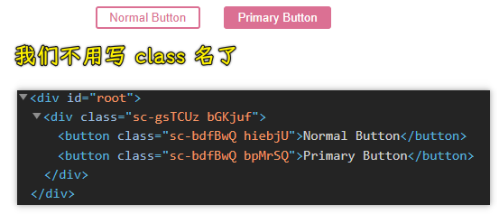

> 第一个`sc-`前缀的表示的是是否由同一个`styled.button`构造出来的，第二个咩有前缀的是用户自己写的样式

自从用了这个库后，我们就没有`.css`这样的文件了！也不用去想如何取一个`class`名字了！ -> 我们只需要写样式属性就完事儿了！

其原理，就是生成一个`class`名，然后把类名加到元素上！

这个方案不能与其它 scss、less 等结合，因为没有选择器给你选
了！

使用这种写法的场景：

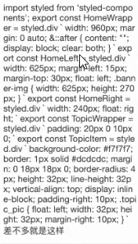

导出一个带有`class`的组件！

💡：标签函数？

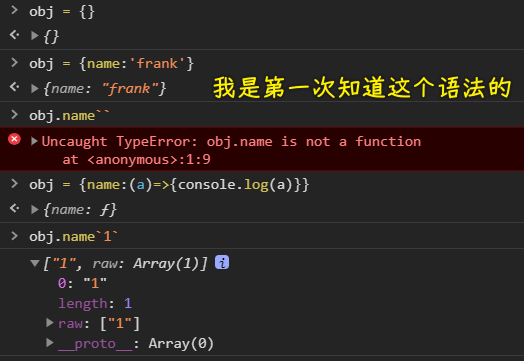

标签函数的语法是函数名后面直接带一个模板字符串，并从模板字符串中的插值表达式中获取参数。

标签函数的第一个参数是被嵌入表达式分隔的文本的数组。第二个参数开始是嵌入表达式的内容。

➹：[ES6 - 标签函数 - 知乎](https://zhuanlan.zhihu.com/p/31687266)

➹：[javascript 模板字符串（标签函数） - Alummox - 博客园](https://www.cnblogs.com/alummox/p/11349116.html)

➹：[JavaScript 标签语句和标签函数_进阶的 linzhangmeidi-CSDN 博客](https://blog.csdn.net/linzhangmeidi/article/details/113823433)

💡：更多例子？

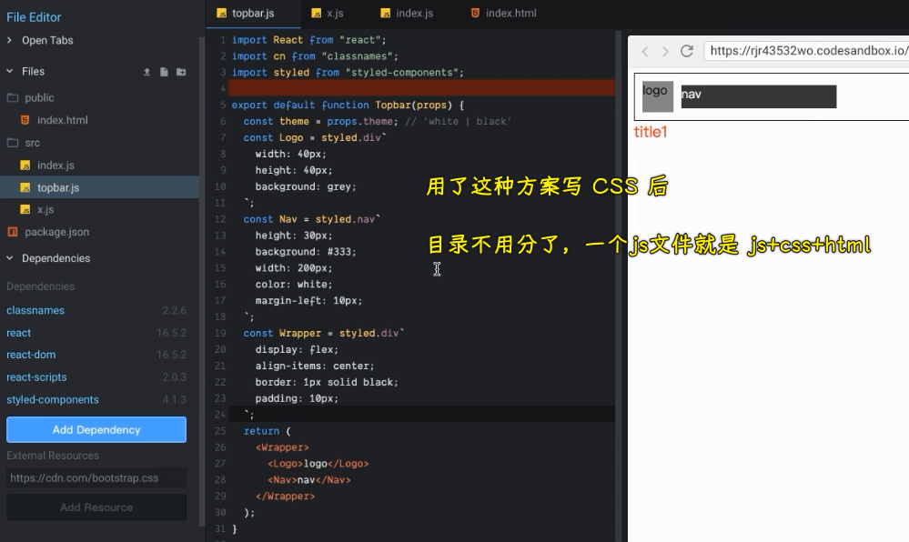

不仅内容和样式不分离，而且行为也不分离 -> 自己加个`onClick`属性就完事了！

如果你想动态改变样式，直接`${xxx}`就完事了：

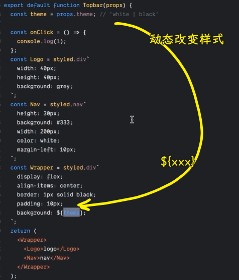

### <mark>3）小结</mark>

这个方案让你：

- 再也看不见类名，不需要你写`class`，也不用去想名字
- 没有 css 文件，只有 js 文件，全部东西都糅合在一起！但从更高维度来看，所有文件都是独立的，分离的！不用再想以前那样在这个组件里写个`class`，还得顾虑其它组件是否也有个一样的`class` -> css in js 方案，给了我们一种好处，那就是心理负担减轻，很多人喜欢 React 也是因为这样！即不用担心自己所写的代码会影响到任何其它组件，不然，你写的代码有 bug，影响到其他人所写的，那就被 fire 了！ -> 利大于弊，从工程角度来说，对新人非常友好，不会有任何觉得自己写错代码就被 fire 的心理负担……

## ★emotion 方式

官网：[emotion-js/emotion: 👩‍🎤 CSS-in-JS library designed for high performance style composition](https://github.com/emotion-js/emotion)

### <mark>1）官方例子</mark>

``` jsx
/** @jsx jsx */
import { jsx } from "@emotion/react";

let SomeComponent = (props) => {
  return (
    <div
      css={{
        color: "hotpink",
      }}
    >Hi</div>
  );
};

export default SomeComponent
```

拷贝官方例子，然后运行所遇到的问题：

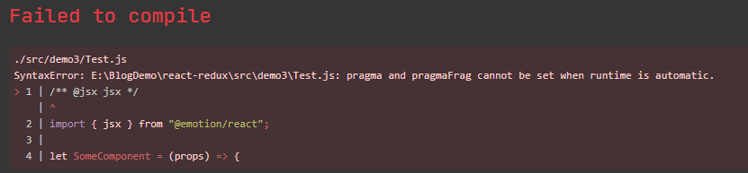

解决：

``` jsx
/** @jsxRuntime classic */
/** @jsx jsx */
import { jsx } from "@emotion/react";

let SomeComponent = (props) => {
  return (
    <div
      css={{
        color: "hotpink",
      }}
    >Hi</div>
  );
};

export default SomeComponent
```

追加一行`/** @jsxRuntime classic */`就行了！

> [Migrating to React 17 and Fixing the JSX Runtime Error with Emotion - DEV Community](https://dev.to/segunadebayo/migrating-to-react-17-and-fixing-the-jsx-runtime-error-with-emotion-l4n)

效果：

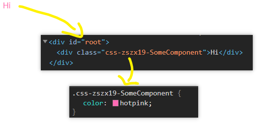

> 代码里边是需要加注释的！

它的一些优化：

我们直接写`fontSize:20`就是`20px`了，如果写`rem`单位，那就`'20rem'`

更多例子：

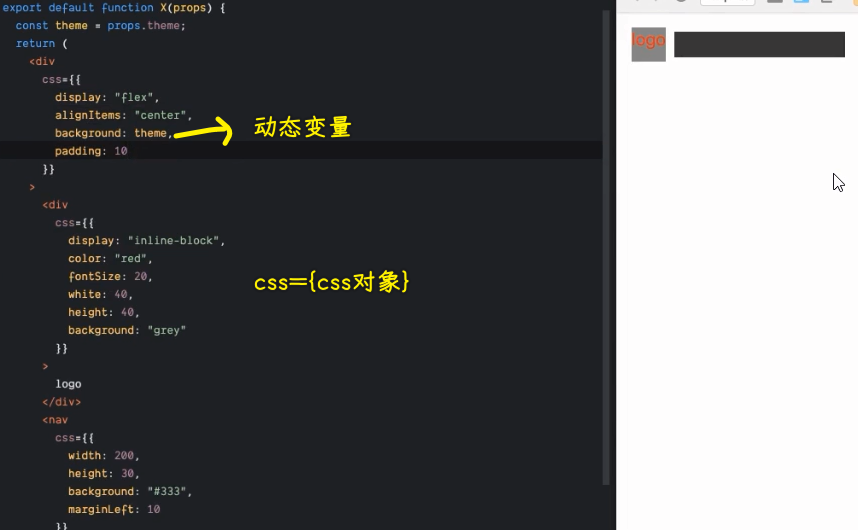

方方不推荐……不过，既然有那么多 star，那肯定会有它的牛逼之处的！

## ★css-modules 方式（失败）

文档：[gajus/react-css-modules: Seamless mapping of class names to CSS modules inside of React components.](https://github.com/gajus/react-css-modules)

这个方案更容易理解，它可以做到每个组件都有自己的模块，各个模块写的`title`class，是不会互相影响的！

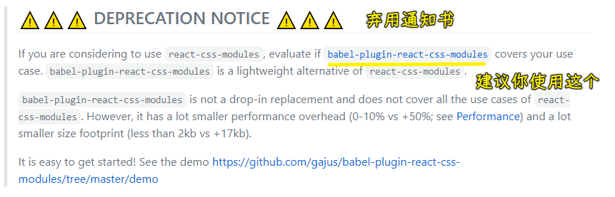

文档：[gajus/babel-plugin-react-css-modules: Transforms styleName to className using compile time CSS module resolution.](https://github.com/gajus/babel-plugin-react-css-modules)

💡：`yarn eject`？

由于需要配置 webpack，因此需要执行这个命令，这是一个非常危险的操作，它是单向的，执行后，复杂的`webpack`管理将交由我们自己管理了。

它的效果：根目录旗下多了一个`config`目录，这个目录里边有很多 webpack 配置文件！

➹：[关于 eject 需要知道的 - Limoer 的记事小本](http://limoer.cc/2019/06/05/eject/)

---

这个方案还是不要用了。

create-react-app 自从 2.0.0 版本开始已经开始支持 CSS Modules，如果是之前的版本则需要先 eject，然后手动配置 webpack 支持。

使用方法：

- 局部样式，命名规则：`xxx.module.css`
- 全局样式，只要不以`.module.css`结尾即可

``` jsx
import styles from './test.module.css';
console.log(styles)

export default function Test() {
  return (
    <div className={styles.title}>Hello</div>
  )
}
```

效果：

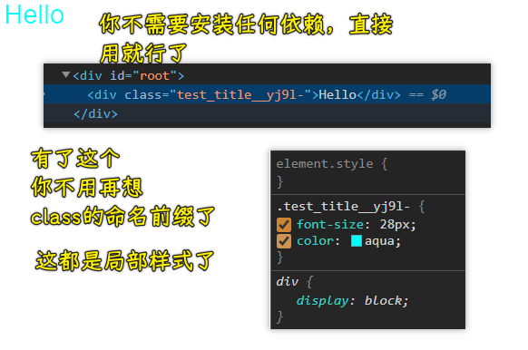

➹：[美化 React 组件之 CSS Modules - 知乎](https://zhuanlan.zhihu.com/p/50837353)

## ★Radium

文档：[FormidableLabs/radium: A toolchain for React component styling.](https://github.com/FormidableLabs/radium)

``` jsx
import Radium from "radium";
import React from "react";
import color from "color";
import PropTypes from "prop-types";

class Button extends React.Component {
  static propTypes = {
    kind: PropTypes.oneOf(["primary", "warning"]).isRequired,
  };

  render() {
    // Radium extends the style attribute to accept an array. It will merge
    // the styles in order. We use this feature here to apply the primary
    // or warning styles depending on the value of the `kind` prop. Since its
    // all just JavaScript, you can use whatever logic you want to decide which
    // styles are applied (props, state, context, etc).
    return (
      <button style={[styles.base, styles[this.props.kind]]}>
        {this.props.children}
      </button>
    );
  }
}

Button = Radium(Button);
console.log(color);

// You can create your style objects dynamically or share them for
// every instance of the component.
var styles = {
  base: {
    background: "transparent",
    borderRadius: "3px",
    border: "2px solid palevioletred",
    color: "palevioletred",
    margin: "0.5em 1em",
    padding: "0.25em 1em",

    // Adding interactive state couldn't be easier! Add a special key to your
    // style object (:hover, :focus, :active, or @media) with the additional rules.
    ":hover": {
      background: color("orange").lighten(0.2),
      // background: 'white'
    },
  },

  primary: {
    background: "palevioletred",
    color: "white",
  },

  warning: {
    background: "yellow",
  },
};

export default function Test() {
  return (
    <div>
      <Button kind="primary">primary</Button>
      <Button kind="warning">warning</Button>
    </div>
  );
}
```

> 官网的例子代码是问题的，如`color`这个函数是没有那个`hexString`API 的！还有你必须要引入`import PropTypes from "prop-types";`啊！

效果：

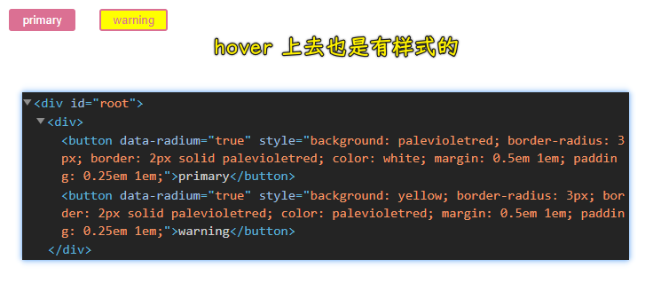

## ★总结

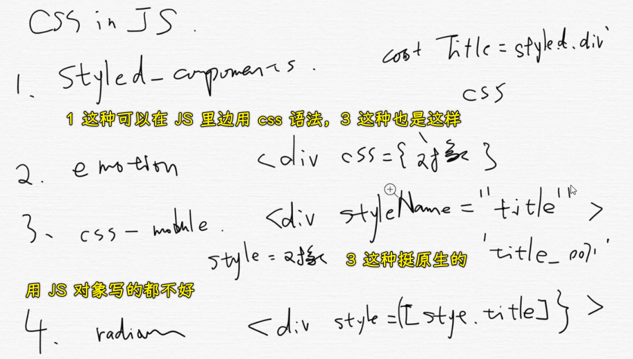

- 旧做法：样式内容分离
  - 加前缀 -> 需要自己想，很麻烦
  - 可以用 scss/less 等
- css in js
  - styled-component：可以在 JS 里边用 css 语法
  - css-module：像旧做法一样，但可以模块化的使用局部`class`
  - 不推荐使用写对象的方式写样式
  - 注意，看这个方案是否支持伪类……

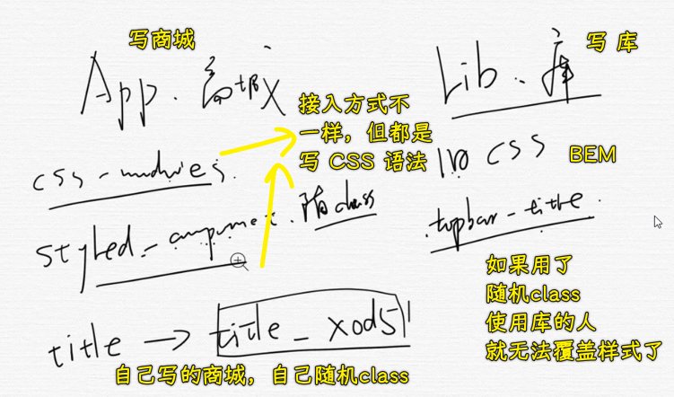

## ★了解更多

➹：[CSS in JS 简介 - 阮一峰的网络日志](https://www.ruanyifeng.com/blog/2017/04/css_in_js.html)

➹：[如何在 React 中运用 CSS？ - 知乎](https://www.zhihu.com/question/30757566)

➹：[css in js 趋势有哪些比较明朗的方案？ - 知乎](https://www.zhihu.com/question/38388076/answers/updated)

➹：[React - 让组件注入 style - 知乎](https://zhuanlan.zhihu.com/p/341790468)

➹：[React 系列十一 - React 中的 CSS - 知乎](https://zhuanlan.zhihu.com/p/156806997)

➹：[精读《请停止 css-in-js 的行为》 - 知乎](https://zhuanlan.zhihu.com/p/26878157)

➹：[CSS-in-JS：一个充满争议的技术方案 - 知乎](https://zhuanlan.zhihu.com/p/165089496)
