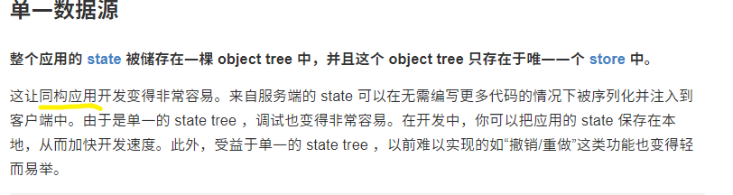

## ★Q&A

1）同构应用是什么？

问题缘由：[文档](https://cn.redux.js.org/docs/introduction/ThreePrinciples.html#%E5%8D%95%E4%B8%80%E6%95%B0%E6%8D%AE%E6%BA%90)



简单来说：

同构是共同构建，首屏后端渲染，后面的是前端渲染。如果你用过 next.js 就明白了，只要你请求一个页面，那就是后端渲染的，但如果你是前端路由跳转渲染页面，那就直接是前端渲染了！

具体点来说：

前后端同构就是 SSR 的一种实现方式

同构的概念最早是 angular2 在 beat 版中提出来的 (2016 年）， 那时叫 angular isomorphism，是一个类似于草案的策略， 是为了解决 angular 1.x 时代的** SPA 首屏慢及 SEO 问题**而提出的。

同构的核心理念是「客户端」与「服务端」共用一套渲染代码， 客户端自然是 javascript 的， 服务端使用可以识别 javascript 的引擎。 比如：

* 前端 react/vue/angular2+ 配合后端 node.js
* 前端 react/vue/angular2 配合后端 java(Nashorn)

其他的入 python/.net/go 都有自己各自的方案。

对比其它的：

再来说说 PHP/JSP/ASP 的 SSR， 类似这种的渲染统称为模版引擎渲染。是任何一门 WEB 开发技术栈必须支持的技术， 也是最早期动态网站的根本技术。

当然现在已经有更多功能更丰富的模版引擎了。 比如：

Java 体系下的

* thymleaf
* freemarker
* velocity

Nodejs 体系下的

* mustache
* handlebars
* doT
* ejs
* numjucks
* underscore（惊不惊喜？)
* pug
* marko
* jade
* jsrender
* jquery template（意不意外？)

其实， 相对于同构 SSR， 模版引擎渲染才是 WEB 的主流。同构 SSR 虽然有诸多好处， 但是上手难度还是挺大的， 需要一个横跨前后端的人来做统筹， 目前来说依然算小众。


> 此项目就是一个 React 同构实现的， 后台通过 RPC 接到 Java， 主要功能就是 SSR

从零开始从头到尾自己纯手搭建就算一个老手也要一周才能完成。利用各种脚手架工具会快很多， 但是可定制化程度较低， 可优化程度也较低。（如果有高手有更好的办法， 可以分享一下。)

最后再来说说提出了前后端同构概念的 angular。**angular isomorphism** 项目在 angular 2.0 正式发布之后改名叫： angular universal。 目前是前端知名的**高开低走**的项目， 并不算成功。

➹：[前端同构应用和 SSR 有什么区别？ - 叛逆的回答 - 知乎](https://www.zhihu.com/question/379831174/answer/1087241315)

➹：[大前端进阶-同构应用 - SegmentFault 思否](https://segmentfault.com/a/1190000023881923)

➹：[魅族官网基于 next.js 重构实践总结与分享 - 知乎](https://zhuanlan.zhihu.com/p/113853235)

2）竞态条件（race condition or race hazard）？

初始状况：


先执行线程 2：


文件就会被加载

但，如果线程 1 先执行呢？


那就会 `log` 一个错误，说明该文件不存在！

这两种情况的发生就是因为「竞态条件」！

许多 JavaScript 开发人员都遇到了这种竞态条件，即使是在单线程代码中也是如此。你甚至都不需要理解任何关于多线程的东西就可以知道为什么这是一个「race」。

当然，有些竞态条件在单线程代码中是不可能的，但是当您使用多个线程编程并且这些**线程共享内存**时，就会发生这种情况。

> 两个线程都在「竞赛」地访问/更改数据 -> 如果 A 第一名，那么皆大欢喜，但如果 B 第一名，那就大家都不好了！ -> 总之，谁跑第一，取决于线程调度算法！

为了防止出现「race condition」，我们通常会在共享数据周围设置一个锁，以确保一次只有一个线程可以访问数据！

不加锁：

``` js
if (x == 5) // The "Check"
{
  y = x * 2; // The "Act"

  // If another thread changed x in between "if (x == 5)" and "y = x * 2" above,
  // y will not be equal to 10.
}
```

加锁：

``` js
// Obtain lock for x
if (x == 5) {
  y = x * 2; // Now, nothing can change x until the lock is released. 
  // Therefore y = 10
}
// release lock for x
```

> Redux 为啥不让组件自己改全局状态而是交给 Reducer？因为改了的话，其它组件都会发生不可预知的错误了……

➹：[Avoiding race conditions in SharedArrayBuffers with Atomics - Mozilla Hacks - the Web developer blog](https://hacks.mozilla.org/2017/06/avoiding-race-conditions-in-sharedarraybuffers-with-atomics/)

➹：[multithreading - What is a race condition? - Stack Overflow](https://stackoverflow.com/questions/34510/what-is-a-race-condition)

3）写 React 不用 Redux 行吗？

可以！

➹：[除 Redux 外，目前还有哪些状态管理解决方案？ - 知乎](https://www.zhihu.com/question/63726609/answers/updated)

4）取余和取模？

概述：

取模运算 (mod) 和取余运算 (rem) 两个概念有重叠的部分，但又不完全一致；主要区别在于**对负整数进行除法运算时操作不同**。取模主要是用于计算机术语中；取余则更多是数学概念。

取模 vs 取余：

- 取余运算 在计算商值时 商值向 0 方向舍入；靠近 0 原则
- 取模运算 在计算商值时 商值向负无穷方向舍入；尽可能让商值小的原则（不超多商值的最大值）

计算步骤：

假设有整数 a 和 b（可以是负整数），那么取模/取余运算可以分为两步运算：

1. 求整数商：`c = a/b`;
2. 计算模/余数：`r = a - (c*b)`;
3. 总计算模/余数：`a mod b = a - b[a/b]` (`[a/b]`表示整数商）

例子：

取模：

| 简述           | 商值                          |                    | 取模值 |
| -------------- | ----------------------------- | ------------------ | ------ |
| 5 mod 3 = 2    | 5/3 = 1.66  商取小原则  商=1  | 5 - 3 * 1 = 2      | 2      |
| -5 mod 3 = 1   | -5/3 = -1.66 商取小原则 商=-2 | -5 - (3 * -2) = 1  | 1      |
| 5 mod -3 = -1  | 5/-3 = -1.66 商取小原则 商=-2 | 5 - (-3 * -2) = -1 | -1     |
| -5 mod -3 = -2 | -5/-3 = 1.66 商取小原则 商=1  | -5 - (-3 * 1) = -2 | -2     |

取余

| 简述           | 商值                         |                     | 取余值 |
| -------------- | ---------------------------- | ------------------- | ------ |
| 5 rem 3 = 2    | 5/3 = 1.66  商靠 0 原则  商=1  | 5 - 3 * 1  = 2      | 2      |
| -5 rem 3 = -2  | -5/3 = -1.66 商靠 0 原则 商=-1 | -5 - (3 * -1) = - 2 | -2     |
| 5 rem -3 = 2   | 5/-3 = -1.66 商靠 0 原则 商=-1 | 5 - (-3 * -1) =  2  | 2      |
| -5 rem -3 = -2 | -5/-3 = 1.66 商靠 0 原则 商=1  | -5 - (-3 * 1) = - 2 | -2     |

java 中 % 是取余运算；Python 中 % 是取模运算

💡：模的理解

“模”是指一个计量系统的计数范围；如时钟，12 个整点为计算范围，则模为 12；计算机也是一个计量机器，模为 32 位或者 64 位；

32 位计算机正常理解 在模 范围内能表达的 有 `[0, 2³²-1]`；那么负数该怎么表达呢，所以出现了补码；也就是 正数 + 负数 正好达到模的溢出阀值 `2³²`；所以在计算机中负数是用补码方式表达的原因；

关于补码的例子：在 12 模的时钟中；假设当前时针指向 10 点，而准确时间是 6 点，调整时间可有以下两种拨法

1. 倒拨 4 小时，即：`10-4=6` ->  `(10-4) mod 12 = 6`
2. 顺拨 8 小时：`10+8=12+6=6` -> `(10+8) mod 12 = 6`

在以 12 模的系统中，加 8 和减 4 效果是一样的；因此凡是减 4 运算，都可以用加 8 来代替。对“模”而言，8 和 4 互为补数。实际上以 12 模的系统中 11 和 1、10 和 2、9 和 3、7 和 5、6 和 6 都有这个特性；**共同的特点是两者相加等于模**

“取模”实质上是计量器产生“溢出”的量，它的值在计量器上表示不出来，计量器上只能表示出模的余数（取模）；任何有模的计量器，均可化为加减法运算

`5 mod 3 = 2` 例子中；模 为 3；2 为取模的值

💡：计算机中取模应用思想

取模的本质是：取模的值，必定会模的范围内；所以，计算机领域引用该特性，使元素路由算法不超出边界，并有规则存放。

首先确定模（范围）；元素取模，使元素有规则的落入模的范围内容器中

如：hashMap、数据库分表、分布式节点路由算法等

➹：[取模运算理解 - 简书](https://www.jianshu.com/p/5e1a83e8be3b)

➹：[原码, 反码, 补码 详解 - ziqiu.zhang - 博客园](https://www.cnblogs.com/zhangziqiu/archive/2011/03/30/ComputerCode.html)

➹：[大神们可不可以讲一下取模是什么意思？最好比如一下，本人数学没学好 - 知乎](https://zhuanlan.zhihu.com/p/103762122)

➹：[编程语言中，取余和取模的区别到底是什么？ - 知乎](https://www.zhihu.com/question/30526656)