### ✍️ Tangxt ⏳ 2021-02-17 🏷️ 页面

# 01-环境准备&启动前端

## ★环境准备

要安装的工具：

* VS Code：写代码
* Node：最新版
* Postman：调试请求接口，看看能否正常的拿到后台响应回来的数据
* Git：版本管理，回顾自己做了什么
* React devTools（查看组件嵌套结构）、Redux devTools（查看 State、Action）

要安装的 VS Code 插件：

* Auto Rename Tag：改开标签时，自动同步修改闭标签
* Bracket Pair Colorizer：颜色区分那些代码嵌套很深的`(){}...`
* ES7 React/Redux/React-Native/JS snippets：提供了很多快捷的语法
  + rafce -> 这个快捷方式经常用到 -> 创建一个函数组件然后导出去
* JavaScript (ES6) code snippets：快捷键输入代码
* Prettier - Code formatter：自动格式化，防止代码混乱

接下来，要了解的是这个应用的前端的初始化内容

## ★创建 react 脚手架

安装：

``` bash
mkdir ms-react-mobile-shop
cd ms-react-mobile-shop
mkdir frontend
cd frontend
yarn create react-app .
```

💡：关闭 `eslint` 的提示？

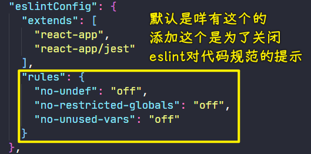

💡：React 应用是单页面应用？

只有一个主页面的应用，只需要在主页面里边一次性加载 JS 和 CSS 等这些资源就行了！

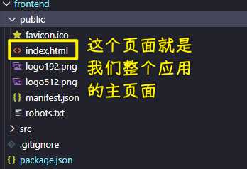

➹：[前端：你要懂的单页面应用和多页面应用](https://juejin.cn/post/6844903512107663368)

💡：根标签和根组件？

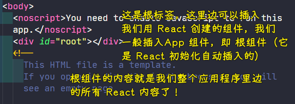

💡： `index.js` 是入口文件？

`App` 组件就是从这里开始被插入到主页面的！

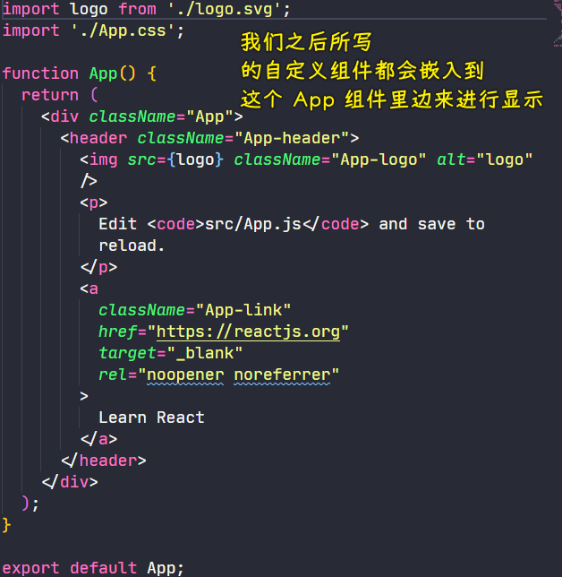

💡：为什么叫 `className` ？

因为在 JS 里边， `class` 是关键字！

同样，我们可以 `<label for="test">Test</label>` ，但在 JSX 里边只能用 `htmlFor`

➹：[reactjs - React ignores 'for' attribute of the label element - Stack Overflow](https://stackoverflow.com/questions/22752116/react-ignores-for-attribute-of-the-label-element)

💡：第三方库可以自定义设置每个页面的 `title` 内容？

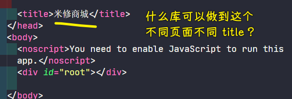

等项目完成后，才去设置！目前直接文本展示就好了！

💡：不想添加额外的节点？

我们知道写多个元素的时候，需要套一个元素（如 `div` ）包裹住它们，但是我们就是不想这个 `div` 元素渲染到页面里边……

语法：

``` jsx
<React.Fragment></React.Fragment>
```

用短语法来声明 Fragments：

``` jsx
<></>
```

这种语法它不支持 `key` 或属性！

➹：[Fragments – React](https://zh-hans.reactjs.org/docs/fragments.html)

💡：敏感数据不上传？

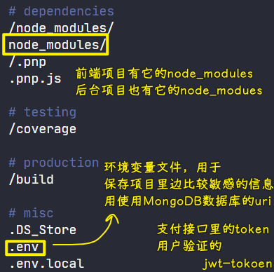

忽略 `.env` 文件 -> 这些敏感数据可不能供人家去参考和下载！

一些例子：

``` 

# 本行为注释
.idea/          # 忽略仓库中所有。idea 目录
/.idea/         # 忽略仓库中根目录下的。idea 目录
/.settings      # 忽略仓库中根目录下的 .settings 文件或目录
~'$'*.docx      # office 打开时生成的临时文件

!etc/eclipse/.checkstyle    # 不忽略 .checkstyle 文件或目录
```

其它例子：

``` 

*.a                    # 所有以 '.a' 为后缀的文件都屏蔽掉
# Office 缓存文件
~'$'*.docx
~'$'*.ppt
~'$'*.pptx 
~'$'*.xls

tags                   # 仓库中所有名为 tags 的文件都屏蔽
core.*                 # 仓库中所有以 'core.' 开头的文件都屏蔽

tools/                # 屏蔽目录 tools
log/*                  # 屏蔽目录 log 下的所有文件，但不屏蔽 log 目录本身

/log.log               # 只屏蔽仓库根目录下的 log.log 文件，其他目录中的不屏蔽
readme.md       # 屏蔽仓库中所有名为 readme.md 的文件
!/readme.md     # 在上一条屏蔽规则的条件下，不屏蔽仓库根目录下的 readme.md 文件
```

> 最后两条的顺序很重要，必须要先屏蔽所有的，然后才建立特殊不屏蔽的规则！

➹：[gitignore 规则 - SegmentFault 思否](https://segmentfault.com/a/1190000017138049)

---

Next：创建页面的主体结构，如 Header、Footer……

## ★创建 header 和 footer

💡：如何把这个图标换了？

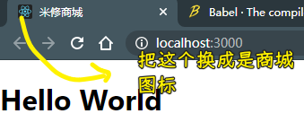

做法：

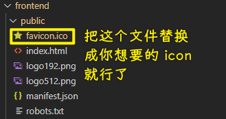

💡：文件目录？

* components：放的是通用组件，如 Header、Footer、评分组件等
* screens：放的是单独某个页面组件，如登录页面、管理页面……

💡：创建一个组件？

在 React 里边，组件的创建，也就是文件的创建，得是首字母大写的，如 `Header.js` -> 这是一个约定俗成的规定！

使用快捷的方式创建组件的结构：

* rcc -> 创建一个可以导出的类组件 
* rafc -> 创建函数组件，没有默认输出
* rafce -> 默认输出的函数组件

自动导入 `import` ：

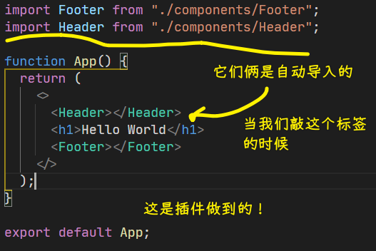

💡：使用 boostrap 搞样式？

文档：[React-Bootstrap · React-Bootstrap Documentation](https://react-bootstrap.github.io/)

React Bootstrap：最流行的前端框架，使用 React 重构了！

有了这个框架，那我们在开发的过程中，那就**有更多的精力放在项目的功能实现**上了，而样式就不必过于关注了！

``` bash
npm install react-bootstrap bootstrap
```

> 视频里没有装 `bootstrap`

当然，还可以使用其它库来实现组件的样式！

除了使用 React Bootstrap 提供的组件样式，我们还可以使用 BootSwatch 提供的主题样式！

文档：[Bootswatch: Free themes for Bootstrap](https://bootswatch.com/)

它是基于 BootStrap 开发的 UI 主题！

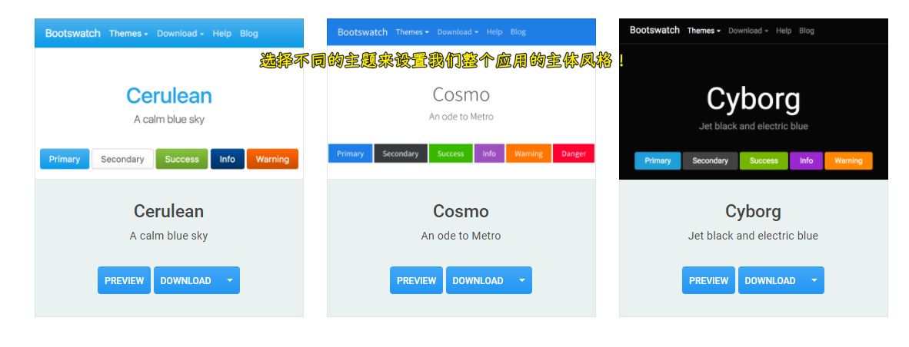

课程选的是 **Lux** 这个主题！

我选的是 **Flatly**：

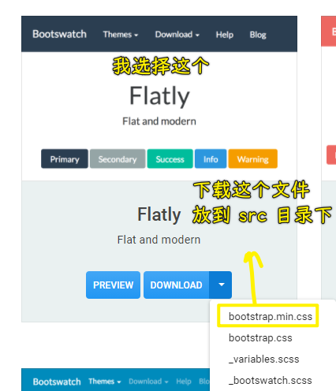

在项目中引入：

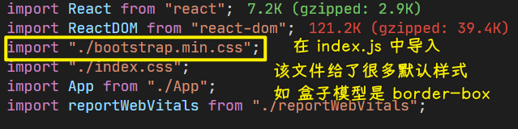

💡：组件使用？

Grid 布局：

API：[React-Bootstrap · React-Bootstrap Documentation](https://react-bootstrap.github.io/layout/grid/#row-props)

1. `Container`：可以让嵌套的内容居中，而且是响应式的！
2. `Row`
3. `Col`

Navbars（头部导航栏）：

文档：[React-Bootstrap · React-Bootstrap Documentation](https://react-bootstrap.github.io/components/navbar/#navbars)

``` jsx
<Navbar bg="light" expand="lg">
  <Navbar.Brand href="#home">React-Bootstrap</Navbar.Brand>
  <Navbar.Toggle aria-controls="basic-navbar-nav" />
  <Navbar.Collapse id="basic-navbar-nav">
    <Nav className="mr-auto">
      <Nav.Link href="#home">Home</Nav.Link>
      <Nav.Link href="#link">Link</Nav.Link>
      <NavDropdown title="Dropdown" id="basic-nav-dropdown">
        <NavDropdown.Item href="#action/3.1">Action</NavDropdown.Item>
        <NavDropdown.Item href="#action/3.2">Another action</NavDropdown.Item>
        <NavDropdown.Item href="#action/3.3">Something</NavDropdown.Item>
        <NavDropdown.Divider />
        <NavDropdown.Item href="#action/3.4">Separated link</NavDropdown.Item>
      </NavDropdown>
    </Nav>
    <Form inline>
      <FormControl type="text" placeholder="Search" className="mr-sm-2" />
      <Button variant="outline-success">Search</Button>
    </Form>
  </Navbar.Collapse>
</Navbar>
```

把一些不要的组件去掉，如下拉框等：

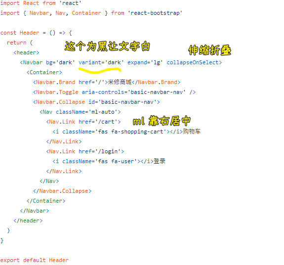

💡： `py-3` 是什么意思？

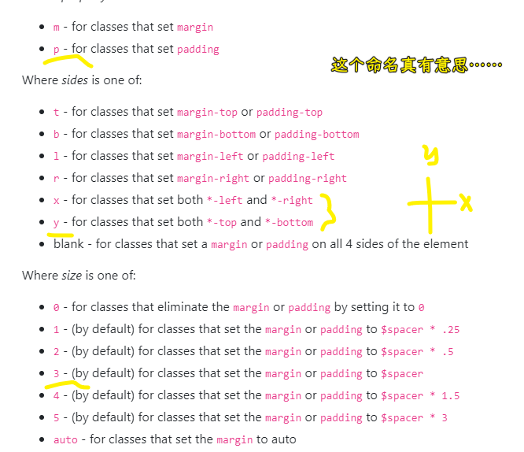

➹：[Spacing · Bootstrap](https://getbootstrap.com/docs/4.4/utilities/spacing/)

💡：老师把路由切换出来的界面叫 `screen`

如点击购物车，会得到一个购物车界面……

💡：添加图标？

库地址：[font-awesome - Libraries - cdnjs - The #1 free and open source CDN built to make life easier for developers](https://cdnjs.com/libraries/font-awesome)

使用：

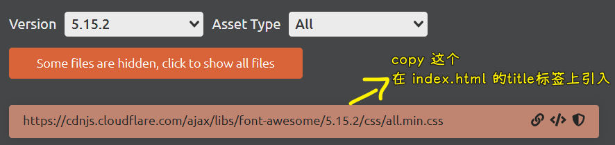

代码：

``` jsx
<Nav.Link href="/cart">
  <i className="fas fa-shopping-cart px-1"></i>购物车
</Nav.Link>
<Nav.Link href="/login">
  <i className="fas fa-user px-1"></i>登录
</Nav.Link>
```

---

Next：数据是来于本地的 `json` 文件，之后再逐步把数据的获取换成是从数据库里边获取！

## ★创建主页页面

> 创建 HomeScreen 组件


💡： `col-md-4` 是什么意思？

* xs=额外的小屏幕（移动电话）`≥ 576px`
* SM=小屏幕（平板）`≥ 768px`
* Md=中等屏幕（一些桌面）`≥ 992px`
* LG=大屏幕（其余桌面）`≥ 1200px`

如果 `< 576px` ，那么每一列的宽度就是 `100%`

`4` 的意思是，一行（满屏宽的行），有 `3` 列，为啥是啥 `3` 列呢？因为一行是以 12 列来划分的，而 `4` 就是一行里边占了 4 份！

➹：[bootstrap 中的 col-md-4、col-xs-1、col-lg-2 中的数字的含义？ - 问答 - 云+社区 - 腾讯云](https://cloud.tencent.com/developer/ask/66334)

💡：遍历的时候需要加 `key` ？

➹：[javascript - Understanding unique keys for array children in React.js - Stack Overflow](https://stackoverflow.com/questions/28329382/understanding-unique-keys-for-array-children-in-react-js)

💡：你是如何看待 `HomeScreen` 组件的？

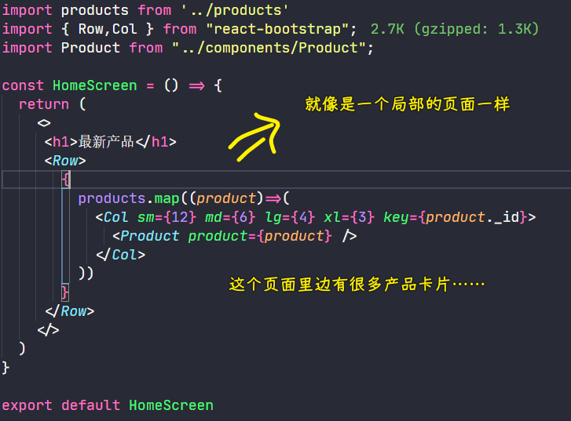

Vue 里边用 `v-for` ，而 React 则是 `map` ！

> `sm={12} md={6} lg={4} xl={3}` 这个表示，sm 时，就是单列，即占满一行！ `md` 时，两列； `lg` 时，三列； `xl` 时，四列！

💡：为啥要用 `Product` 组件？

因为这个 `HomeScreen` 页面里边出现了重复的元素啊！

重复利用的组件保存在 `components` 里边！

💡： `Card.Text` 的 `as` 属性？

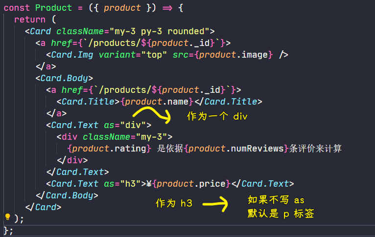

💡：用了 Bootstrap 给我的感觉？

不用写样式了，直接写 `class` 就行了！

常用的 `class` ： `my-3 py-3 rounded1`

---

Next：评分组件带星星，而不是用文本，这样一来就更人性化一些了！

## ★创建评分组件

> 每个产品卡片都会用到五个星星，所以把这五个星星抽象成评分组件！

💡：关于 icon ，fas、far、fal 的区别？

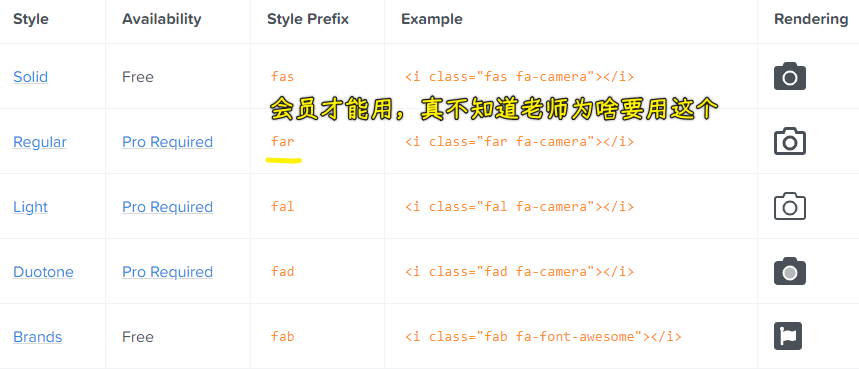

➹：[Basic Use - Font Awesome](https://fontawesome.com/how-to-use/on-the-web/referencing-icons/basic-use)

➹：[Upgrading from Version 4 - Font Awesome](https://fontawesome.com/how-to-use/on-the-web/setup/upgrading-from-version-4)

💡：如何写一个评分组件？

1. 确定 API：value、text、color
2. value 属性控制全星、半星、空星 -> 只有三种状态，没有`3/4`颗星这样的！

➹：[Star Half Alt Icon - Font Awesome](https://fontawesome.com/icons/star-half-alt?style=solid)

💡：解析？

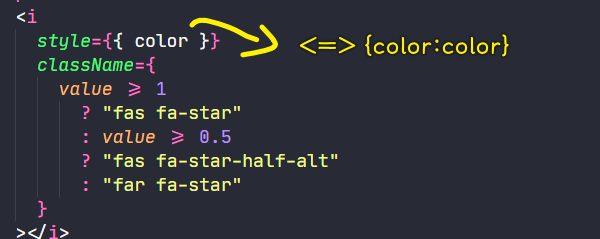

💡：我不想传 `color` 属性给 `Rating` 组件？

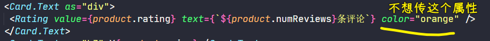

``` js
Rating.defaultProps = {
  color: '#f8e825',
}
```

父组件咩有传 `color` 属性的话，那么子组件拿到的 `color` 值就是上边这个默认值了！

💡：xx 存在，就显示 xx？

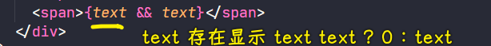

很好奇为啥评分组件要包含评论数！

或许是因为，评分是根据评论数平均出来的！

💡：父组件居然传了一个布尔值过来给评分组件？

我们需要引入属性类型，这样就能限制传给 `Rating` 的属性类型了

``` js
import propTypes from 'prop-types'
Rating.propTypes = {
  value: propTypes.number.isRequired,
  text: propTypes.string.isRequired,
  color: propTypes.string,
}
```

前两个属性是必须填的，后一个不是必须的！如果填错了类型，会在控制台报错，而页面还是正常显示，不会让页面凉凉！

💡：元素之间的间隔用 `rem` 单位？

``` css
h3 {
  padding: 1rem 0;
}

.rating span {
  margin: .1rem;
}
```

---

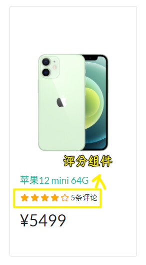

Next：路由切换

## ★实现 react 路由

文档：[React Router: Declarative Routing for React.js](https://reactrouter.com/web/guides/quick-start)、[react-bootstrap/react-router-bootstrap: Integration between React Router and React-Bootstrap](https://github.com/react-bootstrap/react-router-bootstrap)

有了这个 `react-router-bootstrap` ，我们可以这样：

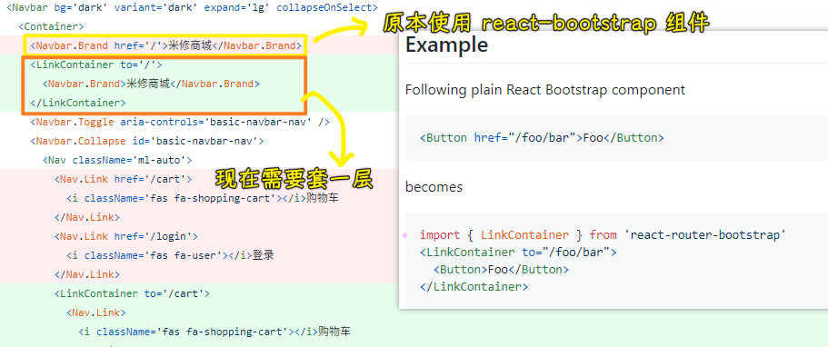

💡： `href` 与 `LinkContainer` 这种有啥区别？

`href` 姿势会刷新页面，而 `LinkContainer` 则不会刷新页面！

总之，原先的姿势会发起组件，而我们的 React 应用是单页面应用，显然我们不需要发起请求！不然，就是多页面应用了！

💡：路由切换的目的？


`main` 视图的切换：

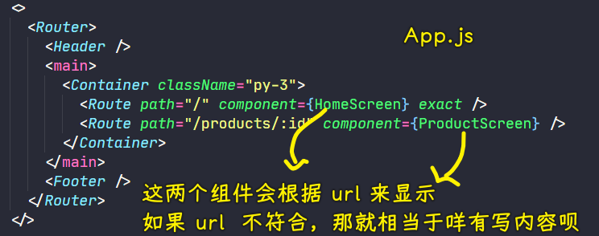

对于导航的跳转，也就是 `Header` 位置处，用的是 `LinkContainer` ，而对于产品组件，用的是 `Link` ！ -> 或许需要带参数吧！ -> 原因之一是因为这是用了 Bootstrap 组件，还有 `Link` 上的属性， `LinkContainer` 也能用！直接换一个标签就行了！

> `Router` 标签会包裹整个页面，这样才会识别 `Route` 对应组件的位置！

注意，千万不要写成这样：

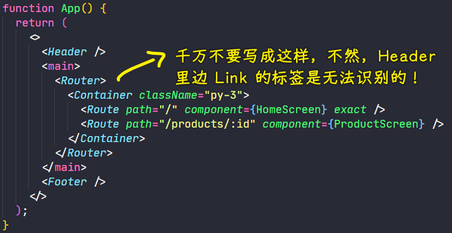

💡： `exact` 属性？

严格匹配 `/` ，以防路由 `/product/1` 这样，也会显示 `/` 的页面。

没有 `exact` 的情况：

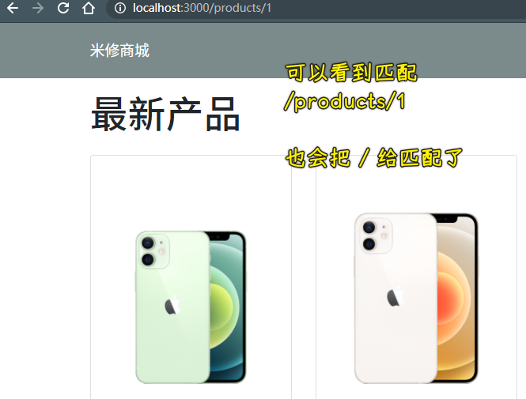

`exact` 这个属性表示绝对匹配路径，如果不是一模一样的路径，那就不会渲染对应的组件！

💡：写路由策略？

谁用到了，那就在哪个组件上写路由，如：

* App组件需要展示路由切换的视图
* 其它有需要跳转文本的组件！

➹：[【React-Router】exact 属性 与 Umi 路由下的 exact_Milk~每天分享一点点，技术进步一点点-CSDN博客](https://blog.csdn.net/weixin_43352901/article/details/109027458)

💡：URL 与 UI 同步？

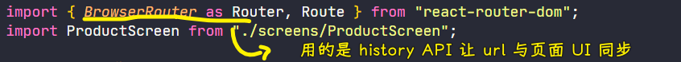

HashRouter用的比较少！

---

Next：实现单个产品界面，即 `ProductScreen`

## ★创建产品详情界面

效果：

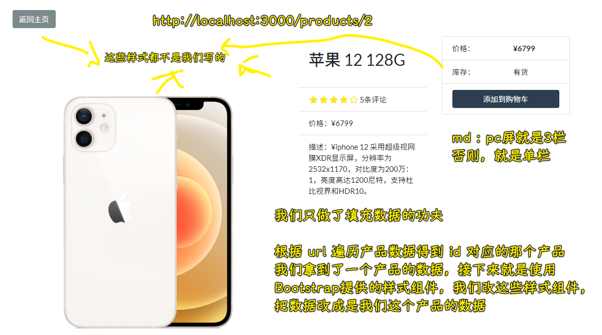

---

产品详情页，用于展示产品的更多内容！

💡： `fluid` ？

没有 `fluid` 的图片：

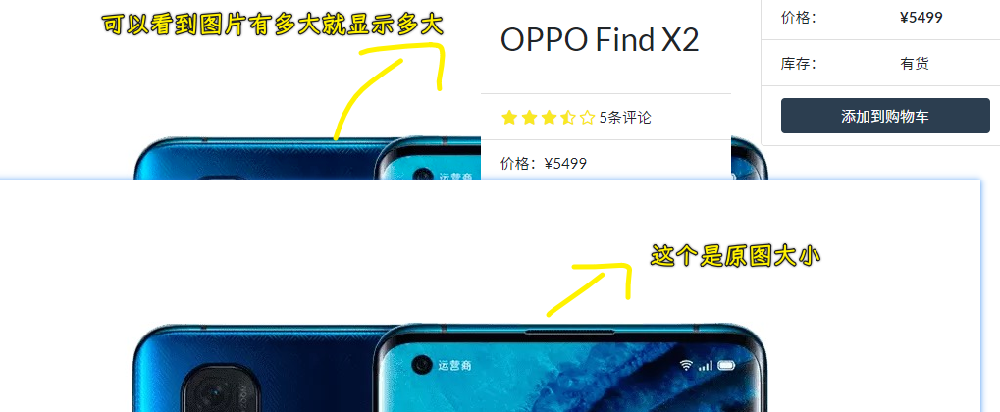

显然，这图片尺寸太大了，超出了我们想要的范围！

有了 `fluid` 的图片：

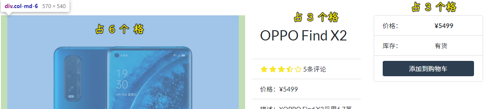

会有个自适应填充的效果，即这张图片是占 6 个格的，那么就在6个格这列里边自适应，而不是让图片溢出到其它列里边了！

`fluid` 属性的本质：

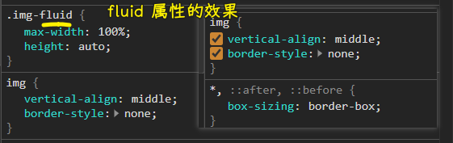

💡： `variant="flush"` ？

有它 vs 没它：

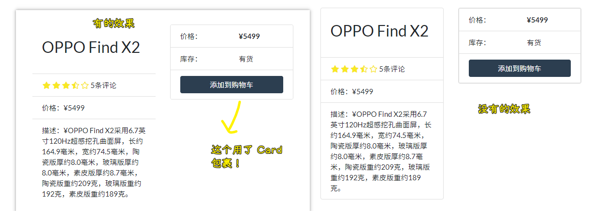

> `flush` ：脸红

总之， `flush` 值就是去掉外边框！ `Card` 组件有外边框，我们去掉内部的外边框就变细了！

💡：两种按钮样式写法？

``` jsx
<Link className="btn btn-dark my-3" to="/">
 返回主页
</Link>
<Button className="btn-block" type="button" disabled={product.countInStock===0}>
  添加到购物车
</Button>
```

前者是`a`标签，但看起来像是按钮，而后者是真正的`button`标签

效果：

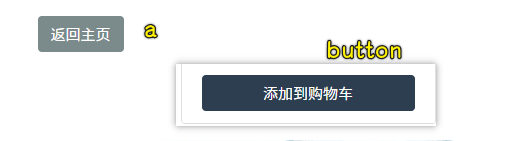

关于`button`的`type`属性：

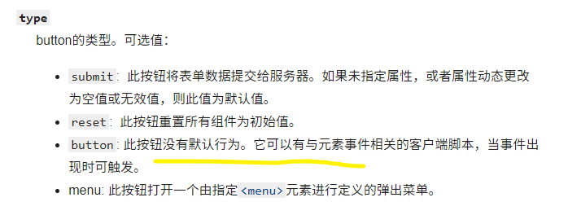

---

Next：后台创建，前后端交互，从后台里边拿到`products.js`（即发请求），而不是不发请求直接在本地读取一个数组！总之，我们要透过发请求拿到这个数组！


