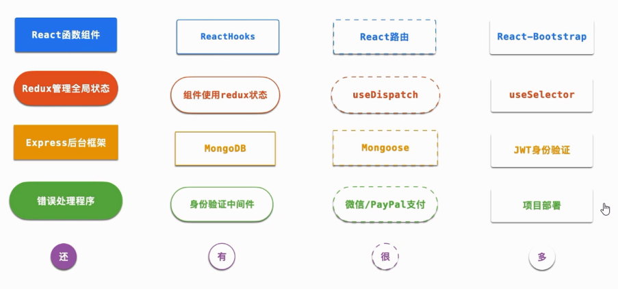
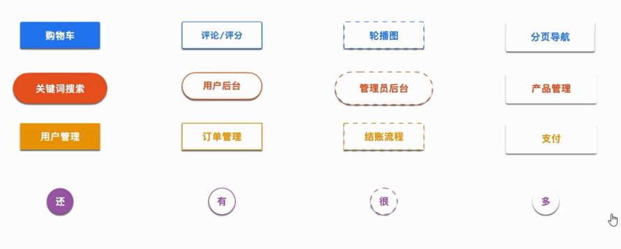
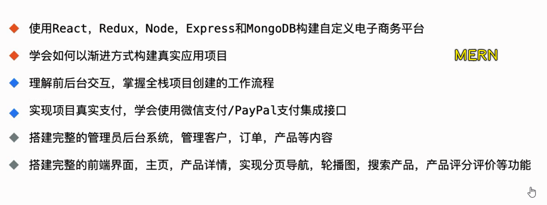

### ✍️ Tangxt ⏳ 2021-02-17 🏷️ 商城管理系统

# 02-React 商城管理系统（前台+后台）

- 教程：[React 商城管理系统（前台+后台）-学习视频教程-腾讯课堂](https://ke.qq.com/course/3135233)
- 常见问题：[FAQ](./faq.md)

## ★概述

使用 React，Redux，Express 和 MongoDB 从头开始构建商城管理平台，涵盖前台及后台管理员系统。

- 预览：[欢迎来到米修商城](http://ms-mobileshop.herokuapp.com/)
- 代码：[ms-online/ms-react-mobile-shop: MERN Project - mobile shop](https://github.com/ms-online/ms-react-mobile-shop)

1）会讲什么？

2）该程序应用会实现哪些主要功能？

3）我们会学到什么？

## ★目录

- [01-环境准备&启动前端](./01.md)
