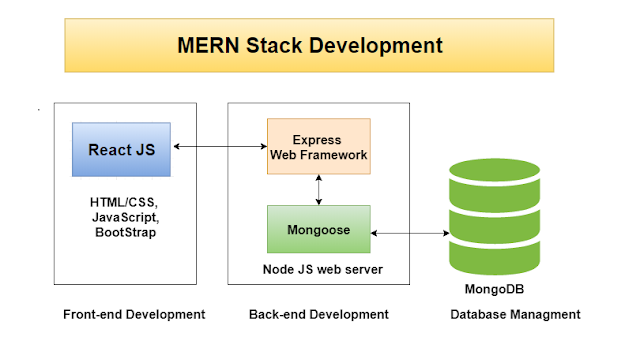
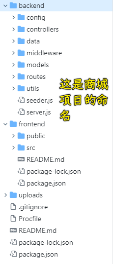
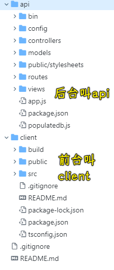

### ✍️ Tangxt ⏳ 2021-02-17 🏷️ FAQ

# FAQ

1）MERN 是什么？

MongoDB，Express，React，Node 的简写，使用 MERN，意味着我们所构建的高级 Web 应用程序，全部基于 JavaScript！

➹：[【译】使用 MongoDB，React，Node 和 Express（MERN）构建一个全栈应用 - SegmentFault 思否](https://segmentfault.com/a/1190000020086440)

➹：[What is MERN Stack?. Img Source : agileengine.com - by Blockchain Simplified - Medium](https://medium.com/@blockchain_simplified/what-is-mern-stack-9c867dbad302)

2）heroku 是什么？

是一个让你可以部署应用的云平台！

它的优点：

- 部署流程简单
- 给开发者提供了最多 5 个应用的免费创建

缺点：

- 国内访问慢

➹：[国内对 Heroku 这个平台评价怎样？ - 知乎](https://www.zhihu.com/question/19983570)

➹：[如何快速使用 Heroku 来部署你的 Laravel 应用 - Laravel China 社区](https://learnku.com/articles/2602/how-to-quickly-use-heroku-to-deploy-your-laravel-application)

3）关于项目的命名？

其它人的命名：

➹：[jokingzhang/express-locallibrary-tutorial: Express 教程: 本地图书馆网站 前后端分离版本](https://github.com/jokingzhang/express-locallibrary-tutorial)