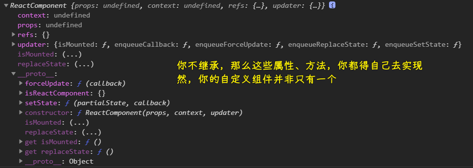

### ✍️ Tangxt ⏳ 2021-02-28 🏷️ 理论篇

# 01-理论篇

## ★准备工作

1）import、export

如果你在`x.js`文件里边用了`export default`导出一个东西，那么你在`y.js`文件使用这个东西得这样来：

``` js
import dada from './y.js'
```

如果你不用`defalut`导出：

``` js
export const o = {}
export function fn() {}
```

那么在导入的时候，你得这样：

``` js
import {o,fn} from './x.js'
```

2）const

为什么要用`const`声明？

``` jsx
const title = <h1>React Learning</h1>
```

因为用 JSX 创建的元素一般是不变的！ -> 内容可以变，但地址不变！

3）class

React 的旧版本创建类组件：

用`createClass`方法 -> 该 API 目前已移除，如果你非得使用它，请单独引入`create-react-class`这个包

新版本中，创建`class`组件，需要`extends React.Component` -> 复用`React.Component`的属性和方法 -> 为什么我们的子类明明没有写`props`，但却能够用它？ -> 那是因为我们继承了`React.Component`



> 我不太确定：组件实例调用了父类的`setState`方法 -> `setState`方法里边用到了子类的`state`属性 -> 这似乎是高阶类啊！

➹：[React.createClass 和 extends Component 的区别 - SegmentFault 思否](https://segmentfault.com/a/1190000005863630)

4）箭头函数

- 让你少写很多代码，如不用拼`function`
- 注意：箭头函数不是万能的，换言之，它不适合所有场景！

不用箭头函数：

``` jsx
<button onClick={this.handleClick.bind(this)}>Add</button>
```

> 以前的`createClass`姿势，不需要我们自己去绑定`this`，因为 React 已经默认帮我们把所有方法里边的`this`搞为组件实例了！而现在的`class`组件则需要我们自己去绑定！ -> 如果不绑定那么`handleClick`里边的`this`值就是`null/undefined`这样了！ -> 我以为是那个触发事件的元素……

用了箭头函数：

``` jsx
<button onClick={() => this.handleClick()}>Add</button>
```

少写了一些代码……

5）npm vs yarn

npm：

npm 是一个基于 nodejs 的 JavaScript **包管理工具**，全称叫做 node package manager，所谓的包呢，其实就是**可复用的代码**，每个人都可以把自己编写的代码库发布到 npm 的源，英文叫做 registry，上面呢进行管理，你也可以下载别人开发好的包，在你自己的应用当中使用

yarn：

- 会缓存已经下载过的包并做了一些其他方面的优化，速度要比 npm 快
- 添加了一些别的 npm 不具备的特性
- yarn 的官网及文档全部都有中文，对用户十分友好

6）快速搭建 React 开发环境

- codepen -> 国内用户用起来比较慢 -> 我们用笔来写代码！我们用 codepen 来写代码！
- <https://codepan.egoist.sh/boilerplate/react> -> 可以离线运行的单页应用
- React CDN
- create-react-app -> 脚手架
- webpack/babel 等 -> 自己完全地手工配置

## ★React

1）JSX

1、简介

- 长得和 HTML 很像甚至基本上看起来一样，但真得不是 HTML
- 它是 React 内部实现的一种，允许我们直接在 JS 里书写 UI 的方式
- JSX 已经是书写 UI 最高效还保持了良好可读性的一种实现了

2、实现原理

- 在浏览器里直接运行采用 JSX 语法的 JavaScript 是不行的！
- 利用 Babel 一类的转译器来将我们的 JSX 语法或者 ES6 语法转译成浏览器可以直接运行的 JavaScript

3、基本语法

💡：JSX 元素

``` jsx
// 用 JSX 创建的元素对象一般来说是不变的
const title = <h1>React Learning</h1>;

// 将 JSX 元素渲染成 DOM 的方法
ReactDOM.render(title,document.getElementById('root'))
```

💡：JSX 属性

支持的属性：[DOM 元素 – React](https://zh-hans.reactjs.org/docs/dom-elements.html#all-supported-html-attributes)

💡：JSX 嵌套

- 像 HTML 那样嵌套
- 一般有嵌套解构的 JSX 元素外面，我们习惯于为它加上一个小括号`()`
- 注意：JSX 在嵌套时，**最外层有且只能有一个标签**，否则就会出错

💡：JSX 表达式

- 在 JSX 元素中，我们**同样可以**使用 JavaScript 表达式，在 JSX 当中的表达式需要用一个大括号括起来`{}`

2）组件类型

