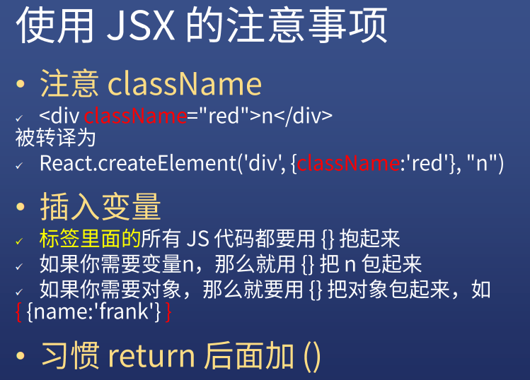
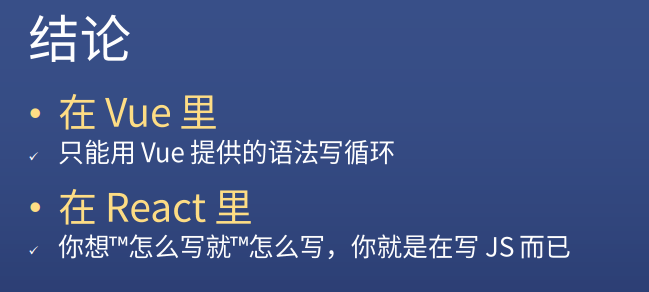

### ✍️ Tangxt ⏳ 2021-03-12 🏷️ React

# 01-React 起手式

## ★如何引入 React

1. CDN 引入 -> 不推荐使用

   1. 引入 react 和 react-dom -> bootcdn（用 `min` 版的） -> **注意引入顺序**
   2. cjs vs umd

      1. cjs -> CommonJS -> Node.js 支持的模块规范
      2. umd -> 统一模块定义，兼容各种模块规范，如浏览器
      3. 理论上优先使用 umd，因为它同时支持 Node.js 和浏览器
      4. 目前，最新的模块规范是使用 `import` 和 `export` 关键字 -> 这个规范浏览器和 Node.js 都支持（需注意它们的版本 -> 低版本不支持这个模块规范）
2. webpack/rollup 引入 -> 老手使用

   1. 自己搭架子 -> 安装包 -> `import` 导入包
   2. 注意命名 -> 包名是小写的，如 `react、react-dom` ，那么导入使用时就是 `React、ReactDOM` 了！
   3. 其它构建工具，rollup、parcel，也支持这样做！

3. create-react-app 引入 -> 新手使用

   1. `yarn global add create-react-app`

   2. `create-react-app xxx` or `create-react-app .` （把当前目录作为项目名）
   3. 把无用的文件删掉 -> 留下一个 `index.js` 即可！

## ★React 初体验

### <mark>1）点击 `+1` 为啥不更新页面？</mark>

为什么 click `+1` button，不会让 `0` 渲染成 `1` ？


究其原因是因为： `App = React.create...` 只执行了一次

什么意思？

就是 `[n,React.createElement()]` 这个 `n` 已经被求值，它就是一个 `0`

当我们 click 的时候，改变了全局 `n` 的值，然后再次 `ReactDOM.render(App,...)` -> 此时的 `App` 里所谓的 `n` 是 `0` 呀！

**第一次 vDOM 和 第二次 vDOM 的对比** -> 发现咩有任何变化，所以页面就不更新咯！

如何解决这个问题？

借用「6 个 6」这个面试题例子，来探讨一下如何解决这个问题

### <mark>2）6 个 6</mark>

#### <mark>1、打印 6 个 6</mark>

``` js
let i
for (i = 0; i < 6; i++) {
  setTimeout(() => console.log(i), 1000)
}
//6 个 6
```

`setTimeout(fn,1000)` 的意思 -> 1s 后，请**尽快**执行 `fn`

啥意思？ -> 你妈说「10 分钟后就吃饭」，10 分钟到了，结果你
还在那儿磨叽，磨叽完了，你才去吃饭……

简单来说，就是 `1s` 之内， `fn` 是不会执行的，而 `1s` 过后，也许是刚好 1s 掐点执行，也许是 1.5s 执行，总之，这得看 JS 引擎是否还在执行同步任务哈！或者任务队列里边还有其它任务在排队……

回到代码本身，为啥打印的是「6 个 6」？

因为循环 6 遍后，全局变量 `i` 是 `6` 了！ -> 函数（ `fn` ）在执行时，才会计算里边的变量的值（ `i` ）

#### <mark>2、打印 0-5</mark>

姿势 1：把变量 `i` 赋值给 `j`

``` js
let i
for (i = 0; i < 6; i++) {
  let j = i
  setTimeout(console.log(j), 1000)
}
//0,1,2,3,4,5
```

在 `for(){}` 的 `{}` 里边用 `let` 声明的变量 `j` 是有作用域的！每次循环都会产生一个新的作用域：


姿势 2：语法糖——简化把 `i` 赋值给 `j` 这个操作

``` js
for (let i = 0; i < 6; i++) {
  setTimeout(console.log(i), 1000)
}
//0,1,2,3,4,5
```

浏览器底层帮我们做了赋值操作！这样有少写了一些代码！而且这个 `i` 还是局部变量！

姿势 3：IIFE

``` js
let i
for (i = 0; i < 6; i++) {
  ! function(j) {
    setTimeout(console.log(j), 1000)
  }(i)
}
//0,1,2,3,4,5
```

IIFE 一执行， `fn` 与局部变量 `j` 构成闭包！ -> 即 `j` 不会被销毁释放

姿势 4：IIFE 绕人版

``` js
for (var i = 0; i < 6; i++) {
  ! function(i) {
    setTimeout(() => console.log(i), 1000)
  }(i)
}
//0,1,2,3,4,5
```

这个姿势与姿势 3 没哈本质区别，无非就是把形参换了个名字罢了！

## ★函数与延迟执行

### <mark>1）普通代码 vs 函数</mark>


``` js
let a = 1
let b = 1 + a //这是普通代码

let f = () => 1 + a
a = 4
console.log(`普通代码的 b 的值${b}, 函数的 b 的值${f()}`) //普通代码的 b 的值 2, 函数的 b 的值 5
```

`f` 被调用后才知道它的返回值是多少 -> 薛定谔的 `a`

而普通代码则是先爽了再说 -> 把 `a` 求出来再说

### <mark>2）React 元素 vs 函数组件</mark>


* `React.createElement('div', null, n)`直接执行
* `()=>React.createment('div', null, n)`里边的`React.createment('div', null, n)`延迟执行

至此我们知道：


所以，点击 `+1` 更新页面代码是：


> 把 App 搞成是一个返回 React 元素的函数就行了

目前这个代码很丑 -> 需要用 React 提供的 API 去构建 vDOM 结构 -> 比 Vue 的写法复杂多了！（Vue 的单文件组件，写个 `template` ，像写 HTML 一样写 DOM 结构）

> 在 React 代码 里边，用 `React.createElement()` 就是在构建虚拟 DOM，那 Vue 就是在用 `template` 构建虚拟 DOM 咯？ -> 我们写的代码，就没用过 DOM API 去构建真实 DOM！

💡：测试 -> 在页面上修改 `button` 的内容，vDOM 是否因此而改变？

不会额……


我把 `'+1'` 改成是变量 `n` ，我在页面上改按钮的值为 `666` ，结果下次点击 `666` 变为 `n` 的真实值了！

总之，React 只更新改变的内容，没有改变的内容不更新（**一般都是用到变量的地方**）。还有用开发者工具直接改页面的内容是不会影响到 vDOM 的！

## ★JSX 初体验

### <mark>1）概述</mark>

* X 表示扩展 -> 所以 JSX 就是 JS 扩展版
* 为什么会有它？ -> 弥补 React 代码太丑（`React.createElement`）而发明的一种语言

### <mark>2）Vue 的 vue-loader vs React 的 JSX</mark>


> 我们只需要配置 babel-loader 就行了，不需要自己手动安装一个 jsx-loader

### <mark>3）使用 JSX</mark>

#### <mark>1、姿势 1（不推荐）</mark>


JSX 写法解析：

- `div`外面加上`()`，不然就是`return undefined`了，毕竟这是多行代码了！
- `<div>`相当于是`React.createElement('div')`
- 写`class`属性得写成`className` -> 这不是在写 HTML 啊！
- 使用变量、表达式、函数就写到`{}`里边
- `App`即函数组件 -> 可以直接用组件标签`<App />` -> 相当于是`React.createElement(App)`（`createElement`内部会调用`App`以此来返回 React 元素） -> 等价于`ReactDOM.render(App(),...)`

原理：

把浏览器不认识的 babel 代码翻译成浏览器认识的 JS 代码，然后把 JS 代码放到页面里代替之前不认识


忠告：


#### <mark>2、姿势 2、3</mark>


> JSX-loader 是 babel-loader 的一个插件，它可以翻译 JSX

> [facebook/create-react-app: Set up a modern web app by running one command.](https://github.com/facebook/create-react-app)

使用构建工具搭建出来的项目，可以直接在 js 文件里边写 JSX 代码了！

> 注意：你用了 JSX 语法，那么你还是得引入`React`的，因为 JSX 被编译的结果就是 `React.createElement()`，不然，就找不到`React`了

### <mark>4）使用 JSX 的注意事项</mark>



### <mark>5）小结</mark>

在哪儿写 「HTML」？


## ★条件判断与循环控制

### <mark>1）条件判断</mark>

> `if...else...` -> 条件控制语句

在 Vue 里边写条边判断，得按 Vue 提供的语法来写：


而在 React 里边，则是想怎么写就怎么写：


可以看到，这完全是在写 JS 啊！

「起个名字」又是一种写法：


「给元素内容起个名字」又是一种写法：


「不用三目运算符，用`if...else...`」又是一种写法：


结论：


> 患有选择困难症的同学就使用 Vue 吧！

### <mark>2）循环控制</mark>

> loop

Vue 里边的姿势：


> 也可以是`<div v-for="item of items"></div>` -> `of`

React 里边的姿势：


不用 `map` 的写法：


结论：



### <mark>3）小结</mark>


## ★总结


学哪个？


> Vue 设计哲学里有一些中国人的中庸之道 -> 把简单和选择留给别人，复杂和无奈留给自己……

## ★了解更多

➹：[为什么都在说 React 比 Vue 难？ - 知乎](https://www.zhihu.com/question/328985141)
