### ✍️ Tangxt ⏳ 2021-03-13 🏷️ React

# 02-React 类组件和函数组件

## ★元素 vs 组件

1）元素与组件

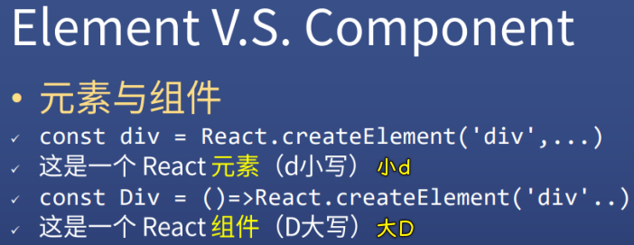

2）什么是组件？


* 就目前的 React 版本而言，一个返回了 React 元素的**函数**就是**组件**
* 而 Vue -> 一个构造选项即一个组件

3）React 两种组件

函数组件：

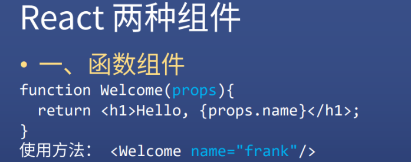

类组件：

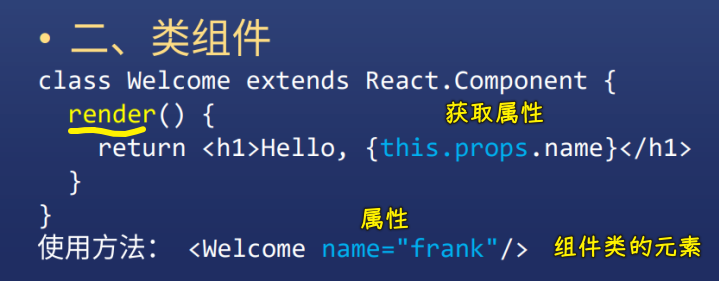

## ★标签会被翻译为 `React.createElement`

1）Welcome 标签


如：

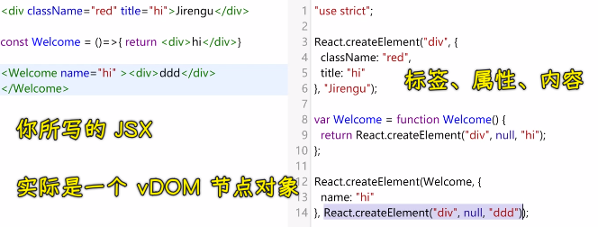

2） `React.createElement` 的逻辑

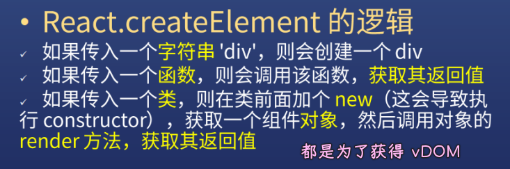

题外话：写类组件是很麻烦的，因为每次你都得写一些很固定的东西：

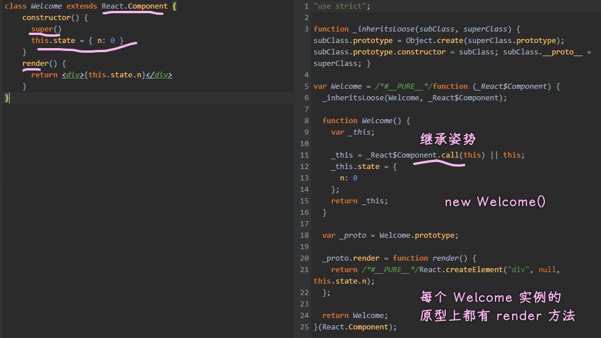

## ★小试牛刀，请动手尝试

需求：

1. div -> 爸爸 -> `Father`组件

   1. div -> 儿子 -> `Son` 组件

      1. button -> +1 -> n+1
      2. span -> n
      3. div -> 孙子 -> `Grandson`组件

         1. button -> +1 -> n+1
         2. span -> n

实现：

``` jsx
import React from "react";
import ReactDOM from "react-dom";

import "./styles.css";

function App() {
  return (
    <div className="App">
      爸爸
      <Son />
    </div>
  );
}

// 儿子组件
class Son extends React.Component {
  constructor() {
    super();
    this.state = {
      n: 0
    };
  }
  add() {
    // this.state.n += 1 为什么不行
    this.setState({ n: this.state.n + 1 });
  }
  render() {
    return (
      <div className="Son">
        儿子 n: {this.state.n}
        <button onClick={() => this.add()}>+1</button>
        <Grandson />
      </div>
    );
  }
}

// 孙子组件
const Grandson = () => {
  const [n, setN] = React.useState(0);
  return (
    <div className="Grandson">
      孙子 n:{n}
      <button onClick={() => setN(n + 1)}>+1</button>
    </div>
  );
};

//获取页面上需要渲染的位置
const rootElement = document.getElementById("root");
ReactDOM.render(<App />, rootElement);
```

解析：

App 组件：

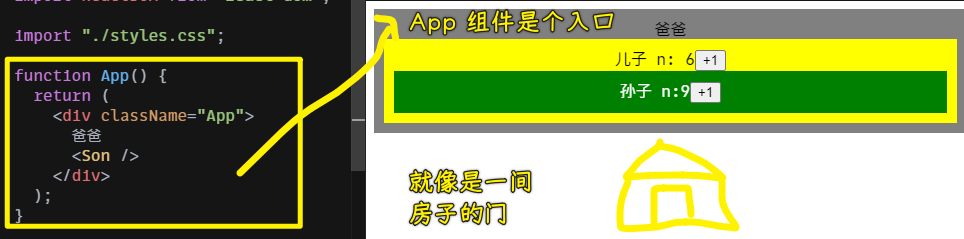

Son 组件：

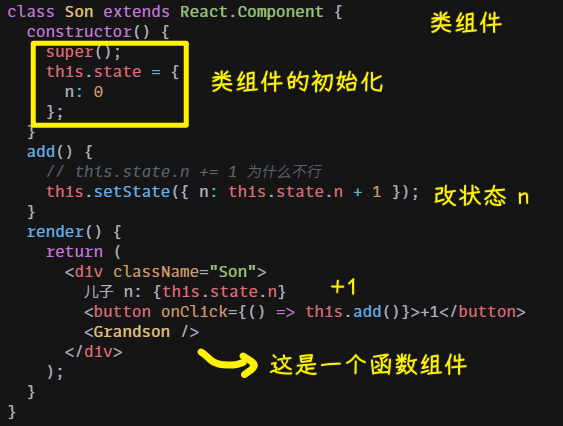

Grandson 组件：

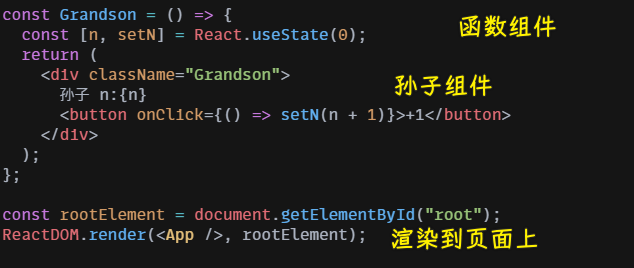

Grandson 的原理：

`0` 就是 `state` 的初始值

这行代码：

``` js
const [n, setN] = React.useState(0)
```

等价于：

``` js
const array = React.useState(0)
const n = array[0]
const setN = array[1]
```

我们用了析构写法：声明一个 `state` 初始值为 `0` ，用 `n` 代表 `0` ，用 `setN` 去对 `0` 进行修改（对一个变量的读和写操作）

注意：

> `setN` 之后得到的是一个新的 `n` ，而不是改变原有的 `n`

💡：为什么 `const` 声明的变量 `n` 能被改值？ `setN` 到底做了什么？

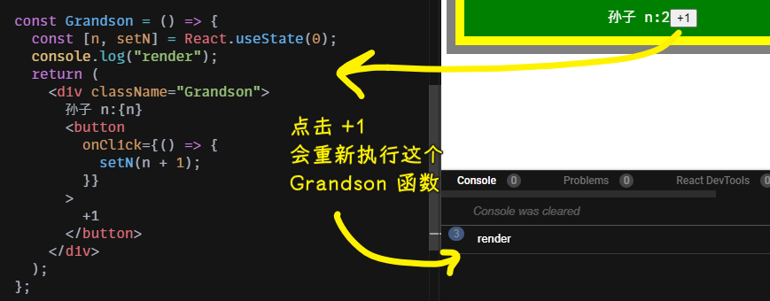

➹：[为什么 useState 可以使用 const 解构赋值？_高桥靓仔的博客-CSDN 博客](https://blog.csdn.net/weixin_45221036/article/details/108581908)

➹：[useState 的原理及模拟实现 —— React Hooks 系列（一） - 知乎](https://zhuanlan.zhihu.com/p/100714485)

## ★类组件和函数组件使用 `props`

1）添加 props（外部数据）


``` jsx
import React from "react";
import ReactDOM from "react-dom";

import "./styles.css";

function App() {
  return (
    <div className="App">
      爸爸
      <Son messageForSon="儿子你好" />
    </div>
  );
}

class Son extends React.Component {
  render() {
    return (
      <div className="Son">
        我是儿子，我爸对我说「{this.props.messageForSon}」
        <Grandson messageForGrandson="孙贼你好" />
      </div>
    );
  }
}

const Grandson = props => {
  return (
    <div className="Grandson">
      我是孙子，我爸对我说「{props.messageForGrandson}」
    </div>
  );
};

const rootElement = document.getElementById("root");
ReactDOM.render(<App />, rootElement);
```

效果：


解析：

💡：爸爸组件如何传数据给儿子？

直接在儿子组件标签上写属性：

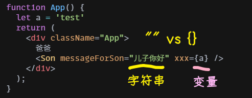

值是字符串，那就是 `"xxx"` ，如果是变量，那就 `{xxx}`

💡：儿子怎么接收爸爸传过来的数据？

类组件直接用 `this.props.xxx` ：

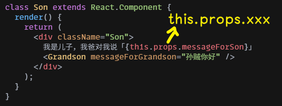

函数组件则是「第一个参数的 `xxx` 」：

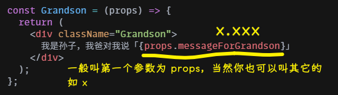

> 也可以用析构语法 `{xxx}`

## ★类组件和函数组件使用 `state` （内部数据）

> 传递的是内部数据 -> `state` -> 遵守不可变数据理念！

1）添加 state（内部数据）


> `setState` 会异步改变 `n` 的值，而 `useState` 则不会改变 `n` 的值

代码：

``` jsx
import React from "react";
import ReactDOM from "react-dom";

import "./styles.css";

function App() {
  return (
    <div className="App">
      爸爸
      <Son />
    </div>
  );
}

class Son extends React.Component {
  constructor() {
    super();
    this.state = {
      n: 0
    };
  }
  add() {
    // this.state.n += 1 为什么不行
    this.setState({ n: this.state.n + 1 });
  }
  render() {
    return (
      <div className="Son">
        儿子 n: {this.state.n}
        <button onClick={() => this.add()}>+1</button>
        <Grandson />
      </div>
    );
  }
}

const Grandson = () => {
  const [n, setN] = React.useState(0);
  return (
    <div className="Grandson">
      孙子 n：{n}
      <button onClick={() => setN(n + 1)}>+1</button>
    </div>
  );
};

const rootElement = document.getElementById("root");
ReactDOM.render(<App />, rootElement);
```

效果：


解析：

💡：类组件的 `state` ？

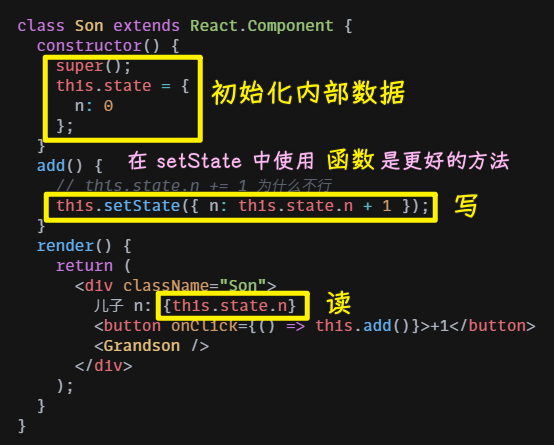

话说，为什么不直接写 `this.state.n=1` ？

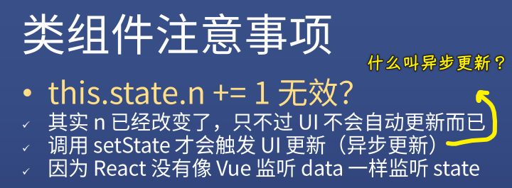

在 Vue 里面会监听 `data` 的变化， `data` 改变页面渲染刷新（因为它设置了 `set` 和 `get` 的接口：响应式原理）

> 这个过程是立刻的吗？

而 React 则没有， `state` 变化渲染要我们去手动设置 `setState` ，而我们这样：

``` js
this.state.n += 1
this.setState(this.state)
```

先把 `state` 变了再 `set` ，也是可以的，但非常不推荐这样做！

因为 React 不建议直接修改，而是要产生一个新的（**React 的不可变数据**），如：

``` js
// set 一个新的
this.setState({
  n: this.state.n + 1
})
```

进一步来说，我们一般不直接写一个对象给 `setState` ，而是写一个**函数**：

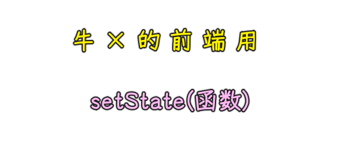

**函数**接收的参数是**旧的 `state` **，然后返回一个**新的 `state` **：

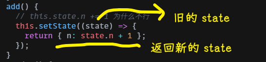

话说，这 TM 有啥区别呢？

因为：**setState 是异步的更新 UI 的过程**

如果直接这样写：

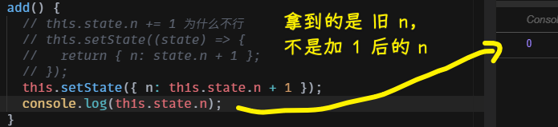

打印 `state` （想拿到最新的 `state` ）

在这个代码里边，先执行的是**打印语句**， `setState` 只是等着还没重新赋值，但是我们会以为此时的 `state` 就是最新的 `state`

> 看成是类似 `setTimeout()` 这样的东西

所以为了避免这个问题，可以使用**函数**，传递的是旧的 `state` ，可以让新的 `state` 先赋值打印出来再 `setState` （**目的只是拿到/看到最新的 `state` 而已呀**）

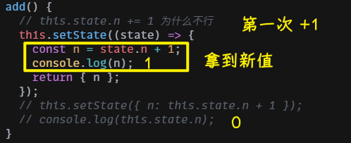

总之，我们用**函数**，就是可以避免你混淆新的 `state` 和旧的 `state` （新的 `n` 和 旧的 `n` ）


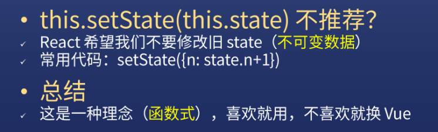

> 函数也是值，它可以延迟返回一个值

💡：函数组件的 `state` ？

函数组件是怎么使用 `state` 的？ -> 使用 `useState` （Hooks API 没啥神奇的，也就那样……）

而类组件是直接就有 `setState` 了！

函数组件是要从 `useState` 拿出来的（** `useState` 就两个接口读和写**）

数组的第一项是用来读的，第二项是用来写的 -> 名字可以随便起

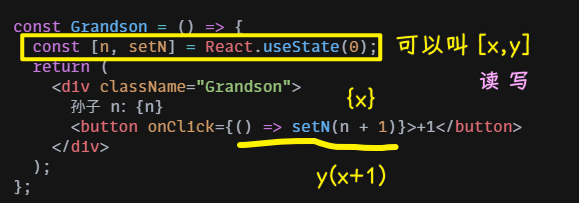

记住：

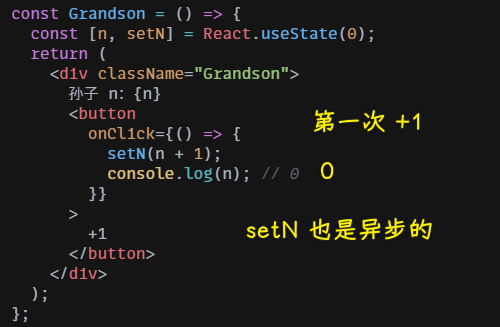

`setN` 永远不会改变 n，而是产生一个**新的 n**，而且它也是**异步的**

> 每次 `+1` 都会重新执行一遍函数

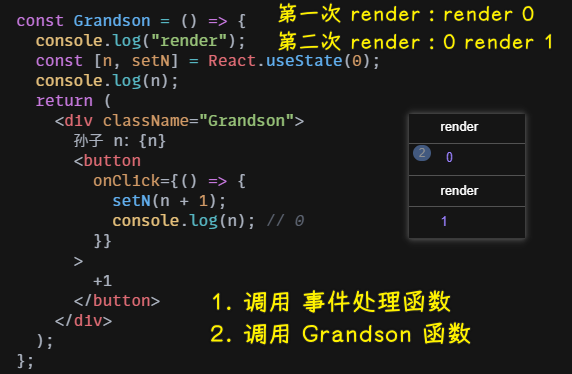

> `setN` 内部会去执行 `Grandson` 函数 -> 好奇它是如何省略这个 `const [n, setN] = React.useState(0)` 的？ -> 大概是 `setN` 会把新值 `n+1` 交给全局变量 `_state` （数组），然后 `ReactDOM.render(<Grandson />,...)` ，所以此时会去执行 `Grandson` 函数 -> `useState` 再次执行，会去判断 `n` 是否还用初始值，显然不用初始值！
>  
> [useState 的原理及模拟实现 —— React Hooks 系列（一） - Caijialinxx](https://caijialinxx.github.io/2019/12/23/hooks-useState/)

好奇怪的结论：

类的 `setState` 会等一会再改变 n，而函数组件的 `setN` 是永远都不会改变 n（对比 Vue，Vue 真是太好理解了）

注意事项：


## ★ Vue/React 编程模型

1）什么是编程模型？

程序是问题求解过程的表达，表达求解过程的语言统称为编程语言。

> 数学题 vs 数学语言（数字、字符）

求解过程就是逻辑，就是**顺序、条件、循环**三种形式，因此程序就是用特定的语言表示的逻辑，程序是形式，逻辑是内容。

**模型是对事物共性的抽象，编程模型就是对编程的共性的抽象**。

> 编程模型就是写代码的姿势吗？

什么是编程的共性呢？最重要的共性就是：**程序设计时，代码的抽象方式、组织方式或复用方式**。

编程技术与编程模型有时并不加以区别，例如面向对象的编程，两种含义都有。但深究的话，还是有一定的区别：前者更接近**具体的语言和工具**，后者更接近**方法与思想**。

> 所有 React、Vue 就是编程技术咯？

面向过程编程是以**功能分解**为核心，而面向对象编程以**概念抽象**为核心，两者在认识论方面有着更深刻的不同。由此导致了面向过程编程一条指令最大能操作一个过程，而面向对象编程一条指令最大能操作一个对象。

编程模型不考虑最小的操作单元。因为有的语言最小可操作到比特，与机器指令的抽象级别是一个层次，但也许它是面象对象的编程模型。

拿手搞装修的民工打比喻：最低级的活是筛砂子，这是用汇编语言编程；进步一点的是搬砖头，这是高级语言编程；再高级一点就是装门、窗户，最高级的大约是安装整体厨柜之类的角色，这是面向对象编程。不同的级别的人，实质上就是在不同的“模型”上工作。

💡：抽象与复用？

编程模型中，指令的抽象程度与复用程度密切相关：

1. 抽象是手段，复用是目标
2. 抽象到什么程度，才能复用到什么程度

从结果出看，编程模型其实就是代码的复用模型

💡：相关概念

与 `.NET`、`Eclipse` 等是编程工具或开发平台，是具体的、实例化的。而编程模型是抽象的、思想性的，两者不能混为一淡。

编程模型处于方法或思想性的层面，在很多情况下，也可称为编程方法、编程方式、编程模式或编程技术。**之所以用编程模型，是因为它能兼顾了技术与思想的两种含义**，能更好的体现本文要表达的意思。

编程模型与体系架构中的 `C/S` 模式及 3 层模型等概念也是有区别的。前者是针**程序设计的模型**，而后者指**体系架构的模型**，含义有很大的不同。

> 技术+思想 = 编程模型

💡：疑问

编程模型就是编程时组织代码的方式，因此接近编程方法的概念。编程模型体现了编程思想，但比它更具体。基于框架的编程是一种编程模型，而且是目前最为抽象、复用程度最高的编程模型。

你说的编程模型能不能理解为是一种成熟的团队合作、工具、框架等等一系列的开发模式？就好比敏捷、企业应用架构模式之类的成熟的模型？

➹：[编程模型随笔 (1)——概述篇 - 星沙明明 - 博客园](https://www.cnblogs.com/xsmm/archive/2012/01/20/software_dev_model.html)

💡：有哪些编程模型？

1. 命令式
2. 声明式
3. 面向对象式
4. 函数式
5. 原型式
6. 混合式
7. 基于栈式
8. 基于逻辑式
9. ……

➹：[编程模型（范式）小结_Java - UCloud 云社区](https://www.ucloud.cn/yun/68141.html)

2）Vue/React 编程模型

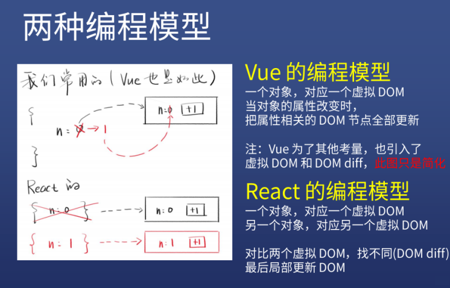

> 这个对象指的是 vDOM 节点对象吗？

💡：Vue 的编程模型（对旧数据进行修改）

接触 Vue 的开发者应该都知道，在 Vue 中一旦内部数据改变了，视图就会随之更新，这是因为 Vue 的 数据响应式原理：

> Vue 对其构造选项 `options` 的 `data` 中的数据进行了篡改并监听，一旦监听数据发生变化，Vue 就会自动刷新视图。

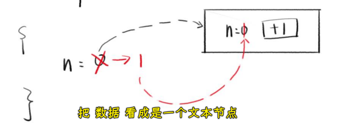

> 声明一个`data`，如`{n:0}` -> Vue 就会把`n`这个数据同步到 UI 上，即一个对象对应着 VDOM 节点？ -> 把一个 UI 模板看作是靶子，每个像`n`这样的数据都是一个箭头，靶子上插有相应的箭头，箭头升级了，原先箭头粒子式破碎消失，取而代之的是新箭头

**在 Vue 的编程模型中，一个数据对象对应一个虚拟 DOM 节点，当对象的属性改变时，Vue 就会将相关的 DOM 节点全部更新**

> `data`这个对象就是一个 `vDOM` 节点对象

💡：React 的编程模型（不管旧数据，生成新数据）

由于 React 没有像 Vue 一样，对其内部数据 state 进行监听，这就使得 React 不知道其内部数据什么时候改变了，只有开发人员知道，所以需要开发人员在改变 state 数据时调用 `setState()` 或 `setN()` 去 **异步** 刷新视图。

而且 React 提倡的时数据不可变理念，当开发人员需要改变内部数据 state 时，不建议修改旧的 state，而是声明新的 state 将旧的 state 进行覆盖。

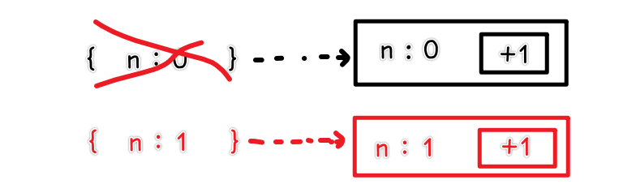

> 在 React 里，不同的数据就是平行线，永远不会互相掺和。

**在 React 的编程模型，一个对象对应一个虚拟 DOM，另一个对象，对应另一个虚拟 DOM。对比两个虚拟 DOM，找不同（DOM diff），最后局部更新 DOM**

💡：两个框架的不同理念

React 的理念是 **数据不可变**，它会通过 `setN()` 声明 **新数据**，而 Vue 的理念是 **数据响应式**，它提倡改变原数据。

➹：[React 和 Vue 的不同编程模型_Mark-CSDN 博客](https://blog.csdn.net/marker__/article/details/105540510)

💡：了解更多

➹：[为什么我们放弃了 Vue？Vue 和 React 深度比较 - 并发编程网 – ifeve.com](https://ifeve.com/%E4%B8%BA%E4%BB%80%E4%B9%88%E6%88%91%E4%BB%AC%E6%94%BE%E5%BC%83%E4%BA%86vue%EF%BC%9Fvue%E5%92%8Creact%E6%B7%B1%E5%BA%A6%E6%AF%94%E8%BE%83/)

➹：[Vue 和 React 的优点分别是什么？ - 知乎](https://www.zhihu.com/question/301860721)

➹：[详解 Vue 中的虚拟 DOM](https://blog.fundebug.com/2019/06/26/vue-virtual-dom/)

3）小结

- Vue 响应式，数据改变就修改原来的 UI 上显示的（**一个数据对应的永远都是一个 DOM**），Vue 一开始是没有 DOM diff 的，后来才加，而且它加入也不是为了解决不可以修改原数据的问题
- React 不准修改原来的，使用新的跟旧的 diff（对比），然后再映射到 UI （两个 DOM 对比）
- 各有优缺点

我不是很理解「一个数据对应的是一个 DOM」，这是说一个`data`吗？还是`data`里边的属性？ -> 非要理解的话，我把类似`n`这样的属性看作是一个文本节点！

Vue 里边的模板到 UI 的过程：

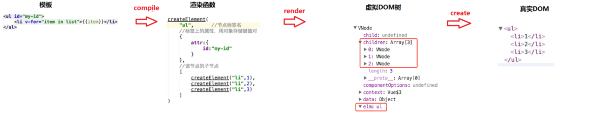

> 一个模板 -> 一颗 vDOM 树 -> 树上有 vDOM 节点，还有一个`data` -> `data`变化 -> 构建出一个新的 vDOM 树 -> 新树 vs 旧树，比较的是同级上的 vDOM 节点，记录二者的差异 -> 把差异应用到真正的 DOM 树上！

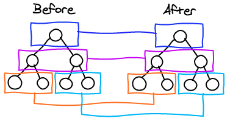

## ★复杂 state 怎么处理

如果 `state` 里边不止有 `n` 怎么办？

1）类组件合并 state

如类组件里有`n`和`m`

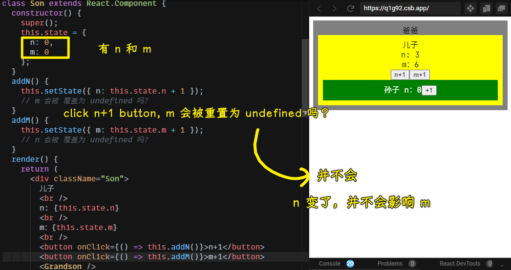

在调用`addN`方法的时候，虽然是`this.setState({ n: this.state.n + 1 })`这样，但这并不会等同于`this.setState({ n: this.state.n + 1,m: undefined });`这样！ -> `m`始终是原来的值！

原因：**类中的 `setState`，如果你对其中一部分 `state` 值进行修改，其它部分的值会自动沿用上一次的值（自动合并）**

这相当于是：

``` js
this.setState({ ...this.state, n: this.state.n + 1 });
```

> 展开 -> 后边的属性要么替换，要么合并

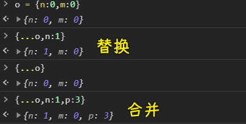

然而，这有一个坑，那就是只会**合并第一层**！

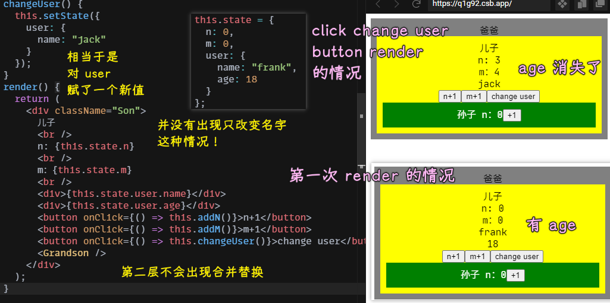

调用 `changeUser` 方法，`m`和`n`不会被置空，而`age`则会被置空！

所以，写多层属性的时候记得要**手动合并**（使用`...`操作符合并属性）：

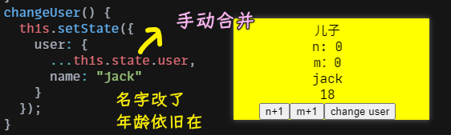

2）函数组件合并 state

函数组件会合并 `state`吗？

不会，它不会自动合并上一次的属性！

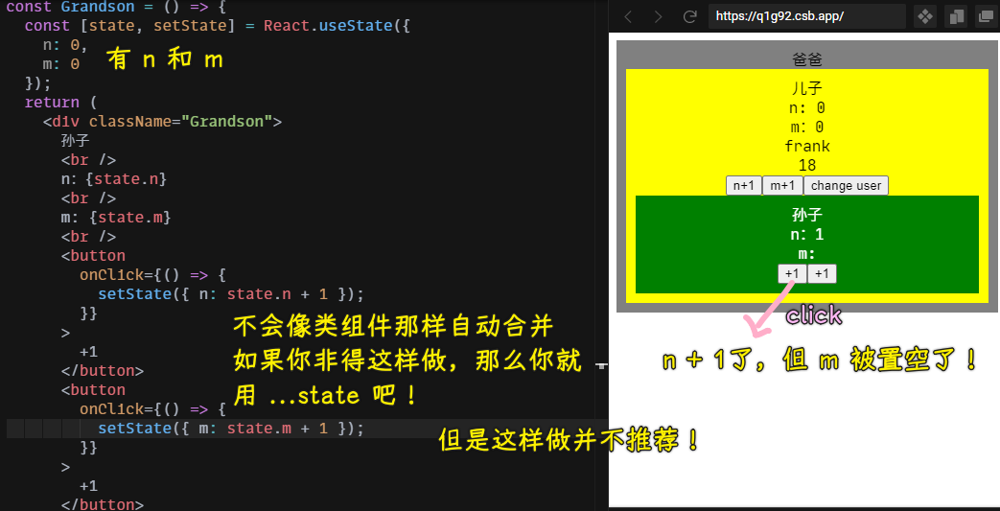

手动合并：

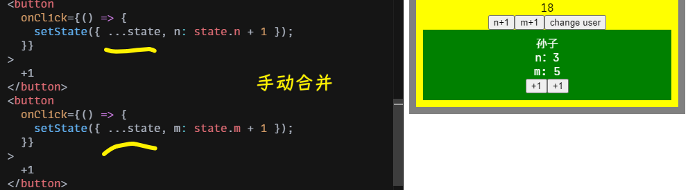

推荐的做法：

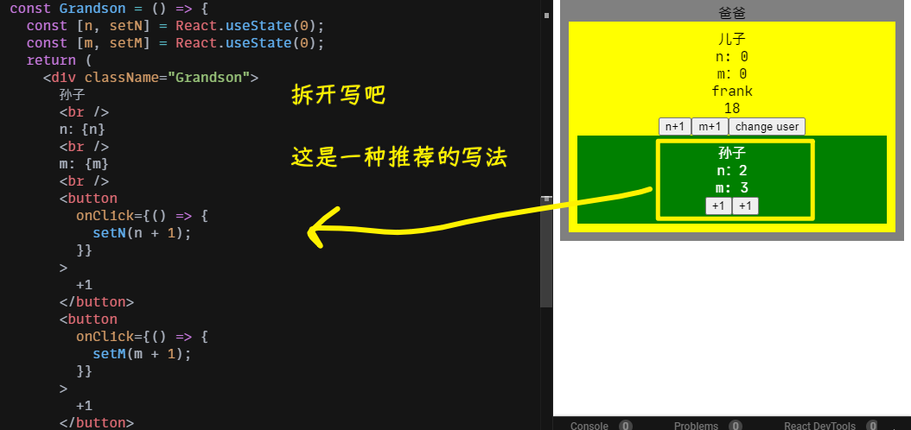

可以看到，对比类组件的写法，函数组件写法超简单，所以**优先使用函数组件**

3）总结

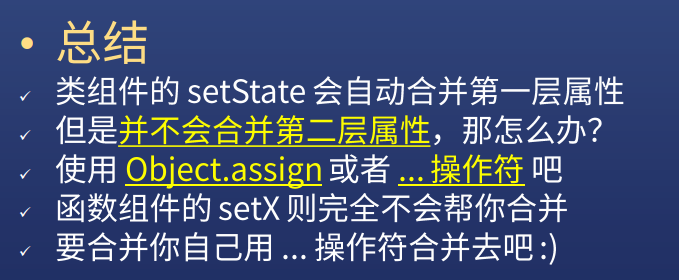

> `Object.assign({},this.state.user)`等价于`{...this.state.user}`

总之，请不要过分依赖自动合并！

> 这是一个讨论数据局部更新的问题 -> 也就是在改一个数据的时候，如何不影响另外一个数据！

## ★React 事件绑定的各种写法


1）类组件的事件绑定

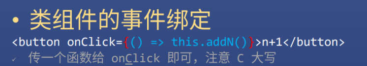

思考一个问题：

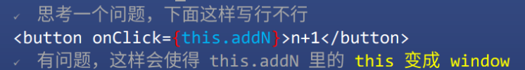

`onClick`调用 -> 其`this`指向`window`

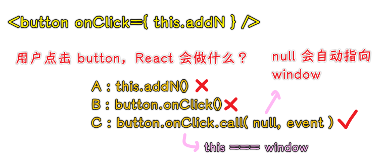

也就是说`addN`方法里边的`this`是`window`咯！ -> 是`button`元素调用的`onClick`方法，不是组件实例调用的？ -> `this.addN`即`0x101` -> `button`元素的`onclick`指向`0x101`

另一种写法：

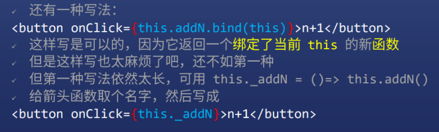

``` jsx
// 在 render 方法里边写这个
const _addN = ()=>this.addN()
// 返回值写这个
<button onClick={this._addN}>n+1</button>
```

但这种写法不优雅，我们可以写到`constructor`里边去：

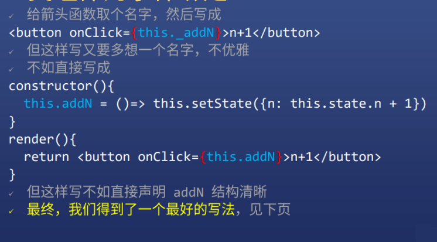

最终写法（ES7 特性）：


区别：


挂到对象上和原型上的区别：

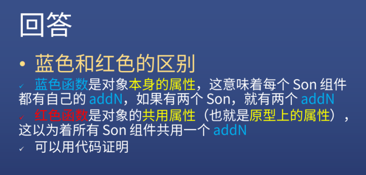

为什么蓝色写法的`this`会指向组件实例？

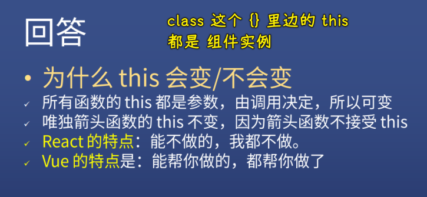

> Vue 里面的 `this` 都隐形搞定了

2）结论

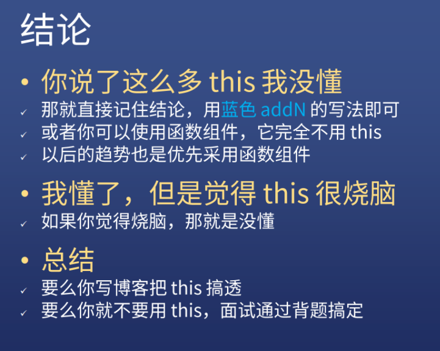

## ★复习 this，两个面试题
