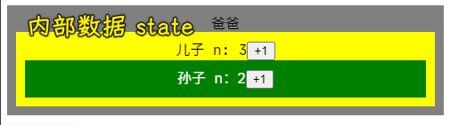

### ✍️ Tangxt ⏳ 2021-03-13 🏷️ React

# 02-React 类组件和函数组件

## ★元素 vs 组件

1）元素与组件


2）什么是组件？


- 就目前的 React 版本而言，一个返回了 React 元素的**函数**就是**组件**
- 而 Vue -> 一个构造选项即一个组件

3）React 两种组件

函数组件：


类组件：


## ★标签会被翻译为 `React.createElement`

1）Welcome 标签


如：


2）`React.createElement` 的逻辑


题外话：写类组件是很麻烦的，因为每次你都得写一些很固定的东西：


## ★小试牛刀，请动手尝试

需求：

1. div -> 爸爸 -> `Father`组件
   1. div -> 儿子 -> `Son`组件
      1. button -> +1 -> n+1
      2. span -> n
      3. div -> 孙子 -> `Grandson`组件
         1. button -> +1 -> n+1
         2. span -> n

实现：

``` jsx
import React from "react";
import ReactDOM from "react-dom";

import "./styles.css";

function App() {
  return (
    <div className="App">
      爸爸
      <Son />
    </div>
  );
}

// 儿子组件
class Son extends React.Component {
  constructor() {
    super();
    this.state = {
      n: 0
    };
  }
  add() {
    // this.state.n += 1 为什么不行
    this.setState({ n: this.state.n + 1 });
  }
  render() {
    return (
      <div className="Son">
        儿子 n: {this.state.n}
        <button onClick={() => this.add()}>+1</button>
        <Grandson />
      </div>
    );
  }
}

// 孙子组件
const Grandson = () => {
  const [n, setN] = React.useState(0);
  return (
    <div className="Grandson">
      孙子 n:{n}
      <button onClick={() => setN(n + 1)}>+1</button>
    </div>
  );
};

//获取页面上需要渲染的位置
const rootElement = document.getElementById("root");
ReactDOM.render(<App />, rootElement);
```

解析：

App 组件：


Son 组件：


Grandson 组件：


Grandson 的原理：

`0` 就是 `state` 的初始值

这行代码：

``` js
const [n, setN] = React.useState(0)
```

等价于：

``` js
const array = React.useState(0)
const n = array[0]
const setN = array[1]
```

我们用了析构写法：声明一个`state`初始值为 `0`，用 `n` 代表 `0`，用 `setN` 去对 `0` 进行修改（对一个变量的读和写操作）

注意：

> `setN`之后得到的是一个新的`n`，而不是改变原有的`n`

💡：为什么`const`声明的变量`n`能被改值？`setN`到底做了什么？


➹：[为什么 useState 可以使用 const 解构赋值？_高桥靓仔的博客-CSDN 博客](https://blog.csdn.net/weixin_45221036/article/details/108581908)

➹：[useState 的原理及模拟实现 —— React Hooks 系列（一） - 知乎](https://zhuanlan.zhihu.com/p/100714485)

## ★类组件和函数组件使用 `props`

1）添加 props（外部数据）


``` jsx
import React from "react";
import ReactDOM from "react-dom";

import "./styles.css";

function App() {
  return (
    <div className="App">
      爸爸
      <Son messageForSon="儿子你好" />
    </div>
  );
}

class Son extends React.Component {
  render() {
    return (
      <div className="Son">
        我是儿子，我爸对我说「{this.props.messageForSon}」
        <Grandson messageForGrandson="孙贼你好" />
      </div>
    );
  }
}

const Grandson = props => {
  return (
    <div className="Grandson">
      我是孙子，我爸对我说「{props.messageForGrandson}」
    </div>
  );
};

const rootElement = document.getElementById("root");
ReactDOM.render(<App />, rootElement);
```

效果：


解析：

💡：爸爸组件如何传数据给儿子？

直接在儿子组件标签上写属性：


值是字符串，那就是`"xxx"`，如果是变量，那就`{xxx}`

💡：儿子怎么接收爸爸传过来的数据？

类组件直接用`this.props.xxx`：


函数组件则是「第一个参数的`xxx`」：


> 也可以用析构语法`{xxx}`

## ★类组件和函数组件使用 `state`（内部数据）

> 传递的是内部数据 -> `state` -> 遵守不可变数据理念！

1）添加 state（内部数据）


> `setState`会异步改变`n`的值，而`useState`则不会改变`n`的值

代码：

``` jsx
import React from "react";
import ReactDOM from "react-dom";

import "./styles.css";

function App() {
  return (
    <div className="App">
      爸爸
      <Son />
    </div>
  );
}

class Son extends React.Component {
  constructor() {
    super();
    this.state = {
      n: 0
    };
  }
  add() {
    // this.state.n += 1 为什么不行
    this.setState({ n: this.state.n + 1 });
  }
  render() {
    return (
      <div className="Son">
        儿子 n: {this.state.n}
        <button onClick={() => this.add()}>+1</button>
        <Grandson />
      </div>
    );
  }
}

const Grandson = () => {
  const [n, setN] = React.useState(0);
  return (
    <div className="Grandson">
      孙子 n：{n}
      <button onClick={() => setN(n + 1)}>+1</button>
    </div>
  );
};

const rootElement = document.getElementById("root");
ReactDOM.render(<App />, rootElement);
```

效果：



解析：

💡：类组件的`state`？


话说，为什么不直接写 `this.state.n=1`？


在 Vue 里面会监听 `data` 的变化，`data` 改变页面渲染刷新（因为它设置了 `set` 和 `get` 的接口：响应式原理）

> 这个过程是立刻的吗？

而 React 则没有，`state`变化渲染要我们去手动设置`setState`，而我们这样：

``` js
this.state.n += 1
this.setState(this.state)
```

先把`state`变了再`set`，也是可以的，但非常不推荐这样做！

因为 React 不建议直接修改，而是要产生一个新的（**React 的不可变数据**），如：

``` js
// set 一个新的
this.setState({ n: this.state.n + 1 })
```

进一步来说，我们一般不直接写一个对象给`setState`，而是写一个**函数**：


**函数**接收的参数是**旧的`state`**，然后返回一个**新的`state`**：


话说，这 TM 有啥区别呢？

因为：**setState 是异步的更新 UI 的过程**

如果直接这样写：


打印 `state`（想拿到最新的 `state`）

在这个代码里边，先执行的是**打印语句**，`setState`只是等着还没重新赋值，但是我们会以为此时的`state`就是最新的`state`

> 看成是类似`setTimeout()`这样的东西

所以为了避免这个问题，可以使用**函数**，传递的是旧的`state`，可以让新的`state`先赋值打印出来再`setState`（**目的只是拿到/看到最新的`state`而已呀**）


总之，我们用**函数**，就是可以避免你混淆新的`state`和旧的`state`（新的 `n` 和 旧的 `n`）


> 函数也是值，它可以延迟返回一个值

💡：函数组件的`state`？

函数组件是怎么使用`state`的？ -> 使用`useState`（Hooks API 没啥神奇的，也就那样……）

而类组件是直接就有`setState`了！

函数组件是要从 `useState` 拿出来的（**`useState`就两个接口读和写**）

数组的第一项是用来读的，第二项是用来写的 -> 名字可以随便起


记住：


`setN` 永远不会改变 n，而是产生一个**新的 n**，而且它也是**异步的**

> 每次 `+1` 都会重新执行一遍函数


> `setN`内部会去执行`Grandson`函数 -> 好奇它是如何省略这个`const [n, setN] = React.useState(0)`的？ -> 大概是`setN`会把新值`n+1`交给全局变量`_state`（数组），然后`ReactDOM.render(<Grandson />,...)`，所以此时会去执行`Grandson`函数 -> `useState`再次执行，会去判断`n`是否还用初始值，显然不用初始值！
> 
> [useState 的原理及模拟实现 —— React Hooks 系列（一） - Caijialinxx](https://caijialinxx.github.io/2019/12/23/hooks-useState/)

好奇怪的结论：

类的 `setState` 会等一会再改变 n，而函数组件的 `setN` 是永远都不会改变 n（对比 Vue，Vue 真是太好理解了）

注意事项：


## ★ Vue/React 编程模型

