### ✍️ Tangxt ⏳ 2021-03-21 🏷️ 类组件

# Class 组件详解

## ★英语小课堂


## 两种创建 Class 组件的方式

1）ES5 方式（过时）


2）ES6 方式


3）哪种好


## ★Props（外部数据）

1）props

外部数据一般都是来自父元素的内部数据：


初始化：


2）子组件读取 props


3）谁写 props


让`props`的**主人**对数据进行更改：


4）相关钩子


``` jsx
import "./styles.css";
import React from "react";

export default class App extends React.Component {
  constructor() {
    super();
    this.state = {
      n: 0
    };
  }
  onClick = () => {
    this.setState({
      n: this.state.n + 1
    });
  };
  render() {
    return (
      <div className="App">
        App <button onClick={this.onClick}>+1</button>
        <B name={this.state.n}>
          <h1>1</h1>
          <h2>2</h2>
        </B>
      </div>
    );
  }
}

class B extends React.Component {
  // constructor(props) {
  //   super(props);
  //   console.log(props);
  // }
  componentWillReceiveProps(newProps, nextContext) {
    console.log("旧的 props");
    console.log(this.props);
    console.log("props 变化了");
    console.log("新的 props");
    console.log(newProps);
  }
  render() {
    return (
      <div>
        {this.props.name}
        <div>{this.props.children}</div>
      </div>
    );
  }
} //通过 this.props.xxx 读取
```

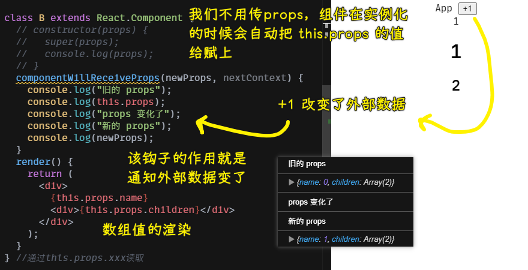

> 该钩子的作用就是「通知你 `props` 什么时候变化」

注意，`componentWillReceiveProps`钩子已被弃用 -> 请不要使用！


💡：为什么要么不写`constructor`，要么写全`constructor`？我没有写`constructor`，而我在 JSX 是可以直接使用`this.props`拿到外部对象的？

如果你不写 `constructor`，那么 React 内部，会在组件实例化后，执行这行代码：

``` js
// React 内部
const instance = new YourComponent(props);
instance.props = props;
```

➹：[译-我们为什么要写 super(props)?](https://juejin.cn/post/6844903729980768269)

5）props 的 作用

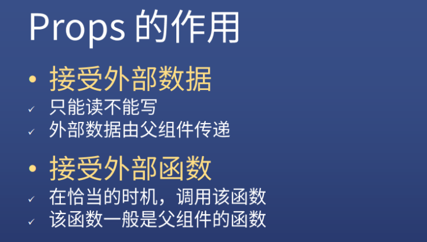

## ★State（内部数据）


1）初始化 State

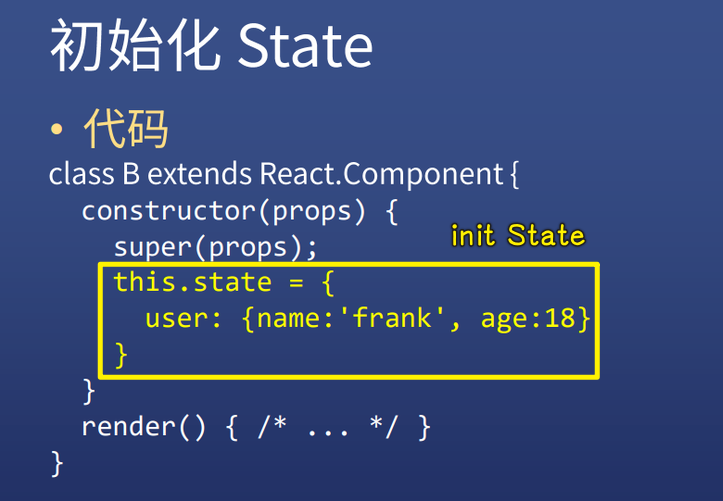

2）读写 State

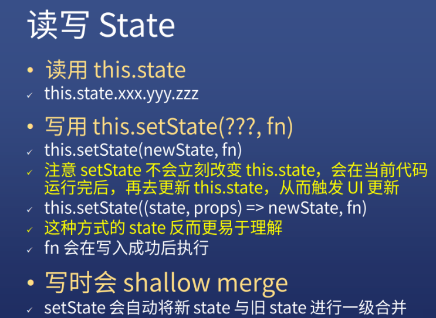

不守规矩的写 State：

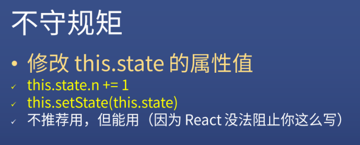

3）setState 第一个参数用对象和函数的区别

需求：两次 setState


> `this.state.x`在读的时候，还是旧的`x`值

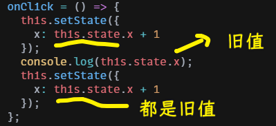

> 之前说过了，函数可以延迟求值，而这个 `this.state.x` 是先确定了值再给`setState`的！ -> 第一个`setState`执行后，`x`并咩有变化，还是原来的`1`，当执行到第二个`setState`，`this.state.x`的值依旧是`1`

所以，如何让两次`setState`的结果是两次`+1`呢？

三种姿势：

1. 一次计算好了再写`setState` -> 这样就只写一次`setState`了
2. 使用`setTimeout()=>{ two setState }` -> 在 callback 里边写两次 `setState`
3. 用函数 -> 满足你写两次`setState`的需求

用定时器：

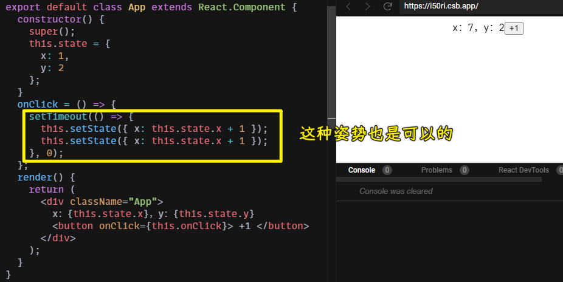

> 这种姿势的`setState`看上去就像同步了！ -> 如果不加`setTimeout`就是异步了！ -> 总之，`setState`本质还是异步的！

用函数参数：

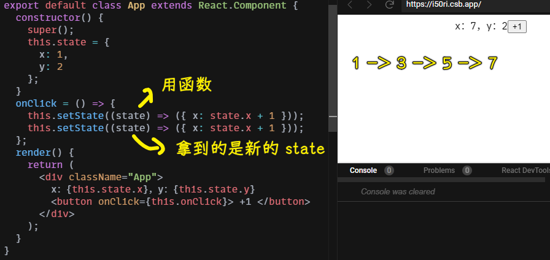

其实还可以用`setState`的第二个参数来搞（少用）：

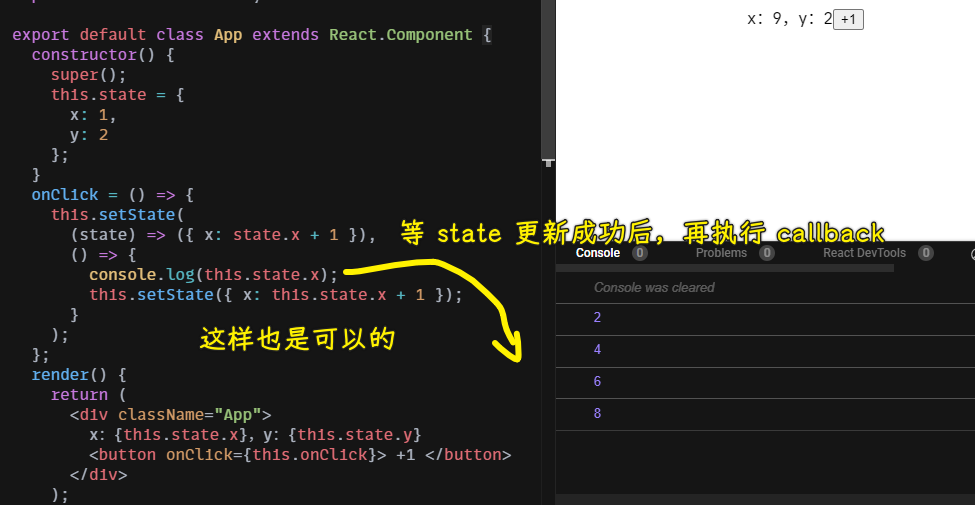

💡：为什么要多次`setState`？

因为这个 Web 应用程序变复杂了，所以多次 `setState` 就可能出现了！

然而一个`setState`就意味着一次`render`？即 DOM 视图会立刻发生变化吗？ -> 不 -> 这是「batches updates」，也就是先把你要更新的说清楚，再一次性去`render` -> 类似于，你要买 10 个苹果，但你却一个袋子装一个这样去结账，结账了 10 次！ -> 为何不 10 个装在一起，再一次性结账呢？

为什么要用函数参数？ -> 我们需要用到上一次`setState`的结果！

类比「王牌对王牌：传声筒传话游戏」:


💡：为什么用了函数参数后，第二个`setState`的`state`值就是上一个`setState`更新后的值？

➹：[译 - 在 setState 中使用函数替代对象](https://juejin.cn/post/6844903459842424839)

💡：`setState`的源码？

``` js
ReactComponent.prototype.setState = function(partialState, callback) {
  this.updater.enqueueSetState(this, partialState);
  if (callback) {
    this.updater.enqueueCallback(this, callback, 'setState');
  }
};
```

`partialState` -> 部分`state` -> 表示「不影响其它的`state`，只更新我要更新的」

➹：[React - setState 源码分析（小白可读）](https://juejin.cn/post/6844903573453537287)

## ★生命周期

1）概述

原生 JS 里边的生命周期：

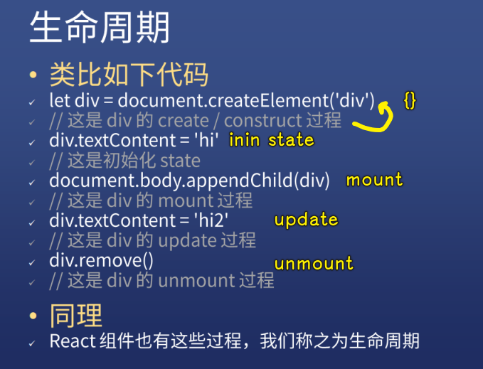

React 里边的生命周期：

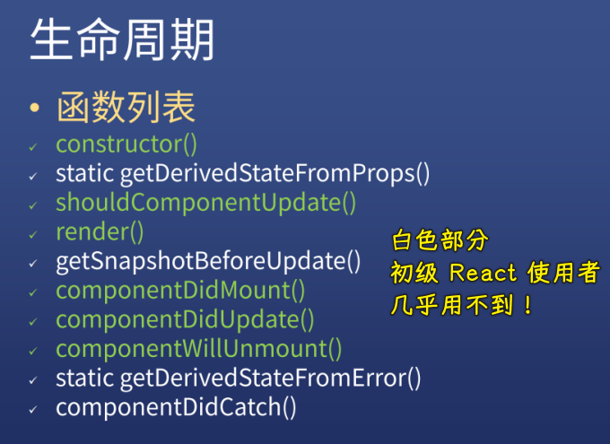

我们必须要会的钩子：

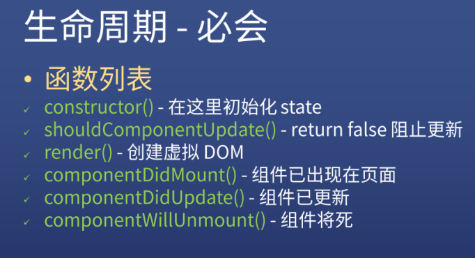

> `componentWillUnmount` -> 组件将要消失！

2）constructor

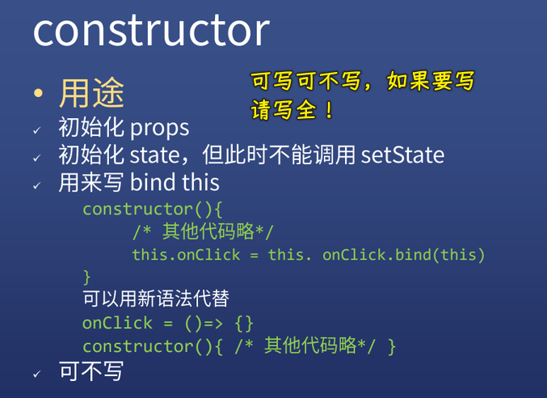

3）shouldComponentUpdate

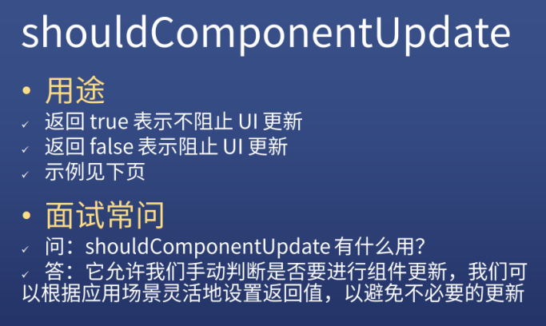

什么时候触发这个钩子？ -> `state`变了就触发

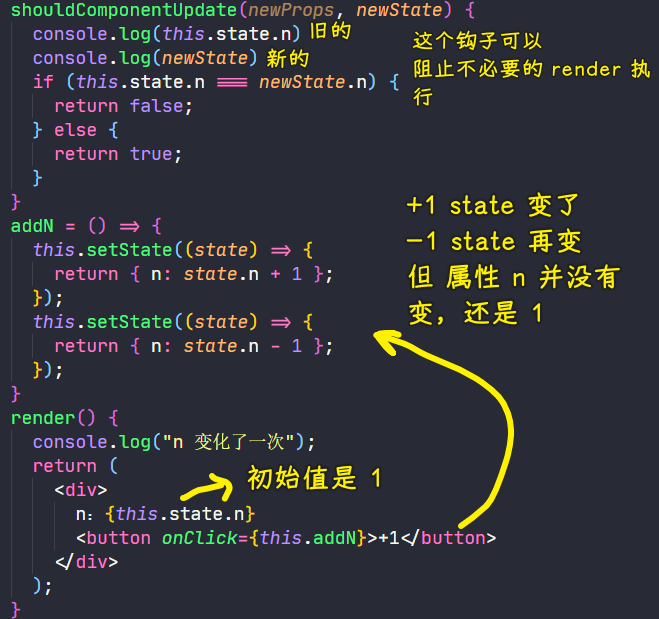

如果我们没有用`shouldComponentUpdate`，即便`n`的值还是原来的`1`，也会执行`render`方法，因为`state`已经变了，`state`这个对象换了，那么 React 就得更新数据，当然，这并不会更新 UI：

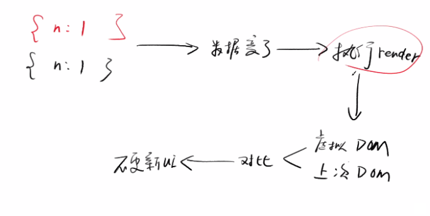

总之，你不写`shouldComponentUpdate`去处理的话，`render`是多执行了的，而我们用这个生命周期钩子是可以阻止它执行的！

如何阻止？ -> **判断新的旧的相等就不执行**

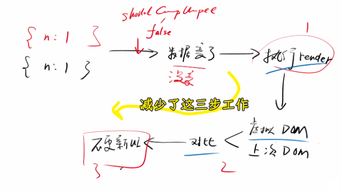

示例代码：

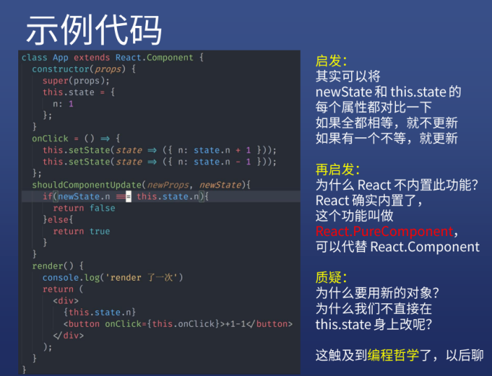

💡：pureComponent？

它会在 `render` 之前对新旧 `state` 进行对比（**浅对比，只对比一层**）

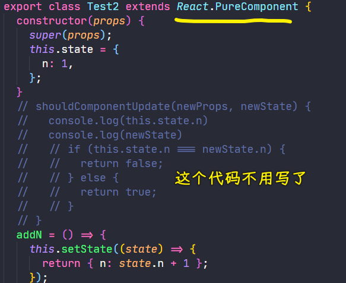

如果你多此一举的写了`shouldComponentUpdate`，那么控制台就会警告你：

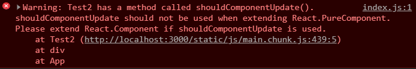

面对这种情况：

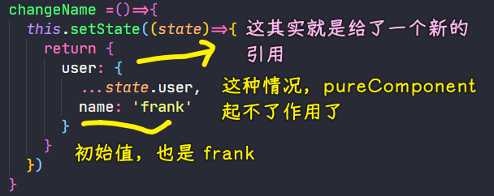

`pureComponent`也就不好使了！即`name`依旧是`frank`，还是会调用`render`，当然，这 UI 并不会更新！

总之：

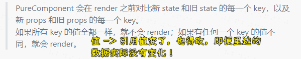

4）render

它给 React 使用者的印象：

- 告诉 React 组件是长啥样的
- `return`的是一个 vDOM 对象

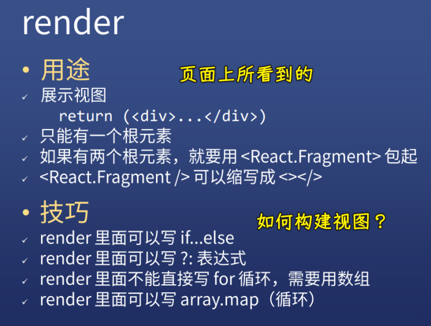

1、虚拟 DOM

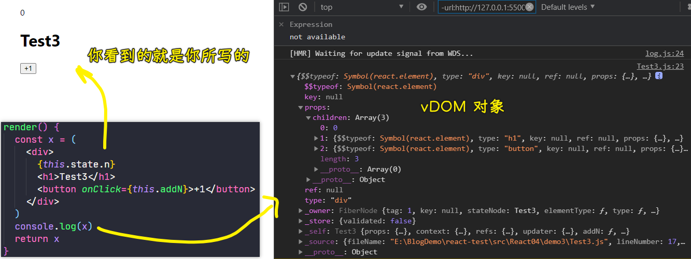

2、React.Frangment

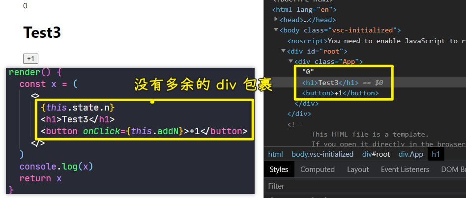

3、if else

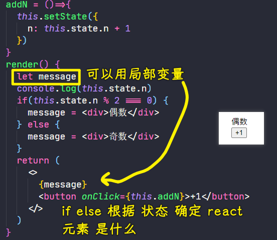

可以简写成三目运算符：

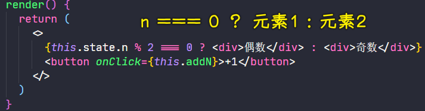

如果你想只展示一种，那么你可以简写成`&&`：

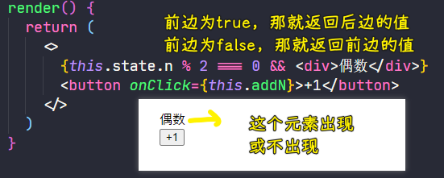

4、循环

如果你用`for`循环，你这样写：

``` jsx
class() {
  render() {
    for (let index = 0; index < this.state.arr.length; index++) {
      const element = this.state.arr[index];
      return element
    }
  }
}
```

循环一遍就结束，因为`return`了呀！

返回的是数组，而不是一个数组元素：

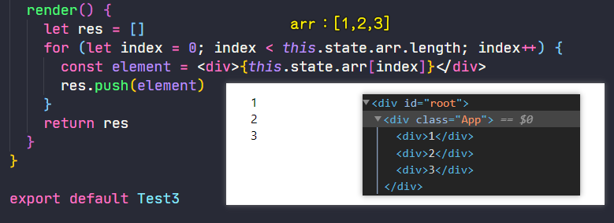

> `Warning: Each child in a list should have a unique "key" prop` -> 别忘了，要为每个 react 元素加一个唯一的`key`属性

使用`map`（**更高级**），而不是`for`：

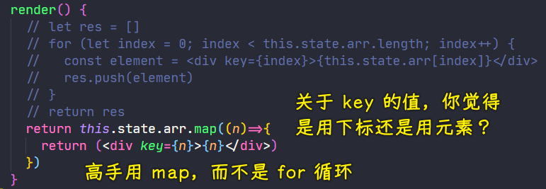

5）componentDidMount
