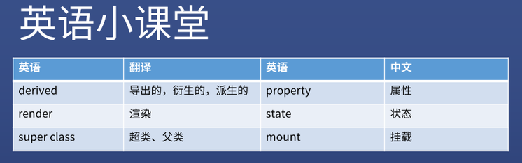
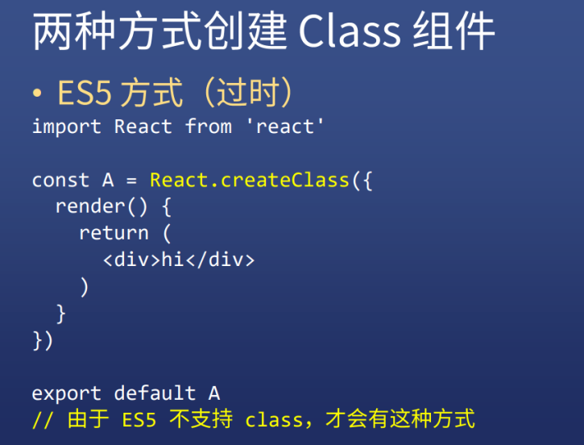
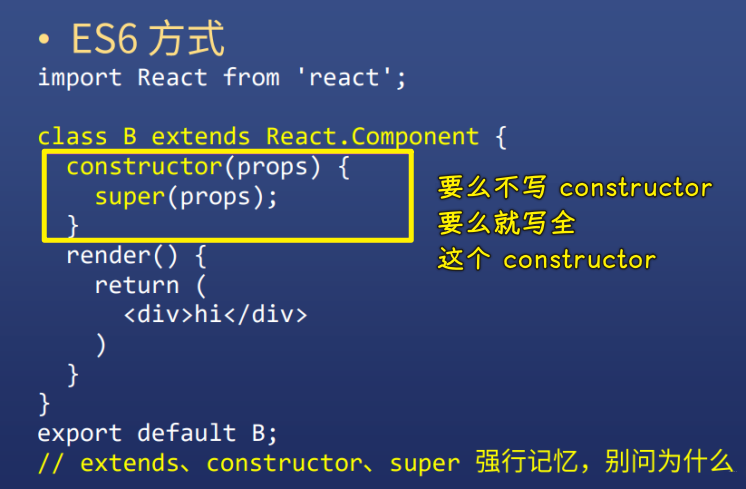
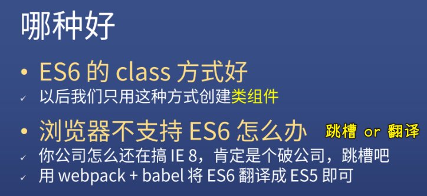
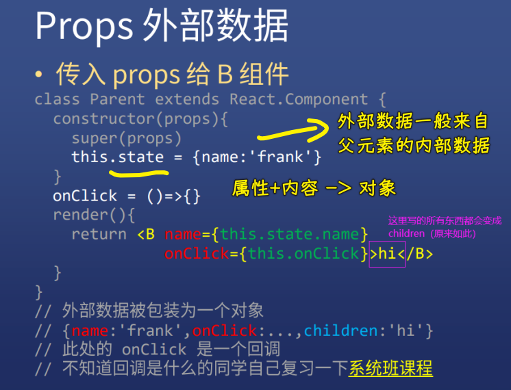
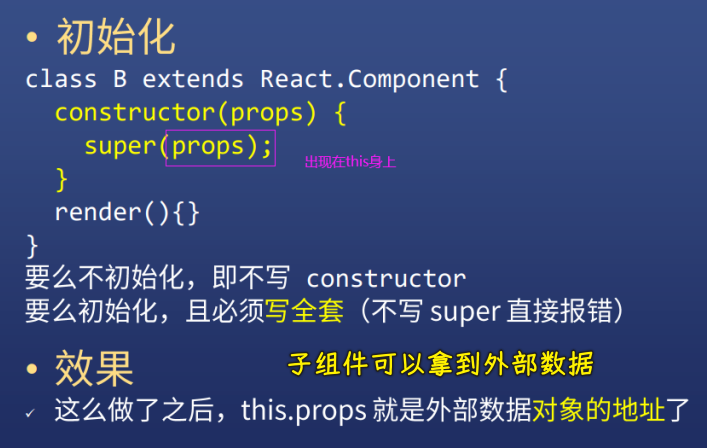
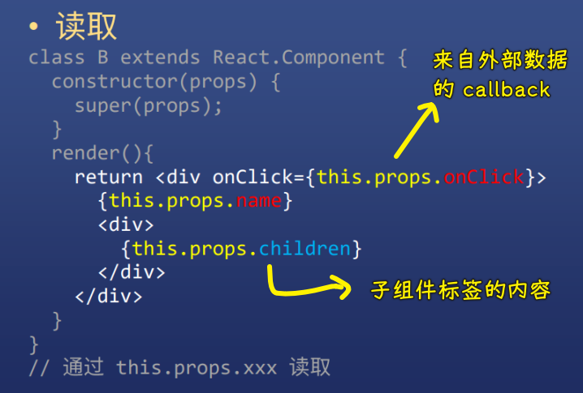
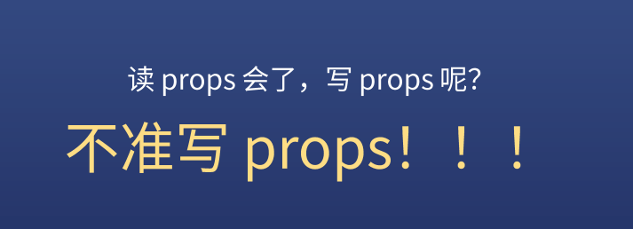
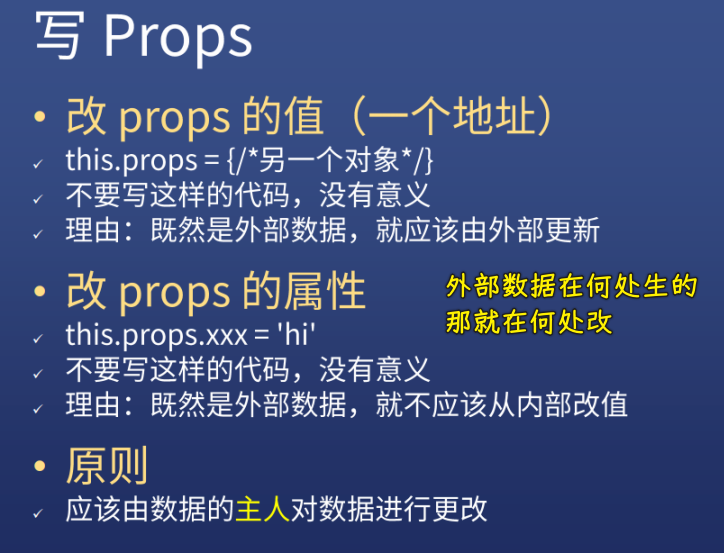
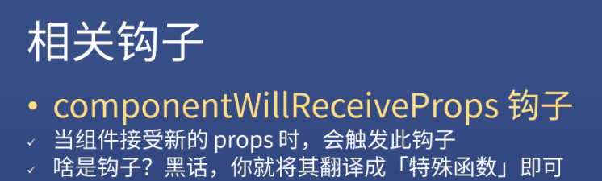

### ✍️ Tangxt ⏳ 2021-03-21 🏷️ 类组件

# Class 组件详解

## ★英语小课堂

## 两种创建 Class 组件的方式

1）ES5 方式（过时）

2）ES6 方式

3）哪种好

## ★Props（外部数据）

1）props

外部数据一般都是来自父元素的内部数据：

初始化：

2）子组件读取 props

3）谁写 props

让`props`的**主人**对数据进行更改：

4）相关钩子

`componentWillReveiveProps`钩子已被弃用 -> 请不要使用！

