### ✍️ Tangxt ⏳ 2021-03-24 🏷️ 函数组件

# 函数组件

## ★函数组件比 class 组件简单

### <mark>1）函数组件的创建方式</mark>


话说，函数组件能替代 Class 组件吗？


这是完全可以的！

可我们为什么要用函数组件代替 Class 组件呢？ -> **因为简洁呀！**

### <mark>2）对比类组件函数组件实现 +1</mark>

#### <mark>1、class 组件</mark>

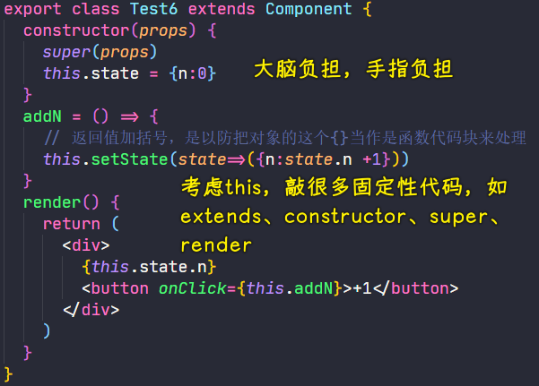

#### <mark>2、函数组件</mark>

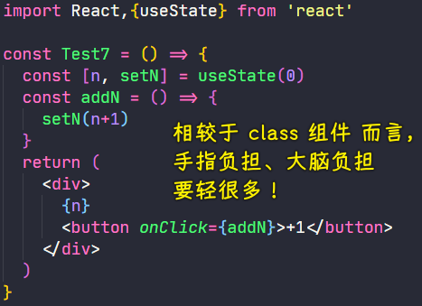

#### <mark>3、小结</mark>

对比函数组件和类组件：

1. class 有`this`
2. 函数消除了 `this`
3. 写法上函数简单
4. 功能上 -> 请看后边

### <mark>3）函数组件代替 class 组件</mark>

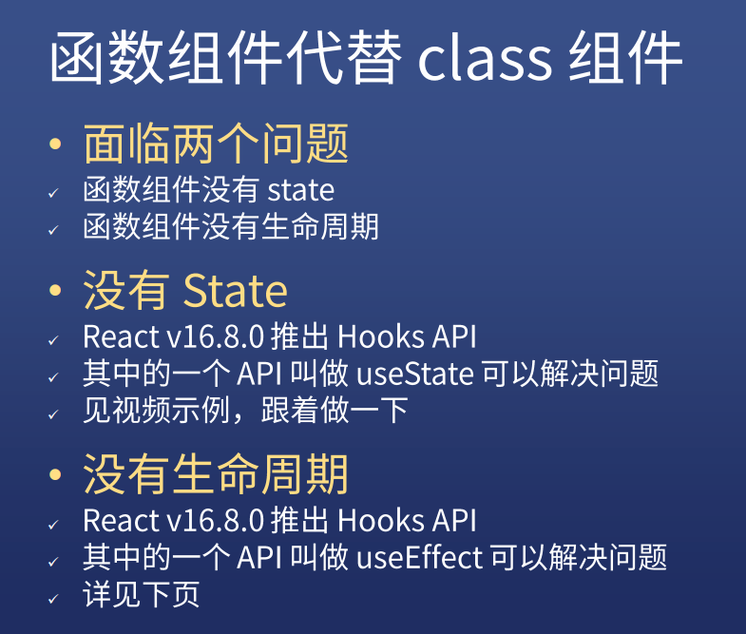

> `useEffect`：函数式编程的专有名词，主要解决生命周期问题（回答面试：解决副作用问题） -> 面试一套回答，开发一套回答！这得看面试官的水平如何！

## ★函数组件模拟生命周期

### <mark>1）componentDidMount</mark>

> 模拟第一次渲染


我们知道这个`componentDidMount`在类里边是只执行一次的

如果我们这样模拟（**直接写**）：

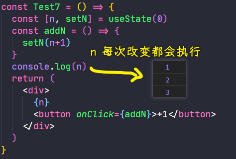

> 如果你写成`setN(n)`这样，是不会执行 Test7 的，因为数据没变！

如果我们用了`userEffect(()=>{})`这样模拟，这跟「直接写」是差不多的！

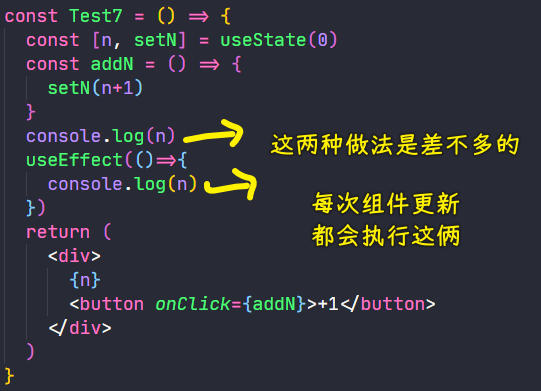

但是，如果给`useEffect`加了第二个参数（**指明在什么情况下去运行这个函数**），如用空数组做第二个参数，就可以模拟第一次渲染的钩子：

``` js
console.log(n)
useEffect(()=>{
  console.log(n)
},[])
```

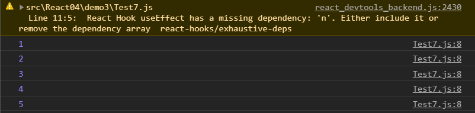

关于这个警告：[reactjs - How to fix missing dependency warning when using useEffect React Hook? - Stack Overflow](https://stackoverflow.com/questions/55840294/how-to-fix-missing-dependency-warning-when-using-useeffect-react-hook)

### <mark>2）componentDidUpdate（自定义 Hook）</mark>

> 模拟数据更新执行函数

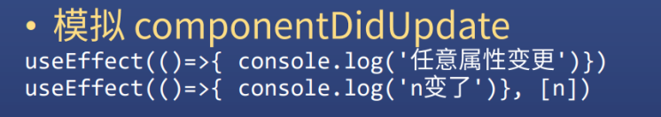

- 第二个参数：表示什么数据更新的时候执行，如`n`更新就执行第一个参数
- 这是包括第一次从`undefined`变成有的！ -> 也就是第一次渲染，也算是组件已经更新了！

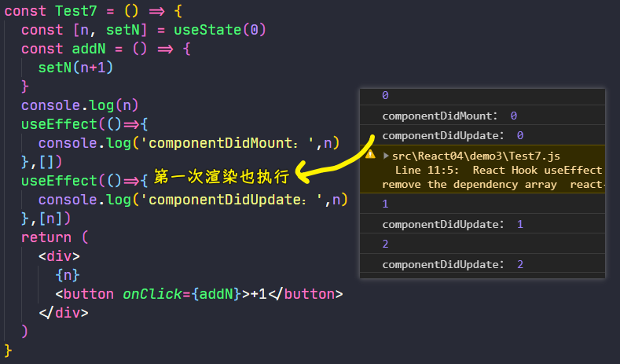

如果多个数据，只有监听了的数据变化才会执行：

- 你只监听了`n`，即第二个参数是`[n]`，`n`变了，第一个参数才会执行
- 你监听两个，写成数组`[n,m]`

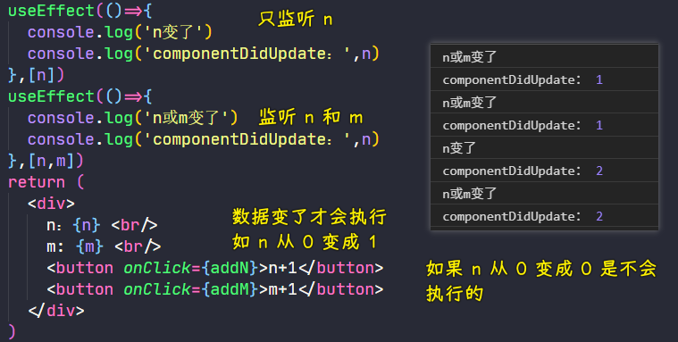

如果是所有 `state` 数据，可以直接不写，意思就是任何一个 `state` 变化都会执行（开始的那样，即不带第二个参数）：

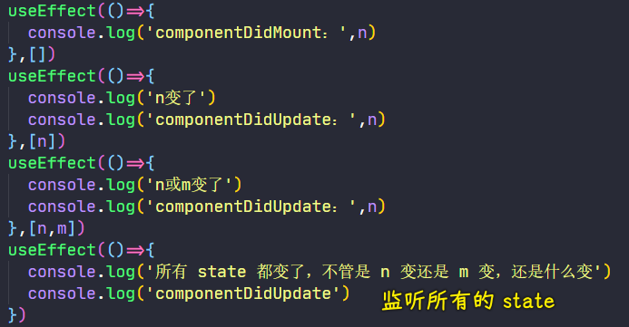

💡：话说，如何消除第一次变化的执行？

姿势 1：加一层`useState`计数

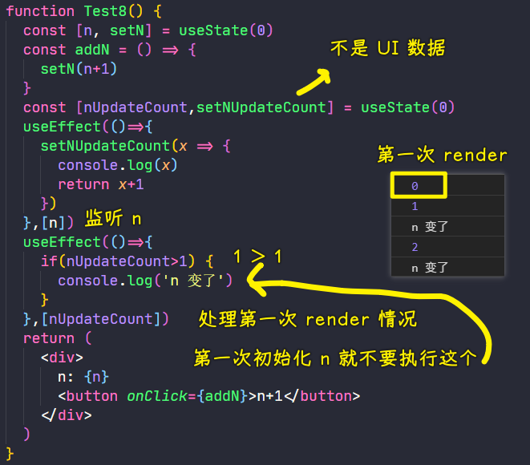

这种姿势很麻烦，还要额外声明一个东西！

姿势 2：通过函数组合（一定是`use`开头的函数名返回这个计数的数据）

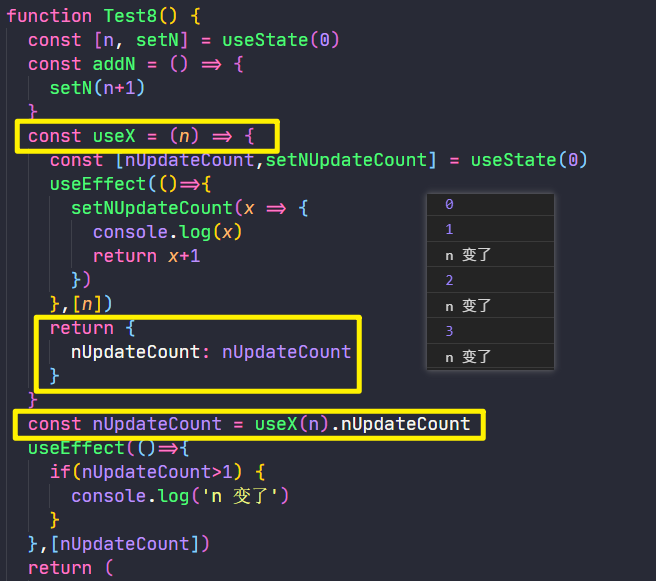

把这个东西从函数组件里边抽离出来，直接封装成：

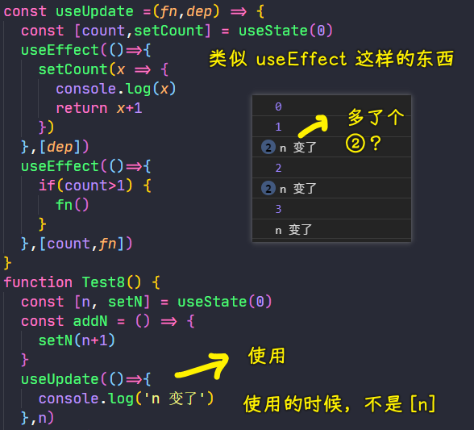

这个做法，相当于重写了一个功能更完善（**排除第一次变化**）的`useEffect`

目前这个代码，是有问题的，看到那个`②`没有？这意味着`fn`多次执行了：

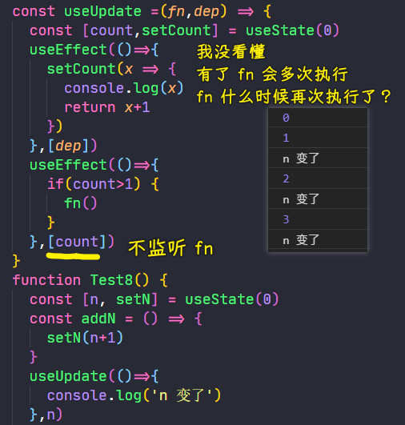

一个疑问：

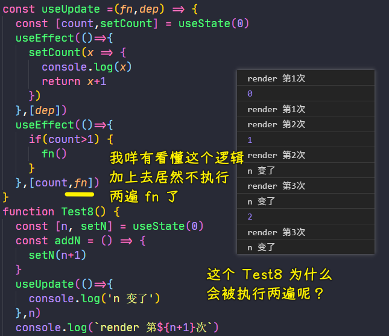

我测试了一下，发现这是代码缓存的缘故，我把使用`useUpdate`的第二个参数改成是`[n]`这样，就得到了我想要的效果了！

为什么会执行两遍？ -> `useUpdate`它搞得鬼！

默认的`useEffect`，不会在`n`变化的时候执行两遍`Test8`：

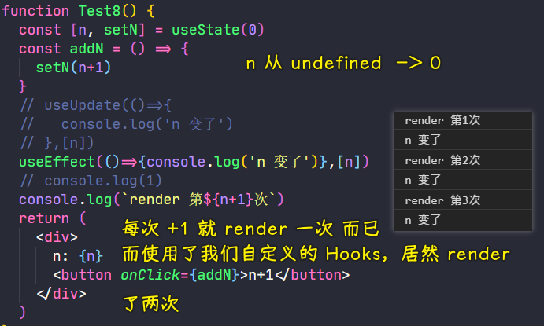

目前的问题是：

- `useUpdate`监听`fn`的话（不加这个居然会给警告），会执行两遍`fn`，不监听则执行一遍`fn` -> 可为啥会这样呢？
- 使用了`useUpdate`会执行两遍`Test8` -> 为什么不只执行一次呢？ -> 如果执行两遍，第二次执行时`n`没变，但`fn`变了，所以不要监听`fn`，这样就执行了一遍`fn`！

为什么管第二个参数叫「依赖项」？ -> 因为第一个参数是否执行，依赖第二项的变化与否！

为什么第二个参数为`[]`就只会执行一遍`fn`？ -> 因为`fn`不依赖任何变量，无论那些变量怎么变，`fn`的执行结果都不会变，既然执行结果都不变了，再执行也就没有任何意义了，所以只执行一遍`fn`就足够了！

---

执行两遍如何解决？

我测试了一下，关闭严格模式也无法解决！ -> 打包后也是执行两遍！

参考：[为什么 react 的函数组件每次渲染执行两次？- 知乎](https://www.zhihu.com/question/387196401)

既然无法解决，我就认为这个`useUpdate`写得并不好，于是在网上在找到了模拟`componentDidUpdate`的另一种写法：

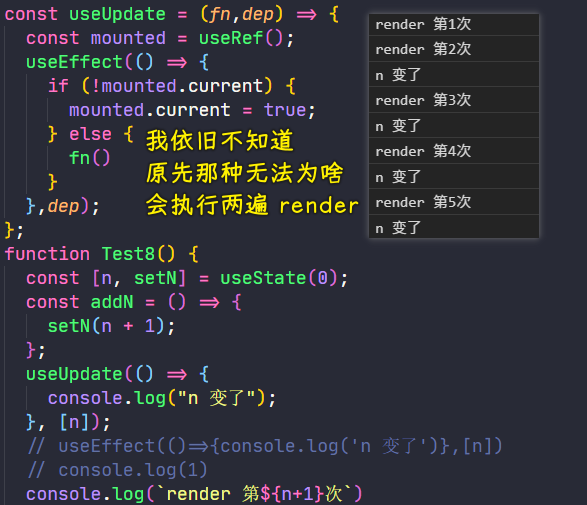

➹：[使用 React Hooks 模拟生命周期](https://juejin.cn/post/6844903921442373639)

---

可以把`useUpdate`封装成一个文件 -> 这就叫做「**自定义 Hook**」

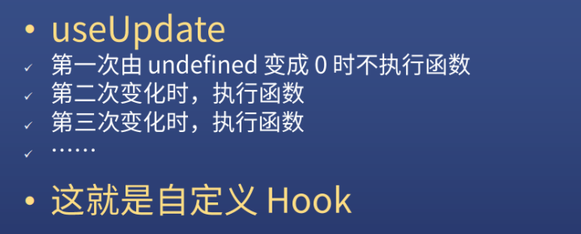

`useUpdate`就是我们第一个自定义 Hook！

### <mark>3）componentWillUnmount</mark>

> 模拟消失

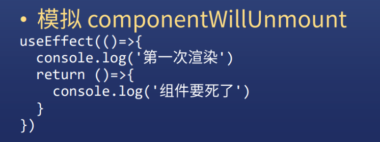

``` jsx
import React, { useState,useEffect } from "react";

const Fa = () => {
  const [sonVisible, setSonVisible] = useState(true);
  const hide = () => {
    setSonVisible(false);
  };
  const show = () => {
    setSonVisible(true);
  };
  return (
    <div>
      {sonVisible ? (
        <button onClick={hide}>hide</button>
      ) : (
        <button onClick={show}>show</button>
      )}
      {sonVisible ? <Test9/> : null}
    </div>
  );
};

const Test9 = () => {
  const [n, setN] = useState(0);
  const addN = () => {
    setN(n + 1);
  };

  useEffect(() => {
    console.log('Son 第一次渲染')
    return () => {
      console.log('组件 Son 要死了')
    }
  },[])
  console.log(`Son render 第${n + 1}次`);
  return (
    <div>
      n: {n}
      <button onClick={addN}>n+1</button>
    </div>
  );
};

export default Fa;
```

效果：

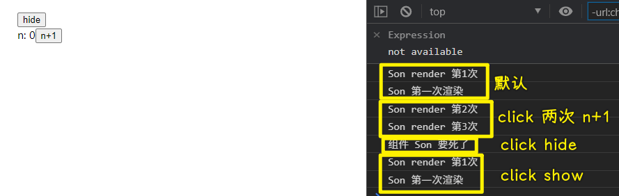

> 要加`[]`参数，不然，子组件状态发生变化时，那个 `console.log('组件 Son 要死了')` 也会执行！

解析：

- 默认展示时，不会执行这个`useEffect`的返回值，只会执行`console.log('Son 第一次渲染')`
- 隐藏时，会执行这个`useEffect`的返回值 -> 即在组件将要销毁前执行

---

可以看到，React 它有一个特点，那就是 -> **所有东西都可以通过函数组合来实现**

### <mark>4）其它生命周期怎么模拟</mark>

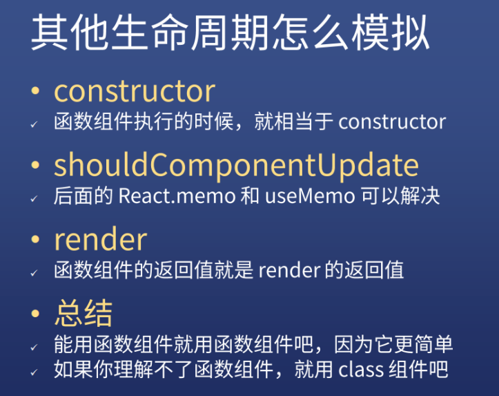

## ★了解更多

➹：[轻松学会 React 钩子：以 useEffect() 为例 - 阮一峰的网络日志](http://www.ruanyifeng.com/blog/2020/09/react-hooks-useeffect-tutorial.html)

➹：[React Hooks 入门教程 - 阮一峰的网络日志](https://www.ruanyifeng.com/blog/2019/09/react-hooks.html)
