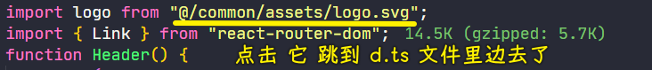
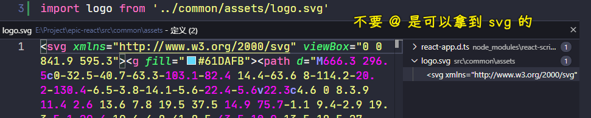
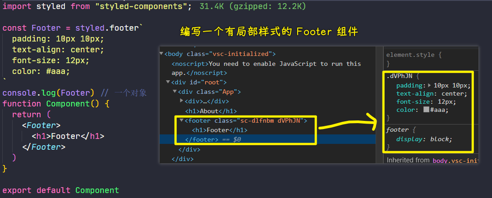
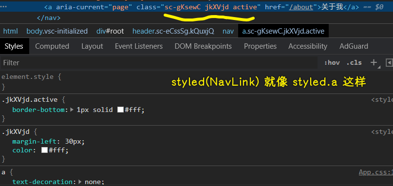
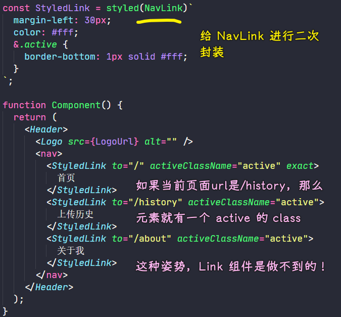
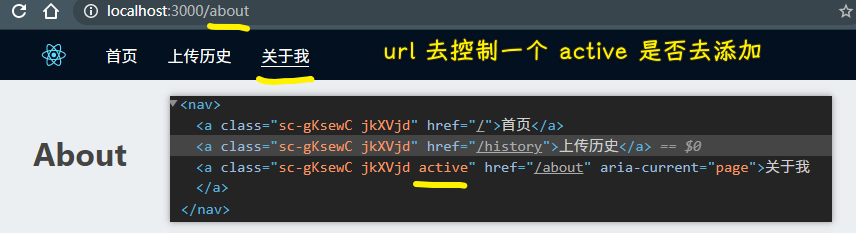
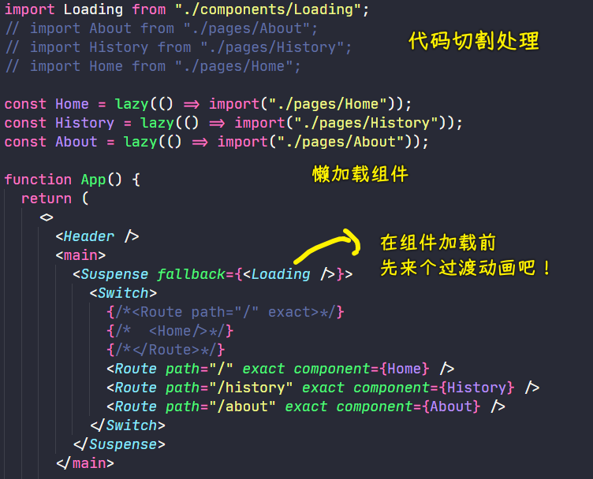

### ✍️ Tangxt ⏳ 2021-03-25 🏷️ epic  

# 01-项目结构搭建、样式引入、状态管理

1）环境搭建

用 `create-react-app` 创建项目

安装的依赖包：

- `yarn add react-router-dom`
- `yarn add mobx`
- `yarn add styled-components`

2）页面结构搭建 & 单页面应用路由

文档：[React Router: Declarative Routing for React.js](https://reactrouter.com/web/guides/quick-start)

页面：

1. Home
2. History
3. About

公共组件：

- Footer
- Header

💡：组件中需要用到图片，那我应该把这图片放置到那个目录好呢？

根目录结构：

```
.
├── build/      : 存放项目被 webpack 处理后生成的文件；
├── config/     : 存放的是项目的配置文件；
├── node_modules/   : 存放 npm 安装的工具包 或 模块；
├── public/     : 静态资源，该目录下的文件不会被 webpack 处理，它们会被拷贝到 build/ 文件夹下；
├── scripts/    : 与项目的构建、打包 或 服务 相关的脚本；
└── src/        : 项目的源代码及资源；
```

`src` 目录结构：

```
src/
├── app/    : 存放项目业务代码；
├── common/     : 存放项目共用的资源，如：常用的图片、图标、共用的组件、共用的样式、常量文件等等；
│   ├── assets/     : 存放项目共用的代码以外的资源，如：图片、图标、视频 等；
│   ├── component/      : 存放项目共用的组件，如：封装的导航条、选项卡等等；  备注：这里的存放的组件应该都是展示组件；
│   ├── constant.less       : 存放 Less 的常量；
│   └── constant.js     : 存放 js 的常量；
├── index.jsx       : webpack 的入口文件；
└── registerServiceWorker.js
```

我放置在 `common/assets/` 里边

➹：[React 项目规范 - 简书](https://www.jianshu.com/p/7f81913d1298)

💡：在 React 中，如何用`@`访问`src`？

1. 找到`node_modules/react-scripts/config/webpack.config.js` -> VS Code 快捷键 `Ctrl + p`
2. 找到 `alias`，添加代码：`'@': path.resolve('src'),`

如何在输入`@`时，让 VS Code 提示路径？

1. 安装插件：`path-intellisense`
2. 配置插件：`"path-intellisense.mappings": {"@": "${workspaceRoot}/src" }`

➹：[vs code 中路径别名（@）提示和转定义等问题。 - 简书](https://www.jianshu.com/p/1798d57ecdab)

💡：如何点击路径跳到图片处？



不要`@`是可以的：



3）styled-components 控制样式

- 文档：[styled-components](https://styled-components.com/)
- [styled-components 基本用法 - 知乎](https://zhuanlan.zhihu.com/p/347651032)
- 安装语法提示插件：`vscode-styled-components`

1、Footer



- `styled.footer`即`footer`元素的样式
- `Footer`的类型是：`Symbol(react.forward_ref)`
- `Component`的类型是：`Symbol(react.element)` -> 结合`Footer` -> 返回一个带有样式的 React 元素！

💡：把`index.js`引入的`index.css`给删了，为啥要删？

让`App.css`控制整个页面的全局样式！

💡：为啥 `App.css` 有个`#root`用于控制整个应用的布局？

如果`App.js`，返回默认的`<div className="App"></div>`，那么页面就多了一层`.App`了，即`div#root > div.App` 这样结构！

所以我们改了一下`App.js`，让它返回的是`<></>`，这样就没有多余的`div`包裹元素了！

2、Header

``` jsx
import React from "react";
import LogoUrl from "@/common/assets/logo.svg";
import { NavLink } from "react-router-dom";
import styled from "styled-components";

const Header = styled.header`
  display: flex;
  align-items: center;
  padding: 10px 100px;
  background-color: #02101f;
`;

const Logo = styled.img`
  height: 30px;
`;

const StyledLink = styled(NavLink)`
  margin-left: 30px;
  color: #fff;
  &.active {
    border-bottom: 1px solid #fff;
  }
`;

function Component() {
  return (
    <Header>
      <Logo src={LogoUrl} alt="" />
      <nav>
        <StyledLink to="/" activeClassName="active" exact>
          首页
        </StyledLink>
        <StyledLink to="/history" activeClassName="active">
          上传历史
        </StyledLink>
        <StyledLink to="/about" activeClassName="active">
          关于我
        </StyledLink>
      </nav>
    </Header>
  );
}

export default Component;
```

💡：`styled(NavLink)`这是什么语法？


这是在对`NavLink`组件进行**二次样式修饰** -> `NavLink`是个`a`元素，相当于往 `a` 元素上加了其它`class`！



> `class` 附加到 React 元素的根元素上

其实说白了，对于自定义组件标签，我们就得用括号，如果你不用括号的话，是无法识别这是一个 HTML 元素的！

➹：[React 中使用 styled-components 的基础使用 - 一只菜鸟攻城狮啊 - 博客园](https://www.cnblogs.com/suihang/p/9971890.html)

➹：[styled-components 使用方法 - SegmentFault 思否](https://segmentfault.com/a/1190000017155008)

💡：`react-router-dom`的`NavLink`和`Link`有啥区别？

`<NavLink>`是`<Link>`的一个特定版本，会在匹配上当前的 url 的时候**给已经渲染的元素添加参数**，该组件的属性有：

* activeClassName(string)：设置选中样式，默认值为 `active`
* activeStyle(object)：当元素被选中时，为此元素添加样式
* exact(bool)：为 `true` 时，只有当路径完全匹配时， `class` 和 `style` 才会被应用
* strict(bool)：为 `true` 时，在确定为位置是否与当前 URL 匹配时，将考虑位置 pathname 后的斜线
* isActive(func)： 判断链接是否激活的额外逻辑的功能



简单来说：



➹：[React Router 中 Link 和 NavLink 的学习总结_冰雪为融的博客-CSDN 博客](https://blog.csdn.net/lhjuejiang/article/details/80366839)

➹：[javascript - React Router v4 `<NavLink>` vs `<Link>` benefits - Stack Overflow](https://stackoverflow.com/questions/47338077/react-router-v4-navlink-vs-link-benefits)

➹：[active styles using NavLink - React router beginners guide - Reactgo](https://reactgo.com/reactrouter/navlink/)

4）动态加载组件

页面一打开，不要一口气加载所有代码，先载入比较重要的 JS，之后视用户操作情况，再载入次要的 JS

不然，随着代码量的增加，页面载入时间也会随着拉长，最后影响用户体验

React Suspense & React Lazy 为 **16.6** 的版本才有的功能，而且目前这两东西无法在 SSR 场景下使用，如果你在此场景下，真得有代码切割的需求，那就必须使用「 Loadable Components」了！

- Lazy：动态载入 js，可以将程式码分割，需要用到时再用 `import` 载入
- Suspense：延迟载入 `component` 会被 `Suspense` 包覆 ，假如 `component` 还没载入完成， 就能够透过 `fallback` 显示一些提示讯息，**必须搭配 Lazy 使用**，如果只有写 Lazy 没有 Suspense 的话就会报错，另外，`Suspense` 可以包覆多个 lazy component

代码：



效果：


➹：[利用 React Suspense & React Lazy 來優化載入速度 - Coding Hot Pot - Medium](https://medium.com/coding-hot-pot/%E5%88%A9%E7%94%A8react-suspense-react-lazy%E4%BE%86%E5%84%AA%E5%8C%96%E8%BC%89%E5%85%A5%E9%80%9F%E5%BA%A6-befe89c1454f)

➹：[这就是你日思夜想的 React 原生动态加载 - 政采云前端团队](https://www.zoo.team/article/react-lazy-suspense)

5）mobx 实现状态管理

💡：`createContext`、`useContext`？

针对函数组件 -> 搞局部的全局数据的！

➹：[精读《Function Component 入门》](https://juejin.cn/post/6844903854174109703#heading-12)

➹：[React Hook 中 createContext & useContext 跨组件透传上下文与性能优化 - Postbird - 猫既吾命](http://www.ptbird.cn/react-createContex-useContext.html)

💡：用 cra 创建出来的项目默认不支持装饰器语法？

如何解决？ -> 用两种姿势：

姿势 1：

使用 `eject` 这个命令，`yarn eject`后，`create-react-app`会生成所有配置文件 -> 根据这个配置，去配置支持装饰器的插件即可！

缺点：若 cra 升级，那生成的配置可能会和新版不兼容 -> 该生成的配置可无法自动随 cra 升级

姿势 2：

通过 react-app-rewired 动态修改，修改 npm 等脚本，让其从 react-app-rewired 启动。

做法：

step1：安装依赖

``` bash
yarn add -D customize-cra react-app-rewired @babel/plugin-proposal-decorators
```

step2：在根目录下，新建 `config-overrides.js`

``` js
const {
  override,
  addDecoratorsLegacy,
  disableEsLint,
  overrideDevServer,
  watchAll,
} = require("customize-cra");

module.exports = {
  webpack: override(addDecoratorsLegacy(), disableEsLint()),
  devServer: overrideDevServer(
    // dev server plugin
    watchAll()
  ),
};
```

step3：修改 `package.json` 文件

``` json
{
  "scripts": {
    "start": "react-app-rewired start",
    "build": "react-app-rewired build",
    "test": "react-app-rewired test",
    "eject": "react-app-rewired eject"
  }
}
```

重新启动项目 -> `yarn start` -> 没有报错了！不过原先使用`@`这样的路径则失效了……

➹：[SyntaxError: Support for the experimental syntax 'decorators-legacy' isn't currently enabled_some1204的博客-CSDN博客](https://blog.csdn.net/some1204/article/details/105752622)

---


