### ✍️ Tangxt ⏳ 2021-04-07 🏷️ epic

# 02-antd、leancloud 登录注册、mobx

### <mark>1）antd 的引入和基本使用</mark>

#### <mark>1、快速上手</mark>

安装：

``` bash
yarn add antd
```

在安装过程中，报错了： `Timeout error on yarn install with https://registry.npm.taobao.o rg/date-fns/download/date-fns-2.19.0.tgz`

如何解决？

``` bash
yarn config set network-timeout 300000
```

配置一下网络超时的时间就好了！

遇到 `ESOCKETTIMEDOUT` 这样的错误都可以这样做！

使用：

在 `src/App.js` 里边使用 `Button` 组件：

* `import { Button } from "antd";`
* `<Button type="primary">Button</Button>`

在 `src/App.css` 的顶部引入样式：

* `@import '~antd/dist/antd.css';`

当然，你也可以在 `src/index.js` 里边导入样式： `import "antd/dist/antd.css"`

效果：


#### <mark>2、CRM 大法，完成我们的需求</mark>

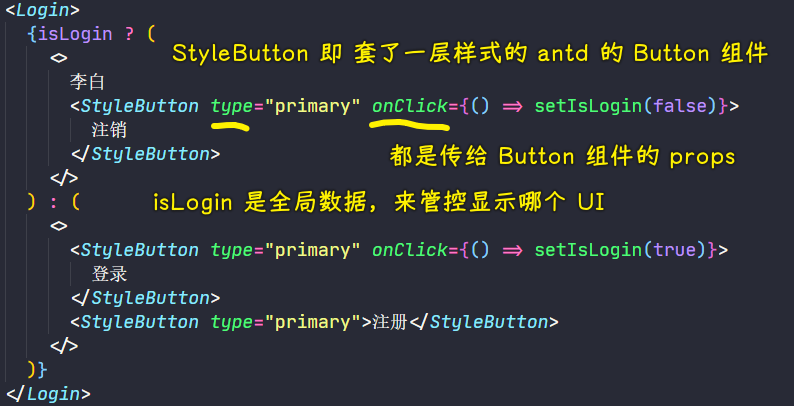

效果：

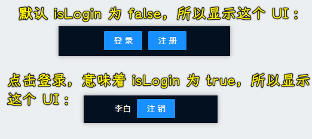

### <mark>2）引入 antd 的 form 表单实现注册页面</mark>

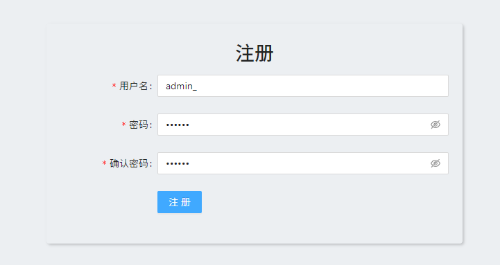

💡：这个是什么语法？

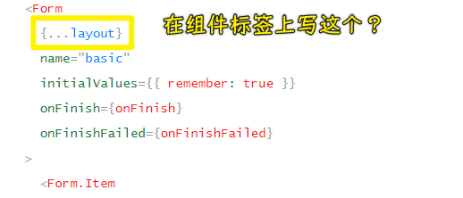

``` js
const layout = {
  labelCol: {
    span: 8
  },
  wrapperCol: {
    span: 16
  },
};
```

React 支持这种写法吗？还是说这是用了其它插件做到的？

- 这个语法的目的：方便拓展我们的属性，不然，自己还得一个个写，就很不动态了
- 在 JSX 里边的这个`...`运算符，表示的是将一个对象的键值对与 `ReactElement` 的 `props` 属性合并 -> React 会帮我们拷贝到组件的 `props` 属性中，总之，这个过程是由 React 操控的
- 可理解成：`<Component labelCol={xxx} wrapperCol={yyy} />`
- 注意：如果用到了同名属性，后者将覆盖前者，如`<Component {...layout} labelCol={zzz} />`
- 本质：babel 识别它，转化成 AST 的一份子，其类型是`JSXSpreadAttribute`

➹：[react 中的解构赋值例子_lskshz 的专栏-CSDN 博客_react 解构](https://blog.csdn.net/lskshz/article/details/72568882)

➹：[React.js 给组件属性赋值的展开运算符应该怎么理解？- SegmentFault 思否](https://segmentfault.com/q/1010000015225190)

### <mark>3）antd 表单验证的几种方</mark>

> 文档：[表单 Form - Ant Design](https://ant.design/components/form-cn/#Rule)

Rule 支持接收 object 进行配置，也支持 function 来动态获取 form 的数据：

``` ts
type Rule = RuleConfig | ((form: FormInstance) => RuleConfig);
```

- `rules`参数 -> 是个数组 -> 用于校验规则，设置字段的校验逻辑
  - 数组里边的元素，是一个个普通对象或者一个个函数，如果是对象值，那么这些对象的每个属性，如`required`、`message`、`min`、`max`、`validator`等都是有意义的！

对于注册页面：

#### <mark>1、用户名输入框校验</mark>

``` js
const validateUserName = (rule, value) => {
  if (/\W/.test(value)) return Promise.reject("只能是字母数字下划线");
  if (value.length < 4 || value.length > 10) return Promise.reject("长度为 4~10 个字符");
  return Promise.resolve();
};
```

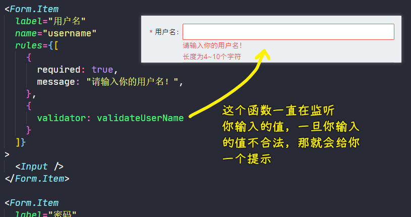

- validator：自定义校验，接收 Promise 作为返回值 -> `(rule, value) => Promise`
- required：是否为必选字段 -> `Boolean` -> 你设它为`true`，那「用户名」旁边就有一个红色的`*`，本质上来说，这个`*`也是一种提示！

#### <mark>2、密码输入框校验</mark>

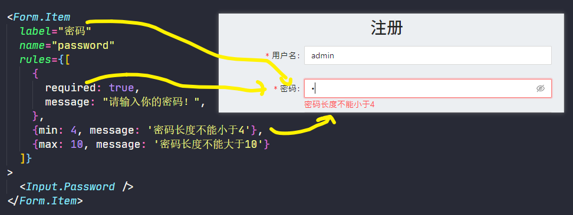

#### <mark>3、确认密码输入框校验</mark>

``` js
const validateConfirm = ({ getFieldValue }) => ({
  validator(rule, value) {
    if (getFieldValue("password") === value) return Promise.resolve();
    return Promise.reject("两次密码不一致");
  },
});
```

`{ getFieldValue }`是 Form 实例，我们拿到实例的`getFieldValue`方法，而箭头函数的返回值就是`RuleConfig`，这就像上边的`{validator: validateUserName}`一样

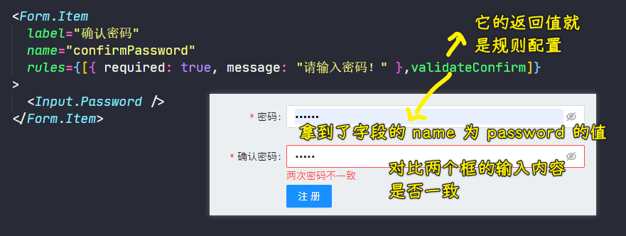

### <mark>4）Leancloud 使用介绍</mark>

#### <mark>1、介绍</mark>

使用一个 Serverless 平台！ -> 不用自己去写后端代码，就能提供后端服务！

我们只要调用它提供的前端 API，就能使用它提供的后端服务了！

适用场景：

- 一个公司的小产品
- 个人项目

如果项目特别复杂 -> 建议自己去写后端代码，而不是使用 Leancloud

#### <mark>2、快速入门</mark>

> 文档：[数据存储开发指南 · JavaScript - LeanCloud 文档](https://leancloud.cn/docs/leanstorage_guide-js.html#hash799084270)

安装：

``` bash
yarn add leancloud-storage
```

创建`epic`应用 -> 创建一个 Class，就是在创建一个数据库！

➹：[【图文教程】前端使用云存储，利用 LeanCloud 管理页面数据 - SegmentFault 思否](https://segmentfault.com/a/1190000021165700)

### <mark>5）使用 Leancloud 完善 Auth 模型实现登录注册接口</mark>

> 文档：[用户注册、登录](https://leancloud.cn/docs/leanstorage_guide-js.html#hash954895)

登录注册接口：

``` js
import AV, { Query, User } from "leancloud-storage";

// 初始化
AV.init({
  appId: "XlO937...",
  appKey: "hcH...",
  serverURL: "https://xxx.lc-cn-n1-shared.com",
});

const Auth = {
  // 注册
  register(username, password) {
    let user = new User();
    user.setUsername(username);
    user.setPassword(password);
    return new Promise((resolve, reject) => {
      user.signUp().then(
        (loginedUser) => resolve(loginedUser),
        (error) => reject(error)
      );
    });
  },

  // 登录
  login(username, password) {
    return new Promise((resolve, reject) => {
      User.logIn(username, password).then(
        (loginedUser) => resolve(loginedUser),
        (error) => reject(error)
      );
    });
  },

  // 注销
  logout() {
    User.logOut();
  },

  // 获取当前用户信息
  getCurrentUser() {
    return User.current();
  },
};

export { Auth };
```

> 把所有的和服务器相关的操作都放到`models`里边 -> 如果就一个功能模块，那就搞一个`index.js`就好了！如果还有其它模块，如用户个人信息、发布的状态、日志等，那就搞多几个文件，而不是都写在一个文件里边！

💡：看文档技巧？

> 文档：[JavaScript SDK 安装指南 - LeanCloud 文档](https://leancloud.cn/docs/sdk_setup-js.html#hash641427453)

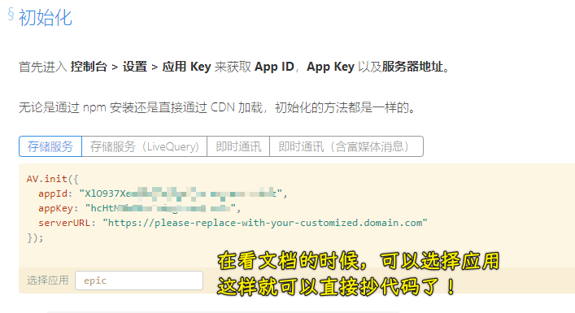

💡：如何去掉控制台里边的这个警告？

警告发生的场景：在表单组件里边删除输入的内容

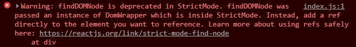

在`src/index.js`里边：


### <mark>6）接口模型、mobx 全局状态、组件间的数据联动</mark>

注册功能用到的数据联动：

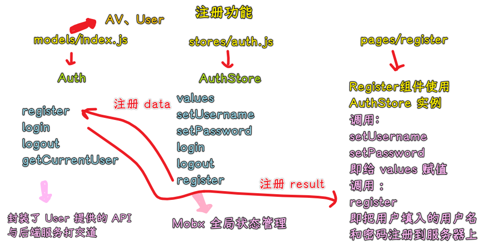

效果：

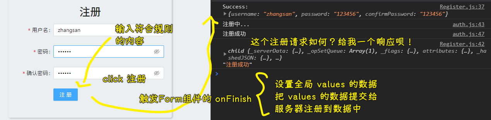

> UI 层 -> action -> values

models 只管数据，不管 UI，stores 可以管 UI 展示！

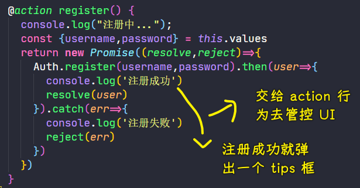

这就是我们还要`Auth.register(username,password).then()`这样搞一层`Promise`的原因所在了！而不是，让`models`里边的代码去处理响应回来的数据！总之，`models`只是数据的搬运工罢了！当然，最终响应回来的数据是交给了 UI 层去处理了，而`store`只是处理了一个过渡罢了，如提示、过渡动画等……整体上看：**M（发请求拿响应数据） -> C（把 Model 数据传给 View，期间可以搞一些辅助的 UI，如过渡动画、提示框等） -> V（React 组件）**

数据库情况：

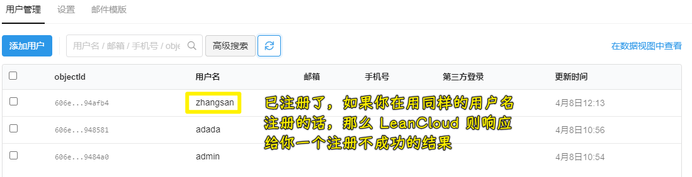

注册同一个用户名：

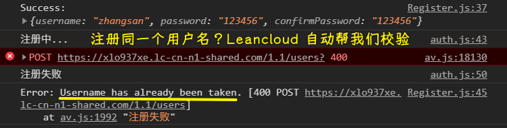

---

登录功能效果：

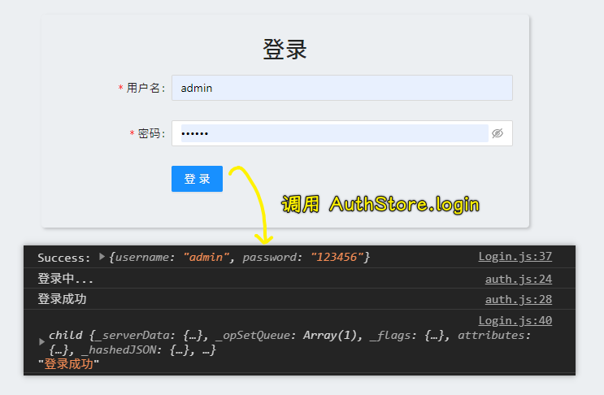

### <mark>7）登录注册功能完善</mark>

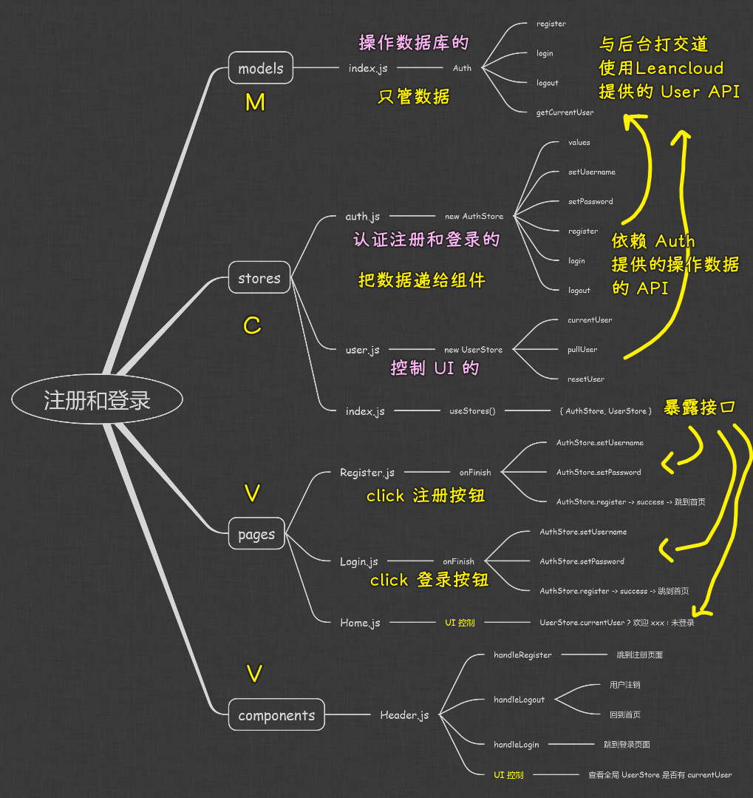

💡：关于模块的导入导出？

如果你这样写：

``` js
export const useStores = () => useContext(context) 
```

> 不能直接导出一个变量，得导出一个带声明的变量

那么其它模块用的时候得这样：

``` js
import { useStores } from "../stores";
```

💡：有两个模块，都导入了同一个模块，那么这个模块是一样的吗？

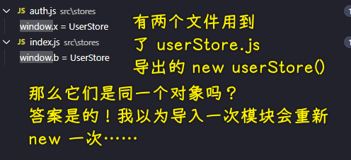

> 图误：`userStore.js` -> `user.js`

测试结果：`window.x === window.b // true`
