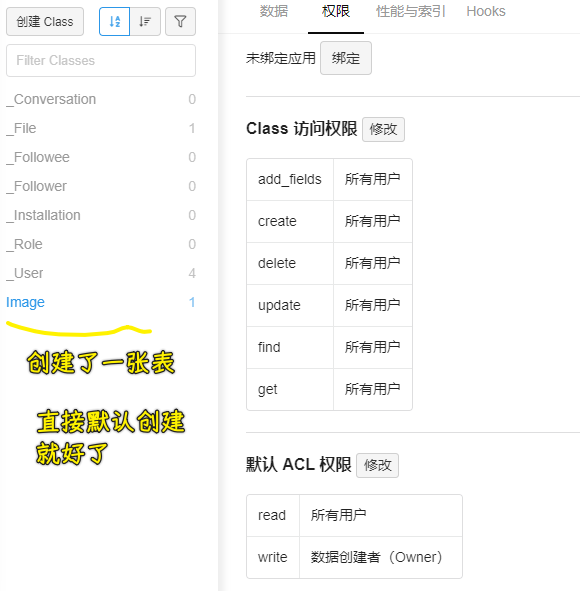

### ✍️ Tangxt ⏳ 2021-04-09 🏷️ epic

# 03-epic 项目文件上传、上传历史


1）leancloud 实现文件上传、图片信息全局状态管理

> 文档：[数据类型](https://leancloud.cn/docs/leanstorage_guide-js.html#hash799084270)、[文件](https://leancloud.cn/docs/leanstorage_guide-js.html#hash825935)


> model -> 接口层、模型层；store -> 全局状态；components -> UI 层

1、与服务器打交道的 Uploader

``` js
const Uploader = {
  add(file, filename) {
    const item = new AV.Object("Image");
    const avFile = new AV.File(filename, file);
    item.set("filename", filename);
    item.set("owner", AV.User.current());
    item.set("url", avFile);
    return new Promise((resolve, reject) => {
      item.save().then(
        (serverFile) => resolve(serverFile),
        (error) => reject(error)
      );
    });
  },
};
```

💡：`new AV.Object("Image")`？

> 在构建对象时，为了使云端知道对象属于哪个 class，需要将 class 的名字作为参数传入。你可以将 LeanCloud 里面的 class 比作关系型数据库里面的表。一个 class 的名字必须以字母开头，且只能包含数字、字母和下划线。

所以创建了一张表：



💡：`new AV.File(filename, file)`？

> 有时候应用需要存储尺寸较大或结构较为复杂的数据，这类数据不适合用 `AV.Object` 保存，此时文件对象 `AV.File` 便成为了更好的选择。文件对象最常见的用途是**保存图片**，不过也可以用来保存文档、视频、音乐等其他二进制数据。

示例：

``` js
const data = { base64: 'TGVhbkNsb3Vk' };
// resume.txt 是文件名
const file = new AV.File('resume.txt', data);
```

💡：`item`配合`avFile`使用？

`AV.Object`旗下的属性支持两种特殊的数据类型 `Pointer` 和 `File`，可以分别用来存储指向其他 `AV.Object` 的指针以及二进制数据

所以：

你上传了一张图片，就是在`Image`表里创建一条记录：


此刻，`Image`表里的这个`item`记录的这个`url`字段指向了`File`表里`avFile`这条记录


> 存储服务似乎用了七牛提供的存储服务！

💡：`item.save()`？

是个异步操作，把数据存储到远程数据库，如果存储成功，响应回来给我们的`serverFile`是这样一个东西：


2、全局状态 ImageStore

``` js
import { observable, action, makeObservable } from "mobx";
import { Uploader } from "../models";

class ImageStore {
  constructor() {
    makeObservable(this);
  }
  @observable filename = "";
  @observable file = null;
  @observable serverFile = null;
  @observable isUploading = false;
  @action setFilename(newFilename) {
    this.filename = newFilename;
  }
  @action setFile(newFile) {
    this.file = newFile;
  }
  @action upload() {
    this.isUploading = true;
    return new Promise((resolve, reject) => {
      Uploader.add(this.file, this.filename)
        .then((serverFile) => {
          this.serverFile = serverFile;
          resolve(serverFile);
        })
        .catch((err) => {
          console.error("上传失败");
          reject(err);
        })
        .finally(() => (this.isUploading = false));
    });
  }
}

export default new ImageStore();
```

`Uploader`组件使用全局数据：


> 这跟之前的登录注册功能是一样的写代码姿势！ -> `Store`维护了我们要传给后台参数

效果：


💡：为什么抽离出一个 Uploader 组件？

这个组件是给 Home 页面用的！而这个页面需要用到很多东西，如果不把上传功能抽离成一个组件，那么 Home 页面就很乱了，而这也体现不了使用 React 的优势了！

💡：非受控表单？

所谓受控和非受控，指的是我们对某个组件状态的掌控，如果它的值只能由用户设置，也就是使用 Web 应用的人，那么这个组件的状态是「**非受控**」的，如果开发者可以通过 JS 代码来控制组件的状态，那么这个组件就是「**受控**」的

> 在 HTML 的表单元素中，它们通常自己维护一套`state`，并随着用户的输入自己进行`UI`上的更新，这种行为是不被我们程序所管控的。而如果将`React`里的`state`属性和表单元素的值建立依赖关系，再通过`onChange`事件与`setState()`结合更新`state`属性，就能达到控制用户输入过程中表单发生的操作。被`React`以这种方式控制取值的表单输入元素就叫做**受控组件**。

受控组件特点 -> 需要单独的为每个表单元素维护一个状态

而非受控组件 -> 利用`ref`属性，可以获取 `input` 元素的 `DOM` 属性信息，如获取用户输入的值 -> 用`defaultValue`属性来指定表单元素的默认值

**对于 file 类型的表单控件它始终是一个不受控制的组件，因为它的值只能由用户设置，而不是以编程方式设置。**

针对`type`类型的`file`的`input`元素，你要用非受控组件的方式去获取它的值！ -> 这就是使用`const ref = useRef()`的原因！

总之你不能通过这样：

``` jsx
<input type="file" value={this.state.files} onChange={(e) => this.handleFile(e)} />
```

去改变这个元素的值！

> file 表单元素的值是`fileRef.current.files` -> `files`（一个或多个文件，是个数组，没开启多选`multiple`的话，那么`files`的长度始终为`1`）

总之：

React 官方的官方的说法是：绝大部分时候推荐使用`受控组件`来实现表单，因为在受控组件中，表单数据由`React`组件负责处理；当然如果选择`受控组件`的话，表单数据就由`DOM`本身处理。

➹：[受控和非受控组件真的那么难理解吗？(React 实际案例详解）](https://juejin.cn/post/6858276396968951822#heading-7)

💡：`onChange`事件？

监听输入内容的改变

➹：[你真的了解 onChange 事件吗 - 知乎](https://zhuanlan.zhihu.com/p/168718667)

💡：IDL 属性？


我很好奇为啥是用`files`来获取元素的内容？而不是用`value`呢？

➹：[Browser APIs · 语雀](https://www.yuque.com/wendraw/fe/browser-api)

➹：[Web 技巧（07）. 在这一期中咱们一起来聊聊 HTML5 中的表单。说到 HTML](https://w3cplus.medium.com/web%E6%8A%80%E5%B7%A7-07-73e856f9e2f4)

2）使用 antd 上传组件实现点击和拖拽上传

