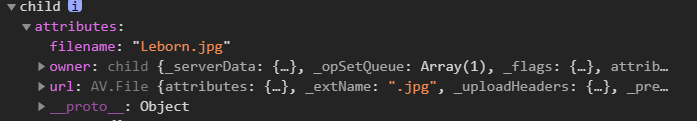

### ✍️ Tangxt ⏳ 2021-04-09 🏷️ epic

# 03-epic 项目文件上传、上传历史


1）leancloud 实现文件上传、图片信息全局状态管理

> 文档：[数据类型](https://leancloud.cn/docs/leanstorage_guide-js.html#hash799084270)、[文件](https://leancloud.cn/docs/leanstorage_guide-js.html#hash825935)


1、与服务器打交道的 Uploader

``` js
const Uploader = {
  add(file, filename) {
    const item = new AV.Object("Image");
    const avFile = new AV.File(filename, file);
    item.set("filename", filename);
    item.set("owner", AV.User.current());
    item.set("url", avFile);
    return new Promise((resolve, reject) => {
      item.save().then(
        (serverFile) => resolve(serverFile),
        (error) => reject(error)
      );
    });
  },
};
```

💡：`new AV.Object("Image")`？

> 在构建对象时，为了使云端知道对象属于哪个 class，需要将 class 的名字作为参数传入。你可以将 LeanCloud 里面的 class 比作关系型数据库里面的表。一个 class 的名字必须以字母开头，且只能包含数字、字母和下划线。

所以创建了一张表：


💡：`new AV.File(filename, file)`？

> 有时候应用需要存储尺寸较大或结构较为复杂的数据，这类数据不适合用 `AV.Object` 保存，此时文件对象 `AV.File` 便成为了更好的选择。文件对象最常见的用途是**保存图片**，不过也可以用来保存文档、视频、音乐等其他二进制数据。

示例：

``` js
const data = { base64: 'TGVhbkNsb3Vk' };
// resume.txt 是文件名
const file = new AV.File('resume.txt', data);
```

💡：`item`配合`avFile`使用？

`AV.Object`旗下的属性支持两种特殊的数据类型 `Pointer` 和 `File`，可以分别用来存储指向其他 `AV.Object` 的指针以及二进制数据

所以：

你上传了一张图片，就是在`Image`表里创建一条记录：



此刻，`Image`表里的这个`item`记录的这个`url`字段指向了`File`表里`avFile`这条记录


> 存储服务似乎用了七牛提供的存储服务！

💡：`item.save()`？

是个异步操作，把数据存储到远程数据库，如果存储成功，响应回来给我们的`serverFile`是这样一个东西：


2、全局状态 ImageStore

``` js
import { observable, action, makeObservable } from "mobx";
import { Uploader } from "../models";

class ImageStore {
  constructor() {
    makeObservable(this);
  }
  @observable filename = "";
  @observable file = null;
  @observable serverFile = null;
  @observable isUploading = false;
  @action setFilename(newFilename) {
    this.filename = newFilename;
  }
  @action setFile(newFile) {
    this.file = newFile;
  }
  @action upload() {
    this.isUploading = true;
    return new Promise((resolve, reject) => {
      Uploader.add(this.file, this.filename)
        .then((serverFile) => {
          this.serverFile = serverFile;
          resolve(serverFile);
        })
        .catch((err) => {
          console.error("上传失败");
          reject(err);
        })
        .finally(() => (this.isUploading = false));
    });
  }
}

export default new ImageStore();
```

`Uploader`组件使用全局数据：


> 这跟之前的登录注册功能是一样的写代码姿势！ -> `Store`维护了我们要传给后台参数

效果：


💡：非受控表单？


