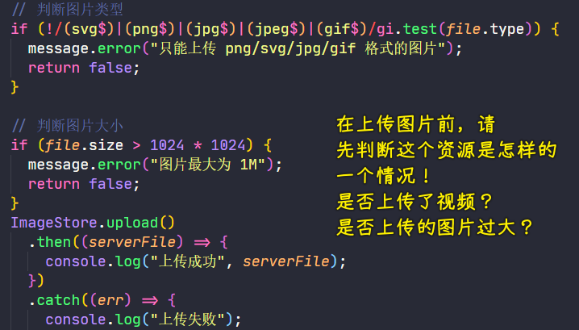
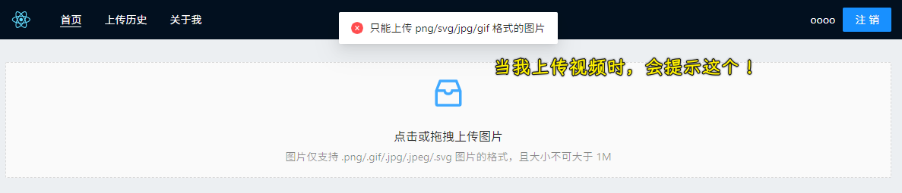
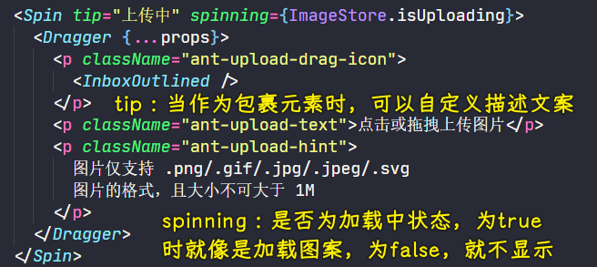
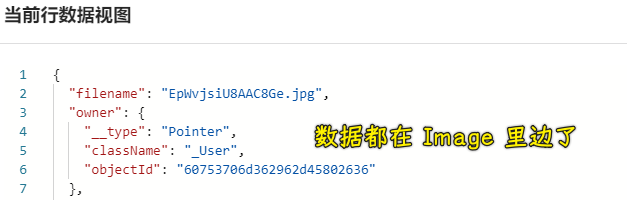
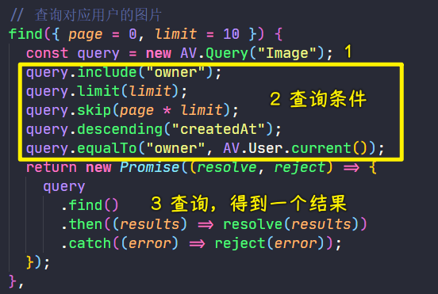
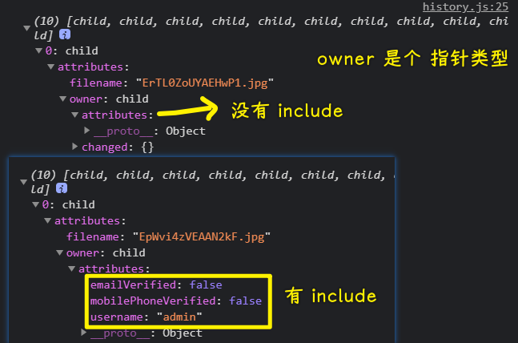
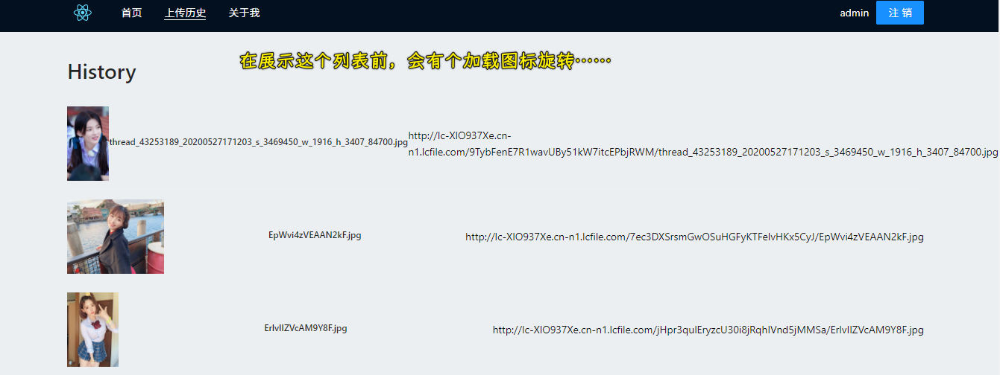
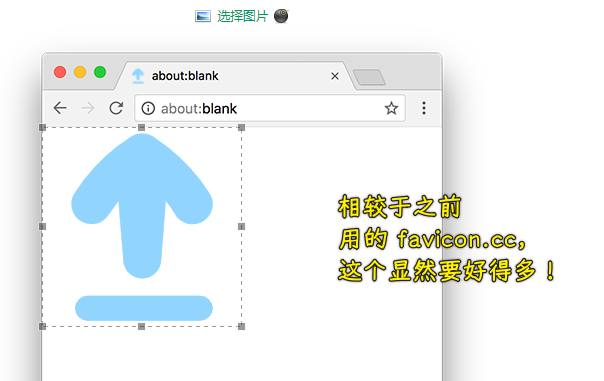

### ✍️ Tangxt ⏳ 2021-04-12 🏷️ epic

# 04-完结篇上传历史的实现

1）产品完善：上传限制与加载提示

目前的问题：可以上传视频等资源

如果什么都可以上传，而且上传内容的大小也不限制，那么这个免费的存储空间很容易就满了……

我们要做的：

1. 限制文件的类型
3. 限制文件的大小

用到的第三方组件：[加载中 Spin - Ant Design](https://ant.design/components/spin-cn/)

上传限制：



效果：




---

加载提示：



效果：


2）上传历史数据查询接口

数据都在 Leancloud 的 Image 里边：



我们要做的：

1. 查询数据
2. 展示数据

> CRUD 之 查询操作！

---

执行一次基础查询通常包括这些步骤：

1. 构建 `AV.Query`；
2. 向其添加查询条件；
3. 执行查询并获取包含满足条件的对象的数组。

代码：



* include：获取来自另一个`class`的数据，如`_User`
* limit：限制返回结果的数量（默认为 `100`），如`query.limit(10)`，表示「只获取 10 条」
* skip：跳过前`page*limit`条结果
* descending：按 `createdAt` 降序排列
* ascending：按 `createdAt` 升序排列
* equalTo：获取所有`owner`为当前登录用户的`Image`

> 注意： `skip` 的值越高，查询所需的时间就越长。作为替代方案，可以通过设置 `createdAt` 或 `updatedAt` 的范围来实现更高效的翻页，因为它们都自带索引。

💡：关于`include`？



➹：[数据存储入门教程 · JavaScript - LeanCloud 文档](https://leancloud.cn/docs/leanstorage-started-js.html#hash1905932728)

➹：[查询 · JavaScript - LeanCloud 文档](https://leancloud.cn/docs/leanstorage_guide-js.html#hash701396643)

3）上传历史全局状态管理

``` js
import {
  observable,
  action,
  makeObservable
} from "mobx";
import {
  Uploader
} from "../models";
import {
  message
} from "antd";

class HistoryStore {
  constructor() {
    makeObservable(this);
  }
  @observable list = [];
  @observable isLoading = false;
  @observable hasMore = true;
  @observable page = 0;
  limit = 10;

  @action append(newList) {
    this.list = this.list.concat(newList);
  }

  @action find() {
    this.isLoading = true;
    Uploader.find({
        page: this.page,
        limit: this.limit
      })
      .then((newList) => {
        this.append(newList);
        if (newList.length < this.limit) {
          this.hasMore = false;
        }
      })
      .catch((error) => {
        message.error("加载数据失败", error);
      })
      .finally(() => {
        this.isLoading = false;
      });
  }
}

export default new HistoryStore();
```

4）加载更多的实现 & 列表数据展现

> 文档：[列表 List - Ant Design](https://ant.design/components/list-cn/#components-list-demo-infinite-load)



➹：[源码阅读-通过 react-infinite-scroller 理解滚动加载要点 - SegmentFault 思否](https://segmentfault.com/a/1190000017137730)

5）产品完结

完善一些细节……

6）代码部署：设置 GithubPages 预览

➹：[将 react 项目部署到 Github pages_stay hungry stay foolish-CSDN 博客](https://blog.csdn.net/u013716535/article/details/112556620)

➹：[Deployment - Create React App](https://create-react-app.dev/docs/deployment/)

7）其它

💡：在使用`styled-compnents`的过程中，如何为元素添加伪类？

➹：[styled-components 使用方法 - SegmentFault 思否](https://segmentfault.com/a/1190000017155008)

💡：使用 craco 来搞装饰器？

> antd 最开始也是推荐的`react-app-rewired`，但是后来`react-app-rewired`不怎么维护了，所以改为了`craco`

➹：[craco 和 react-app-rewired 有什么区别？- SegmentFault 思否](https://segmentfault.com/q/1010000038778224#)

➹：[react Ant Design 中 craco 配置 及 装饰器的配置_北芒的博客-CSDN 博客](https://blog.csdn.net/qq_44163269/article/details/107403673)

➹：[更骚的 create-react-app 开发环境配置 craco · 语雀](https://g.yuque.com/runarale/gau4ci/vslrow)

💡：更改 logo？


➹：[iconfont-阿里巴巴矢量图标库](https://www.iconfont.cn/search/index?searchType=icon&q=upload&page=1&fromCollection=1&fills=&tag=complex)

➹：[色彩 - Ant Design](https://ant.design/docs/spec/colors-cn)

💡：好看的盒子阴影？

➹：[86 Beautiful CSS box-shadow examples - CSS Scan](https://getcssscan.com/css-box-shadow-examples?ref=producthunt)

💡：favicon 制作？



> 选择 `64*64` 的

➹：[favicon 制作 - 在线工具](https://tool.lu/favicon/)

💡：用`yarn`作为包管理工具的项目，能否用`npx`安装东西？

我能否这样：`npx tailwindcss init`？

➹：[yarn equivalent of npx ? · Issue #3937 · yarnpkg/yarn](https://github.com/yarnpkg/yarn/issues/3937)

