### ✍️ Tangxt ⏳ 2021-03-26 🏷️ Mobx

# Mobx 应用

mobx 是一个简单可扩展的状态管理库

## ★mobx vs redux

mobx 学习成本更低（对比 redux 要学 16 小时，mobx 只需学两小时就能上手做项目了），性能更好的状态解决方案

总之，mobx：

- 开发难度低
- 开发代码量少
- 渲染性能好
  - 状态和组件一对一，如状态树对应三个组件，当发生状态改变时，只会渲染那个受状态影响的那个组件，不受影响的，则不会渲染！

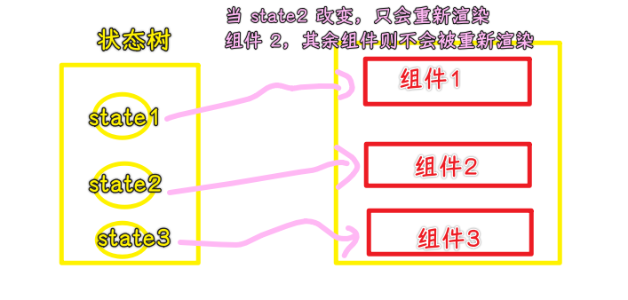

## ★核心思想

状态变化引起的副作用（如 UI 更新）应该被自动触发

- 应用逻辑只需要修改状态数据即可，Mobx 会自动渲染 UI，无需人工干预
- 数据变化只会渲染对应的组件
- React 提供一个把应用程序的状态渲染成组件树的机制，并对这颗组件树进行渲染
- MobX 提供了存储和更新应用状态的机制以供 React 使用

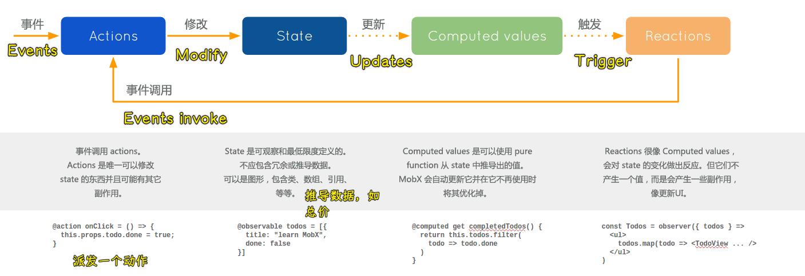

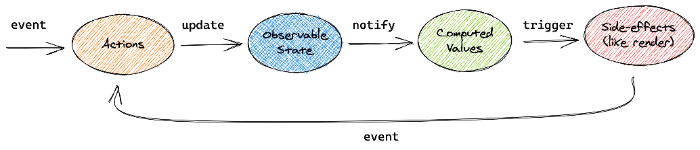

React 利用虚拟 DOM 来优化 UI 的渲染，以减少 DOM 操作成本。 MobX 则提供了优化将应用状态同步到 React 组件内的机制，通过使用了一种响应式的状态依赖图，该依赖图严格**只在需要的时候更新**，并且不会出现代码腐化。

## ★环境准备

### <mark>1）安装依赖模块</mark>

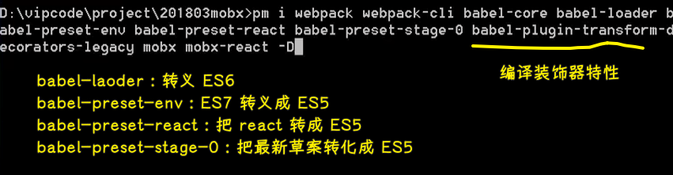

``` bash
mkdir xxx
cd xxx
yarn init -y
yarn add webpack webpack-cli babel-core babel-loader babel-preset-env babel-preset-react babel-preset-stage-0 babel-plugin-transform-decorators-legacy react mobx mobx-react
```

> 需要安装`react`

### <mark>2）webpack.config.js</mark>

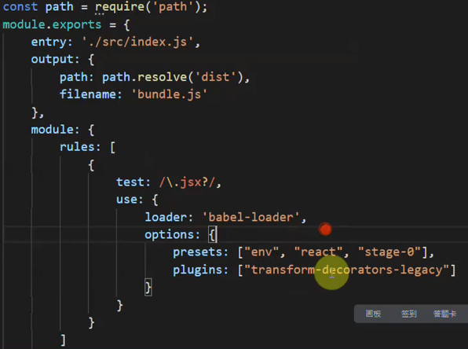

### <mark>3）package.json</mark>

``` json
{
  "scripts": {
    "start": "webpack --mode development -w"
  }
}
```

### <mark>4）测试</mark>

1. 创建一个`src/index.js`
2. `yarn start` -> 在根目录下出现一个`build`目录
   1. 添加一个`index.html`（写个`<div id="root"></div>`就行了），引入打包生成的`bundle.js`
   2. 用 VS Code 提供的 `live server` 功能打开这个`index.html`

> 视频是 18 年 3 月份的，用了 webpack5 后，安装的依赖包得改了！ -> webpack 配置也要改 -> 我没有配置`stage-0`，似乎 babel7 后，这个配置就取消了！ -> 这个配置仅仅是打包 JS 文件

## ★Decorator

### <mark>1）类的修饰</mark>

- 修饰器（Decorator）函数，用来修饰类的行为
- 修饰器是一个对类进行处理的函数。修饰器函数的第一个参数，就是所要修饰的目标类
- 修饰器本质就是编译时执行的函数
- 如果想添加实例属性，可以通过目标类的`prototype`对象操作

> 读修饰器还是装饰器，都随你

装饰器的设计理念：


在不改造 **托尼·史塔克（Tony Stark）** 本体的前提下，通过加装**盔甲、飞行器**的方式增强 Tony 的能力，从而“变成”钢铁侠。 -> 组合大于继承

例子：

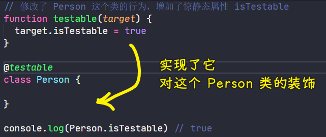

原理：

``` js
// 修改了 Person 这个类的行为，增加了惊静态属性 isTestable
function testable(target) {
  target.isTestable = true
}

// @testable
class Person {

}
// 就是调用了函数
testable(Person)

console.log(Person.isTestable) // true
```

### <mark>2）修饰属性</mark>

需求：给一个叫`Circle`类的东西添加一个实例属性`PI`，要求这个属性「只读的」，毕竟`PI`是恒定的！

``` js
// target：目标的原型，即函数的原型 -> key：类的属性 -> descriptor：描述器
function readonly(target,key,descriptor) {
  console.log(target,key)
  console.log(descriptor)
  descriptor.writable = false
}
class Circle {
  // 这是实例的属性
  @readonly PI = 3.14
  computed() {

  }
}
let c1 = new Circle()
// 视频里是报了 Cannot assign to read only property 'PI' of object 这样的错误
// 自己本地测试没有报错，但是起了效果
c1.PI = 3.15
console.log(c1.PI) // 3.14
```

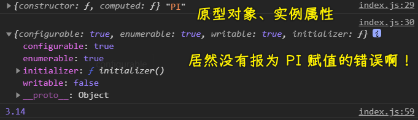

💡：在 VS Code 里边，`PI` 会有警告？

配置 `jsconfig.json` ：

``` json
{
  "compilerOptions": {
    "experimentalDecorators": true
  }
}
```

💡：描述器（descriptor，也叫属性描述符）是什么？

``` js
Object.defineProperty(obj, prop, descriptor)
```

我们可以这样给一个对象定义属性：

``` js
let obj = {}
obj.name = 'xxx'
```

也可以这样：

``` js
Object.defineProperty(obj,'age',{
  value: 666, // 实际的值
  enumerable: false, // 是否可枚举 -> 可以用 for in 循环吗？
  writable: true, // 是否可修改
  configurable: false // 是否可配置 -> 可以删除这个属性配置吗？ -> delete obj.age
})

console.log(obj.age) // 666
obj.age = 777
console.log(obj.age) // 777

for (const key in obj) {
  console.log(key) // 只 log 了一个 name 属性
}

delete obj.age
console.log(obj.age) // 777
```

第一种姿势其实就是第二种姿势的简写，只是它默认就是可写的、可枚举的，以及可配置的！

题外话，其实，属性描述符`descriptor`总共分为两种形式：

1. 数据描述符（Data descriptor）
2. 访问器描述符（Accessor descriptor）

注意

我们上边那种形式就是把`descriptor`当作是「数据描述符」来表现：

``` js
const res = Object.getOwnPropertyDescriptor(obj,'age');
console.log(res) // { value: 777, writable: true, enumerable: false, configurable: false }
```

而「访问器描述符」（也可以叫存取描述符）的形式就是在一个的对象里边用`get/set`

注意 -> **描述符必须是两种形式之一，不能同时是两者**

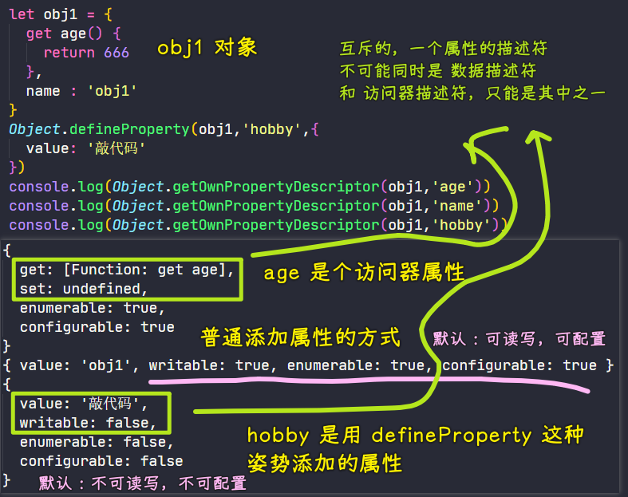

### <mark>3）修饰方法</mark>

修饰器不仅可以修饰类，还可以修饰类的属性和方法

例子：打印函数调用日志

``` js
class Calculator {
  @logger
  add(a,b) {
    return a+b
  }
}

function logger(target,name,descriptor) {
  let oldVal = descriptor.value
  descriptor.value = function() {
    console.log(`${name}(${Array.from(arguments).join(',')})`)
    return oldVal.apply(this,arguments)
  }
}

let c = new Calculator()
let res = c.add(1,2)
console.log(res) // add(1,2) -> 3
```

原理：

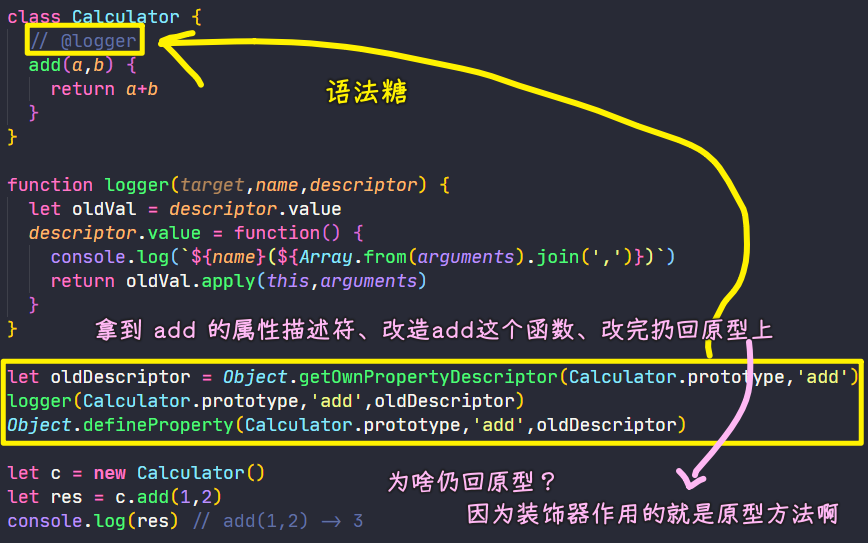

``` js
let oldDescriptor = Object.getOwnPropertyDescriptor(Calculator.prototype,'add')
logger(Calculator.prototype,'add',oldDescriptor)
Object.defineProperty(Calculator.prototype,'add',oldDescriptor)
```

💡：为啥我定义在实例属性上，这`target`居然也是原型对象呢？按理说不应该是实例吗？

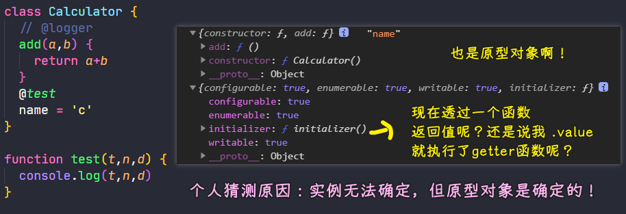

也许，官方约定了，传的就是原型属性，而不是实例对象！

话说，如果`add`是个实例方法，而且它是个箭头函数，这又会怎么样呢？

如：

``` js
class Calculator {
  @logger
  add = (a, b) => {
    return a + b;
  };
  // @test
  name = "c";
}
```

我测试了一下，`descriptor.value`的值是`undefined`，你得透过`descriptor.initializer()`来获取`add`方法，最终代码：

``` js
function logger(target, name, descriptor) {
  console.log(target, name);
  console.log(descriptor);
  console.log(descriptor.initializer());
  // let oldVal = descriptor.value;
  // console.log(oldVal); // undefined
  let oldVal = descriptor.initializer();
  function _oldVal() {
    console.log(`${name}(${Array.from(arguments).join(',')})`)
    return oldVal.apply(this,arguments)
  }
  descriptor.initializer = function initializer() {
    return _oldVal
  }
}
```

效果：

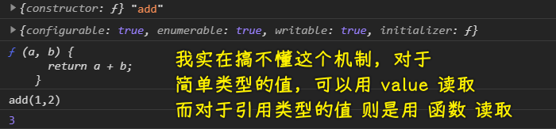

### <mark>4）小结</mark>

- 大部分需求都是在处理`descriptor`
- 装饰在原型方法还是实例属性/方法，其第一个参数的值都是原型对象啊！装饰在类上则是类本身！
- 写上了装饰器，意味着会自动执行这个装饰器方法 -> 被装饰了的东西，你该怎么用还是怎么用，只是多了一些不明觉厉的能力的罢了！

## ★Proxy

- Proxy 可以理解成，在目标对象之前架设一层「拦截」，外界对该对象的访问，都必须先通过这层拦截，因此提供了一种机制，可以对外界的访问进行过滤和改写
- `get`方法用于拦截某个属性的读取操作，可以接受**三个参数**，依次为「目标对象」、「属性名」和「`Proxy`实例本身」
- `set`方法用来拦截某个属性的赋值操作，可以接受**四个参数**，依次为「目标对象」、「属性名」、「属性值」和「`Proxy`实例本身」

``` js
let proxy = new Proxy(target,handler)
```

``` js
let p1 = new Proxy({name:'xxx'},{
  get(target,key,receiver) {
    console.log(`getting ${key}`)
    console.log(receiver)
    return Reflect.get(target,key,receiver)
  },
  set(t,k,value,r) {
    console.log(`setting ${key}`)
    return Reflect.set(t,k,value,r)
  }
})

console.log(p1.name)
// getting name
// { name: 'xxx' }
// xxx
```

> `receiver`就是`p1` -> 这是个没啥用的参数

💡：Reflect？

`Reflect` 是一个内置的对象，它提供拦截 JavaScript 操作的方法。`Reflect` 不是一个函数对象，因此它是不可构造的。`Reflect` 的所有的方法都是静态的就和 `Math` 一样，目前它还没有静态属性。

`Reflect` 对象的方法与 `Proxy` 对象的方法相同。

`Reflect` 一共有 13 个静态方法，它可以分为：

- 一部分是是原来存在 `Object` 上的方法，将它转义到了 `Reflect` 上，并作了小改动，让方法更加合理，如`defineProperty`、`getOwnPropertyDescriptor`
- 另一部分是将原来操作符的功能，变成函数行为，如`in -> has(target, key)`、`delete -> deleteProperty(target, key)`

为什么需要`Reflect`这个东西？（产生的背景和必要性）

> 因为 proxy 代理不了一些 Map、Set 之类的属性，但是 Proxy 为它们提供了默认的插槽 这时候 Reflect 就能派上用场了

例子：

`Reflect.get ( target, propertyKey [ , receiver ])` -> 该方法用来获取对象中某个属性，如：

``` js
const testObject = {
  a: 'you',
  b: 'like'
}
Reflect.get(testObject, 'a') === 'you' // true
Reflect.get(testObject, 'b') === 'like' // true
```

`Reflect.set ( target, propertyKey, V [ , receiver ] )` -> 该方法用来设置对象中某个属性，如：

``` js
const testObject = {
  a: 'you',
  b: 'like'
}
Reflect.set(testObject, 'c', 'javascript') // true
Reflect.get(testObject, 'c') === 'javascript' // true
```

总之，上边的`Proxy`返回一个`return Reflect.set(t,k,value,r)`，意味着不使用赋值语句了！

➹：[JS 中的 Reflect 和 Proxy](https://juejin.cn/post/6844903790739456013)

➹：[JS 的 Reflect 学习和应用 - 知乎](https://zhuanlan.zhihu.com/p/92700557)

💡：老师的日常笔记目录？

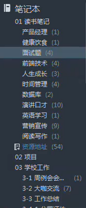

## ★Mobx

### <mark>1）observable</mark>

- Mobx 为现有的数据结构（如对象、数组、类实例、字符串、数值等）添加了可观察的功能
- `observable`就是一种让数据的变化可以被观察的方法
- 先把数据转化成可以被观察的对象，那么对这些数据的修改就可以被监视

#### <mark>1、引用类型（observable）</mark>

> 对象、数组

``` js
import { observable } from "mobx";

let o1 = observable({ name: "frank" });
console.log(o1.name);

let arr1 = observable([1, 2, 3]);
console.log(arr1);

arr1.pop();
arr1.push(4);
arr1.unshift(0);

console.log(arr1);
```

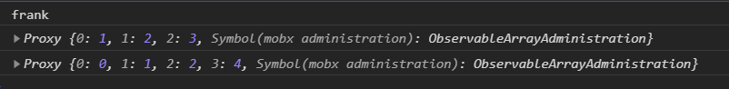

> `observable`返回时一个`Proxy`实例

需求：改变数据，执行`callback`

使用`observe`（动词，观察）：

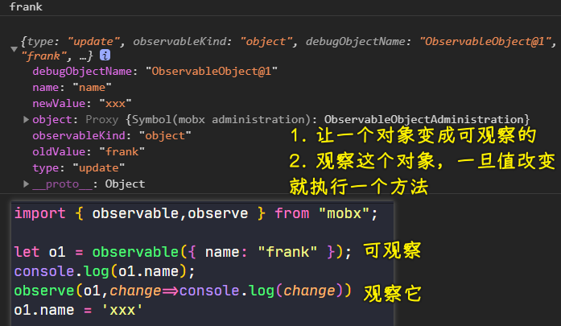

#### <mark>2、简单类型（基本类型）</mark>

> 字符串、布尔值、数字、Symbol（独一无二的值）

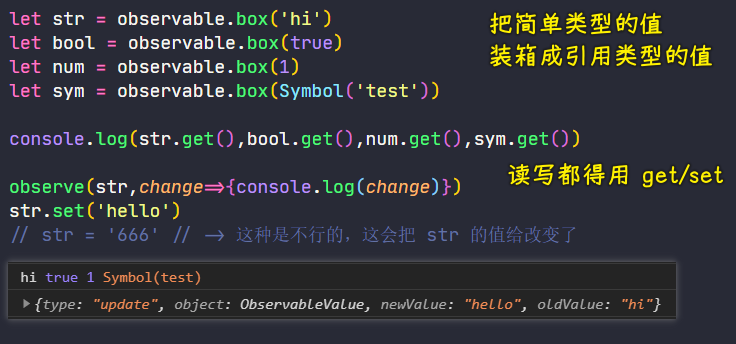

#### <mark>3、decorator</mark>

对于存有基本类型值的属性，不需要写成`@observable.box`这样，直接`@observable age = 18`这样就好了，`observable`内部自己帮我们封装了！

Mobx6 之前的做法：

``` js
import { observable, observe } from "mobx";
class Person {
  @observable name = "frank";
  @observable age = 18;
  @observable isMarried = false;
  @observable hobby = ["敲代码", "打 LOL", "睡觉"];
  @observable home = { name: "海岛" };
  @observable skills = new Map();
}

let p = new Person()
observe(p,(c)=>{
  console.log(c)
})
console.log(p)
p.age = 19
p.name = 'xxx'
p.hobby.push('玩耍')
p.home.name = '椰岛'
```

Mobx6 不要 `decorator` 了：

``` js
import { makeAutoObservable,observe } from "mobx"
class Person {
  name = "frank";
  age = 18;
  isMarried = false;
  hobby = ["敲代码", "打 LOL", "睡觉"];
  home = { name: "海岛", number: '101'};
  skills = new Map();
  constructor() {
    makeAutoObservable(this)
  }
}

let p = new Person()
// p 实例旗下的属性改变了，都会执行这个 callback
observe(p,(c)=>{
  console.log(c)
})
// p 实例的 name 属性改变了，就会执行这个 callback
observe(p,'name',(c)=>{
  console.log(c)
})

console.log(p) // 实例的自有属性都被 get、set 了，即都被监听了
p.age = 19
p.name = 'xxx'
// p.hobby.push('玩耍')
// p.home.name = '椰岛'
// 遵守数据不可变理念
p.hobby = [...p.hobby,'玩耍']
p.home = {...p.home,name:'椰岛'}
console.log(p.hobby[3]) // 玩耍
console.log(p.home.name) // 椰岛
console.log(p.home.number) // 101
```

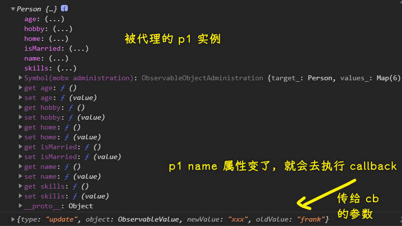

> 在配合 React 使用时，`observe`这个操作对应的是`mobx-react`里边的`observer`

再看那张图：

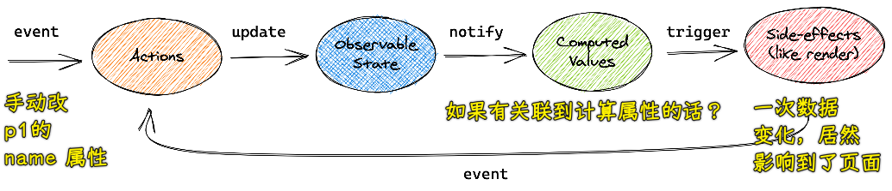

➹：[Mobx 真的好用吗？它有什么优缺点？主要适用于什么场景？ - 知乎](https://www.zhihu.com/question/328612405)

➹：[mobx6.0 为什么移除装饰器 - 知乎](https://zhuanlan.zhihu.com/p/342648174)

💡：如果我非得要在 Mobx6 里边使用装饰器模式呢？

那么你得这样做：

``` js
import { makeObservable,observable, observe } from "mobx";
class Person {
  @observable name = "frank";
  @observable age = 18;
  @observable isMarried = false;
  @observable hobby = ["敲代码", "打 LOL", "睡觉"];
  @observable home = { name: "海岛" };
  @observable skills = new Map();
  constructor() {
    makeObservable(this)
  }
}

let p = new Person()
observe(p,(c)=>{
  console.log(c)
})
console.log(p)
p.age = 19
p.name = 'xxx'
```

即添加`makeObservable`就行了！

但这看起来很没有必要，也许这是为了兼容老版本所提供的一个开关按钮吧！

## ★使用对可观察对象做出响应

> 如果你有一个属性是算出来的，那你就用`computed`呗！

### <mark>1）computed</mark>

* 计算值 (computed values) 是可以根据现有的状态或其它计算值衍生出的值
* 组合已有的可观察数据，成为新的可观察数据
* 既是反应又是可观察数据
* 可以作为函数使用也可以作为 `decorator` 使用
* 使用 `.get()` 来获取计算的当前值
* 使用 `.observe(callback)` 来观察值的改变。
* `computed` 值可以引用其它 `computed` 的值，但是不能循环引用

示例：

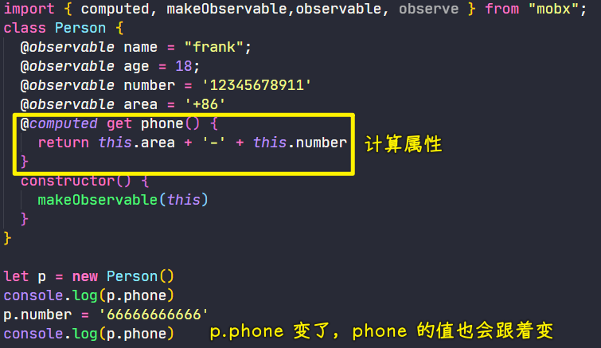

其实，我把`@computed`去掉，结果也是一样的！ -> `phone`是个访问器属性啊！

难道只是为了修饰它是一个计算属性吗？

💡：如何监听计算属性的变化，然后做点什么呢？

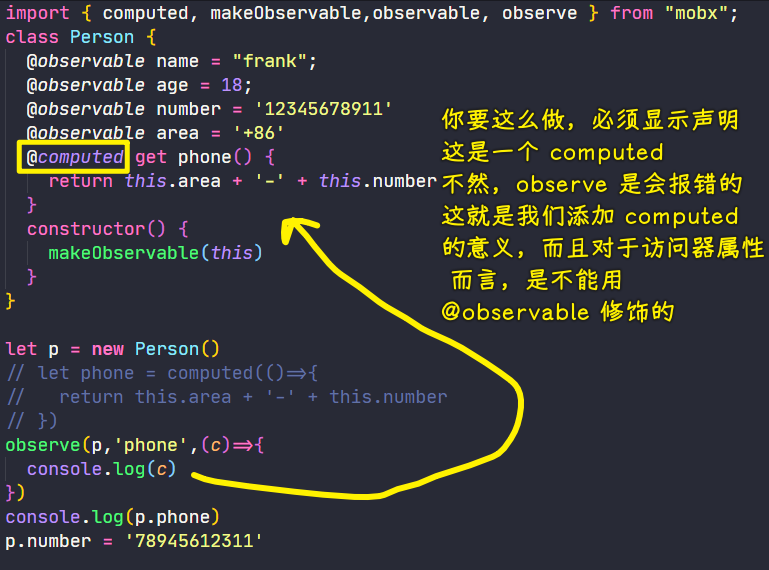

效果：

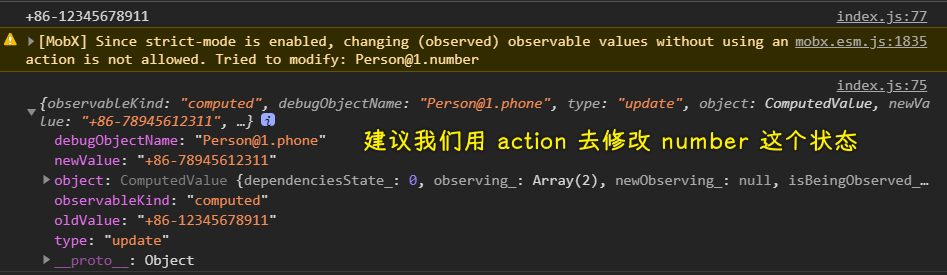

注意：如果你用了`@observable`修饰访问器属性，那么会报`'observable' cannot be used on getter/setter properties`的错误

💡：把`computed`作为函数使用？

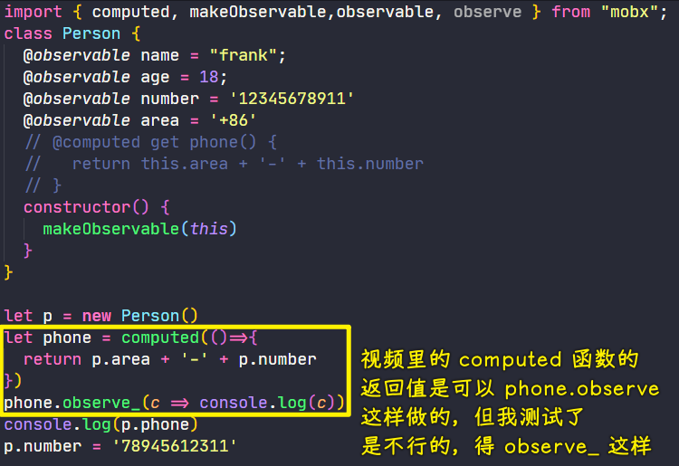

💡：`autorun`也可以起到`observe`的作用？

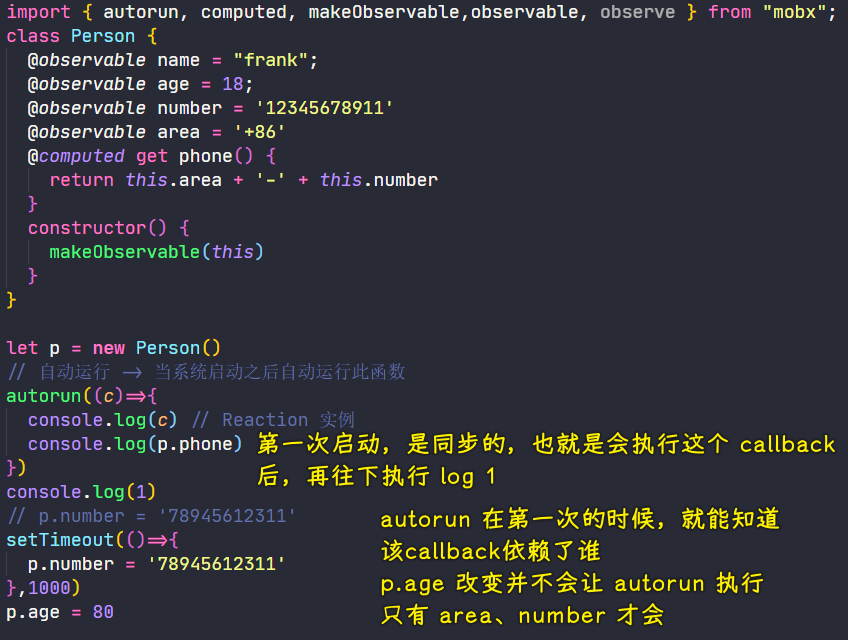

你改成这样：

``` js
autorun((c)=>{
  console.log(c) // Reaction 实例
  console.log(p.age)
})
```

那么`p.age`改变了，就会`autorun`一下了！

> 视频里说用`autorun`的原因：不能`p.phone.observe()`这样 -> `p.phone`返回的就是一个字符串了，所以用`autorun`就能解决这个问题了！

话说，`observe`和`autorun`差别大吗？

> `autorun(callback)`可以很方便地就实现了状态变化，重新渲染 UI！ -> 监听`callback`里用到的状态，状态一旦变化，就会重新`render` -> 或许是`mobx-react`里的`observer`实现原理

### <mark>2）autorun</mark>

* 如果使用修饰器模式，则不能再用`observe`方法了 -> 这里指的`p.phone.observe`姿势！
* 当你想创建一个响应式函数，而该函数本身永远不会有观察者时，可以使用 `mobx.autorun`
* 当使用 `autorun` 时，所提供的函数总是立即被触发一次，然后每次它的依赖关系改变时会再次被触发
* 数据渲染后自动渲染

``` js
import { autorun, computed, makeObservable, observable } from "mobx";
class Store {
  constructor() {
    makeObservable(this);
  }
  @observable province = "广东";
  @observable city = "广州";
  @computed get home() {
    return this.province + this.city;
  }
}

let store = new Store();
autorun(() => {
  //console.log(store.province,store.city);
  console.log(store.home); // 执行了三次，广东广州，湖南广州，湖南长沙
});

store.province = "湖南";
store.city = "长沙";
```

注意：计算属性`home`依赖的本质是`store.province`和`store.city`！我把上边那个注释给取消掉了，也是执行了三次！

### <mark>3）when</mark>

> 为什么会有它？ -> 有时候需要等到某个时间点再打印！ -> 有点像事件的`once`

* when 观察并运行给定的 `predicate`，直到返回 true。
* 一旦返回 `true`，给定的 `effect` 就会被执行，然后 `autorunner`（自动运行程序） 会被清理。 -> **只执行一次**
* 该函数返回一个清理器以提前取消自动运行程序。 -> **可以主动取消**

语法：

``` ts
when(predicate: () => boolean, effect?: () => void, options?)
```

示例：

``` js
import { makeObservable, observable, when } from "mobx";

class Person {
  @observable age = 18;
  constructor(age) {
    makeObservable(this);
    this.age = age;
  }
}

let boy = new Person(19);
let girl = new Person(18);

// when 会等待条件满足，一旦满足就会执行回调并销毁监听
// callback 执行一次后就不会在执行了，因为监听被销毁了！
when(
  () => {
    return boy.age >= 22 && girl.age >= 20;
  },
  () => {
    console.log(`男${boy.age}`, `女${girl.age}`);
    console.log("我们去领结婚证吧！");
  }
);

setInterval(() => {
  boy.age++;
  girl.age++;
}, 1000);
```

主动取消监听：

``` js
// when 函数会返回一个取消监听的函数，如果你调用它，那就直接取消监听了！
// 相当于，你 add 了，紧接着你又 remove 了，等于白干！
let disposer = when(
  () => {
    return boy.age >= 22 && girl.age >= 20;
  },
  () => {
    console.log(`男${boy.age}`, `女${girl.age}`); // 22 20
    console.log("我们去领结婚证吧！"); // ...
  }
);
disposer()
```

### <mark>4）reaction</mark>

> 最重要的一个

- `autorun`的变种，`autorun`会自动触发，`reaction`对于如何追踪`observable`赋予了更细粒度的控制
- 它接收两个函数参数，第一个（**数据函数**）是用来追踪并返回数据作为第二个函数（**效果函数**）的输入
- 不同于`autorun`的是，当创建时「效果函数」不会直接运行，只有在数据表达式首次返回一个新值后才会运行
- 可以用在登录信息存储和写缓存逻辑

示例：

``` js
let boy = new Person(19);
let girl = new Person(18);
// arr -> [20,19]
reaction(
  () => [boy.age, girl.age],
  (arr) => console.log(arr)
);
setInterval(() => {
  boy.age++;
  girl.age++;
}, 1000);
```

注意：

1. 给一样的值是不会触发的，如`boy`的`age`默认值是`19`，你`boy.age = 19`是不会触发`callback`执行的！
2. 数组里边任意一个数据改变都会触发`callback`执行 -> 这有点像`useEffect`啊！
3. `when`和`reaction`同时存在，都满足条件触发了 -> 谁先写，那就先触发谁！

💡：`reaction`与`autorun`的区别？

- `autorun`：不改变数据就触发一次`callback`
- `reaction`：不改变数据就不触发

## ★action

> 想要批量操作，而不是一个状态变化了，就会触发执行`callback` -> 全部改完再触发！

- 前面的方式每次修改都会触发`autorun`和`reaction`执行
- 用户一次操作需要修改多个变量，但是视图更新只需要一次
- 任何应用都有动作，动作是任何用来修改状态的东西
- 动作会分批处理变化并只在（最外层的）动作完成后通知计算值和反应
- 这将确保在动作完成之前，在动作期间生成的中间值或未完成的值对应用的其余部分是不可见的

### <mark>1）action</mark>

``` js
import { action, autorun, computed, makeObservable, observable } from "mobx";

class Person {
  @observable area = "+86";
  @observable number = "12345678911";
  @computed get phone() {
    return this.area + "-" + this.number;
  }
  constructor() {
    makeObservable(this);
  }
  @action switchPhone(area, number) {
    this.area = area;
    this.number = number;
  }
}

let p1 = new Person();
autorun(() => {
  console.log(p1.phone);
});
p1.switchPhone("+1", "11122233366");

// 默认执行：+86-12345678911
// 改了两个状态才执行一次：+1-11122233366
```

### <mark>2）action.bound</mark>

如果我们想这样做：

``` js
let xxx = p1.switchPhone
xxx('+1',"11122233366")
```

那么`xxx`里边的`this`显然不是`p1`实例了

所以我们就有了`@action.bound` -> 它帮我们绑定了`switchPhone`里边的`this`为`p1`实例

``` js
import { action, autorun, computed, makeObservable, observable } from "mobx";

class Person {
  @observable area = "+86";
  @observable number = "12345678911";
  @computed get phone() {
    return this.area + "-" + this.number;
  }
  constructor() {
    makeObservable(this);
  }
  @action.bound switchPhone(area, number) {
    this.area = area;
    this.number = number;
  }
}

let p1 = new Person();
autorun(() => {
  console.log(p1.phone);
});
// p1.switchPhone("+1", "11122233366");

let xxx = p1.switchPhone
xxx('+1',"11122233366")
```

> `@action.bound`把`switchPhone`搞成为`switchPhone.bind(this)`了！

### <mark>3）runInAction</mark>

> 为啥需要？ -> 随意组合其它需要被修改的状态，而不是当你需要修改`phone`这个计算属性时，需要定义一个用`@action`修饰的`switchPhone`方法，然后修改`area`和`number`状态！

它像是一个事务 -> 用来批处理

示例：

``` js
import { observable, runInAction } from "mobx"

const state = observable({ value: 0 })

runInAction(() => {
  state.value++
})
console.log(state.value) // 2
```

``` js
runInAction(()=>{
  p1.area = '+1';
  p1.number = '11122233366';
})
```

➹：[关于 mobx runInAction 的使用 - 知乎](https://zhuanlan.zhihu.com/p/77170757)

## ★mobx 应用

* mobx-react 核心是将 `render` 方法包装为 `autorun`
* 谁用到了可观察属性，谁就需要被 `observer` 修饰 -> 按需渲染

``` bash
yarn add react react-dom mobx-react
```

> mobox-react -> react 结合 mobx 使用，类似 react-redux

### <mark>1）计数器</mark>

组件直接读：

``` jsx
import React, { Component } from "react";
import ReactDOM from "react-dom";
import { observable, action, makeObservable } from "mobx";
import { observer } from "mobx-react";

class Store {
  @observable number = 0;
  @action.bound add() {
    this.number++;
  }
  constructor() {
    makeObservable(this)
  }
}
let store = new Store();

// Counter 类组件用到了可观察属性 number，所以需要用 @observer 修饰它
// @observe 即起到了 autorun 的作用，第一次默认渲染，之后根据组件所依赖的可观察状态是否变化来渲染
@observer
class Counter extends Component {
  render() {
    return (
      <div>
        <p>{store.number}</p>
        <button onClick={store.add}>+1</button>
      </div>
    );
  }
}
ReactDOM.render(<Counter />, document.querySelector("#root"));
```

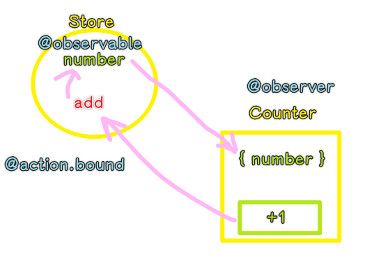

另一种获取数据的做法（传过来）：

``` jsx
import React, { Component } from "react";
import ReactDOM from "react-dom";
import { observable, action, makeObservable } from "mobx";
import { observer } from "mobx-react";

class Store {
  @observable counter = { number: 0 };
  @action.bound add() {
    this.counter.number++;
  }
  constructor() {
    makeObservable(this)
  }
}
let store = new Store();
@observer
class Counter extends Component {
  // let store = this.props.store
  render() {
    return (
      <div>
        <p>{this.props.counter.number}</p>
        <button onClick={this.props.add}>+1</button>
      </div>
    );
  }
}
ReactDOM.render(
  <Counter counter={store.counter} add={store.add} />,
  document.querySelector("#root")
);
```

💡：关于`@action.bound`的实现？

不是那么简单的实现，我搞不明白的是：

`action.bound`这个函数，在我们还未`new Store()`的时候，就已经执行了，可它是如何确定`add`里边的`this`是未来的实例`store`呢？

如果我们不加`.bound`，我们是直接这样了：

``` js
let store = new Store();
store.add = store.add.bind(store)
```

➹：[autobind-decorator/index.js at master · andreypopp/autobind-decorator](https://github.com/andreypopp/autobind-decorator/blob/master/src/index.js)

### <mark>2）TODO</mark>

``` jsx
import React, { Component, Fragment } from "react";
import ReactDOM from "react-dom";
import { observable, action, computed, makeObservable } from "mobx";
import PropTypes from "prop-types";
import { observer, PropTypes as ObservablePropTypes } from "mobx-react";
class Todo {
  id = Math.random();
  @observable text = "";
  @observable completed = false;
  constructor(text) {
    makeObservable(this)
    this.text = text;
  }
  @action.bound toggle() {
    this.completed = !this.completed;
  }
}
class Store {
  constructor() {
    makeObservable(this)
  }
  @observable todos = [];
  @computed get left() {
    return this.todos.filter((todo) => !todo.completed).length;
  }
  @computed get filterTodos() {
    return this.todos.filter((todo) => {
      switch (this.filter) {
        case "completed":
          return todo.completed;
        case "uncompleted":
          return !todo.completed;
        default:
          return true;
      }
    });
  }
  @observable filter = "all";
  @action.bound changeFilter(filter) {
    this.filter = filter;
    console.log(this.filter);
  }
  @action.bound addTodo(text) {
    this.todos.push(new Todo(text));
  }
  @action.bound removeTodo(todo) {
    this.todos.remove(todo);
  }
}
@observer
class TodoItem extends Component {
  static porpTypes = {
    todo: PropTypes.shape({
      id: PropTypes.number.isRequired,
      text: PropTypes.string.isRequired,
      completed: PropTypes.bool.isRequired,
    }).isRequired,
  };
  render() {
    let { todo } = this.props;
    return (
      <Fragment>
        <input
          type="checkbox"
          onChange={todo.toggle}
          checked={todo.completed}
        />
        <span className={todo.completed ? "completed" : ""}>{todo.text}</span>
      </Fragment>
    );
  }
}
@observer
class TodoList extends Component {
  static propsTypes = {
    store: PropTypes.shape({
      addTodo: PropTypes.func,
      todos: ObservablePropTypes.observableArrayOf(
        ObservablePropTypes.observableObject
      ),
    }).isRequired,
  };
  state = { text: "" };
  handleSubmit = (event) => {
    event.preventDefault();
    this.props.store.addTodo(this.state.text);
    this.setState({ text: "" });
  };
  handleChange = (event) => {
    this.setState({ text: event.target.value });
  };
  render() {
    let {
      filterTodos,
      left,
      removeTodo,
      filter,
      changeFilter,
    } = this.props.store;
    return (
      <div className="todo-list">
        <form onSubmit={this.handleSubmit}>
          <input
            placeholder="请输入待办事项"
            type="text"
            value={this.state.text}
            onChange={this.handleChange}
          />
        </form>
        <ul>
          {filterTodos.map((todo) => (
            <li key={todo.id}>
              <TodoItem todo={todo} />
              <button onClick={() => removeTodo(todo)}>X</button>
            </li>
          ))}
        </ul>
        <p>
          <span>你还有{left}件待办事项！</span>
          <button
            onClick={() => changeFilter("all")}
            className={filter === "all" ? "active" : ""}
          >
            全部
          </button>
          <button
            onClick={() => changeFilter("uncompleted")}
            className={filter === "uncompleted" ? "active" : ""}
          >
            未完成
          </button>
          <button
            onClick={() => changeFilter("completed")}
            className={filter === "completed" ? "active" : ""}
          >
            已完成
          </button>
        </p>
      </div>
    );
  }
}
let store = new Store();
ReactDOM.render(<TodoList store={store} />, document.querySelector("#root"));
```

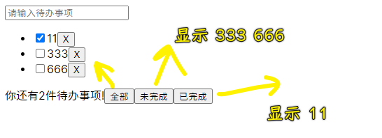

## ★优化

### <mark>1）observe</mark>

只监听数组元素的添加或删除：

``` js
import { observable, makeObservable, observe } from "mobx";

class Store {
  @observable todos = []
  constructor() {
    makeObservable(this)
    observe(this.todos,e=>{
      console.log(e)
    })
  }
}
let store = new Store()
store.todos.push('吃饭饭')
store.todos.push('睡觉觉')
console.log(store)
console.log(store.todos) 
```

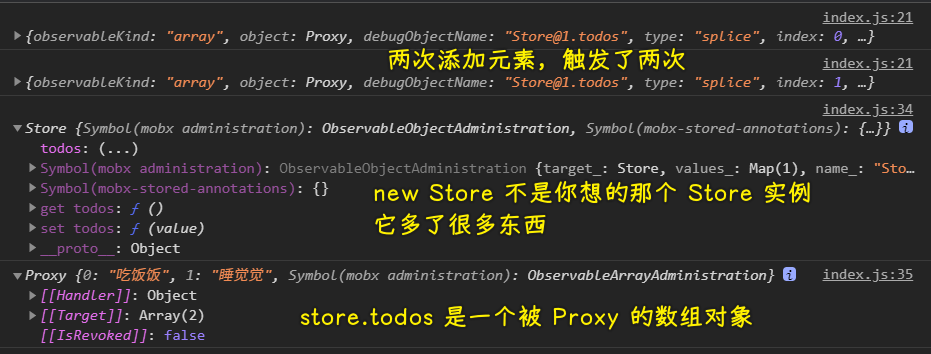

当我这样做时：

``` js
let store = new Store()
store.todos.push('吃饭饭')
store.todos.push(['睡觉觉'])
store.todos.push({name:'frank',age:18})
// 视频里需要 store.todos.get(1) 才能拿到数组元素，而现在我用的这个最新版是不用的！
console.log(store.todos[1])
store.todos[1].push('打豆豆')
console.log(store.todos[2].name)
```


如果我们非得让它可以触发执行呢？那么你得这样做：

``` js
import { observable, makeObservable, observe } from "mobx";

class Store {
  @observable todos = [];
  // 里边存放着所有的取消监听的函数，只要调用了，监听结束，即数据变化了，不会再执行 cb 了
  disposers = [];
  constructor() {
    makeObservable(this);
    observe(this.todos, (event) => {
      console.log(event);
      // 让以前的所有「取消监听函数」执行
      this.disposers.forEach((disposer) => disposer());
      this.disposers = [];
      for (let todo of event.object) {
        let disposer = observe(todo, (e) => {
          console.log(e);
        });
        this.disposers.push(disposer);
      }
    });
  }
}
let store = new Store();
// 不加 observable 会说没有权限，其实一般是不用加才对的！
store.todos.push(observable("吃饭饭"));
store.todos.push(["睡觉觉"]);
store.todos.push({ name: "frank", age: 18 });
// 视频里需要 store.todos.get(1) 才能拿到数组元素，而现在我用的这个最新版是不用的！
console.log(store.todos[1]);
store.todos[1].push("打豆豆");
console.log(store.todos[2].name = 'Jack');
store.todos[0].set('吃菜菜')
console.log(store.todos)
```

### <mark>2）spy</mark>

> 间谍

这个调试可能会用，但开发就不会用了！因为性能很差 -> 它会监听所有变化！

``` js
import { observable, makeObservable, spy } from "mobx";
spy((e) => console.log(e));
class Store {
  @observable todos = [];
  constructor() {
    makeObservable(this);
  }
}
let store = new Store();
store.todos.push("吃饭饭");
store.todos.push(["睡觉觉"]);
store.todos.push({ name: "frank", age: 18 });
// 视频里需要 store.todos.get(1) 才能拿到数组元素，而现在我用的这个最新版是不用的！
// 为啥要这样？因为视频里用 push(observable({name:'xxx',age:18})) 这样样 push 一个数据的
// 而这个元素显然不是一个 普通对象，而是一个可被观察的普通对象
console.log(store.todos[1]);
store.todos[1].push("打豆豆");
console.log((store.todos[2].name = "Jack"));
store.todos[0] = "吃菜菜";
console.log(store.todos);
```

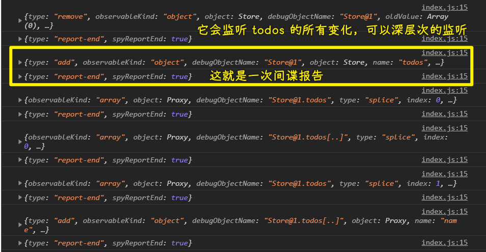

### <mark>3）toJS</mark>

> 递归地将一个 (observable) 对象转换为 javascript 结构。 支持 observable 数组、对象、映射和原始类型。 计算值和其它不可枚举的属性不会成为结果的一部分。默认情况下可以正确支持检测到的循环，但也可以禁用它来获得性能上的提升。

语法：`toJS(value, options?)`

示例 1：

``` js
import {
  observable,
  toJS,
  isObservableObject,
} from "mobx";
var obj = observable({
  x: 1,
});
console.log(obj);
var clone = toJS(obj);
console.log(clone);

console.log(isObservableObject(obj)); // true
console.log(isObservableObject(clone)); // false
```

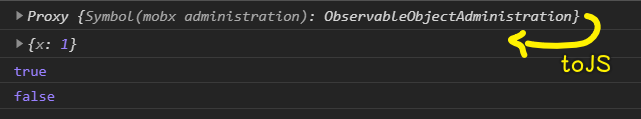

示例 2：

``` js
import {
  observable,
  toJS,
  isObservableObject,
  makeObservable,
  observe,
} from "mobx";

class ToDo {
  @observable todos = [];
  disposers = [];
  constructor() {
    makeObservable(this);
    observe(this.todos, (change) => {
      console.log(change);
      this.disposers.forEach((disposer) => disposer());
      this.disposers = [];
      for (let todo of change.object) {
        this.disposers.push(
          observe(todo, (change) => {
            this.save();
            //console.log(change)
          })
        );
      }
      this.save();
    });
  }
  save() {
    console.log(this.todos)
    localStorage.setItem("todos", JSON.stringify(toJS(this.todos)));
  }
}

let todoList = new ToDo();
todoList.todos.push(observable("吃饭"));
todoList.todos.push({ name: "frank", age: 18 });
```

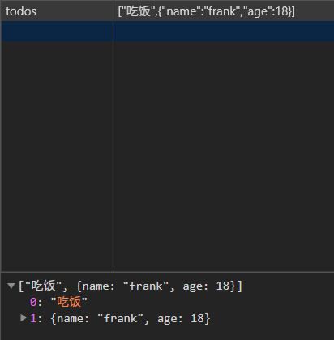

### <mark>4）trace</mark>

`trace` 是一个小工具，它能帮助你查找为什么计算值、 reactions 或组件会重新计算

### <mark>5）示例</mark>

* 把视图拆解的更细致
* 使用专门的视图渲染列表数据
* 尽可能晚的解构使用数据

``` jsx
import React, { Component, Fragment } from "react";
import ReactDOM from "react-dom";
import {
  trace,
  observable,
  action,
  computed,
  observe,
  spy,
  toJS,
  makeObservable,
} from "mobx";
import PropTypes from "prop-types";
import { observer, PropTypes as ObservablePropTypes } from "mobx-react";
spy((event) => {
  //console.log(event);
});
class Todo {
  id = Math.random();
  @observable text = "";
  @observable completed = false;
  constructor(text) {
    makeObservable(this);
    this.text = text;
  }
  @action.bound toggle() {
    this.completed = !this.completed;
  }
}
class Store {
  disposers = [];
  constructor() {
    makeObservable(this);
    observe(this.todos, (change) => {
      console.log(change);

      this.disposers.forEach((disposer) => disposer());
      this.disposers = [];
      for (let todo of change.object) {
        this.disposers.push(
          observe(todo, (change) => {
            this.save();
            //console.log(change)
          })
        );
      }
      this.save();
    });
  }
  save() {
    localStorage.setItem("todos", JSON.stringify(toJS(this.todos)));
  }
  @observable todos = [];
  @computed get left() {
    return this.todos.filter((todo) => !todo.completed).length;
  }
  @computed get filterTodos() {
    return this.todos.filter((todo) => {
      switch (this.filter) {
        case "completed":
          return todo.completed;
        case "uncompleted":
          return !todo.completed;
        default:
          return true;
      }
    });
  }
  @observable filter = "all";
  @action.bound changeFilter(filter) {
    console.log("hi");
    this.filter = filter;
    console.log(this.filter);
  }
  @action.bound addTodo(text) {
    this.todos.push(new Todo(text));
  }
  @action.bound removeTodo(todo) {
    this.todos.remove(todo);
  }
}
@observer
class TodoItem extends Component {
  static propTypes = {
    todo: PropTypes.shape({
      id: PropTypes.number.isRequired,
      text: PropTypes.string.isRequired,
      completed: PropTypes.bool.isRequired,
    }).isRequired,
  };
  render() {
    trace();
    let { todo } = this.props;
    return (
      <Fragment>
        <input
          type="checkbox"
          onChange={todo.toggle}
          checked={todo.completed}
        />
        <span className={todo.completed ? "completed" : ""}>{todo.text}</span>
      </Fragment>
    );
  }
}
@observer
class TodoFooter extends Component {
  static propTypes = {};
  render() {
    trace();
    let { left, filter, changeFilter } = this.props.store;
    return (
      <div>
        <span>你还有{left}件待办事项！</span>
        <button
          onClick={() => changeFilter("all")}
          className={filter === "all" ? "active" : ""}
        >
          全部
        </button>
        <button
          onClick={() => changeFilter("uncompleted")}
          className={filter === "uncompleted" ? "active" : ""}
        >
          未完成
        </button>
        <button
          onClick={() => changeFilter("completed")}
          className={filter === "completed" ? "active" : ""}
        >
          已完成
        </button>
      </div>
    );
  }
}
@observer
class TodoViews extends Component {
  render() {
    let { filterTodos, removeTodo } = this.props.store;
    return (
      <ul>
        {filterTodos.map((todo) => (
          <li key={todo.id}>
            <TodoItem todo={todo} />
            <button onClick={() => removeTodo(todo)}>X</button>
          </li>
        ))}
      </ul>
    );
  }
}
@observer
class TodoHeader extends Component {
  state = { text: "" };
  handleSubmit = (event) => {
    event.preventDefault();
    this.props.store.addTodo(this.state.text);
    this.setState({ text: "" });
  };
  handleChange = (event) => {
    this.setState({ text: event.target.value });
  };
  render() {
    return (
      <form onSubmit={this.handleSubmit}>
        <input
          placeholder="请输入待办事项"
          type="text"
          value={this.state.text}
          onChange={this.handleChange}
        />
      </form>
    );
  }
}
@observer
class TodoList extends Component {
  static propsTypes = {
    store: PropTypes.shape({
      addTodo: PropTypes.func,
      todos: ObservablePropTypes.observableArrayOf(
        ObservablePropTypes.observableObject
      ),
    }).isRequired,
  };

  render() {
    trace();
    return (
      <div className="todo-list">
        <TodoHeader store={this.props.store} />
        <TodoViews store={this.props.store} />
        <TodoFooter store={this.props.store} />
      </div>
    );
  }
}
let store = new Store();
ReactDOM.render(<TodoList store={store} />, document.querySelector("#root"));
```

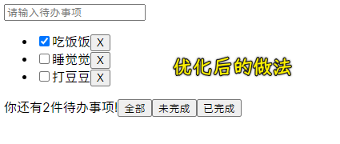

> 测试：读本地数据 -> 赋值给`todos` -> 渲染 -> 会有 bug！
