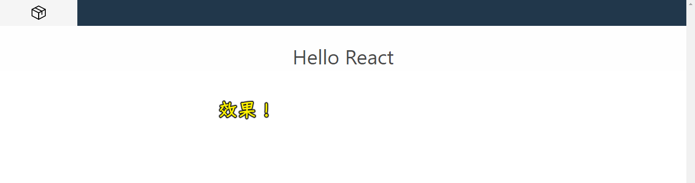

### ✍️ Tangxt ⏳ 2020-10-27 🏷️ faq

# FAQ

## ★ 1~10

1）关于 React 和 ReactDOM？

必须同时使用这两个库才能在浏览器上开发 React 应用

总之，只使用其中任何一个都不能在浏览器上开发 React 应用

2）如何理解 `const x = React.createElement('div', null, 'hi') `？

`x` 是一个 React 元素，它代表一个 `div`，它是一个虚拟 DOM 对象

注意，`x`可不是一个 DOM 对象哈！

3）有如下三个代码片段，请问，能够在 `n` 为偶数时显示「n 是偶数」，`n` 为奇数是显示「n 是奇数」的是 A、B、C 中的哪一个？

``` jsx
// 片段 A
let n = 0
const Component = () => {
  return 
    <div>
      { n%2===0 ? <div>n 是偶数</div> : <span>n 是奇数</span> }
    </div>
}
```

注意片段 A 的 `return` 后面没有括号

``` jsx
// 片段 B
let n = 0
const Component = () => {
  return (
    <div>
      n%2===0 ? <div>n 是偶数</div> : <span>n 是奇数</span>
    </div>
  )
}
```

注意片段 B 的 `n%2` 前面没有 `{`

``` jsx
// 片段 C
let n = 0
const Component = () => {
  return (
    <div>
      { n%2===0 ? <div>n 是偶数</div> : <span>n 是奇数</span> }
    </div>
  )
}
```

片段 C 是正确的！

4）点加 1 后，数字会加 1？

代码：[Demo](https://codesandbox.io/s/twilight-sun-iogjz)

5）如何使用 parcel 搭建 React 应用？



代码：[Demo](https://github.com/ppambler/react-demo/commit/76817a1d2bb5be4244015353e56de0b6f1ffdde1)

➹：[How To Set Up a React Project With Parcel - DigitalOcean](https://www.digitalocean.com/community/tutorials/how-to-set-up-a-react-project-with-parcel)

6）Bulma ？

一个 CSS 框架，做一些代码测试时，可以用它提供的样式去搞！

使用：

``` html
<link href="https://cdn.bootcdn.net/ajax/libs/bulma/0.9.1/css/bulma.min.css" rel="stylesheet">
```

➹：[Documentation - Bulma: Free, open source, and modern CSS framework based on Flexbox](https://bulma.io/documentation/)

➹：[CSS 框架 Bulma 教程 - 阮一峰的网络日志](http://www.ruanyifeng.com/blog/2017/10/bulma.html)

7）React vs Vue？

- Vue：自动挡，坏了很难修，构造复杂但使用简单
- React：手动挡（半自动挡），坏了很容易修，使用较 Vue 复杂但构造简单

总之，使用 Vue，就是在让开发者放弃 JS 的编程序和灵活性，而且面试官考察 Vue 大部分都认为问不出你到底是个什么样的水平，而问 React，则可以考察出你对 JS 底层的掌握能力！

> 电锯 vs 类似斧头一样的电锯

8）感觉 React 上手比 Vue 要简单？

任何库都要在「概念简洁」（自由度高）和「使用便利」（提供现成的范式）上做选择。React 选择了前者，Vue 选择了后者。

不可能有一个库能同时做到两者。即使做到了两者，你也会发现使用的人分成两拨，两拨人互相看不惯。

如果你一定要问他俩孰优孰劣，可能没有答案。

> Webpack vs Parcel


➹：[Vue真的比React上手简单吗? - 方应杭的回答 - 知乎](https://www.zhihu.com/question/271908748/answer/364203091)
