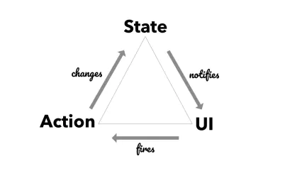

### ✍️ Tangxt ⏳ 2021-02-02 🏷️ FAQ

# FAQ

`UI = fn(state)`：给定相同的 `state` 状态，`fn` 总是会生成一致的 `UI`

在 React 的世界里，还需要加上 `props` 才完整：

``` js
VirtualDOM = fn(props, state)
```



> [Mobx React 初学者入门指南](https://juejin.cn/post/6844903831726211079)

## ★目录

- [React](./react.md)
- [Redux](./redux.md)
- [Any](./any.md)