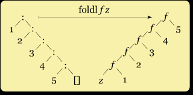
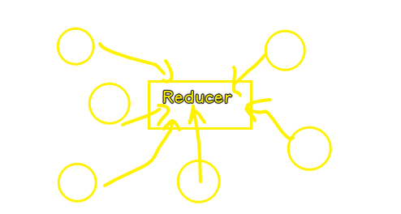

### ✍️ Tangxt ⏳ 2021-02-02 🏷️ faq

# Redux-Question

## ★TODO

- [理解 React，但不理解 Redux，该如何通俗易懂的理解  Redux？ - 知乎](https://www.zhihu.com/question/41312576)
- [Redux 有哪些最佳实践？- 知乎](https://www.zhihu.com/question/47995437)
- [前端状态管理模式 (Redux/Vuex) 和 HTML 本地存储的区别在哪里？ - 知乎](https://www.zhihu.com/question/57138762)
- [React Hooks 是否能取代 Redux、mobx等，请举例说明？- 知乎](https://www.zhihu.com/question/324199539)
- [译-2019 React Redux 完全指南](https://juejin.cn/post/6844903815594901512)

## ★Q&A

1）为什么叫 Reducer？

reduce 是什么东西，这个名词其实是函数式编程当中的一个术语，在更多的情况下，reduce 操作被称为 Fold 折叠

在 JS 里边，reduce 属于一种高阶函数，它将其中的回调函数 reducer 递归应用到数组的所有元素上并返回一个独立的值。这也就是“缩减”或“折叠”的意义所在了。

总之，**redux 当中的 reducer 之所以叫做 reducer，是因为它和 `Array.prototype.reduce` 当中传入的回调函数非常相似**。

还有一种解释：

reducer 就是方块内部对这些数据对象的筛选处理过程，为什么叫 reducer，想象一下有多个模块依次请求改变方块内一个状态，效率起见，这个状态的最终值是最后一个请求的值，所以用一个 reducer 来“整理归总”这样的请求，状态改变一次就够了。

> 一块蛋糕 -> 我们不断地吃，吃剩下的就是你的了……

➹：[Redux 中的 reducer 到底是什么，以及它为什么叫 reducer？ - 知乎](https://zhuanlan.zhihu.com/p/25863768)

➹：[理解 React，但不理解 Redux，该如何通俗易懂的理解  Redux？ - dboy的回答 - 知乎](https://www.zhihu.com/question/41312576/answer/181429454)
