# React入门

## ★引子

从未接触过React…

## ★学习目标

- 知道如何去搭建一个最简单的 React 项目
- 知道如何去看文档、如何去做组件间通信、如何去做组件化

## ★怎么学？

- 对比之前的 「Vue」入门课程，看看 React 是如何做那些事儿的！
- 没有良好JS的基础学不好React，React的优点就是，JS用得多溜，React用得就多溜
- 看 React 文档（相较于Vue的平铺直叙，分门别类，React文档脉络不是很清晰，有种很乱的调调，当然，它更符合哪里不会就看哪里的感官）
- 直接用 React 做项目，做毁它（吸取教训，那样做是不对的！）
- 然后你就 React 入门了
- 再做第二个项目，这次不会毁了

## ★React vs Vue

- 入门搞Vue，因为Vue封装了很多东西！而React需要你自己造很多东西，但是灵活呀！
- 二者只学一个就能找着工作，但两个都学了，那就更好了！
- 如果你用了一段时间 React，发现是真得好用，那么你就真得喜欢用React了。

## ★React 最核心原理

> 通过一个简单的例子来简单了解 React 最核心的原理！

### ◇搭建项目环境（能运行代码就好）

1. 创建一个叫`react-tictactoe`的目录

2. 初始化 react 项目，之前我们初始化一个 vue 项目用的是 `vue-cli`，那么 react 有什么类似的工具吗？——那就是 `create-react-app`

   ➹：[Create a New React App – React](https://reactjs.org/docs/create-a-new-react-app.html#create-react-app)

   一般芳芳看文档，都是直接看能运行的代码，而不是直接看一大段英文

```bash
npx create-react-app my-app or yarn create react-app my-app
cd my-app
npm start
```

> 一般我们都是先创建一个目录，然后进去一个目录 `yarn create react-app .`一下就好了！
>
> 芳芳用的是  `npx create-react-app .`，但是在安装的时候用的却是`yarn`，为啥不是npm呢？

这个安装用了我大概11min的时间！（可以用npm）

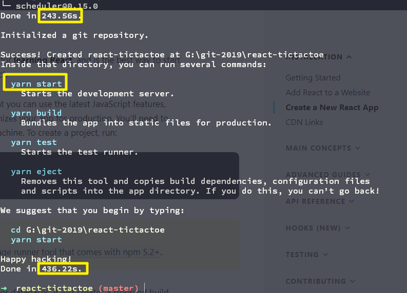

当你查看`node_modules`就会明白，为啥要安装那么久了：


> 关于文件大小和占用空间的关系：
>
> 很多人一起吃饭，这个分配单元就相当于碗的大小，这个文件就好比碗里的饭，每个人的饭量不一样，有人吃的多，就需要两个碗来盛饭，但是有的人吃的少，但也是要占一个碗。
>
> 说白了，有些文件所占用的空间刚好接近分配的最小空间，而有些则是一个文件放一个字符，也要占用分配好的最小空间
>
> 总之，就是文件数量太多了，导致有31MB的空间被浪费了！所以说硬盘空间下，是不足矣运行该项目的！

➹：[“文件大小”和“占用空间”的区别 - 向死而生 - CSDN博客](https://blog.csdn.net/duyusean/article/details/78643475)

3. 启动项目：`yarn start`，也可以用 `npm start`，反正都是用于启动 `react-scripts start`这个脚本。 虽然它们俩功能一样，但是yarn的bug相较于小一点！（一般第一次启动 react 项目都很慢，这跟你机器的性能有关！）
4. 拿到一个react项目，那么首先就是看src下的 `index.js`文件，这是约定俗成的！然后对于新手入门来说，你得把一些无关紧要的文件给删掉。
5. 删掉多余的文件，让src目录下有 `index.js`和 `App.js`这两个文件，其中文件的内容如下：

`index.js`：

```react
import React from 'react';
import ReactDOM from 'react-dom';
import App from './App';

ReactDOM.render(<App />, document.getElementById('root'));
```

`App.js`：

```react
import React from 'react';

function App() {
  return (
    <div className="App">
      hi
    </div>
  );
}

export default App;
```

效果：

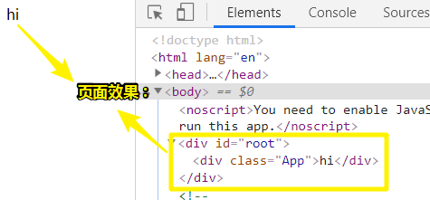

总之，`index.js`是程序的入口，而 `App.js`则是该项目的第一个组件

### ◇开始讲解 React 的基本原理

**①用原生JS搞一下DOM，然后告知你 React 可以做得更好**

1. 把 `index.js`里边的内容都删掉，写上一些原生JavaScript代码去跑即可，反正它会自动运行，类似于我们在 `index.html`里边写 `<script src="./index.js"><script>`。代码内容如下：

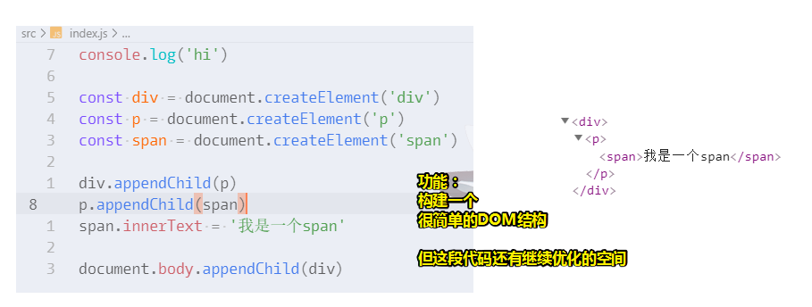

你只要把这个功能搞清楚了，那么你就知道 React 在做什么了

目前，来看这段 JS 代码看起来没啥问题，但是有点繁琐，我们需要把它变得更简单一点，如少写几个 `document`，因此我们需要封装一个 `createElement`函数（给我一个tagName，我就返回一个创建好的DOM元素）

2. 第一次优化，功能不变——创建DOM元素简单点

```js
console.log('hi')

const div = createElement('div')
const p = createElement('p')
const span = createElement('span')

div.appendChild(p)
p.appendChild(span)
span.innerText = '我是一个span'

document.body.appendChild(div)

function createElement(tagName) {
  return document.createElement(tagName)
}
```

3. 第二次优化，功能有变——为 `creatElement`添加第二个参数，该参数作为第一个参数的子元素（可以元素元素节点，也可以是文本节点）

```js
const div = createElement('div', 
                createElement('p', 
                  createElement('span', '我是一个span')))
                                  

document.body.appendChild(div)

function createElement(tagName, children) {
  const element = document.createElement(tagName)
  if(children) {
    if(typeof children === 'string') {
      let childrenTextNode = document.createTextNode(children)
      element.appendChild(childrenTextNode)
    } else {
      element.appendChild(children)
    }
  }
  return element
}
```

此时，创建这样的结构：

```html
<div>
   <p>
   		<span>我是一个span</span>
   </p>
</div>
```

只需要一句话就可以做到！是不是很牛逼？

理解了，这个之后，就好理解 React 在干啥了

目前我们做了啥？——通过以下代码可以创建一个DOM结构（把`createElement`改成是`t`这个简短的名字）

```js
const div = (
  t('div',
    t('p',
      t('span', '我是一个span')))
)
```

> 第一个括号没啥实际意义，只是为了好看点！

这跟在浏览器渲染的DOM结构一模一样（缩进也一模一样）：

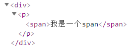

那么，我们能否发明一种新的语言，像写标签一样创建我们上边的结构呢？

只要开发者写这样的代码：

```react
const div2 = (
  <div>
    <p>
      <span>'我是一个span'</span>
    </p>  
  </div>
)
```

那么我就写个类似 babel 这样的东西，可以把上边这段代码翻译成这样代码：

```react
const div = (
  t('div',
    t('p',
      t('span', '我是一个span')))
)
```

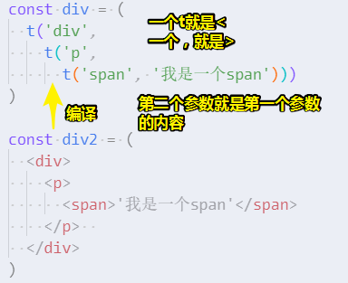

> 简单意会一下编译过程就好了！

总之，如果某个工具能够简单，非常方便做到以上的翻译过程，那么该工具就是非常牛逼的！

而这一点就是 React 的创举了。

很多人只想到翻译的结果，没想到翻译前的结果，毕竟这需要用到编译原理的知识啊！反正，就是你基础牛逼，那么你写的轮子就牛逼呗！

至此，你理解了这一点之后，那么你就知道 React 的核心是什么了，那就是「你以为自己在写标签（`div2`里边那一坨东西），实际上 React 把你这些标签翻译成 `div`变量 里边那一坨东西」

4. 再次改造——引入 React ，让 React 为我们写`t`

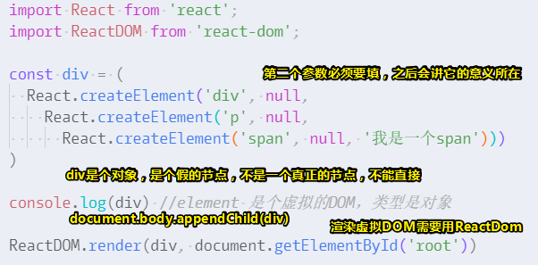

这个假的节点是 React 的第二个创举！即虚拟DOM，而它比DOM的性能要更强大！

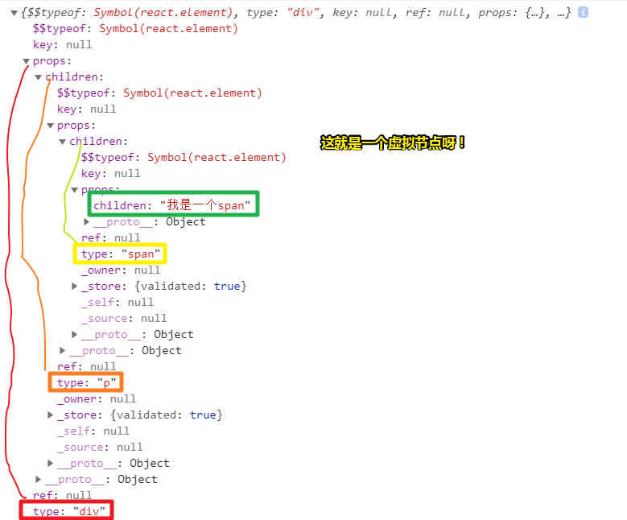

我们不能直接把 虚拟DOM 渲染到页面里边去，需要借助`react-dom`这个库，而该库就是支持虚拟节点的，它的用法很简单——**谁要放在谁旗下**！

> ReactDOM 不鼓励我们把虚拟节点放到body旗下，而是放在某个div旗下，以防污染body。
>
> `React.createElement`这个API相较于我们之前的 `createElement`多了一个参数，这个参数我们暂且留空，把它设为 `null`，之后会讲到！

至此，我们又把起初的那个功能用 React 实现了一遍！

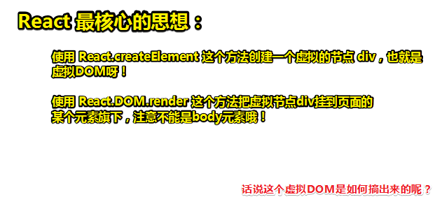

至此， React 的基本原理就讲清楚了，那么接下来就是做项目了。

---

## ★如何声明一个组件

### ◇完善写法

> 这是之前说到一个创举，即编译前的代码

```react
const div = (
  <div>
    <p>
      <span>我是一个span</span>
    </p>
  </div>
)
```

当你写了这种语法（ React 的核心），那么你在心里边就默念成这样的：

```js
const div = (
  React.createElement('div', null,
    React.createElement('p', null,
      React.createElement('span', null, '我是一个span')))
)
```

> `<`：`React.createElement`
>
> `>`：`,`

### ◇构建更复杂的东西

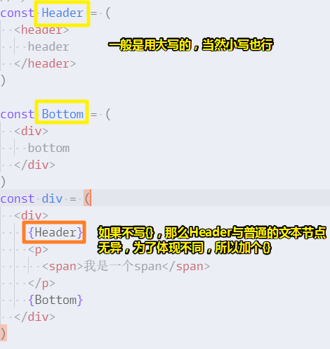

> 加个花括号表示引入的是另外一个组件哈！

我们可以看到像任意组合变量那样，组合成一个页面！甚至还可以把`Header`这个变量移到另外一个页面里去！

以上就是 React 提供的组件化思维，而 Vue 则需要你自己写一个vue单文件组件，即 Vue 它自己发明语法，而 React 不发明任何语法，只是告诉你，这可以简写成 `const span = (<span>hi</span>)`，当然，也不阻止你 `React.createElement('span', null, 'hi')`这样写，不过，应该没有人会这样写吧！毕竟敲那么多字符实在是太麻烦了！

>  React 的第二个思想：使用纯 JS 的组合来实现组件化

### ◇让组件支持参数

在 JS 里边支持参数的就只有函数了

所以，如果我们的 `Header`可以是一个函数的话，那么该组件就可以接受参数了

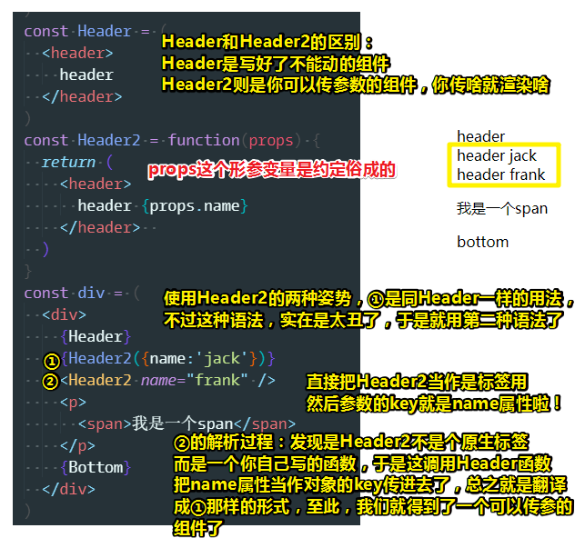

我们可以发现 React 特别巧妙，它不给你提供任何API，它只在写法上给你做文章！

而这就是 React 作者的思路了——使用很简单的做法，就能实现传参！

回过头来看 Vue ，它的思路是发明一个新的语法！如 `v-if`啥的！

> 其实我们在使用 Vue 组件的时候也是像②那样传参的！不过，你咩有写过 React 的话，你是不知道第二种姿势其实是一种函数调用的简写姿势哈！说白了，你写过 React 之后，才会知道 Vue 组件化那种设计是怎样来的！

### ◇让组件使用自身的变量

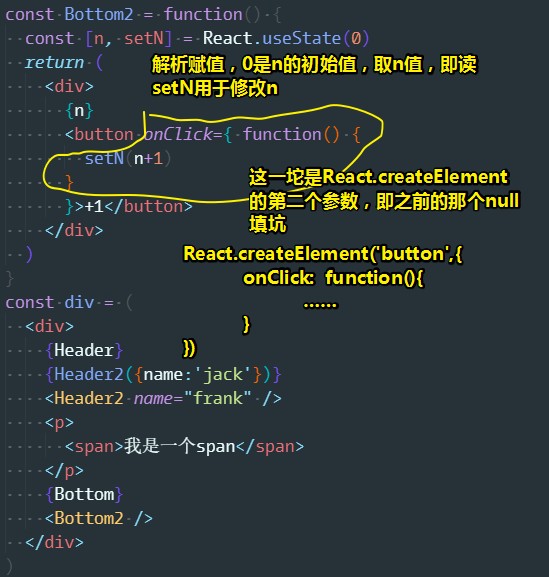

> `onClick`这里的代码，是特属于 React 的语法，原生 JS 可不能这么用哈！

这里的 `onClick`必须得是大写，才表示这是在监听一个click事件，而其值必须得要用 `{}`包裹才行，如果直接用 字符串的话，那是会报错的！

以下是翻译之后的写法，在 `()` 用到原生 JS 代码 请一定 使用 `{}`括起来！这表示里边的内容是 JS 代码哈！用于区分普通的字符文本！

```react
const Bottom2 = function() {
  const [n, setN] = React.useState(0)
  return (
    <div>
      {n}
      {React.createElement('button',{
        onClick: function() {
          setN(n+1)
        }
      },'+1')}
    </div>
  )
}
```

关于 `setN`存在的意义：

针对下边这个代码，按照正常的 JS 思路来说，点击 `+1`这个button显然会加1

``` react
const Bottom2 = function() {
  let n = 0
  return (
    <div>
      {n}
      <button onClick={
        function() {
          n = n+1
        }
      }>+1</button>
    </div>
  )
}
```

然而结果是没反应！

而这就涉及到 React 的核心思想了——如果你要在一个组件内边使用一个内部的状态的话，那么你得这样写：

```react
const Bottom2 = function() {
  const [n, setN] = React.useState(0)
  return (
    <div>
      {n}
      <button onClick={
        function() {
          setN(n+1)
        }
      }>+1</button> //为button绑定click事件
    </div>
  )
}
```

`const [n, setN] = React.useState(0)`：表示这个状态的初始值是`0`，而这个状态的值是 `n`，而这个状态的更新方法时 `setN`，`[n, setN]`是个析构赋值

> 我本来想说，状态n的初始值是 `0`，但这样说并不能很好体现一个组件内部可以存在多个状态呀！

用法：

- 显示n：`{n}`
- 改n：`setN(n+1)`，`setN`似乎是这样的 `function setN(n){return n}`，然后把返回值赋值 `n`

回过头来看 `Bottom2`这个变量的代码，我们使用到的 React  API就只有 `React.useState(0)`这个，其它的都是原生 JS 自带的内容（变形那个并不算是使用了 React 的API，因为编译后的结果就是原生 JS 了）

而这也是 React 和 Vue 最大的不同，即 React 的API极少极少，但是与 Vue 的功能是一样的！

总之，如果你喜欢 React ，那就用 React 呗！不喜欢，也没事，毕竟，还可以用 Vue 哈！

### ◇使用类构造一个组件

> 这种写法很麻烦！

```react
class Bottom3 extends React.Component{
  render() {
    return (
      <div>bottom 3</div>
    )
  }
}
```

这是ES6提供的功能，而不是 React 提供的，回顾那句话「如果你 JS 学得不好，那么你就不要学 React 了」

类组件比函数组件要难理解得多，因此函数组件要流行得多！

用法，还是直接 `<Bottom3 />`即可！

总之，我们可以用函数做一个简单的组件，也可以用类做一个简单的组件

不过，我们之后，主要用的就是函数组件了，因为简单、逼格高呀！

而类组件这种语法，只要背就好了，人人都会

而函数组件这种语法是比较新的，还有很多面试官不会！如果你在面试的时候用新语法的话，那么面试官肯定会觉得你很厉害呀！或者说你是一个很好学的人。

总之，首推函数组件写法！

### ◇总结一下 React 的几个功能

- 可以使用标签的形式直接创建一个虚拟div，然后里边可以写上任意的子元素
- 在Xx组件里边，可以通过 `{}`直接把Zzz组件给引进来！ `{Zzz}`
- 把Zzz组件写成一个函数，然后调用一下Zzz引进到Xx组件里边来！ `{Zzz({name:'frank'})}`
- 优化上一个功能，即写成一个标签，`<Zzz name="frank" />`，把参数写成是标签的属性，上一个功能与这个功能的结构一模一样，只是写法上不一样
- 如果你希望一个组件拥有自己的状态，那么你就使用 `React.useState()`这么一个API，然后再给上一个初始化的值，然后再给上一个读的API和一个写的API，如这样 `const [n, setN] = React.useState(0)`，那么读的就是 `n`，写的就是 `setN`
- 使用类创建组件

接下来正式搞那个井字棋项目了，毕竟我们目前已经知道如何声明一个简单组件了！

---

## ★搞一个棋盘出来

> 之前大概讲了 React 的基本用法，而且就只用到了一个 `React.useState()`这个 API，其余的都是 JS ，而 说到 Vue 的基本用法呢？则讲了有6、7个API

### ◇注意点

- `import ReactDOM from 'react-dom';`是为了让虚拟DOM可以出现在body里边
- 关于render一个组件：

```react
ReactDOM.render(<div>
  <Chessboard />
</div>, document.getElementById('root'))
```

一般都是裹上一层`div`，然后再render，因为这样好写一点，当然，你不包裹也行！

- HTML可以用class属性，但是 React 不能：

```react
//错误例子
const Cell = function (props) {
  return (                      
    <div class="cell">
      {props.text}
    </div>
  )
}
//正确例子
const Cell = function (props) {
  return (                      
    <div className="cell">
      {props.text}
    </div>
  )
}
```

为啥不能呢？——因为我们并不是在写HTML呀！这是 React 的JSX 语法啊！

总之，简单来说，我们用原生 JS 的时候是这样添加class的：

```js
const div = document.createElement('div')
div.className = 'red'
```

为啥原生 JS 不是向下边这样呢：

```js
div.class = 'red'
```

因为在 JS 里边，class是关键字啊！而早期的 JS 是不支持把关键字当作属性的，所以它为了避嫌，于是就用了 `className`，而这就好比古代的人，父亲的名字有个「强」字，那么儿子的名字就不能由个「强」字了，当然兄弟之间不用避嫌，但是父子关系就得避嫌了，所以你日后为你的孩子取名字的时候，得注意哈！

所以为了避讳 `class`这个名字，所以只好叫做 `className`，虽然实际上HTML里的是 `class`属性！

因此我们可以得出这样一个结论：

>  JS 里边如果要加class name的话，那么就只能用`className`，而不是`class`

而我们的这个：

```jsx
(                      
  <div className="cell">
    {props.text}
  </div>
)
```

是 JS 啊！而不是HTML，因为它翻译的结果就是 `React.createElement(……)`

因此，我们就得用`className`，而不是 想写HTML那样用`class`

- 关于样式的引入，很简单，直接 `import './style.css'`
- 为啥在为组件绑定事件时需要加个 `{}`呢？

```react
const Bottom2 = function() {
  const [n, setN] = React.useState(0)
  return (
    <div>
      {n}
      <button onClick={
        function () {
          setN(n+1)
        }
      }>+1</button>
    </div>
  )
}
```

因为不加的话，就会报错（如 识别`onClick=function (){}`的 `onClick=function`就表示一个属性的结束了），反正这是语法规定的，所以这些语法还是得记住呀！毕竟这是 React 自己写的 `babel-jsx`

不过这样写实在是太丑了吧！

于是，利用 JS 提供的变量功能，把callback提取出来，然后再用变量引入进去！

``` React 
const Cell = function (props) {
  const onClickButton = function() {
    console.log('click')
  }
  return (
    <div className="cell" onClick={onClickButton}>
      {props.text}
    </div>
  )
}
```

总之，这就是 React 如何正常绑定一个事件的写法了。

需要注意的是，`onClickButton`这个函数可以写在函数 `Cell`这个函数外边，反正都是 JS ， React 永远不限制你，不过一般，该函数是该组件用到的，那么最好就是写在组件内，毕竟你写在外边的话，别人是不知道你这个`onClick`是在调用哪个callback的！

> 关于`onClick`这个名字，我们在原生 JS 里边是 `onclick`，而HTML大小写都无所谓，所以这就有点矛盾了！
>
> 反正就是小驼峰，没有关键字呗！

> vim技巧：`di{`拿到花括号里的内容，然后摁 `p` 粘贴

-  关于DOM的更新， React 会自动检查DOM有咩有变化，如果有变化，那就更新，咩有那就不更新！

```react
const Cell = function (props) {
  const [text,setText] =  React.useState('')
  const onClickButton = function() {
    setText('x')
  }
  return (
    <div className="cell" onClick={onClickButton}>
      {text}
    </div>
  )
}
```

总之，内容是`×`了，再点击 Cell 重新为`text`赋一样的值是，是不会更新DOM的：

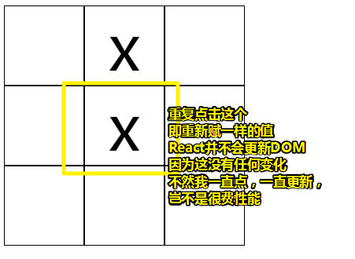

关于内容不居中的问题，这是字体的问题，如果你用的是icon，这是没问题的！

- 关于组件的名字，最好都是首字母大写的，不然很容易冲突！（或许这是用于识别普通函数和构建组件的函数，毕竟声明一个普通函数，我们用的是小驼峰）

- 数组的map这个API：对数组里边的每个元素做一个操作，然后返回一个新数组，而原数组的内容不会改变！

  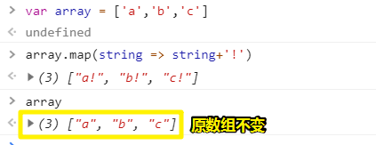

- 在遍历生成9个Cell的过程中， React 啥也没做（用的是原生 JS ），而使用 Vue 的话则需要用到 它自己发明的 `v-if`指令，可见 React 啥也没做，就能成为一个框架了！

- 


### ◇开搞

1. 先把所有东西都放到 `index.js`里边做，之后在把它们抽到 `App.js`里边去！

2. 先写一个`Cell`组件

3. 生成多个`Cell`组件，通过一个叫 `map`的二维数组来遍历生成9个Cell，如果 vue 想用这种方式生成的话，需要用到 `v-for`，而 React 则不需要，直接原生 JS 搞起！

   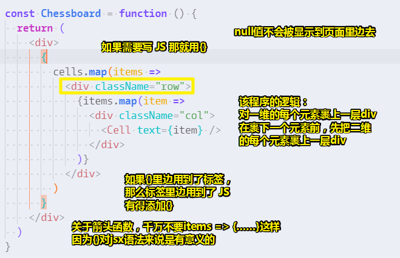

### ◇重新看一遍做了哪些功能

1. 声明了一个表示每个格子的二维数组
2. 而格子就是一个div，以及其里边需要展示的 `x` 和 `o`
3. 搞了一个棋盘，它也是个div，其里边的内容是对二维数组里的每个格子的映射，即一个格子映射成一个Cell

整体结构就是三行row，三列col，内容是一个 `Cell`组件！

总之，最后看的其实就是这句代码：

``` React 
ReactDOM.render(<div>
  <Chessboard />
</div>, document.getElementById('root'))
```

我们的 `Chessboard`组件的内容到底是啥样的DOM结构，如果你不具体到 `Chessboard`组件的 细节的话，那么这其实可以很面向对象的编程！

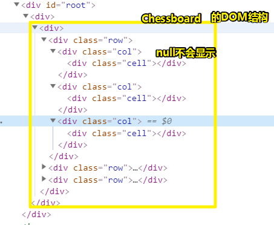

> 话说这 `<div></div>`有点冗余！

## ★复杂点的操作

### ◇注意点

- 变量是谁传过来的，就谁改！如下边这样是不行的，text的值来自于 `Chessboard`这个组件的item

``` React 
const Cell = function(props) {
  const onClickCell = () =>{
    props.text = 'x'
  }
  return (
    <div className="cell" onClick={onClickCell}>
      {props.text}
    </div>
  )
}
```

你得这样才行：

``` React 
const Cell = function (props) {
  return (
    <div className="cell" onClick={props.onClick}>
      {props.text}
    </div>
  )
}

const Chessboard = function () {
  const onClickCell = () => {
    console.log('on click cell')
  }
  return (
    <div>
      {
        cells.map((items, row) =>
          <div className="row">
            {items.map((item, col) =>
              <div className="col">
                <Cell text={item} onClick={onClickCell} />
              </div>
            )}
          </div>
        )
      }
    </div>
  )
}
```

`Cell`组件写了个 `onClick`属性，意味着这是一个自定义事件，把其中的值，即callback传给了Cell组件里边，当Cell所映射的内容，被点击后，就会触发  `onClickCell`执行！

> 对于vue的父子组件间通信可以总结成一句话：
>
> 父组件通过 `prop` 给子组件下发数据，子组件通过`$emit`触发事件给父组件发送消息，即 `prop` 向下传递，事件向上传递。
>
> ➹：[ vue 父子组件间通信 - 个人文章 - SegmentFault 思否](https://segmentfault.com/a/1190000014381699)

此时 `Chessboard`组件是父组件，而`Cell`则是子组件，在父组件这个范围内，传了两个参数给 `Cell`这个子组件，分别是 `text`的值和 `onClick`的值

那么 `onClickCell`这个callback应该写在哪儿呢？是写在`Cell`组件里边，还是 `Chessboard`里边呢？

我们需要通过点击每个Cell触发click事件，更改每个`Cell`的内容，由于这个内容的传递是来自于父组件的`item`的，所以我们就把callback写到父组件里边去了，而不是子组件。

至于子组件的的功能就只接收数据，不处理数据。

注意，`Cell`是个组件标签，所以我们不能直接为它绑定 `onClick`事件，而是绑定到它所映射的原生HTML上去！

总之 `Chessboard`就像是个Controller，而`Cell`则是个Model

- 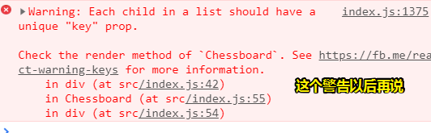

  只是个警告而已，不影响我们的代码，以后再说这个点！

- 如果一个函数想有自己的状态，那么这就不应该用变量，而是用 `state`，所以我们原先这样的代码：

```js
const cell = [
	 [null, null, null],
   [null, null, null],
   [null, null, null],
]
```

就得写在 `Chessboard`组件里边去：

```js
  const [cells, setCells] = useState([
    [null, null, null],
    [null, null, null],
    [null, null, null],
  ])
```

至此这个函数组件，就拥有一个可以改写的状态了！

- `onClickCell`和 `(p)=>onClickCell(p)`是等价的吗？

```
//为啥不这样：
<Cell text={item} onClick={onClickCell} />
//而是要这样：
<Cell text={item} onClick={() => onClickCell(row, col)} />
```

数学的角度来看它们俩是一样的

```
onClickCell(1)
const fn = (p) => onClickCell(p)
fn(1)
```

都会执行 `onClickCell(1)`，只是后者中转了一层！

因此，从数学角度来看，任何一个 函数`fn`你的都可以改写成 `()=>fn()`这种格式，如果有参数的话，那就这样 `(…args)=>fn(…args)`

它们的功能从外表上来看是咩有区别的！ 

因此就有了这样的代码：

``` React 
(
    <div>
      {
        cells.map((items, row) =>
          <div className="row">
            {items.map((item, col) =>
              <div className="col">
                <Cell text={item} onClick={() => onClickCell(row, col)} />
              </div>
            )}
          </div>
        )
      }
    </div>
)
```

如果你还是这样的话：

``` React 
<Cell text={item} onClick={onClickCell} />
```

`onClickCell` 是无法接收参数 的，如果你这样写的话：

```React
<Cell text={item} onClick={onClickCell(row,col)} />
```

那么 `onClickCell`就会立即执行，然后把返回结果交给了 `Cell`组件的 `onClick`属性！而这样一来，点击事件就没有可用的callback执行了！

言归正传，`row`和 `col`是来自闭包的！即它们的值，都是每次遍历的其中一次结果！你点击不同的Cell就会拿到不同的row值和col值！

- 深拷贝和浅拷贝：cells是的值是个地址！如果地址不变，那么UI就不会变！所以需要这行代码：

```js
const copy = JSON.parse(JSON.stringify(cells))
```

这是一种很简单的深拷贝办法，即把对象字符串化，然后再变成一个有着新地址的新对象：

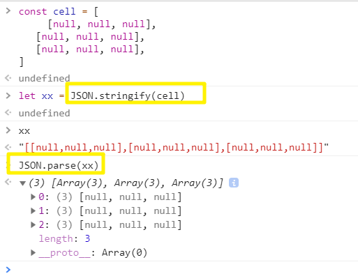

不过这种做法，比较原始，一般不会这么写，但是，这是可以用呀！可以达到我们的目的的！

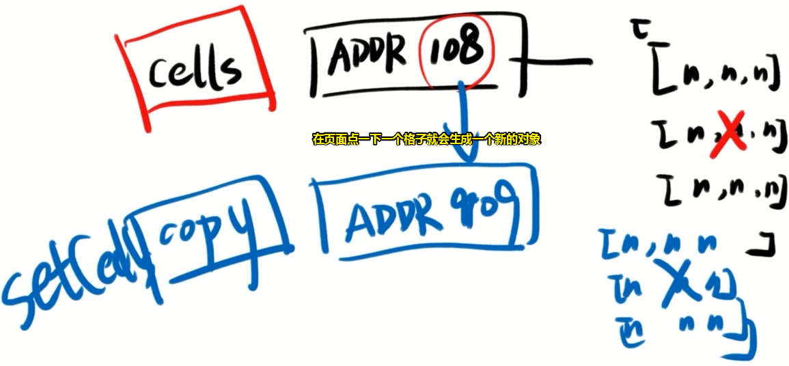

➹：[深拷贝的终极探索](https://yanhaijing.com/javascript/2018/10/10/clone-deep/)

➹：[JS深拷贝总结 - 掘金](https://juejin.im/post/5b20c9f65188257d7d719c1c)

话说，创建那么多对象不会影响性能吗？ 

其实创建对象并不一定会影响性能，有些库可以让创建对象不影响性能

知乎上有这样一个问题「为啥函数式编程这两年又火起来了？」

因为内存够了呀！我们的电脑动不动就16G内存，开了很多东西，也不过占用了60%的内存，剩下的40%内存，对于这些小对象而言，你即便创建一万个对象也没事！

那么以前为啥不流行呢？因为内存不够呀，拷贝十几份对象就GG了呀！

而现在，就没啥问题，尤其是前端，前端写的页面是在用户电脑里边跑，所以用户电脑的内存可以随便用，即用函数式是咩有问题的！

而后端呢？就不行了，因为一个电脑一万用呀，你访问一个淘宝，ta又访问一个淘宝，如果增加一次拷贝，那么服务器的压力又得增加一倍了呀！

而前端就没这样的问题了，毕竟这是一对一服务的！内存是妥妥的足够的！

话又说来，修改一个格子就会创建一个新的对象，这是很浪费内存的，而这就是针对函数式一个很吐槽的点了

不过，我内存够，就喜欢这样写呀！你打我呀！

不管怎样，在内存里边创建一个对象是非常快的事儿，而这比页面操作节点，那就不止超过一万倍了！

总之，你得改变地址！而且不需要百分百的深拷贝！

- 关于这个 `setN(n + 1)`，每次都会复制一遍`n+1`的值给n，永远不会改之前的n值，而这样做的好处，等你学你函数式就明白了！或许我可把 `setN(n + 1)`看作是 `fn(x) = y`，y的值就是n的值，在这里并没有出现 `n=setN(n + 1)`，即咩有赋值操作！

  > 在其他类型的语言中，变量往往用来保存"状态"（state）。不修改变量，意味着状态不能保存在变量中。函数式编程使用参数保存状态

### ◇思路

- 点击Cell
  1. n+1
  2. 改变cells的值
  3. 判断谁赢

## ★写判断谁赢

### ◇面向对象也占内存？

面向对象虽然占内存，但是它是用同一块内存啊！然后用的是`this`来引用这块内存！而函数式是不用this的！

函数式编程非常讨厌`this`，所以你讨厌`this`的话，那就用函数式编程呗！

### ◇异步更新

函数的状态是异步更新的！

### ◇思路

1. 判断谁赢，直接用  `if……else`

   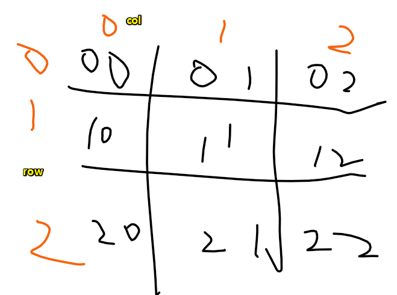

2. 做个谁赢了的标志

3. 更进一步？（需要用到后端知识，如nodejs）

   1. 双人点击
   2. 分享到朋友圈
   3. ……

### ◇判断方法的优化

关于优化，目前不需要去优化。

对于新人来说，先把功能写到简历上，然后加上漂亮的CSS，然后你就可以找工作了，然后你工作之余再去优化，而不是优化半天，简历不更新，找不到工作！

总之，先把东西做完，再讲优化，况且日后你还会学到更多的 JS 优化技巧，而这时，你才明白如何去优化！

➹：[JavaScript 性能优化技巧分享 - 前端 - 掘金](https://juejin.im/entry/5a2e04006fb9a04528466ead)

芳芳目前想到的优化：

1. 把赢的做成一个模式，然后判断当前的情况能否匹配这个模式！如这样：

```js
[
	[1,2,3],//1
	[10,20,30], //10
	[100,200,300] //100
]
```

判断它们加起来等于某个值，就算赢了，而这样一来也不用写那么多 `===`

总之，如果你要优化就得看很多书

如60分的代码，优化到70分，得看1本书；70到80，得看5本；80到90，看10本书都不止！

因此，先把70分的代码再说，80分的优化，况且能做到70分，其实挺不错了！

补充，其它优化思路：

上边这种优化思路是问题的，因为`100+20+2+1=123`与斜着的冲突 了

我们可以通过二进制说来搞，如第一个值那就 `00000001`，同理，其它格子也是如此，然后你把所有这些值加起来，去跟一个值做异或操作，如果是0，那就是匹配的！

总之，涉及算法的，真得需要去学一下算法和数据结构！

> 代码少了，可是代码可读性下降了，那还需要去优化吗？
>
> 很多时候，前端其实不需要学算法，即便我们目前这个井字棋的`tell`函数里边的代码不那么好看，但是至少我们是很清楚的知道代码是对的呀。
>
> 总之花那么多时间去学习算法的，还不如写两个if、两个for……

## ★总结下学了啥

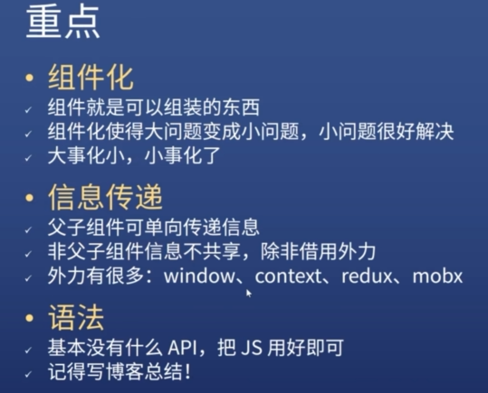

-  React 的组件化做得很巧妙，要么用变量表示一个组件（不需要传参），要么用函数（参数可选），要么用类……这3种方法来表示一个组件！总之，变量、函数、类都可以表示成一个组件

- 信息传递：往下传值，还是往上传值，都是用的是props，这个数据可以从子组件里边或者父组件里边带出来！关于子父通信就是那个click事件触发

  ➹：[react中子组件向父组件传值 - 简书](https://www.jianshu.com/p/2f632cbdf6ad)

-  React 的API，自己找资料学呗！目前就学了两个 `React.useState()`和 `ReactDOM.render()`，后者还不算是 React 的API，说白了就学 了一个API，然后其余的是原生 JS 就能做出一个简单的井字棋项目！

- 语法：HTML语法和 `{}`

- 写博客总结：如该井字棋里边用到了数组的map方法，它是如何做到遍历生成9个Cell组价的！

做一个最最简单的总结：


所谓的简单，指的是，它不提供非常复杂的概念，你只要把 JS 理解了就行了

但是有一个诡异之处就是 JS 是很难理解的，所以有些人就想，我能不能用 React 结合其它的语言呢？

毕竟 JS 这东西有点难啊！

于是他们发明了 [ResonReact](https://reasonml.github.io/reason-react/zh-CN/)，它的广告词是「所有的 ReactJS 知识的编程法典」

说白了，就是把涉及ReactJS都翻译好了一遍，然后写成很好的词典，然后你用了词典上提供的姿势写，就能写出很好的 React 代码

反正这些人就是认为「 React 你把所有东西都压到 JS 身上是否真得好呢？我们能不能用更好的语言来写 React 呢？」

于是就发明了 ReasonReact，其语法如下：

```react
[@react.component]
let make = (~name) =>
    <button>
      {React.string("Hello!")}
    </button>;
```

看起来很像 JS ，但是有 `[@react.component]`注解什么的、参数 `~name`多了个 `~`

这些语法都很奇怪！

总之，很像 JS ，但是它把 JS 所有的糟粕语法都给删掉了

总之，「一切皆 JS 」是 React 的核心思想，你可以用 JS 的函数， JS 的class， JS 的map， JS 的 `&&`等就可以完成你所需要的功能了

这个井字棋游戏，可以在你面对面试官的时候说「会 React ，但是又不那么会」

如果深入学习 React 知识可以看看芳芳的 React 入门课！

以上就是对 React 这个框架的简单使用啦！

## ★总结

- JS 不好，请不要学  React ！

- 闭包要学，不然看不懂 React ！

- 不需要深拷贝就能更新视图！

- JS 不支持连等，即 `a === b === c`，你得写成 `a===b && b === c`

- 等价于 `v-if`的操作： ` {finished && <div>游戏结束</div>} `， React 没有提供类似于  Vue 提供的 `v-if`这样的API，这是纯 JS 弄的！当然也不算非常纯，只是逻辑上是纯的！

- 不管做啥，还是用全等比较好！

- 单向数据流：

  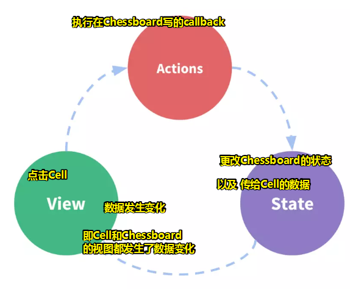

  ➹：[单向数据流和双向数据流 - 简书](https://www.jianshu.com/p/810464f1a576)

## ★Q&A

### ①yarn 和 npm 切换至淘宝源？

查看目前的源：

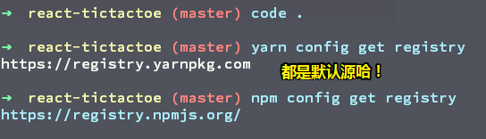

切换成淘宝源：
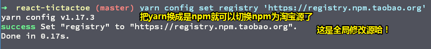

换回原来的默认源：

```bash
 # npm
 npm config set registry 'https://registry.npmjs.org/'
 # yarn
 yarn config set registry 'https://registry.yarnpkg.com'
```

➹：[yarn 国内加速，修改镜像源 - Laravel China 社区](https://learnku.com/articles/15976/yarn-accelerate-and-modify-mirror-source-in-china)

➹：[npm，yarn如何查看源和换源 - 知乎](https://zhuanlan.zhihu.com/p/35856841)

### ②为啥写在HTML上的onClick能触发callback执行？

**如果你是写在HTML中，那HTML的标签是不分大小写的**     

 比如： 

```html
<a href="#" id="myclick" onclick="dosomething();">Click me!</a>
```

 这里的`onclick`，你可以写成`ONCLICK`，或是别的什么，因为那是HTML，HTML不分大小写。    

 但是如果你写成Javascript，那就不是这样了：     

 比如：     

```js
 var link = document.getElementById('myclick');    
 link.onclick = function(){    
   alert('hello');    
 }     
```

 你要把`onclick`改成`onClick`，那就是一个`onClick`的新方法，和 `onclick`事件无关。

➹：[onClick还是onclick，第一个c是否要大写，发现虽然mdn和msdn上都说的是onclick，但是浏览器也能触发onClick事件，这是为什么？ - 知乎](https://www.zhihu.com/question/19942453)

### ③为啥要加 `()`？

> 为了好看呗！

反正不加括号就会报错，而加了括号就会被 `babel-jsx` 翻译成原生 JS 

➹：[你对return后面的括号了解多少？ - 简书](https://www.jianshu.com/p/e9230dc06044)

➹：[render方法括号的作用 - on the way - SegmentFault 思否](https://segmentfault.com/a/1190000012360432)

### ④关于 `useState(0)`？

- 返回值是`[0,f]`，即一个是0，一个是函数；我们都是这样赋值的 `const [n, setN] = useState(0)`
- `setN(n + 1)`的返回值是 `undefined`，那么为啥n的值会变呢？而且你 ` setN(n + 1)`之后，log一下 `n`的值，`n`的值并没有立刻更新！
- 重复 `setN(n + 1)`没有效果！
- 每次点击Cell都会执行 `Chessboard`函数！——我觉得这时的n应该是有个新值了！经过测试确实如此：

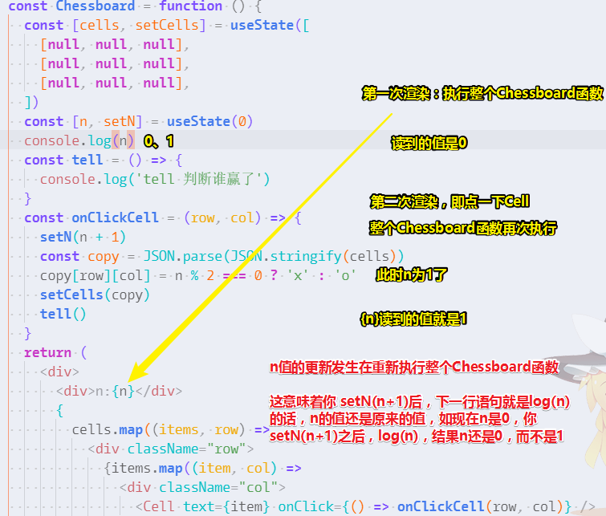

或许这是状态发生了变化，然后导致函数组件的的重新执行！

不管了，我得去看看芳芳的 React 入门视频才行了！

### ⑤asyn 和 defer？

➹：[浅谈script标签的defer和async - 前端 - 掘金](https://juejin.im/entry/5a7ad55ef265da4e81238da9)

### ⑥iconfont外链引入？

通过生成一个`script`标签来引入！

在 jsx 里边使用图标的时候，请把`xlink:href` 改为`xlinkHref`

➹：[react 中使用iconfont - 掘金](https://juejin.im/post/5bee5278e51d450b291c0a4d)

### ⑦函数式？

➹：[函数式编程扫盲篇 - 飞林沙 - 博客园](https://www.cnblogs.com/kym/archive/2011/03/07/1976519.html)

➹：[函数式编程所倡导使用的「不可变数据结构」如何保证性能？ - 知乎](https://www.zhihu.com/question/53804334)